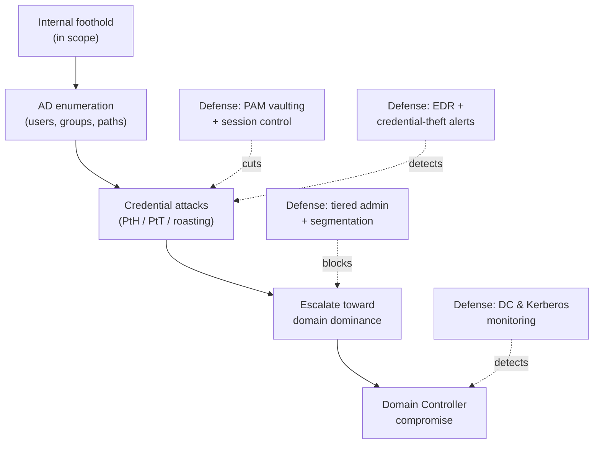

# 03 — Active Directory Exploitation

The heart of the **Practical Network Penetration Tester (PNPT)** engagement is **Active
Directory (AD) exploitation**. Once a tester has an internal **foothold** (from
[02 — External penetration testing](02-external-penetration-testing.md)), the goal is to
move through the AD domain toward **Domain Controller (DC) compromise** — effectively
owning the identity backbone of a Windows network. This is also exactly where **Privileged
Access Management (PAM)**, tiering, segmentation, and detection earn their keep, so every
attack concept below is paired with how defenders **block and detect** it.

> **Authorized-use note.** AD attacks are legal **only** under written authorization and
> scope. This page is **conceptual** — it explains *why* each technique works and how to
> defend against it, and names tools by **purpose**. It contains **no exploit code** or
> command syntax. See the CEH hub's
> [legal & ethics](../../ceh/00-overview/legal-and-ethics.md).

## Learning objectives

- Explain why AD is the central target of the PNPT internal phase.
- Describe AD enumeration and the main credential-attack concepts.
- Understand **Pass-the-Hash**, **Pass-the-Ticket**, **Kerberoasting**, and **AS-REP
  roasting** conceptually.
- Explain **Domain Controller compromise** as the objective of the chain.
- Map each attack to **PAM, tiering, segmentation, EDR, and monitoring** defenses.

## Why AD is the target

Active Directory is the **single source of truth** for identity, authentication, and
authorization across a Windows estate. Compromise the domain — specifically a DC or a
Domain Admin — and you control every joined machine and account. That leverage is why the
PNPT engagement is built around it. Background:
[../../protocols/active-directory.md](../../protocols/active-directory.md) and
[../../protocols/kerberos.md](../../protocols/kerberos.md).

## AD enumeration

With any domain foothold, an attacker first **enumerates** the directory: users, groups,
computers, group memberships, trusts, and especially **paths to privilege** (who can
administer what). This is low-noise reconnaissance done with *authenticated* access — the
attacker maps the terrain before striking. The defensive challenge is that most enumeration
uses legitimate directory queries, so **detection depends on behavioral baselining**, not
on blocking the protocol.

## Credential-attack concepts

These are the canonical AD techniques the PNPT exercises. Each is described by **what it
abuses**, never as a runnable procedure.

| Technique | What it abuses (concept) | Goal |
| --- | --- | --- |
| **Pass-the-Hash (PtH)** | Windows accepts an NTLM password **hash** as proof of identity, so a stolen hash authenticates without the cleartext password | Reuse a captured hash to access other systems |
| **Pass-the-Ticket (PtT)** | Kerberos **tickets** authenticate sessions; a stolen ticket can be replayed | Impersonate a user/service using their ticket |
| **Kerberoasting** | Any domain user can request a **service ticket** whose encryption is derived from a service account's password, enabling **offline** password cracking | Recover weak service-account passwords offline |
| **AS-REP roasting** | Accounts with **Kerberos pre-authentication disabled** return crackable material to any requester | Recover passwords of misconfigured accounts offline |

The unifying theme: AD authentication trusts **secrets and tickets**, so capturing or
requesting them — then cracking or replaying **offline/elsewhere** — moves an attacker
laterally and upward without ever "breaking" cryptography.

## Domain Controller compromise (concept)

The objective of the chain is to obtain **domain-dominance** credentials (e.g. Domain
Admin) or compromise a **DC** directly. From there an attacker can read all domain secrets
and persist. In the PNPT this is the "win condition" of the internal phase — and the report
must show the **full path** that led there, not just the final access.

## Defense — how PAM, tiering, and detection stop the chain

This is the highest-value section for a defender, and the area where **WALLIX** and PAM are
directly relevant.

| Defense | How it breaks the AD attack chain |
| --- | --- |
| **PAM (e.g. WALLIX Bastion)** | Privileged credentials are **vaulted and brokered**, never typed on endpoints — so there is **no reusable hash or ticket to steal**. Sessions are proxied, recorded, and time-bound. See [../../docs/pam-bastion/README.md](../../docs/pam-bastion/README.md) |
| **Tiered administration** | Tier-0 (DCs/identity) admins never log on to lower-tier hosts, so a workstation foothold yields no Tier-0 credentials to harvest |
| **Network segmentation** | Limits which hosts can reach DCs and admin interfaces, shrinking lateral paths |
| **Endpoint Detection & Response (EDR)** | Flags credential-theft behavior (memory access to authentication material, anomalous ticket requests) |
| **Strong/managed service-account passwords** | Long, random, rotated secrets make Kerberoasting/AS-REP cracking infeasible; group-managed accounts remove human-set passwords |
| **Kerberos / DC monitoring** | Alerts on mass service-ticket requests (roasting), anomalous replication, and unusual privileged logons |
| **Least privilege & group hygiene** | Fewer over-privileged accounts means fewer paths to domain dominance |

PAM is the strategic answer to credential theft: **if privileged secrets never live on the
machines an attacker can reach, the PtH/PtT/roasting toolkit has nothing to capture.** For
the broader picture, see
[../../foundations/pam-threat-landscape.md](../../foundations/pam-threat-landscape.md) and
the full mapping in
[../../attack-to-defense-matrix.md](../../attack-to-defense-matrix.md).

## Exam tips

- **Document the whole path to DC**, not just the final compromise — the debrief and report
  are graded on methodology, not luck.
- **For every AD finding, name the defensive control** (PAM, tiering, service-account
  hardening) — consultant-style remediation is what the debrief rewards.
- **Know the concepts cold**: be able to explain *why* PtH or Kerberoasting works in one or
  two sentences. Deeper practice lives in the OSCP hub's
  [Active Directory attacks](../../oscp/topics/05-active-directory-attacks.md).

> Authorized-use note: practice AD techniques only in a lab you own or an environment you
> are explicitly authorized, in scope, to assess.

## Sources

- TCM Security — PNPT certification page: <https://certifications.tcm-sec.com/pnpt/>
  (AD exploitation → Domain Controller compromise; volatile details marked "verify on
  TCM").
- Cross-reference — protocols: [Kerberos](../../protocols/kerberos.md),
  [Active Directory](../../protocols/active-directory.md); PAM:
  [Bastion](../../docs/pam-bastion/README.md),
  [PAM threat landscape](../../foundations/pam-threat-landscape.md). Compiled **2026-06-21**.
