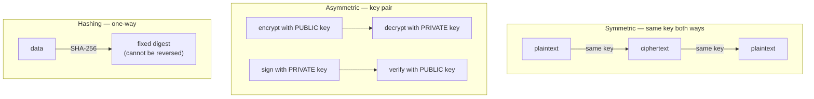
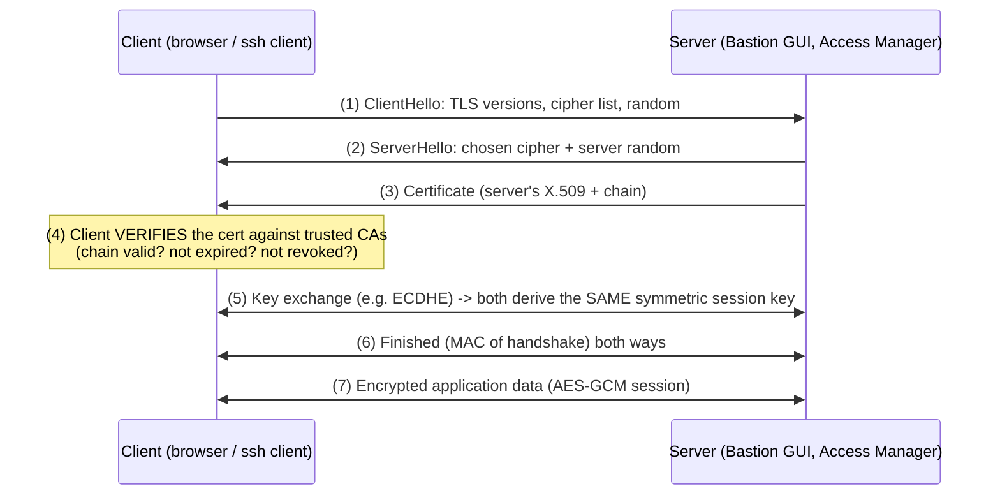
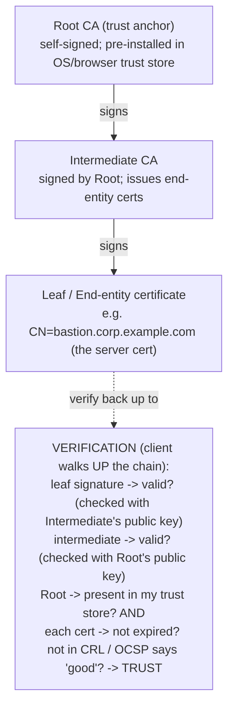
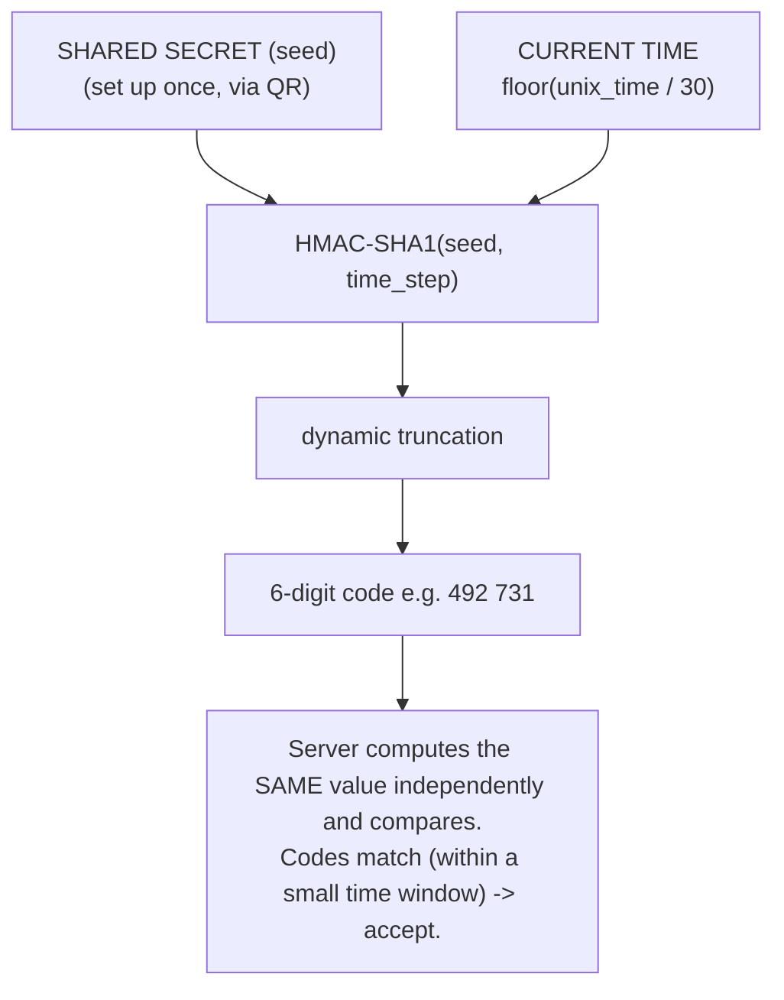

# Cryptography and PKI for PAM

Privileged Access Management (PAM) is cryptography in production. **WALLIX Bastion**
encrypts its vault and sessions with **AES-256**, encrypts its disk at rest with
**LUKS**, authenticates users and servers with **X.509 certificates** and **SSH keys**,
rotates **RSA keys (≥3072 bits)**, and supports **MFA** built on **TOTP** and
**FIDO2/WebAuthn**. You cannot reason about a PAM appliance without the cryptographic
vocabulary below. This file teaches it from first principles and ties each piece to
Bastion.

## Learning objectives

By the end of this file you should be able to:

- Distinguish **symmetric** vs **asymmetric** encryption, and **hashing**.
- Explain **encryption at rest** (**LUKS / AES-256**).
- Walk through the **TLS handshake**.
- Define a **PKI (Public Key Infrastructure)**: **CA**, **CSR**, **X.509 certificate**,
  and revocation via **CRL / OCSP**, and read a **certificate trust chain**.
- Compare **SSH key types** (RSA / ECDSA / Ed25519).
- Explain the crypto behind MFA: **TOTP** and **FIDO2 / WebAuthn**.
- Connect each to how WALLIX Bastion uses it.

See [../reference/acronyms.md](../reference/acronyms.md) and
[networking-and-protocols.md](networking-and-protocols.md).

---

## 1. Symmetric vs asymmetric encryption, and hashing

| Type | Keys | Strength | Typical use |
|------|------|----------|-------------|
| **Symmetric** | **One shared secret** key encrypts *and* decrypts | Very fast | Bulk data: disk encryption, session traffic. e.g., **AES-256** |
| **Asymmetric** | A **key pair**: public encrypts / private decrypts (and private signs / public verifies) | Slow, but solves key distribution | Key exchange, signatures, certificates. e.g., **RSA**, **ECDSA**, **Ed25519** |
| **Hashing** | *No key* — a one-way fingerprint | Irreversible | Integrity, password storage, signatures. e.g., **SHA-256** |



In practice systems combine them: asymmetric crypto **exchanges a symmetric session
key**, then fast symmetric crypto protects the bulk data. That is exactly what TLS and
SSH do.

> **Bastion tie-in:** Per the
> [product portfolio](../docs/00-overview/product-portfolio.md#architecture-deployment-ha-integrations),
> Bastion uses **AES-256** (symmetric) for data, **SHA-2** for hashing, **ECC** and
> **RSA (private keys ≥ 3072 bits)** for asymmetric operations, with a selectable crypto
> policy (`WABSecurityLevel`, **SOG-IS CES 1.3** recommended).

---

## 2. Encryption at rest — LUKS and AES-256

**Encryption at rest** protects data on disk if the hardware is stolen. On Linux the
standard is **LUKS (Linux Unified Key Setup)**, the on-disk format for **dm-crypt**.
LUKS encrypts the whole block device with a symmetric cipher — typically **AES-256**.

```bash
# (Illustrative) initialize a LUKS-encrypted volume
sudo cryptsetup luksFormat /dev/sdb1
sudo cryptsetup open /dev/sdb1 vault   # unlock -> /dev/mapper/vault
```

> **Bastion tie-in:** Bastion's **encryption at rest = LUKS (dm-crypt)** with **AES-256**
> (per the product portfolio). The credential vault and session recordings sit on
> encrypted storage; recordings are further encrypted so **only the originating Bastion
> can replay them**.

---

## 3. FLOW: the TLS handshake

**TLS (Transport Layer Security)** secures a channel (HTTPS = HTTP over TLS, port 443).
The handshake authenticates the server (via its certificate) and agrees a fresh
symmetric session key. Simplified TLS 1.2/1.3 flow:



**Walk-through:** Hellos negotiate version + cipher and exchange randoms (1–2); the
server presents its **certificate chain** (3); the client **verifies** it (4 — see PKI
below); an ephemeral key exchange (**ECDHE**) lets both sides derive the same secret
without sending it (5), giving **forward secrecy**; both confirm with `Finished` (6); the
rest of the conversation is fast symmetric **AES** (7).

> **Bastion tie-in:** TLS protects the Bastion admin GUI, the **REST API**, the **Access
> Manager** HTTPS gateway, **LDAPS**, and RDP/TLS. WAM also supports **X.509 client
> certificate** authentication with **CRL/OCSP** checking (per the product portfolio).

---

## 4. PKI — Public Key Infrastructure

A **PKI (Public Key Infrastructure)** is the system of authorities, certificates, and
policies that lets you **trust a public key belongs to who it claims**. Core pieces:

| Term | Expands to | Role |
|------|-----------|------|
| **CA** | Certificate Authority | Trusted issuer that signs certificates |
| **CSR** | Certificate Signing Request | A request (public key + identity) sent to a CA to be signed |
| **X.509** | (the certificate standard) | The signed certificate binding identity ↔ public key |
| **CRL** | Certificate Revocation List | A published list of revoked certs (pull the whole list) |
| **OCSP** | Online Certificate Status Protocol | Ask the CA "is *this one* cert still valid?" in real time |

How a certificate is born:

```bash
# 1. Generate a private key + a CSR (Certificate Signing Request)
openssl req -new -newkey rsa:3072 -nodes \
        -keyout server.key -out server.csr \
        -subj "/CN=bastion.corp.example.com"

# 2. Send server.csr to the CA -> CA signs -> you receive server.crt (X.509)

# 3. Inspect the resulting certificate
openssl x509 -in server.crt -noout -text
```

### FLOW: certificate trust chain

Trust flows **down** from a self-signed **Root CA** through optional **Intermediate
CAs** to the **leaf** (end-entity) certificate. A client trusts the leaf because it can
follow the signatures back up to a Root CA already in its **trust store**.



> **Bastion tie-in:** Bastion/WAM present server certificates (verified via this chain),
> and WAM can authenticate users by **X.509 client certificate** with **CRL/OCSP**
> revocation checks. Using a proper internal CA (rather than self-signed leaf certs)
> avoids browser warnings and enables revocation.

---

## 5. SSH key types — RSA, ECDSA, Ed25519

SSH public-key auth (see
[linux-essentials-for-pam.md](linux-essentials-for-pam.md#ssh--secure-shell)) supports
several asymmetric algorithms:

| Type | Family | Recommended size | Notes |
|------|--------|------------------|-------|
| **RSA** | Integer factorization | **≥ 3072 bits** (4096 common) | Universally compatible; larger keys = slower |
| **ECDSA** | Elliptic-curve DSA | 256/384/521-bit curves | Smaller/faster than RSA; depends on curve quality |
| **Ed25519** | Edwards-curve (Curve25519) | fixed (256-bit) | Modern default: fast, short, strong; **preferred** |

```bash
ssh-keygen -t ed25519                 # modern default (preferred)
ssh-keygen -t rsa -b 4096             # when RSA is required for compatibility
ssh-keygen -t ecdsa -b 384            # elliptic-curve alternative
```

> **Bastion tie-in:** Bastion **generates and rotates** SSH keys for target accounts and
> supports **RSA / DSA / ECDSA** key generation; the default password-change policy uses
> **RSA key size 4096**, and stored RSA private keys are **≥ 3072 bits** (per the
> [product portfolio](../docs/00-overview/product-portfolio.md#password--secrets-management)).
> Avoid legacy short RSA/DSA keys.

---

## 6. The crypto behind MFA — TOTP and FIDO2/WebAuthn

**MFA (Multi-Factor Authentication)** combines factors from different categories:
*something you know* (password), *something you have* (phone/security key), *something
you are* (biometric). Two common second factors:

### TOTP — Time-based One-Time Password

**TOTP (Time-based One-Time Password, RFC 6238)** generates a 6-digit code that changes
every ~30 seconds. Server and authenticator app share a **secret seed** (provisioned via
a QR code) and both compute **HMAC(seed, current_time_step)**, truncated to 6 digits — no
network needed at generation time.

#### FLOW: TOTP generation



Because both sides derive the code from the same seed + clock, the code works **offline**
and is valid only for its short time window.

### FIDO2 / WebAuthn — phishing-resistant keys

**FIDO2** (Fast IDentity Online 2) and its browser API **WebAuthn (Web Authentication)**
use **asymmetric** crypto on a hardware **security key** (e.g., YubiKey) or platform
authenticator. At registration the authenticator creates a key pair *per site*; at login
it **signs a server challenge with the private key**, which never leaves the device. The
signature is **bound to the site's origin**, so a phishing site cannot replay it — this
is why FIDO2 is called **phishing-resistant**.

> **Bastion tie-in:** Bastion delivers MFA via **RADIUS/SAML** and **WALLIX Trustelem**;
> Trustelem itself supports **TOTP**, the **WALLIX Authenticator** (push + TOTP), and
> **FIDO2 security keys via WebAuthn**, plus smart cards (per the
> [product portfolio](../docs/00-overview/product-portfolio.md#3-wallix-trustelem--idaas-sso--mfa--identity-federation)).
> Note FIDO2/push are **not native to Access Manager** — they arrive through the
> federated IdP over SAML/OIDC.

---

## How this maps to the certifications

- **WCA-P / WCP-P:** TLS, certificates, SSH keys, and the vault's encryption underpin
  daily configuration (password policies, certificate setup, secret rotation).
- **WCE-P (Expert):** **Advanced authentication** covers **X.509** and **2-factor**;
  understanding the TLS handshake, trust chains, CRL/OCSP, and key rotation is directly
  exercised (see [wce-p-expert.md](../docs/pam-bastion/wce-p-expert.md)).

---

## Sources

- NIST FIPS 197 — Advanced Encryption Standard (AES): https://csrc.nist.gov/pubs/fips/197/final
- NIST FIPS 180-4 — Secure Hash Standard (SHA-2): https://csrc.nist.gov/pubs/fips/180-4/upd1/final
- NIST SP 800-57 Part 1 — Recommendation for Key Management (key sizes): https://csrc.nist.gov/pubs/sp/800/57/pt1/r5/final
- RFC 8446 — TLS 1.3: https://www.rfc-editor.org/rfc/rfc8446
- RFC 5280 — X.509 Public Key Infrastructure Certificate and CRL Profile: https://www.rfc-editor.org/rfc/rfc5280
- RFC 6960 — Online Certificate Status Protocol (OCSP): https://www.rfc-editor.org/rfc/rfc6960
- RFC 2986 — PKCS #10 Certification Request (CSR): https://www.rfc-editor.org/rfc/rfc2986
- RFC 8709 — Ed25519 / Ed448 for SSH: https://www.rfc-editor.org/rfc/rfc8709
- RFC 6238 — TOTP: Time-Based One-Time Password Algorithm: https://www.rfc-editor.org/rfc/rfc6238
- RFC 4226 — HOTP: HMAC-Based One-Time Password Algorithm: https://www.rfc-editor.org/rfc/rfc4226
- W3C — Web Authentication (WebAuthn) Level 2: https://www.w3.org/TR/webauthn-2/
- FIDO Alliance — FIDO2 specifications: https://fidoalliance.org/specifications/
- LUKS / cryptsetup (dm-crypt) documentation: https://gitlab.com/cryptsetup/cryptsetup/-/wikis/home
- SOG-IS Agreed Cryptographic Mechanisms: https://www.sogis.eu/documents/cc/crypto/SOGIS-Agreed-Cryptographic-Mechanisms-1.3.pdf
- WALLIX Bastion AES-256 / LUKS / RSA≥3072 / certificate auth: [product-portfolio.md](../docs/00-overview/product-portfolio.md)
