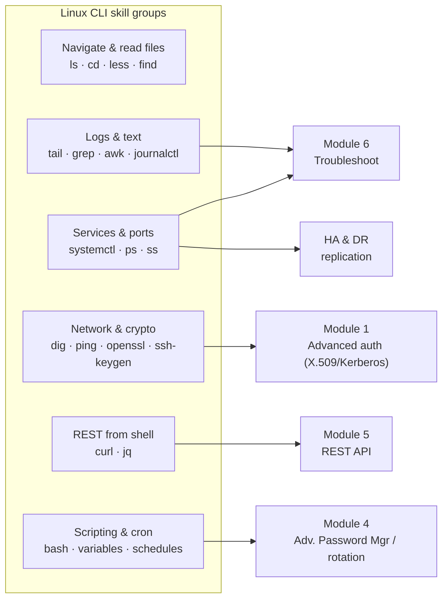

# Linux CLI Deep Dive for WCE-P

The **WALLIX Certified Expert – PAM ([WCE-P](../docs/pam-bastion/wce-p-expert.md))**
explicitly requires **GNU/Linux command-line** skills, because the Expert tasks —
troubleshooting, the REST Application Programming Interface (API), proxy tuning, and high
availability — happen at the shell, not just the web GUI. This page is a focused,
transferable Linux-CLI study guide for that level.

> This page teaches the **portable Linux skills** you need. The **WALLIX-specific**
> commands, exact log paths, service names and CLI tools are documented (and sourced) in
> the deep dives — each section links to the right one. New to Linux? Start with
> [Linux essentials for PAM](linux-essentials-for-pam.md).

## Learning objectives

- Get a shell on a Linux host/appliance and move around safely.
- Read and search logs, inspect services/processes/ports, and edit config files.
- Call a REST API and parse JavaScript Object Notation (JSON) from the shell.
- Recognise the operational commands behind WCE-P's troubleshooting, REST API, and
  high-availability (HA) modules.

## How CLI skills map to WCE-P modules



## 1. Getting a shell

The WALLIX Bastion is a hardened **Debian-based Linux appliance**. Expert-level work means
connecting to it over **Secure Shell (SSH)** with the administrative account you've been
given, then working at the prompt.

```bash
ssh admin@bastion.example.com        # connect (use the account/port you were provided)
whoami                               # which user am I?
id                                   # my user id and groups
pwd                                  # where am I in the filesystem?
exit                                 # leave the session
```

> The exact administrative account, console behaviour, and management ports are
> appliance-specific — see [Bastion architecture](../deep-dives/bastion-architecture.md).
> Always prefer **read-only** inspection first, and take a snapshot before changes.

## 2. Navigate & read files

```bash
ls -lah /var/log            # list, long + human sizes + hidden
cd /var/log                 # change directory
less bigfile.log            # page through (q to quit, / to search, G end, g top)
cat file                    # dump small file
find / -name "*.conf" 2>/dev/null   # locate files by name (errors hidden)
stat file                   # size, owner, timestamps
```

File permissions matter for config and key files (covered in
[Linux essentials → permissions](linux-essentials-for-pam.md)): `chmod`, `chown`, and the
`rwx` triplets.

## 3. Logs & text processing — the heart of Module 6 (Troubleshoot)

Most troubleshooting is *reading logs fast*:

```bash
tail -f /var/log/app.log              # follow a log live (Ctrl-C to stop)
tail -n 200 app.log                   # last 200 lines
grep -i "error" app.log               # case-insensitive search
grep -ri "kerberos" /var/log/         # recursive search in a tree
zgrep "fail" app.log.1.gz             # search inside rotated/compressed logs
awk '{print $1, $9}' access.log       # pick columns
cut -d: -f1 /etc/passwd                # split on a delimiter
sort | uniq -c | sort -rn              # count & rank (e.g. top error lines)
journalctl -u <service> --since today # systemd journal for one unit
```

> **Which** logs and databases to read for the Bastion and Access Manager — exact paths
> and what each contains — are in
> [Troubleshooting & logs](../deep-dives/troubleshooting-and-logs.md).

## 4. Services, processes & ports

```bash
systemctl status <service>            # is it running? recent log lines
systemctl restart <service>           # restart a unit (with care)
ps aux | grep <name>                  # find a running process
top    # or: htop                     # live CPU/memory view
ss -tlnp                              # listening TCP ports + owning process
ss -tn state established              # current connections
```

The Bastion's internal services (database, the RDP proxy, REST API, schedulers, etc.) and
their roles are listed in
[Bastion architecture](../deep-dives/bastion-architecture.md#4-internal-components--services).

## 5. Text editing config files

You'll need at least one terminal editor. **`vi`/`vim`** is everywhere:

```text
vi file.conf      open
  i               insert mode (type)
  Esc             back to command mode
  :w              save        :q  quit        :wq save+quit       :q!  quit no-save
  /text           search
```

`nano` is simpler if available (`Ctrl-O` save, `Ctrl-X` exit). **Back up before editing**:
`cp file.conf file.conf.bak`.

## 6. The REST API from the shell — Module 5

WCE-P's REST API module is practiced with **`curl`** (make requests) and **`jq`** (read
JSON):

```bash
# generic shape — authenticate, then GET a resource, pretty-print the JSON
curl -s -k -H "X-Auth-Key: <api-key>" \
     https://bastion.example.com/api/<resource> | jq .

# common flags:  -s silent  -k skip TLS check (lab only)  -X method  -H header  -d body  -i show headers
```

> The Bastion's actual authentication headers, resources, methods and response codes are
> documented in [REST API & automation](../deep-dives/rest-api-and-automation.md) — use
> those exact values, not the placeholder above.

## 7. Network & crypto helpers — Module 1 (Advanced authentication)

Diagnosing X.509, Kerberos, RADIUS and SAML problems is much easier from the shell:

```bash
ping host                     # reachability
dig host  # or: nslookup host # DNS resolution (matters for Kerberos!)
ss -tn                        # who am I connected to?
openssl s_client -connect host:443        # inspect a TLS service + its cert chain
openssl x509 -in cert.pem -noout -text     # decode a certificate (issuer, dates, SAN)
ssh-keygen -lf key.pub                      # fingerprint an SSH key
date                          # clock skew breaks Kerberos — check the time
```

Background on these protocols: [networking & protocols](networking-and-protocols.md) and
[cryptography & PKI](cryptography-and-pki.md); the Bastion's auth methods are in
[Authentication & Access Manager](../deep-dives/authentication-and-access-manager.md).

## 8. Scheduling & light scripting — Modules 2–4

```bash
# cron timing: minute hour day-of-month month day-of-week  (used for password-rotation schedules)
# example - run a job at 02:30 every day:
# 30 2 * * *  /path/to/job

# minimal bash:
for h in web db app; do echo "checking $h"; ssh "$h" uptime; done
command && echo OK || echo FAILED      # exit-code branching ($? holds the last code)
```

Password-rotation scheduling uses cron-style timing — see
[Secrets & password management](../deep-dives/secrets-and-password-management.md).
The Expert *application* scripting (Module 2) uses **AutoIt** on Windows, not bash, but the
same automation mindset applies.

## 9. High availability / operations

HA replication, the autossh tunnel between nodes, and the `bastion-replication` control
tool are operated from the shell. Don't memorise invented flags — the exact commands,
modes and "what is/isn't replicated" are in
[High availability & DR](../deep-dives/high-availability-and-dr.md). At the CLI you'll
mostly use `systemctl`, `ss`, log-reading, and the documented replication command.

## Quick-reference

| Task | Commands |
|------|----------|
| Move around | `ls -lah` · `cd` · `pwd` · `less` · `find` |
| Read logs | `tail -f` · `grep -ri` · `zgrep` · `journalctl -u` |
| Services/ports | `systemctl status` · `ps aux` · `ss -tlnp` |
| Edit config | `vi` / `nano` · back up with `cp` first |
| REST API | `curl -H` … `| jq .` |
| Network/crypto | `dig` · `openssl s_client` · `openssl x509` · `date` |
| Automate | `cron` timing · `for` loops · `&&` / `||` / `$?` |

## Safety first

You're often on a **production security appliance**. Inspect read-only before you change
anything, snapshot/back up first, avoid destructive commands (`rm -rf`, redirection over
files) unless you're certain, and only act within your **authorised** scope.

## Sources

- WALLIX Certified Expert prerequisite (GNU/Linux command lines): training catalog
  2025–2026 (EN) — https://www.wallix.com/wp-content/uploads/2024/04/WALLIX_TRAINING_2025-2026_ENG.pdf
- WALLIX-specific CLI, logs, services, REST API and replication: this repo's
  [deep dives](../deep-dives/README.md) (sourced from the official WALLIX Bastion guides).
- Linux command behaviour: standard GNU coreutils / `man` pages and
  [Linux essentials for PAM](linux-essentials-for-pam.md).
