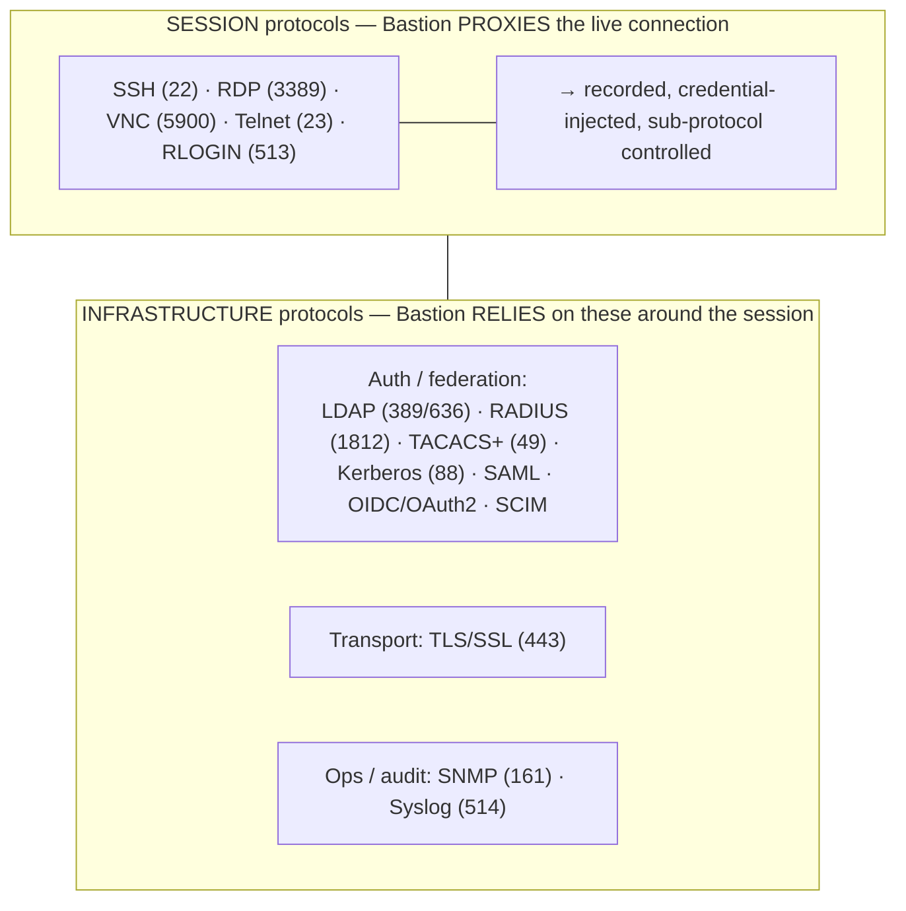
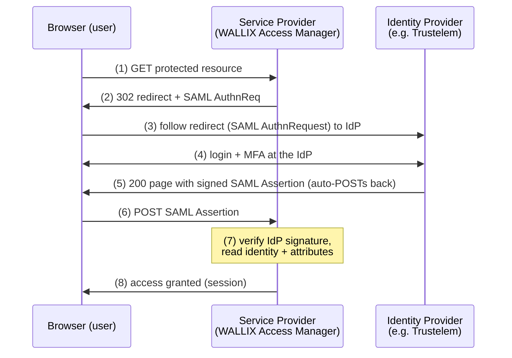
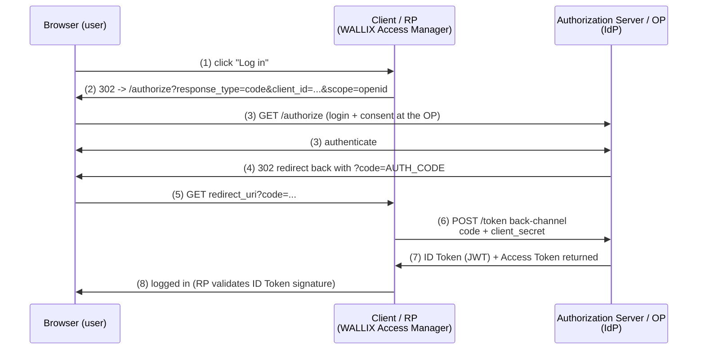
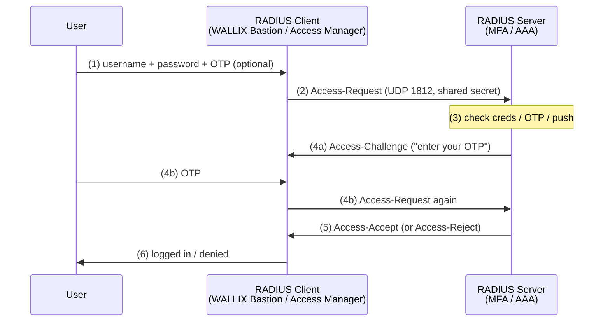

# Networking and Protocols for PAM

A Privileged Access Management (PAM) broker like **WALLIX Bastion** lives in the network
*between* administrators and targets. It either **proxies** a protocol (SSH, RDP, VNC,
Telnet…) or **relies on** a protocol for authentication, federation, or logging (LDAP,
RADIUS, SAML, Syslog…). To configure and troubleshoot Bastion you must know what each
protocol is *for*, which **TCP/UDP port** it uses, and **where it shows up in WALLIX**.
This file gives you that map, then walks through three authentication flows you will
meet constantly: **SAML 2.0 SSO**, **OpenID Connect (OIDC) authorization-code**, and
**RADIUS**.

> **Port reminder:** A **port** is a 16-bit number identifying a service on a host;
> **TCP (Transmission Control Protocol)** is connection-oriented, **UDP (User Datagram
> Protocol)** is connectionless. Defaults below can be changed, but exam questions
> assume the standard ports.

## Learning objectives

By the end of this file you should be able to:

- Name each PAM-relevant protocol, its purpose, default port(s), and where it appears in
  WALLIX (one big reference table).
- Distinguish **session protocols** (proxied by Bastion) from **infrastructure
  protocols** (auth/federation/logging Bastion relies on).
- Walk through the **SAML 2.0 SSO**, **OIDC authorization-code**, and **RADIUS**
  authentication flows.

See [../reference/acronyms.md](../reference/acronyms.md),
[cryptography-and-pki.md](cryptography-and-pki.md) (TLS, certificates), and
[windows-and-active-directory.md](windows-and-active-directory.md) (Kerberos, LDAP, RDP).

---

## 1. The master protocol table

| Protocol | Expands to | Purpose | Default port(s) | Transport | Where in WALLIX |
|----------|-----------|---------|-----------------|-----------|-----------------|
| **SSH** | Secure Shell | Encrypted CLI / file transfer / tunnelling | **22** | TCP | **Bastion session proxy** (shell, SCP, SFTP, X11, direct-TCPIP sub-protocols); OT protocol encapsulation |
| **RDP** | Remote Desktop Protocol | Graphical Windows remote desktop | **3389** | TCP | **Bastion session proxy** via the **"Redemption"** engine (NLA, Kerberos, TLS) |
| **VNC** | Virtual Network Computing | Graphical remote desktop (cross-platform) | **5900** | TCP | **Bastion session proxy**; session-invite (guest) supported for VNC |
| **Telnet** | Teletype Network | *Plaintext* remote CLI (legacy) | **23** | TCP | **Bastion session proxy** (legacy/OT devices) |
| **RLOGIN** | Remote Login | *Plaintext* UNIX remote login (legacy) | **513** | TCP | **Bastion session proxy** (legacy) |
| **TLS/SSL** | Transport Layer Security / Secure Sockets Layer | Encrypts other protocols (HTTPS = HTTP over TLS) | **443** (HTTPS) | TCP | Bastion admin GUI & REST API; **Access Manager** HTTPS gateway; protects LDAPS, RDP, etc. |
| **LDAP** | Lightweight Directory Access Protocol | Directory queries / authentication (AD) | **389** | TCP | **Bastion + Access Manager** user authentication against AD/LDAP |
| **LDAPS** | LDAP over TLS | Encrypted LDAP | **636** | TCP | Same as LDAP, encrypted (recommended) |
| **RADIUS** | Remote Authentication Dial-In User Service | Centralized AAA / often the MFA second factor | **1812** (auth), 1813 (acct) | UDP | **Bastion + Access Manager** auth domain; MFA via RADIUS (e.g., Trustelem) |
| **TACACS+** | Terminal Access Controller Access-Control System Plus | AAA for network devices (Cisco) | **49** | TCP | Bastion directory/authentication integration |
| **Kerberos** | (named after the 3-headed dog) | Ticket-based SSO authentication | **88** | TCP/UDP | **Bastion** user auth and target auth; RDP Kerberos (default from 12.0.1) |
| **SAML 2.0** | Security Assertion Markup Language | Browser SSO / identity federation (XML) | **443** (over HTTPS) | TCP | **Access Manager** as SAML **Service Provider**; Trustelem as IdP |
| **OIDC / OAuth 2.0** | OpenID Connect / Open Authorization | Modern SSO (OIDC) on top of authorization (OAuth 2.0); JSON/JWT | **443** (over HTTPS) | TCP | **Access Manager** auth domain (OIDC **Authorization Code Flow**) |
| **SCIM** | System for Cross-domain Identity Management | Automated user/group provisioning (JSON/REST) | **443** (over HTTPS) | TCP | **Trustelem** acts as SCIM client to provision downstream apps |
| **SNMP** | Simple Network Management Protocol | Device monitoring / metrics / traps | **161** (162 traps) | UDP | **Bastion** monitoring (v2c/v3) |
| **Syslog** | System Logging Protocol | Event/log forwarding to a SIEM | **514** | UDP (often TCP) | **Bastion** log forwarding via `syslog-ng` to a SIEM |

### Two families to keep straight

> **AAA** = **Authentication** (who are you?), **Authorization** (what may you do?),
> **Accounting** (what did you do?). RADIUS and TACACS+ are the classic AAA protocols.

---

## 2. FLOW: SAML 2.0 — Single Sign-On

**SAML 2.0 (Security Assertion Markup Language)** is an XML-based standard for **browser
SSO** and identity federation. Three roles:

- **Principal** — the user (in a web browser).
- **Service Provider (SP)** — the app the user wants (here, **WALLIX Access Manager**).
- **Identity Provider (IdP)** — who authenticates the user (e.g., **WALLIX Trustelem**,
  Microsoft Entra ID, Okta).

This is the **SP-initiated** flow (user starts at the app):

**Walk-through:** the SP bounces the unauthenticated user to the IdP with a signed
**AuthnRequest** (1–3); the user authenticates (and does MFA) at the IdP (4); the IdP
returns a **signed SAML Assertion** that the browser POSTs to the SP (5–6); the SP
verifies the IdP's signature and logs the user in (7–8). The SP never sees the password.

> **Bastion tie-in:** **Access Manager** acts as the **SAML Service Provider** (both
> SP- and IdP-initiated), trusting IdPs like Trustelem/ADFS/Entra. Per the
> [product portfolio](../docs/00-overview/product-portfolio.md#access-manager-web-portal--single-point-of-access--gateway),
> **FIDO2/OTP/push are not native to WAM — they arrive via the federated IdP** over
> SAML/OIDC.

---

## 3. FLOW: OpenID Connect (OIDC) — Authorization Code Flow

**OAuth 2.0** is an *authorization* framework (delegated access via tokens). **OpenID
Connect (OIDC)** adds an *authentication* layer on top, returning an **ID Token** (a
signed **JWT — JSON Web Token**) that proves who the user is. The recommended flow is
the **Authorization Code Flow**:

- **Resource Owner** — the user.
- **Client / Relying Party (RP)** — the app (here, **WALLIX Access Manager**).
- **Authorization Server / OpenID Provider (OP)** — the IdP.

**Why the code, not the token, comes back through the browser:** the short-lived
**authorization code** (4–5) is exchanged for tokens over a **back-channel** server-to-
server call (6–7) authenticated with the `client_secret`, so the tokens never pass
through the user's browser. The RP then validates the ID Token's signature (8).

> **Bastion tie-in:** **Access Manager** supports **OIDC (Authorization Code Flow)** as
> an authentication-domain type (per the
> [product portfolio](../docs/00-overview/product-portfolio.md#access-manager-web-portal--single-point-of-access--gateway)).

---

## 4. FLOW: RADIUS authentication (often the MFA second factor)

**RADIUS (Remote Authentication Dial-In User Service)** is a UDP-based **AAA** protocol
(auth on **UDP 1812**). In PAM it is the classic way to plug in a **second factor**:

- **NAS (Network Access Server) / RADIUS client** — here, **WALLIX Bastion** or **Access
  Manager**.
- **RADIUS server** — the AAA/MFA service (e.g., Trustelem, an OTP server).

**Walk-through:** the client wraps the user's credentials in an **Access-Request**
secured by a **shared secret** (2). The server may answer **Access-Challenge** to demand
an OTP (4a/4b), then finally **Access-Accept** or **Access-Reject** (5). Accounting
(`Access-Request` on 1813) optionally logs the session.

> **Bastion tie-in:** Bastion and Access Manager both support **RADIUS** auth domains;
> WALLIX **Trustelem** integrates with Bastion via **LDAP/RADIUS** to deliver MFA. Note
> RADIUS typically carries PAP and is used as a "**2nd factor only**" mechanism in the
> Trustelem integration (per the
> [product portfolio](../docs/00-overview/product-portfolio.md#supported-protocols--standards)).

---

## How this maps to the certifications

- **WCA-P / WCP-P:** SSH, RDP, and proxy concepts are stated prerequisites; you will
  configure session protocols and LDAP/RADIUS auth.
- **WCE-P (Expert):** the **Advanced authentication** module covers **RADIUS, Kerberos,
  X.509, and SAML** directly (see
  [wce-p-expert.md](../docs/pam-bastion/wce-p-expert.md)); SAML/OIDC are central to
  Access Manager. The IDaaS track adds **SCIM, SAML, OIDC/OAuth 2.0**
  (see [ewcp-i-professional.md](../docs/idaas/ewcp-i-professional.md)).

---

## Sources

- RFC 4251 / 4252 — SSH protocol & authentication: https://www.rfc-editor.org/rfc/rfc4251 · https://www.rfc-editor.org/rfc/rfc4252
- Microsoft — Remote Desktop Protocol: https://learn.microsoft.com/en-us/windows/win32/termserv/remote-desktop-protocol
- RFC 4120 — Kerberos V5: https://www.rfc-editor.org/rfc/rfc4120
- RFC 4511 — LDAP (the protocol): https://www.rfc-editor.org/rfc/rfc4511
- RFC 2865 — RADIUS: https://www.rfc-editor.org/rfc/rfc2865
- RFC 8907 — TACACS+: https://www.rfc-editor.org/rfc/rfc8907
- RFC 8446 — TLS 1.3: https://www.rfc-editor.org/rfc/rfc8446
- OASIS — SAML 2.0 specifications: http://docs.oasis-open.org/security/saml/v2.0/
- RFC 6749 — OAuth 2.0 Authorization Framework: https://www.rfc-editor.org/rfc/rfc6749
- OpenID Connect Core 1.0: https://openid.net/specs/openid-connect-core-1_0.html
- RFC 7644 — SCIM 2.0 Protocol: https://www.rfc-editor.org/rfc/rfc7644
- RFC 5424 — The Syslog Protocol: https://www.rfc-editor.org/rfc/rfc5424
- RFC 3416 — SNMPv2 protocol operations: https://www.rfc-editor.org/rfc/rfc3416
- IANA Service Name and Transport Protocol Port Number Registry: https://www.iana.org/assignments/service-names-port-numbers/service-names-port-numbers.xhtml
- WALLIX Bastion / Access Manager / Trustelem protocol support: [product-portfolio.md](../docs/00-overview/product-portfolio.md)
