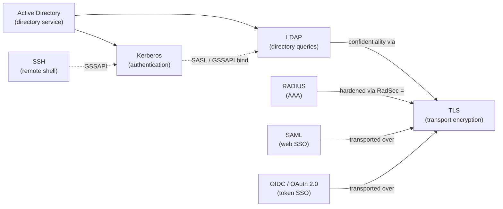

# Protocols — how authentication & identity mechanisms actually work

Deep, mechanism-level explanations of the core protocols behind identity, directory, and
secure transport — the *how it works*, the *message flows*, and crucially *what is
encrypted and how*. Every page is grounded in the relevant RFCs/standards and uses
**Mermaid sequence diagrams** so you can not only understand but **explain** each mechanism.

These are the protocols a Privileged Access Management (PAM) engineer, an ethical hacker,
and a sysadmin all need to reason about — they show up across the
[WALLIX/PAM](../docs/pam-bastion/README.md) and [CEH](../ceh/README.md) hubs.

## Pages

| Protocol | What it does | Highlights |
|----------|--------------|-----------|
| [Kerberos](kerberos.md) | Network authentication (tickets) | AS / TGS / AP exchanges, TGT & service tickets, session keys, pre-auth, what's encrypted with which key |
| [Active Directory](active-directory.md) | Directory service (Microsoft) | LDAP + Kerberos + DNS combined; forest/domain structure; Kerberos vs NTLM logon; the PAC |
| [LDAP](ldap.md) | Directory access & queries | The DIT, DN/RDN, bind methods (simple/SASL), search; LDAPS vs StartTLS |
| [RADIUS](radius.md) | AAA (network access) | Access-Request/Accept/Reject, the shared secret, **why only the password is obfuscated**, RadSec/EAP |
| [TLS](tls.md) | Transport encryption | The 1.2 vs 1.3 handshake, ECDHE key agreement → HKDF → AEAD, Perfect Forward Secrecy, cert validation |
| [SSH](ssh.md) | Secure remote shell & tunneling | 3-layer model, ECDH key exchange, host-key trust (TOFU), publickey auth, channels |
| [SAML](saml.md) | Web SSO federation (enterprise) | IdP/SP model, signed assertions, SP- vs IdP-initiated, XML Signature/Encryption |
| [OIDC / OAuth 2.0](oidc-oauth2.md) | Token-based auth & authorization | Authorization Code + PKCE, JWTs (JWS/JWE), access/ID/refresh tokens |

## How they fit together

Active Directory **is** a directory service that combines Kerberos (authentication), LDAP
(queries), and DNS. LDAP and RADIUS have weak or no native encryption, so both rely on
**[TLS](tls.md)** for confidentiality. Kerberos carries its own encryption.

## Foundations & where these are used

- Crypto building blocks (symmetric/asymmetric, hashing, PKI): [cryptography & PKI](../prerequisites/cryptography-and-pki.md).
- Ports & a protocol-family overview: [networking & protocols](../prerequisites/networking-and-protocols.md).
- How WALLIX Bastion / Access Manager use these for auth: [authentication & Access Manager](../deep-dives/authentication-and-access-manager.md).
