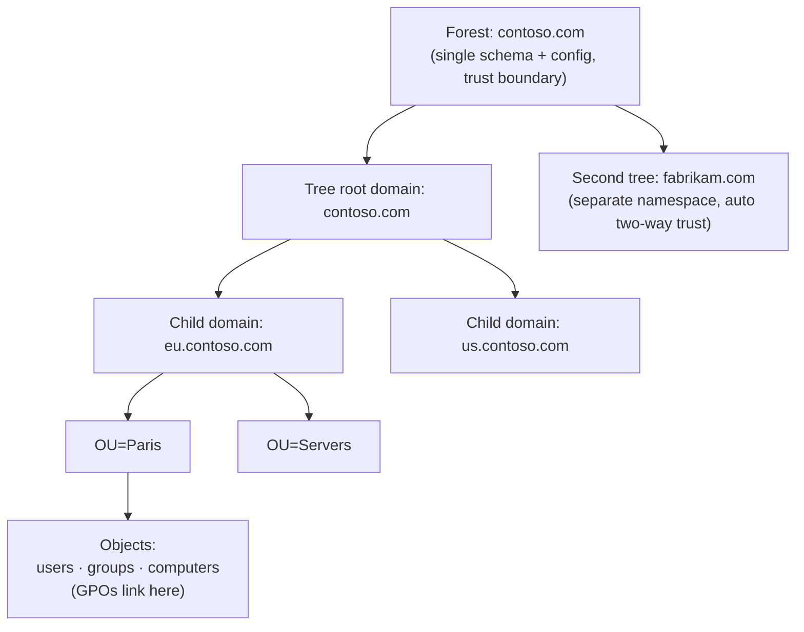
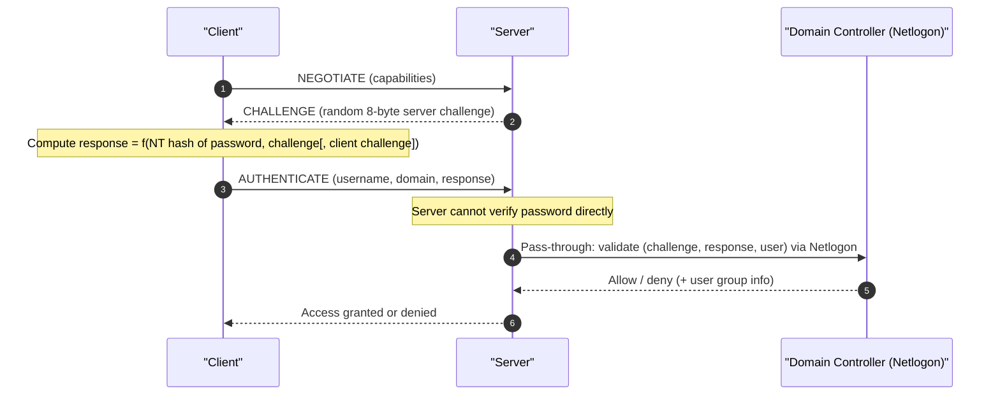

# Active Directory

**Active Directory (AD)** is Microsoft's enterprise **directory service**: a replicated,
hierarchical database of identity and policy objects that *combines* several standard
protocols into one system — **LDAP** (Lightweight Directory Access Protocol) for
queries/writes, **Kerberos** for authentication, **DNS** (Domain Name System) for
locating services, and a multi-master **replication** engine to keep every domain
controller consistent. This page explains how those pieces fit together, how a domain
logon actually works end to end, and how AD is hardened on the wire.

## Learning objectives

By the end of this page you should be able to:

- Explain how AD layers **LDAP + Kerberos + DNS + replication** into one directory service.
- Describe the **logical structure**: forest → tree → domain → **Organizational Unit
  (OU)** → object, plus the **schema** and the **Global Catalog (GC)**.
- Summarise the five **Flexible Single Master Operation (FSMO)** roles.
- Read **Security Identifiers (SIDs)** and **Relative Identifiers (RIDs)** and explain
  **Group Policy Objects (GPOs)**.
- Walk an **interactive domain logon** end to end and place the **Privilege Attribute
  Certificate (PAC)** inside the Kerberos ticket.
- Compare **Kerberos** (primary) with legacy **NTLM** (NT LAN Manager) challenge-response,
  and list NTLM's weaknesses.
- Describe wire hardening: **LDAP signing & channel binding**, **LDAPS**, **SMB signing /
  encryption**.

See also [kerberos.md](kerberos.md),
[../prerequisites/windows-and-active-directory.md](../prerequisites/windows-and-active-directory.md),
[../prerequisites/cryptography-and-pki.md](../prerequisites/cryptography-and-pki.md),
and [../deep-dives/authentication-and-access-manager.md](../deep-dives/authentication-and-access-manager.md).

---

## 1. What AD combines

AD Domain Services (AD DS) is not a single protocol but an integration of several:

| Protocol / mechanism | Standard | Role inside AD |
|----------------------|----------|----------------|
| **LDAP** | RFC 4511 (LDAPv3) | The query/update protocol for reading and writing directory objects; AD exposes the directory on TCP **389** (LDAP) and **636** (LDAPS), plus **3268/3269** for the Global Catalog. |
| **Kerberos** | RFC 4120 | The default authentication protocol; every domain controller runs a Key Distribution Center (KDC). See [kerberos.md](kerberos.md). |
| **DNS** | RFC 1035 + SRV records (RFC 2782) | Clients find domain controllers via **SRV records** (e.g., `_ldap._tcp.dc._msdcs.<domain>`); AD requires DNS. |
| **Replication** | Microsoft DRS (MS-DRSR) | Multi-master replication keeps every domain controller's copy of the database consistent. |
| **NTLM** | MS-NLMP | Legacy fallback authentication (challenge-response). |

A **Domain Controller (DC)** is a server that hosts a writable replica of the domain
database and runs all of the above (LDAP server, KDC, DNS, replication).

## 2. Logical structure



- **Forest** — the top-level container and the **security boundary**. All domains in a
  forest share one **schema** and one **configuration** partition and are joined by
  automatic two-way transitive trusts.
- **Tree** — one or more domains sharing a contiguous DNS namespace (e.g., `contoso.com`
  → `eu.contoso.com`).
- **Domain** — a replication and administrative unit with its own accounts and policies.
- **Organizational Unit (OU)** — a container *inside* a domain for organising objects; it
  is the unit that **GPOs** attach to and where administrative delegation is applied.
- **Object** — a leaf entry (user, group, computer, etc.), each with attributes.

**Schema.** The schema defines every **object class** and **attribute** that can exist in
the forest. It is forest-wide and extensible (e.g., installing Exchange extends the
schema). Changing it is high-impact and controlled by a single FSMO role (below).

**Global Catalog (GC).** A GC is a domain controller that holds a *full* replica of its
own domain plus a *partial, read-only* replica (a subset of attributes) of **every other
domain in the forest**. It answers forest-wide searches and **Universal group** membership
lookups, and is queried on ports **3268/3269**. Without a reachable GC, interactive logon
in a multi-domain forest can fail.

## 3. FSMO roles (brief)

Although AD is multi-master, a few operations must be single-master to avoid conflicts.
These are the **Flexible Single Master Operation (FSMO)** roles — five of them:

| Role | Scope | Responsibility |
|------|-------|----------------|
| **Schema Master** | Forest | Only DC that can modify the schema. |
| **Domain Naming Master** | Forest | Controls adding/removing domains and application partitions. |
| **RID Master** | Domain | Hands out blocks of **RIDs** to DCs so SIDs stay unique. |
| **PDC Emulator** | Domain | Time-sync root, password-change priority, account-lockout processing, legacy compatibility. |
| **Infrastructure Master** | Domain | Maintains cross-domain object references. |

## 4. Security Identifiers (SIDs) and RIDs

Every security principal (user, group, computer) has a unique, immutable **Security
Identifier (SID)** — *not* its name. A SID looks like:

```
S-1-5-21-3623811015-3361044348-30300820-1013
```

- `S-1-5` — revision and the NT Authority identifier.
- `21-3623811015-3361044348-30300820` — the **domain identifier** (unique per domain).
- `1013` — the **Relative Identifier (RID)**, unique within the domain, allocated from the
  RID Master's pool. Well-known RIDs include `500` (built-in Administrator) and `512`
  (Domain Admins).

Authorization in Windows is done by **SID**, which is why the PAC (below) carries SIDs.
Renaming an account keeps its SID and therefore its access.

## 5. Group Policy Objects (GPOs)

A **Group Policy Object (GPO)** is a bundle of configuration and security settings
(password policy, audit policy, software, drive mappings, registry tweaks). GPOs are
**linked** to a **site**, **domain**, or **OU**, and apply to the users/computers beneath
that link. Processing order is **L-S-D-OU** (Local, then Site, then Domain, then nested
OUs, with later levels overriding earlier ones unless "enforced" or "block inheritance" is
set). Clients pull GPOs from the DC's **SYSVOL** share over **SMB** at logon and on a
refresh interval.

## 6. Authentication: Kerberos (primary)

Kerberos is the default. The full mechanism — AS/TGS/AP exchanges, what is encrypted with
which key, tickets and authenticators — is in [kerberos.md](kerberos.md). The AD-specific
addition is the **PAC** (section 8). Each DC is a KDC; clients find it via DNS SRV records.

## 7. Authentication: NTLM (legacy)

> **NTLM (NT LAN Manager) is legacy.** Microsoft recommends Kerberos and is actively
> deprecating NTLM. Use it only where Kerberos cannot work (e.g., authentication by IP
> address with no SPN, certain workgroup/local scenarios) and disable it where possible.

NTLM is a **challenge-response** protocol: the server (or a DC, via **Netlogon**) sends a
random challenge, and the client proves it knows the user's password hash by computing a
response over that challenge — the password and its hash are never sent directly.



**Why NTLM is weak / deprecated:**

- **No mutual authentication** in classic NTLM — the client does not verify the server,
  enabling **NTLM relay / SMB relay** attacks (forward the victim's response to another
  service).
- **Pass-the-hash** — the response is derived from the NT hash, so stealing the *hash*
  (not the cleartext) is enough to authenticate; no Kerberos-style ticket lifetime limits.
- **No delegation / no built-in channel binding** by default, and older variants
  (LM, NTLMv1) use broken cryptography (DES-based, crackable).
- **NTLMv2** improves things (adds a client challenge and timestamps, HMAC-MD5) but still
  inherits relay and pass-the-hash problems.

Mitigations: enforce **SMB signing**, **Extended Protection for Authentication (EPA /
channel binding)**, restrict NTLM via Group Policy, and prefer Kerberos.

## 8. End-to-end interactive domain logon

This ties Kerberos, DNS, LDAP, the PAC and GPOs into one flow when a user logs on at a
domain-joined workstation.

```mermaid
sequenceDiagram
    autonumber
    participant U as "User"
    participant WS as "Workstation (LSASS)"
    participant DNS as "DNS"
    participant DC as "Domain Controller (KDC + LDAP)"
    participant SVC as "File server (CIFS service)"
    U->>WS: Ctrl+Alt+Del, username + password
    WS->>WS: Derive client key Kc via string-to-key (never sends password)
    WS->>DNS: SRV query _kerberos._tcp / _ldap._tcp for the domain
    DNS-->>WS: Address(es) of a Domain Controller
    Note over WS,DC: Kerberos AS exchange (with PA-ENC-TIMESTAMP pre-auth)
    WS->>DC: AS-REQ (pre-auth = Enc(Kc, timestamp))
    DC-->>WS: AS-REP → TGT (incl. PAC with user SID + group SIDs), client/TGS session key
    Note over WS,DC: Kerberos TGS exchange for the workstation's own host service
    WS->>DC: TGS-REQ (TGT + authenticator) for host/workstation
    DC-->>WS: TGS-REP → service ticket (PAC copied in)
    WS->>WS: Build access token from PAC SIDs; load profile
    WS->>DNS: SRV lookup, then LDAP to DC for GPOs (SYSVOL via SMB)
    DC-->>WS: GPO list + settings → applied
    Note over U,SVC: Later: user opens a file share (SSO, no re-prompt)
    WS->>DC: TGS-REQ for cifs/fileserver (using existing TGT)
    DC-->>WS: TGS-REP → service ticket for the file server
    WS->>SVC: AP-REQ (service ticket + authenticator)
    SVC-->>WS: AP-REP (mutual auth); reads PAC to authorize access
```

The user typed a password **once** and then reached the workstation, GPOs, and a file
server without re-entering it — that is Kerberos **Single Sign-On**, with the **PAC**
supplying authorization data at each service.

## 9. The PAC: authorization inside the ticket

The **Privilege Attribute Certificate (PAC)** is a Microsoft structure that the KDC places
in the *authorization-data* field of Kerberos tickets ([MS-PAC]). It carries the user's
**SID**, the SIDs of all groups the user belongs to, logon information, and KDC-generated
**signatures** so a target service can trust it. This lets the service build the user's
**access token** and make authorization decisions *locally*, without an extra LDAP lookup
on every request. The PAC is the bridge between **authentication** (Kerberos proved who you
are) and **authorization** (what SIDs/groups you have). It is an AD extension layered on
top of standard Kerberos (RFC 4120). PAC validation and signatures have been the subject of
security fixes (e.g., the "PAC validation" / certificate-mapping hardening updates), so
keeping DCs patched matters.

## How it encrypts / what is protected

AD's confidentiality and integrity come from the underlying protocols, plus hardening
controls that should be enabled:

- **Kerberos tickets and session traffic** — encrypted with AES etypes per RFC 3961/3962;
  see [kerberos.md](kerberos.md). This protects credentials and the PAC.
- **LDAP signing (integrity)** — without it, LDAP **simple binds** can send credentials in
  cleartext and traffic can be tampered with. Microsoft hardening requires LDAP **signing**
  (a Kerberos/NTLM-derived integrity seal) so directory traffic cannot be modified or
  relayed. Enforced via the `LDAPServerIntegrity` policy.
- **LDAP channel binding (EPA)** — binds the LDAP authentication to the underlying
  **TLS** channel so a relayed bind on a different channel is rejected; mitigates LDAP
  relay. Microsoft has pushed this to "required" on patched DCs.
- **LDAPS** — LDAP over **TLS** on port **636** (and GC on **3269**), giving full
  confidentiality and server authentication via the DC's certificate. Preferred for any
  bind that carries a password (e.g., simple bind), or use **SASL/GSS-API** sealing.
- **SMB signing** — keyed integrity on SMB packets (used for SYSVOL/GPO and file shares);
  defeats SMB relay/tampering. Modern Windows enables/requires it by default in many
  builds.
- **SMB encryption** — **SMB 3.x** can encrypt the session payload (AES-GCM/CCM),
  protecting file traffic on untrusted networks.

## Security notes & common attacks

- **NTLM relay** — relay a captured NTLM authentication to LDAP/SMB/HTTP; mitigate with
  SMB signing, LDAP signing + channel binding, and disabling NTLM.
- **Pass-the-hash / pass-the-ticket** — stolen NTLM hashes or Kerberos tickets replayed;
  mitigate with credential protections, tiered admin, and short ticket lifetimes.
- **Kerberoasting / AS-REP roasting** — see [kerberos.md](kerberos.md); strong
  service-account passwords (gMSA), require pre-auth, disable RC4.
- **DCSync / DCShadow** — an attacker with replication rights pulls password hashes
  (including **krbtgt**) via the replication protocol; restrict the *Replicating Directory
  Changes* rights.
- **Golden ticket** — forged TGTs from a stolen **krbtgt** key; rotate krbtgt (twice) on
  compromise and monitor.
- **Unconstrained delegation abuse** — captured forwarded TGTs impersonate users; prefer
  constrained / resource-based constrained delegation.
- **Cleartext LDAP simple bind** — never simple-bind over plain 389; use LDAPS or
  SASL/GSS sealing, and enforce signing + channel binding.

## Sources

- **Microsoft Learn — Active Directory Domain Services overview**:
  <https://learn.microsoft.com/en-us/windows-server/identity/ad-ds/get-started/virtual-dc/active-directory-domain-services-overview>
- **Microsoft Learn — How the Global Catalog works**:
  <https://learn.microsoft.com/en-us/previous-versions/windows/it-pro/windows-server-2003/cc728188(v=ws.10)>
- **Microsoft Learn — FSMO roles**:
  <https://learn.microsoft.com/en-us/troubleshoot/windows-server/active-directory/fsmo-roles>
- **Microsoft Learn — Security identifiers (SIDs)**:
  <https://learn.microsoft.com/en-us/windows-server/identity/ad-ds/manage/understand-security-identifiers>
- **Microsoft Learn — Kerberos authentication overview**:
  <https://learn.microsoft.com/en-us/windows-server/security/kerberos/kerberos-authentication-overview>
- **Microsoft Learn — NTLM overview** (and deprecation guidance):
  <https://learn.microsoft.com/en-us/windows-server/security/windows-authentication/ntlm-overview>
- **Microsoft — [MS-PAC] Privilege Attribute Certificate Data Structure**:
  <https://learn.microsoft.com/en-us/openspecs/windows_protocols/ms-pac/>
- **Microsoft — LDAP signing & channel binding requirements (ADV190023 / KB4520412)**:
  <https://learn.microsoft.com/en-us/troubleshoot/windows-server/active-directory/2020-ldap-channel-binding-signing-requirements>
- **Microsoft — Overview of SMB signing / encryption**:
  <https://learn.microsoft.com/en-us/windows-server/storage/file-server/smb-security>
- **RFC 4120** — *The Kerberos Network Authentication Service (V5)*:
  <https://www.rfc-editor.org/rfc/rfc4120>
- **RFC 4511** — *LDAP: The Protocol*: <https://www.rfc-editor.org/rfc/rfc4511>
