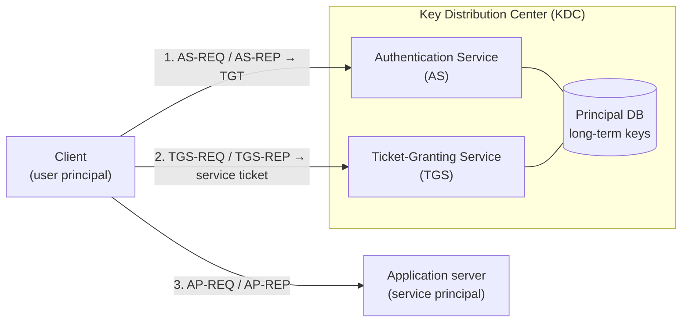
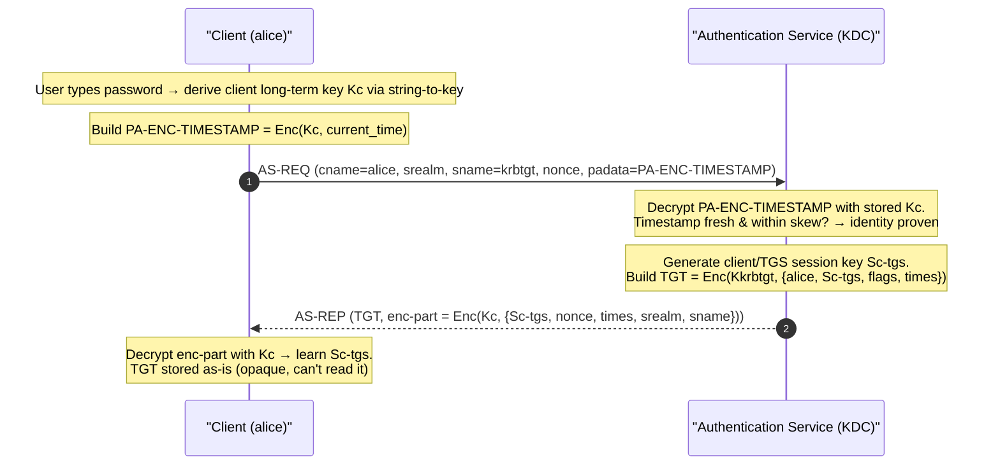
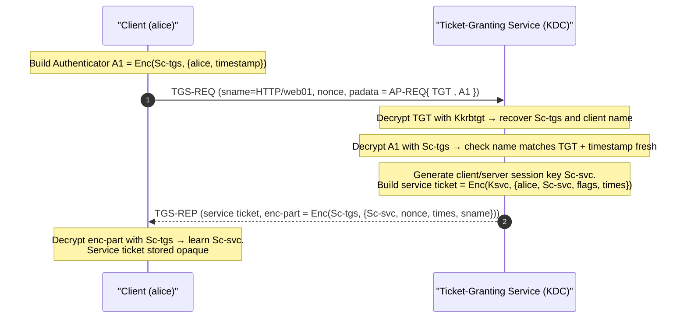
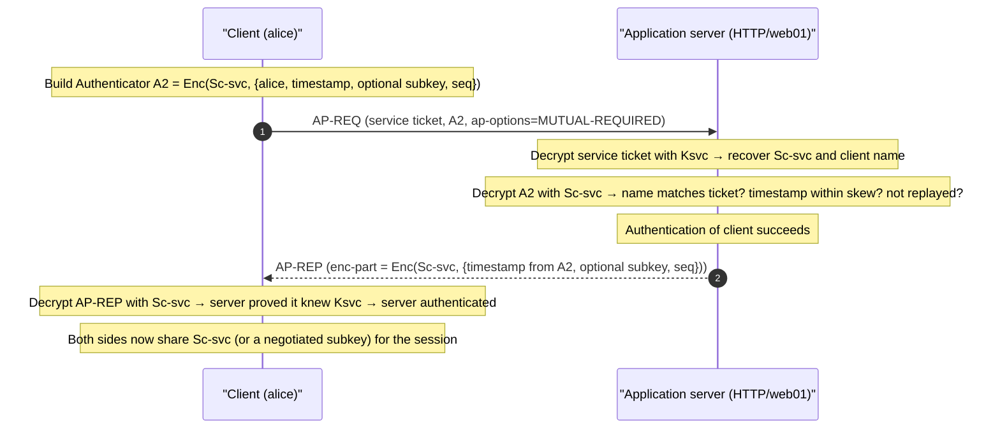

# Kerberos

**Kerberos** is a network authentication protocol that lets a client and a server prove
their identities to each other over an *untrusted* network — without ever sending the
user's password across the wire — by using a trusted third party that issues
short-lived, encrypted **tickets**. This page explains the mechanism from first
principles: the keys involved, what is encrypted with which key in every message, and
why those choices give Kerberos its security properties. The authoritative reference is
**RFC 4120** ("The Kerberos Network Authentication Service (V5)"), with cryptography in
**RFC 3961** and **RFC 3962**.

## Learning objectives

By the end of this page you should be able to:

- Define the core **principals**, **realms**, and the **Key Distribution Center (KDC)**
  and its two services, the **Authentication Service (AS)** and **Ticket-Granting
  Service (TGS)**.
- Distinguish **long-term keys** (derived from the password via *string-to-key*) from
  per-conversation **session keys**.
- Walk through the **three exchanges** (AS, TGS, AP) and state exactly *what is encrypted
  with which key* in each message.
- Explain why the **password is never transmitted**, why **clock synchronisation**
  matters, and how **pre-authentication** (PA-ENC-TIMESTAMP) works.
- Describe **encryption types** (RFC 3961/3962), **cross-realm referrals**, and
  **forwardable tickets / delegation**.
- Recognise the **Privilege Attribute Certificate (PAC)** that Active Directory adds.

See also [active-directory.md](active-directory.md),
[../prerequisites/cryptography-and-pki.md](../prerequisites/cryptography-and-pki.md),
[../prerequisites/windows-and-active-directory.md](../prerequisites/windows-and-active-directory.md),
and [../deep-dives/authentication-and-access-manager.md](../wallix/deep-dives/authentication-and-access-manager.md).

---

## 1. Vocabulary: principals, realms, the KDC

**Principal** — a uniquely named entity that Kerberos can authenticate. A principal name
has the form `primary/instance@REALM`. Examples (RFC 4120 §6.2): a user principal
`alice@EXAMPLE.COM`, a service principal `HTTP/web01.example.com@EXAMPLE.COM`, and the
TGS's own principal `krbtgt/EXAMPLE.COM@EXAMPLE.COM`. The `host/`, `HTTP/`, `cifs/`,
`ldap/` style names are **Service Principal Names (SPNs)**.

**Realm** — the administrative domain that a KDC is authoritative for; by convention it
is written in uppercase (e.g., `EXAMPLE.COM`). In Active Directory the realm maps to the
**Kerberos domain**.

**Key Distribution Center (KDC)** — the trusted third party. It is logically two
services that share one principal database (RFC 4120 §1.3):

| Service | Abbrev. | Role |
|---------|---------|------|
| **Authentication Service** | AS | Verifies the client's identity at logon and issues a **Ticket-Granting Ticket (TGT)**. |
| **Ticket-Granting Service** | TGS | Takes a valid TGT and issues **service tickets** for individual application servers. |

The KDC knows the **long-term secret key of every principal** in its database (the user's
key derived from their password, and each service account's key). It is the only party
that can do so — which is exactly why it can act as the trusted introducer.

## 2. The keys: long-term vs session

**Long-term key (the secret derived from the password).** Kerberos never stores or sends
the password itself. Instead it runs a **string-to-key (s2k)** function over the password
(plus a salt — by default the realm and principal name) to produce a symmetric key. The
exact s2k algorithm is part of each **encryption type (etype)** and is defined in RFC
3961 (the framework) and RFC 3962 (the AES etypes, which use **PBKDF2** — Password-Based
Key Derivation Function 2 — over the password and salt). This long-term key is what the
KDC stores for the user and what services store for themselves.

**Session keys.** Every Kerberos conversation gets fresh, randomly generated symmetric
**session keys** invented by the KDC. A TGT carries a *client/TGS session key*; a service
ticket carries a *client/server session key*. Session keys are short-lived and confined
to one ticket's lifetime, which limits the damage if one is exposed (a form of forward
secrecy at the session level).

Because all of this is **symmetric** cryptography, the trick Kerberos uses repeatedly is:
encrypt a freshly generated session key under the long-term key of the party who should
receive it. Only that party (who knows the long-term key) can decrypt and learn the
session key — proving the sender knew the right long-term secret, without ever revealing
either secret on the wire.

## 3. Tickets and authenticators

| Item | Encrypted under | Contains (selected fields, RFC 4120 §5.3) | Purpose |
|------|-----------------|-------------------------------------------|---------|
| **Ticket-Granting Ticket (TGT)** | The **krbtgt** long-term key (only the KDC can read it) | client name, realm, flags, **client/TGS session key**, start/end times | Lets the client request service tickets from the TGS without re-entering the password. |
| **Service ticket** | The **target service's** long-term key | client name, realm, flags, **client/server session key**, times | Presented to the application server to prove identity. |
| **Authenticator** | The relevant **session key** (client/TGS or client/server) | client name, realm, **timestamp**, optional subkey, optional sequence number | A freshly built, single-use proof that the sender currently *holds* the session key. Defeats replay. |

The crucial distinction: a **ticket** is reusable for its lifetime and is opaque to the
client (it cannot read inside it — it is encrypted for the KDC or the service). An
**authenticator** is built fresh by the client for each use, encrypted with the session
key, and contains a timestamp so the receiver can reject stale copies.

## 4. Exchange (a): AS-REQ / AS-REP with pre-authentication

At logon the client contacts the **AS** to obtain a TGT. Modern Kerberos requires
**pre-authentication** to stop an offline guessing attack on the reply. With
**PA-ENC-TIMESTAMP** (RFC 4120 §5.2.7.2; the encrypted-timestamp method), the client
encrypts the *current time* with its long-term key (derived from the typed password) and
sends it as padata. The KDC decrypts it with the stored user key; if it yields a fresh,
valid timestamp, the client has proven it knows the password — *before* the KDC issues
anything.

**What is encrypted with which key:**

- **PA-ENC-TIMESTAMP** → encrypted with **Kc** (client long-term key). Proves password
  knowledge; only a party who knows the password can produce a decryptable fresh
  timestamp.
- **TGT** → encrypted with **Kkrbtgt** (the krbtgt long-term key). The client cannot read
  it; only the KDC can, later, in the TGS exchange.
- **AS-REP encrypted part** (carrying the new **client/TGS session key Sc-tgs**) →
  encrypted with **Kc**. Only the real user, who can re-derive Kc from the password, can
  recover the session key.

**Why the password is never sent:** the password is only ever used *locally* to derive
Kc, which is used to encrypt a timestamp and to decrypt the AS-REP. The password and Kc
never travel on the network.

## 5. Exchange (b): TGS-REQ / TGS-REP

Now the client wants to reach a specific service (say `HTTP/web01`). It presents its TGT
to the **TGS** and asks for a service ticket. It proves it is the legitimate holder of
the TGT by attaching an **authenticator** encrypted with the client/TGS session key.

**What is encrypted with which key:**

- **TGT** (replayed inside the AP-REQ) → still under **Kkrbtgt**; the TGS decrypts it to
  recover **Sc-tgs**.
- **Authenticator A1** → encrypted with **Sc-tgs**. Proves the requester currently holds
  the session key bound to that TGT (not just a copied TGT blob).
- **Service ticket** → encrypted with **Ksvc** (the target service's long-term key). The
  client cannot read it.
- **TGS-REP encrypted part** (carrying the new **client/server session key Sc-svc**) →
  encrypted with **Sc-tgs** (note: *not* the password-derived Kc — the user does not need
  the password again; the TGT's session key suffices). This is the basis of **Single
  Sign-On (SSO)**: one password entry, many service tickets.

## 6. Exchange (c): AP-REQ / AP-REP (mutual authentication)

The client finally contacts the **application server** and presents the service ticket
plus a fresh authenticator. If mutual authentication is requested
(`MUTUAL-REQUIRED`), the server replies in a way that proves *it* could read the ticket
(i.e., it knows Ksvc), authenticating the server to the client.

**What is encrypted with which key:**

- **Service ticket** → under **Ksvc**; the server decrypts it to learn **Sc-svc** and the
  client's identity. A server that cannot decrypt the ticket is not the right server.
- **Authenticator A2** → under **Sc-svc**; proves the client holds the client/server
  session key. The timestamp + optional sequence number give replay protection.
- **AP-REP encrypted part** → under **Sc-svc**, echoing the authenticator's timestamp.
  Because only a holder of Ksvc could have recovered Sc-svc, a correct AP-REP authenticates
  the **server to the client** (mutual authentication).

After the AP exchange both parties share Sc-svc (or a subkey negotiated in the
authenticator), which they may use with the Kerberos **KRB-SAFE** / **KRB-PRIV** messages
or with **GSS-API** (Generic Security Services Application Program Interface) wrap/MIC
operations to integrity- and/or confidentiality-protect the subsequent application data.

## How it encrypts / what is protected

Kerberos is built almost entirely on **symmetric** encryption and keyed integrity
(message authentication). The recurring pattern is *"seal a new session key under the
recipient's long-term key."* The table summarises every secret and its scope:

| Key | Derived / generated by | Known to | Protects |
|-----|------------------------|----------|----------|
| **Kc** — client long-term key | string-to-key over the password (RFC 3961/3962, PBKDF2 for AES) | client + KDC | PA-ENC-TIMESTAMP; AS-REP enc-part |
| **Kkrbtgt** — krbtgt long-term key | random key of the krbtgt account | KDC only | The TGT |
| **Ksvc** — service long-term key | string-to-key / random for the service account | service + KDC | The service ticket; AP-REP |
| **Sc-tgs** — client/TGS session key | random, by AS | client + KDC | TGS-REQ authenticator; TGS-REP enc-part |
| **Sc-svc** — client/server session key | random, by TGS | client + service | AP-REQ authenticator; AP-REP; later app data |

**Encryption types (etypes) — RFC 3961 / 3962.** RFC 3961 defines the *framework*
(encryption and checksum "profiles": how keys are derived, how confidentiality and
integrity are combined). RFC 3962 defines the AES etypes used by modern deployments:

- `aes128-cts-hmac-sha1-96` and `aes256-cts-hmac-sha1-96` (RFC 3962) — AES in CBC mode
  with **CTS** (ciphertext stealing) for confidentiality, plus **HMAC-SHA1** truncated to
  96 bits for integrity; key derivation uses PBKDF2.
- `aes128-cts-hmac-sha256-128` and `aes256-cts-hmac-sha384-192` — newer SHA-2-based etypes
  defined in **RFC 8009** (an extension beyond RFC 3962; noted here for completeness).
- Legacy `rc4-hmac` (RC4/HMAC-MD5, originally a Microsoft etype) and single-DES etypes are
  **deprecated** and weak; **RFC 6649** deprecates DES, and RC4 should be disabled.

Every encrypted ticket and message therefore carries *both* confidentiality and a keyed
**integrity** checksum, so an attacker cannot tamper with ciphertext undetected.

**Why clock sync matters.** Authenticators rely on a **timestamp** rather than a server
challenge to defeat replay. The receiver accepts an authenticator only if its timestamp is
within an allowed **clock skew** (commonly **5 minutes** by default; configurable). Inside
that window the server is expected to cache recently seen authenticators to reject exact
replays (RFC 4120 §3.2.3). If client and server clocks drift beyond the skew, valid
requests are rejected (`KRB_AP_ERR_SKEW`); if the window were huge, replay attacks would
be easier. Hence Kerberos realms depend on synchronised time (e.g., NTP). The default
5-minute figure is the conventional value, but it is configurable per implementation.

## 7. Cross-realm referrals

When a client in `EXAMPLE.COM` needs a service in `PARTNER.COM`, the two realms must share
a secret. They establish an **inter-realm key** by provisioning a shared `krbtgt`
principal for the remote realm (e.g., `krbtgt/PARTNER.COM@EXAMPLE.COM`). The client's home
TGS issues a **cross-realm TGT** for the remote realm, encrypted under that shared
inter-realm key; the client presents it to the remote realm's TGS, which trusts it and
issues a service ticket (RFC 4120 §1.2, §2.7). With multiple hops, realms can be chained
**transitively** along a trust path. Active Directory automates this with referrals across
domains in a forest and across forest trusts.

## 8. Forwardable tickets and delegation

Ticket **flags** (RFC 4120 §2) control delegation:

- **FORWARDABLE / FORWARDED** — a TGT marked forwardable can be used to obtain a new TGT
  with a *different network address*, so a service can act **on the user's behalf** to a
  further back-end (constrained vs unconstrained delegation in AD builds on this).
- **PROXIABLE / PROXY** — similar idea for service tickets rather than TGTs.
- **RENEWABLE** — a ticket can be renewed up to a maximum lifetime without re-authenticating.

Delegation is powerful and dangerous: an unconstrained-delegation service that receives a
forwarded TGT can impersonate the user anywhere. This is a known attack surface in AD (see
Security notes).

## 9. The PAC (Active Directory)

Microsoft AD embeds a **Privilege Attribute Certificate (PAC)** inside the *authorization
data* of Kerberos tickets. The PAC carries the user's **Security Identifier (SID)**, group
SIDs, and other authorization attributes, signed by the KDC so that the target service can
make access decisions without a separate directory lookup. The PAC is an AD/Microsoft
extension, not part of base RFC 4120; it is covered in [active-directory.md](active-directory.md).

> **RFC 6113** ("A Generalized Framework for Kerberos Pre-Authentication", aka **FAST** —
> Flexible Authentication Secure Tunneling) generalises and hardens pre-authentication by
> wrapping the AS exchange in an armored channel, mitigating the offline-guessing exposure
> of bare PA-ENC-TIMESTAMP. AD implements this as **Kerberos Armoring**.

## Security notes & common attacks

- **Offline password guessing on AS-REP.** If a principal has pre-authentication
  *disabled* (`DONT_REQUIRE_PREAUTH`), anyone can request an AS-REP and brute-force the
  password offline against the Kc-encrypted part — the **AS-REP Roasting** attack. Keep
  pre-auth required; prefer FAST/armoring (RFC 6113).
- **Kerberoasting.** Any authenticated user can request a service ticket for an SPN; the
  ticket is encrypted under the service account's long-term key, so a weak service-account
  password can be cracked offline. Mitigate with long random passwords (or **group Managed
  Service Accounts**) and AES etypes (disable RC4).
- **Golden / Silver tickets.** Whoever steals **Kkrbtgt** can forge arbitrary TGTs
  ("golden ticket"); whoever steals a service key **Ksvc** can forge service tickets
  ("silver ticket"). Protect and rotate the krbtgt key; monitor for anomalous tickets.
- **Pass-the-ticket.** Tickets extracted from a host's memory can be replayed until they
  expire; short lifetimes and credential-guard-style protections reduce exposure.
- **Replay within the skew window** is the reason authenticators carry timestamps and
  servers cache them; tight clock sync keeps the window small.
- **Weak etypes** (DES, RC4) enable faster cracking and downgrade attacks — enforce AES
  (RFC 3962 / RFC 8009) and disable legacy types (RFC 6649 deprecates DES).
- **Unconstrained delegation** lets a compromised front-end impersonate users broadly;
  prefer constrained / resource-based constrained delegation and mark sensitive accounts
  "cannot be delegated".

## Sources

- **RFC 4120** — *The Kerberos Network Authentication Service (V5)*:
  <https://www.rfc-editor.org/rfc/rfc4120>
- **RFC 3961** — *Encryption and Checksum Specifications for Kerberos 5*:
  <https://www.rfc-editor.org/rfc/rfc3961>
- **RFC 3962** — *Advanced Encryption Standard (AES) Encryption for Kerberos 5*:
  <https://www.rfc-editor.org/rfc/rfc3962>
- **RFC 6113** — *A Generalized Framework for Kerberos Pre-Authentication (FAST)*:
  <https://www.rfc-editor.org/rfc/rfc6113>
- **RFC 8009** — *AES Encryption with HMAC-SHA2 for Kerberos 5*:
  <https://www.rfc-editor.org/rfc/rfc8009>
- **RFC 6649** — *Deprecate DES, RC4-HMAC-EXP, and Other Weak Cryptographic Algorithms in Kerberos*:
  <https://www.rfc-editor.org/rfc/rfc6649>
- **MIT Kerberos documentation**: <https://web.mit.edu/kerberos/krb5-latest/doc/>
- **Microsoft Learn — Kerberos authentication overview**:
  <https://learn.microsoft.com/en-us/windows-server/security/kerberos/kerberos-authentication-overview>
- **Microsoft — [MS-PAC] Privilege Attribute Certificate Data Structure**:
  <https://learn.microsoft.com/en-us/openspecs/windows_protocols/ms-pac/>
