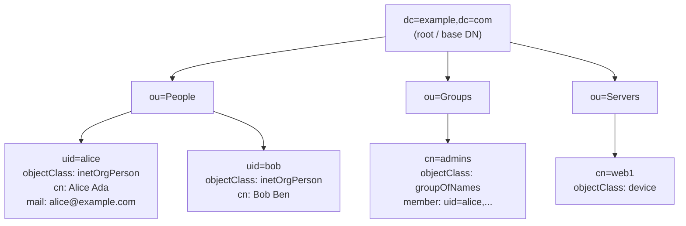
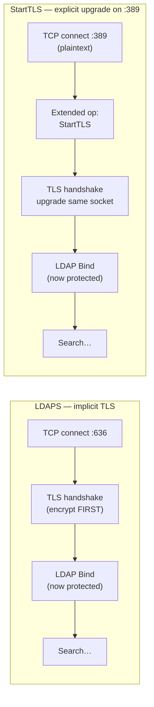

# LDAP — Lightweight Directory Access Protocol (Mechanism)

The **Lightweight Directory Access Protocol (LDAP)** is the on-the-wire protocol used to
read from and write to a **directory service** — a specialised, read-optimised database
of people, groups, computers, and services arranged as a tree. When **WALLIX Bastion**
authenticates a user against **Active Directory (AD)** or an OpenLDAP server, it speaks
LDAP. This page explains *how the protocol actually works*: how the data is structured,
what messages cross the wire, how a client proves its identity (the **bind**), and —
crucially — the fact that **LDAP carries no encryption of its own**: confidentiality is
borrowed entirely from **Transport Layer Security (TLS)**.

LDAP is defined by a family of Request for Comments (RFC) documents. The core protocol is
**RFC 4511**; authentication and security are **RFC 4513**; the **Distinguished Name (DN)**
string form is **RFC 4514**; **search filters** are **RFC 4515**; the **LDAP URL** is
**RFC 4516**; **attribute syntaxes** are **RFC 4517** and the **schema** for user/group
objects is **RFC 4519**.

## Learning objectives

By the end of this page you should be able to:

- Describe the **Directory Information Tree (DIT)**: entries, the **Distinguished Name (DN)**
  and **Relative DN (RDN)**, attributes, **objectClasses**, and the **schema**.
- List the LDAP **protocol operations** (bind, search, compare, add, modify, delete,
  modifyDN, unbind, extended, abandon) and what each does.
- Distinguish the three **bind / authentication methods**: **anonymous**, **simple**
  (cleartext password — needs TLS), and **SASL** (EXTERNAL, GSSAPI/Kerberos, DIGEST-MD5).
- Read a **search request**: base DN, **scope**, and a **filter**.
- Explain **referrals** and how a client is redirected to another server.
- Explain *exactly* why **LDAP has no built-in encryption**, and the difference between
  **LDAPS (port 636)** and **StartTLS (port 389)**, and why a **simple bind without TLS
  sends the password in cleartext**.

See [../prerequisites/networking-and-protocols.md](../prerequisites/networking-and-protocols.md)
for ports and transport, [../prerequisites/cryptography-and-pki.md](../prerequisites/cryptography-and-pki.md)
for TLS and certificates, [./tls.md](./tls.md) for the TLS handshake itself,
[./kerberos.md](./kerberos.md) for the GSSAPI/Kerberos bind mechanism, and
[../deep-dives/authentication-and-access-manager.md](../deep-dives/authentication-and-access-manager.md)
for how WALLIX consumes LDAP/AD identities.

---

## 1. The Directory Information Tree (DIT)

LDAP data lives in a **Directory Information Tree (DIT)** — a hierarchy of **entries**.
Each entry is identified by a **Distinguished Name (DN)** and holds a set of **attributes**.
The tree is rooted near a **naming context** (the "suffix" or "base", e.g.
`dc=example,dc=com`, where `dc` = domainComponent) and branches downward through
organisational units (`ou`) to leaf entries such as users (`uid`/`cn`).



### Names: DN and RDN (RFC 4514)

- A **Relative Distinguished Name (RDN)** names an entry *relative to its parent* — it is
  one (or more, if multi-valued) `attribute=value` pair, e.g. `uid=alice`.
- A **Distinguished Name (DN)** is the full path: the entry's RDN followed by all the
  RDNs of its ancestors, comma-separated, **most-specific first**, e.g.
  `uid=alice,ou=People,dc=example,dc=com`. The DN is globally unique within the DIT and is
  the primary key of an entry.
- RFC 4514 defines the **string representation** of a DN, including which characters must be
  escaped (`,` `+` `"` `\` `<` `>` `;`, leading/trailing spaces, leading `#`).

### Attributes, objectClasses, and the schema (RFC 4519 / 4517)

| Concept | What it is |
|---------|-----------|
| **Attribute** | A typed name/value pair on an entry (e.g. `mail`, `cn`, `member`). May be single- or multi-valued. |
| **Attribute type** | Defined in the schema with a syntax (**RFC 4517**: e.g. DirectoryString, Integer, DN) and matching rules (how equality/substring comparisons work, e.g. `caseIgnoreMatch`). |
| **objectClass** | A special multi-valued attribute listing the **classes** an entry belongs to. Each class declares which attributes are **MUST** (required) and **MAY** (optional). Example: `inetOrgPerson` requires `cn` and `sn`. |
| **Schema** | The catalogue of all attribute types and objectClasses the server enforces. **RFC 4519** defines the common user/organisation schema (`person`, `organizationalPerson`, `inetOrgPerson`, `groupOfNames`, `dc`, `ou`, `cn`, `uid`, `member`…). |

Every entry MUST have at least one **structural** objectClass; the schema is what lets the
server reject malformed entries.

---

## 2. Protocol operations (RFC 4511)

LDAP is a **message-oriented** protocol over a single Transmission Control Protocol (TCP)
connection. Each request carries a **messageID**; responses reuse it, so multiple operations
can be in flight at once. Messages are encoded with **Basic Encoding Rules (BER)**, a subset
of Abstract Syntax Notation One (ASN.1) — this is a binary encoding, **not** human-readable,
but binary is *not* the same as encrypted.

| Operation | Purpose |
|-----------|---------|
| **Bind** | Authenticate the connection (choose anonymous / simple / SASL). Establishes the identity used for later authorization. |
| **Unbind** | Politely end the session (no response; the server closes the connection). |
| **Search** | The workhorse read: return entries matching a filter under a base DN. |
| **Compare** | Ask "does entry X have attribute=value?" — returns true/false **without** returning the value (useful to test a password attribute without reading it). |
| **Add** | Create a new entry. |
| **Modify** | Add / delete / replace attribute values on an entry. |
| **Delete** | Remove an entry. |
| **ModifyDN** | Rename an entry or move it to a new parent (change its RDN/superior). |
| **Abandon** | Ask the server to stop processing an outstanding operation. |
| **Extended** | A protocol-extension envelope identified by an Object Identifier (OID). **StartTLS** (OID `1.3.6.1.4.1.1466.20037`) and **Password Modify** are extended operations. |

The server can also send **unsolicited notifications** (e.g. "Notice of Disconnection").

---

## 3. Bind: the authentication methods (RFC 4513)

The **bind** operation tells the server *who you are* on this connection. RFC 4513 defines
three families. **Until a bind succeeds, the connection is treated as anonymous.**

| Method | How identity is proven | Confidentiality |
|--------|------------------------|-----------------|
| **Anonymous** | Simple bind with an **empty DN and empty password**. Grants whatever access the server allows to "anybody". | n/a — no secret sent. |
| **Simple** | The client sends a **DN and the password in cleartext** inside the bind request. | **None at the LDAP layer.** RFC 4513 says a simple bind **MUST NOT** be used without a confidentiality layer (TLS) unless the data is otherwise protected. |
| **SASL** | The bind selects a **Simple Authentication and Security Layer (SASL)** mechanism by name and runs a challenge/response. | Depends on the mechanism (see below). |

### SASL mechanisms you will meet

- **EXTERNAL** — "use the identity already established by a lower layer." In practice this
  means the **TLS client certificate**: after TLS mutual authentication, the client binds
  with SASL EXTERNAL and the server derives the DN from the certificate. No password crosses
  the wire at all. (This is how WALLIX/AD can do **X.509 certificate** authentication.)
- **GSSAPI** — the **Generic Security Services Application Programming Interface**, which in
  directory deployments means **Kerberos v5**. The client presents a Kerberos service ticket
  for the directory's `ldap/host` Service Principal Name (SPN); no password is sent to the
  directory, and GSSAPI can additionally negotiate a signing/sealing (integrity/encryption)
  layer over the LDAP messages. See [./kerberos.md](./kerberos.md).
- **DIGEST-MD5** — a legacy challenge/response so the password is not sent in cleartext.
  It is **deprecated and considered weak** (MD5-based, historical implementation problems);
  RFC sources mark it obsolete. Prefer GSSAPI or EXTERNAL over TLS. *Do not present
  DIGEST-MD5 as "secure" — it is not.*

> **Key takeaway:** SASL chooses *how* you authenticate; **TLS chooses whether the bytes are
> encrypted.** They are independent. A SASL bind without an encryption layer still exposes
> the rest of the traffic (searches, results) on the wire.

---

## 4. A real exchange: bind then search

The diagram below shows a typical service account binding, then searching for a user, over a
TLS-protected connection. (For an unprotected port-389 simple bind, the `BindRequest`
password would travel in cleartext — see §6.)

```mermaid
sequenceDiagram
    participant C as LDAP client<br/>(e.g. WALLIX Bastion)
    participant S as LDAP / AD server

    Note over C,S: TCP connect (then TLS — LDAPS:636 or StartTLS on 389)
    C->>S: BindRequest (simple)<br/>DN=cn=svc,dc=example,dc=com + password
    S-->>C: BindResponse (resultCode = success)

    C->>S: SearchRequest<br/>base=ou=People,dc=example,dc=com<br/>scope=subtree<br/>filter=(uid=alice)
    S-->>C: SearchResultEntry<br/>dn=uid=alice,...; cn; mail; memberOf
    S-->>C: SearchResultDone (success)

    C->>S: UnbindRequest
    Note over C,S: Server closes the connection
```

### Search semantics (RFC 4515 / 4516)

A `SearchRequest` is built from three knobs:

| Parameter | Meaning |
|-----------|---------|
| **baseObject (base DN)** | Where in the tree to start, e.g. `ou=People,dc=example,dc=com`. |
| **scope** | `baseObject` (just that one entry), `singleLevel` (immediate children only), or `wholeSubtree` (the base and everything beneath it). |
| **filter** | A boolean predicate over attributes (RFC 4515), in **prefix/parenthesised** form. |

Filter examples (RFC 4515):

| Filter | Matches |
|--------|---------|
| `(uid=alice)` | Entries whose `uid` equals `alice`. |
| `(objectClass=*)` | Any entry (presence test on `objectClass`). |
| `(&(objectClass=person)(mail=*@example.com))` | AND: persons with an example.com mail. |
| `(\|(uid=alice)(uid=bob))` | OR: alice or bob. |
| `(!(uid=admin))` | NOT: everything except `uid=admin`. |
| `(cn=Al*)` | Substring: `cn` starting with `Al`. |

An **LDAP URL** (RFC 4516) packs all of this into one string:
`ldap://host:389/ou=People,dc=example,dc=com?cn,mail?sub?(uid=alice)` —
host, **base DN**, requested attributes, **scope** (`sub`), and **filter**. `ldaps://`
denotes the TLS-wrapped variant.

---

## 5. Referrals (RFC 4511)

A server that does not hold the requested part of the tree can return a **referral**: a
**result** (resultCode `referral`) or, within a search, a **SearchResultReference**,
containing one or more **LDAP URLs** pointing at the server(s) that do. The client may then
**chase** the referral by opening a new connection to the referred server and reissuing the
operation. Referrals are how a distributed directory stitches multiple servers into one
logical DIT (in AD, this is how cross-domain/global-catalog lookups can be redirected).

---

## 6. How it encrypts / what is protected

**This is the single most important point about LDAP: the LDAP protocol itself provides no
encryption.** BER encoding is binary, but binary is trivially decoded; anyone capturing the
packets sees DNs, filters, returned attributes — and, with a **simple bind**, the
**password in cleartext**. Confidentiality and server authentication come *entirely* from
**TLS** wrapped around the LDAP connection. There are two ways to apply it:

| | **LDAPS** | **StartTLS** |
|---|-----------|--------------|
| Port | **636/TCP** (a separate "ldaps" port) | **389/TCP** (the ordinary LDAP port) |
| How TLS starts | TLS is negotiated **immediately on connect**, *before any LDAP byte* (implicit TLS, like HTTPS). | The client first connects in plaintext, then sends the **StartTLS extended operation** (OID `1.3.6.1.4.1.1466.20037`); on success, the **same connection is upgraded** to TLS. |
| Standardisation | A widely used de-facto convention (separate-port TLS), **not** the IETF-preferred method. | The **standards-track** mechanism, described in **RFC 4511** §4.14 with security in **RFC 4513**. |
| Practical rule | **Bind only after TLS is up.** | **Send StartTLS first, verify it succeeded, then Bind.** Binding before StartTLS leaks the password. |



Two consequences to internalise:

1. **A simple bind on plain port 389 (no StartTLS) sends the DN and password in cleartext.**
   A passive sniffer captures the credential. This is why RFC 4513 forbids simple binds
   without a confidentiality layer, and why WALLIX/AD deployments use **LDAPS (636)** or
   **StartTLS** for the bind that validates user passwords.
2. **TLS protects the channel, not the stored data.** It encrypts the connection between
   client and directory; it says nothing about how passwords are hashed *inside* the
   directory (that is the server's `userPassword`/AD hashing, a separate concern).

When the bind uses **SASL GSSAPI (Kerberos)**, GSSAPI can supply its own integrity/
confidentiality ("signing and sealing") even without TLS — but the typical, simplest, and
recommended path for password-based simple binds remains **TLS**.

---

## 7. Security notes & common attacks

- **Cleartext password capture** — simple bind without TLS leaks the password. *Mitigation:*
  always LDAPS or StartTLS; ideally SASL EXTERNAL (certificate) or GSSAPI so no password
  travels at all.
- **StartTLS stripping / downgrade** — an active attacker can drop or forge the StartTLS
  response so the client silently stays in plaintext and then binds. *Mitigation:* configure
  the client to **require** TLS and **fail closed** if StartTLS does not succeed; validate the
  server certificate (a StartTLS connection to a man-in-the-middle still fails certificate
  validation if checked).
- **Certificate validation disabled** — "ignore certificate errors" turns TLS into encryption
  against passive eavesdroppers only and opens the door to man-in-the-middle. *Mitigation:*
  validate the chain and hostname; pin the CA.
- **Anonymous bind exposure** — if anonymous read is allowed, the whole tree (users, emails,
  group membership) can be enumerated for reconnaissance. *Mitigation:* restrict anonymous
  access; require authentication for sensitive subtrees.
- **LDAP injection** — building a filter by string-concatenating untrusted input (e.g.
  `(uid=<user-input>)`) lets an attacker inject filter syntax (`*)(uid=*))(|(uid=*`) to
  alter the query. *Mitigation:* escape filter special characters per RFC 4515.
- **Unauthenticated / "unauthenticated simple" bind** — a non-empty DN with an **empty
  password** is treated by RFC 4513 as anonymous, not as a logged-in user; mis-handling this
  can let an empty password appear to "succeed". *Mitigation:* reject empty-password binds.
- **DIGEST-MD5 weakness** — do not rely on it; prefer GSSAPI or TLS + EXTERNAL.

---

## Sources

- **RFC 4511** — *Lightweight Directory Access Protocol (LDAP): The Protocol* (operations,
  messages, StartTLS, referrals). <https://www.rfc-editor.org/rfc/rfc4511>
- **RFC 4513** — *LDAP: Authentication Methods and Security Mechanisms* (anonymous, simple,
  SASL, TLS). <https://www.rfc-editor.org/rfc/rfc4513>
- **RFC 4514** — *LDAP: String Representation of Distinguished Names*.
  <https://www.rfc-editor.org/rfc/rfc4514>
- **RFC 4515** — *LDAP: String Representation of Search Filters*.
  <https://www.rfc-editor.org/rfc/rfc4515>
- **RFC 4516** — *LDAP: Uniform Resource Locator*. <https://www.rfc-editor.org/rfc/rfc4516>
- **RFC 4517** — *LDAP: Syntaxes and Matching Rules*. <https://www.rfc-editor.org/rfc/rfc4517>
- **RFC 4519** — *LDAP: Schema for User Applications*. <https://www.rfc-editor.org/rfc/rfc4519>
- **RFC 4422** — *Simple Authentication and Security Layer (SASL)* (referenced by RFC 4513).
  <https://www.rfc-editor.org/rfc/rfc4422>
