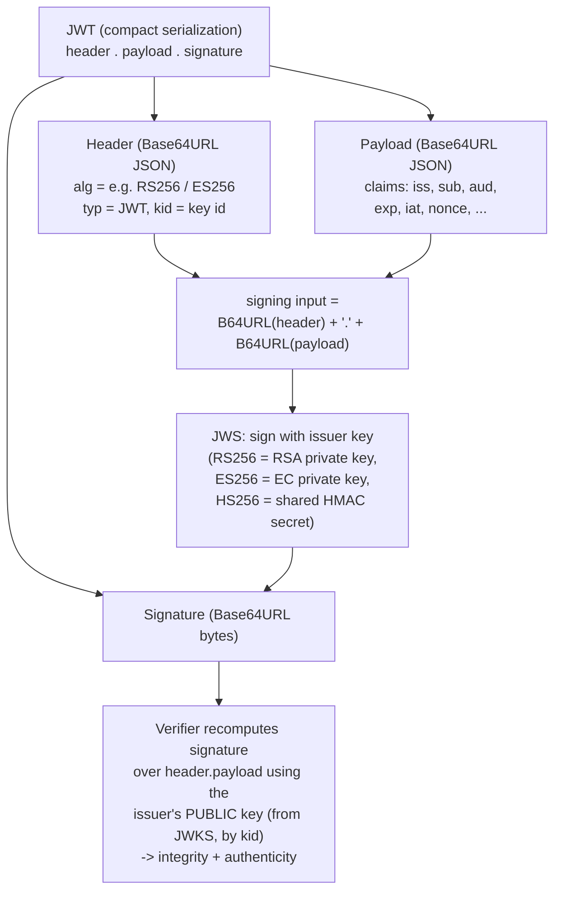

# OAuth 2.0 and OpenID Connect (OIDC): how they actually work

**OAuth 2.0** is an **authorization** framework: it lets a user grant a third-party
application *limited access to their resources* on another service — *without handing over
their password*. **OpenID Connect (OIDC)** is a thin **authentication** layer built *on top
of* OAuth 2.0: it reuses the same flow but adds a standard way to answer "*who is this user,
and how/when did they log in?*". Together they are the modern, JSON-based answer to the same
SSO problem that **SAML (Security Assertion Markup Language)** solves with XML — and they are
what WALLIX One **IDaaS / Trustelem** and **Access Manager** speak when federating to and from
modern apps.

The distinction is the thing to keep straight from the start:

- **OAuth 2.0 = authorization** ("this app may read your calendar"). Defined in **RFC 6749**.
- **OpenID Connect = authentication** ("this is Alice, who logged in with MFA at 09:14").
  Defined in the **OpenID Connect Core 1.0** specification.

This page explains the **mechanism**: the roles, the **Authorization Code flow with PKCE**
(the flow you should use today), the `/authorize` and `/token` endpoints, the three kinds of
token, and the structure of a **JSON Web Token (JWT)** — *what is signed and what may be
encrypted, and what a client must verify*.

> This page assumes you understand digital signatures, public/private keys, and hashing.
> If not, read
> [../prerequisites/cryptography-and-pki.md](../prerequisites/cryptography-and-pki.md) first.
> **Everything here mandates TLS (Transport Layer Security)** — see [./tls.md](tls.md).

## Learning objectives

By the end of this file you should be able to:

- State precisely how **OAuth 2.0 (authorization)** differs from **OIDC (authentication)** and
  why "OAuth for login" without OIDC is an anti-pattern.
- Name the four **OAuth roles** — resource owner, client, authorization server, resource
  server.
- Walk the **Authorization Code flow with Proof Key for Code Exchange (PKCE)** message by
  message, and explain what `/authorize` and `/token` each do.
- Distinguish the three tokens: **access token** (a **bearer token**), **refresh token**, and
  the OIDC **ID Token** (a **JWT**).
- Decode a **JWT**'s `header.payload.signature` structure and explain **JSON Web Signature
  (JWS)** signing vs optional **JSON Web Encryption (JWE)**.
- List the checks a client/resource server must perform on a JWT (issuer, audience, expiry,
  signature) and explain **PKCE**, redirect-URI validation, and why the **implicit flow** is
  discouraged.

---

## 1. The roles (RFC 6749 §1.1)

| Role | OAuth term | Who/what it is |
|------|-----------|----------------|
| **Resource owner** | The user | The human who owns the data and grants access. |
| **Client** | The application | The app requesting access on the user's behalf (a web app, SPA, mobile app, or service). |
| **Authorization Server (AS)** | The token issuer | Authenticates the resource owner and issues tokens. In OIDC this is the **OpenID Provider (OP)** — the equivalent of SAML's IdP. |
| **Resource Server (RS)** | The API | Hosts the protected resources; accepts **access tokens** and serves data. |

A key sub-distinction for security:

- A **confidential client** can keep a secret (a server-side web app with a backend) — it
  authenticates to the AS with a `client_secret`.
- A **public client** *cannot* keep a secret (a Single-Page App in a browser, a mobile app) —
  its code is on the user's device. Public clients **must** use **PKCE** (§3) because they have
  no secret to prove they are the legitimate redemeer of a code.

---

## 2. OAuth (authorization) vs OIDC (authentication)

Plain OAuth 2.0 issues an **access token** that says *what the bearer may do* — but says
nothing reliable about *who the user is*. Using an access token "to log a user in" is unsafe:
access tokens are opaque to the client, audience-targeted at the API, and can be obtained or
substituted in ways that break a login assumption (the historical "confused deputy" / token-
substitution problems).

**OIDC fixes this** by adding, alongside the access token, a dedicated **ID Token** — a signed
**JWT** *intended for the client* that explicitly states the user's identity and authentication
event. You request it by including the scope **`openid`**. If you need to *authenticate a user*
(log them in), you need **OIDC**, not bare OAuth.

| | OAuth 2.0 (RFC 6749) | OpenID Connect (OIDC Core 1.0) |
|---|---|---|
| Purpose | **Authorization** (delegated access) | **Authentication** (login / identity) |
| Key artifact | **Access token** (for the API) | **ID Token** (a JWT, for the client) |
| Triggered by | scopes like `read`, `write` | the **`openid`** scope (+ `profile`, `email`, …) |
| "Who is the user?" | not reliably answerable | answered by ID Token claims (`sub`, `iss`, `aud`, …) |

---

## 3. The Authorization Code flow with PKCE

The **Authorization Code grant** (RFC 6749 §4.1) is the recommended flow, and **Proof Key for
Code Exchange (PKCE, RFC 7636)** is the protection that current guidance (OAuth 2.0 Security
Best Current Practice) says **all** clients — public *and* confidential — should use.

**The core idea:** the user-facing **front channel** (the browser) only ever carries a
short-lived **authorization code**, never tokens. The actual tokens are fetched on the
**back channel** (a direct, server-to-server HTTPS call from client to the AS's `/token`
endpoint). PKCE binds the code to the very client instance that started the flow, so a stolen
code is useless to anyone else.

How PKCE works in one sentence: the client invents a random secret (the **`code_verifier`**),
sends only its **hash** (`code_challenge = SHA-256(code_verifier)`) when asking for the code,
and must present the **original `code_verifier`** when redeeming the code — so only the
originator can exchange it.

```mermaid
sequenceDiagram
    participant U as User / Browser
    participant C as Client (App)
    participant AS as Authorization Server
    participant RS as Resource Server (API)
    Note over U,RS: every call is over TLS (HTTPS)
    Note over C: generate random code_verifier;<br/>code_challenge = SHA-256(verifier)
    U->>C: 1. Start login / "Connect"
    C-->>U: 2. Redirect to AS /authorize<br/>(client_id, redirect_uri, scope=openid...,<br/>state, code_challenge, S256)
    U->>AS: 3. GET /authorize
    Note over AS: 4. AS authenticates the user<br/>(password / MFA / existing session)<br/>+ consent
    AS-->>U: 5. Redirect to redirect_uri<br/>with authorization code + state
    U->>C: 6. Deliver code + state to client
    Note over C: verify state matches
    C->>AS: 7. POST /token (back channel)<br/>code, redirect_uri, client_id,<br/>code_verifier (+ client_secret if confidential)
    Note over AS: 8. AS recomputes SHA-256(verifier),<br/>checks it equals stored code_challenge
    AS-->>C: 9. access_token (+ refresh_token)<br/>+ id_token (JWT) [OIDC]
    Note over C: 10. validate id_token JWT<br/>(signature, iss, aud, exp, nonce)
    C->>RS: 11. GET /resource<br/>Authorization: Bearer access_token
    RS-->>C: 12. Protected data
```

Step by step:

1. **Start.** The user clicks "log in / connect" at the client.
2–3. **`/authorize` (front channel).** The client redirects the browser to the AS's
   **`/authorize`** (authorization) endpoint with: `response_type=code`, its `client_id`, the
   `redirect_uri`, the requested **`scope`** (including **`openid`** for OIDC), a random
   **`state`** (CSRF protection), and the PKCE **`code_challenge`** + `code_challenge_method=S256`.
   For OIDC a **`nonce`** is also sent, to bind the eventual ID Token to this request.
4. **AS authenticates the user** — by password, **MFA**, or an existing session — and obtains
   **consent** for the requested scopes. The user's credentials go *only* to the AS, never the
   client.
5–6. **Authorization code returned (front channel).** The AS redirects the browser back to the
   registered `redirect_uri` with a short-lived, single-use **authorization code** and the
   `state`. The client confirms `state` matches what it sent.
7. **`/token` (back channel).** The client makes a **direct** POST to the AS's **`/token`**
   endpoint with the `code`, the `redirect_uri`, its `client_id`, and the **`code_verifier`**
   (the original PKCE secret). A confidential client also authenticates here (e.g.
   `client_secret`).
8. **PKCE check.** The AS hashes the presented `code_verifier` and confirms it equals the
   `code_challenge` from step 2 — proof this is the same client instance that started the flow.
9. **Tokens issued.** The AS returns a JSON response with an **`access_token`**, usually a
   **`refresh_token`**, and (because `openid` was requested) an **`id_token`** (a JWT).
10. **Validate the ID Token** (the OIDC client's job — see §4 and "How it secures").
11–12. **Call the API.** The client calls the resource server presenting the access token in
   the **`Authorization: Bearer <token>`** header (RFC 6750). The RS validates the token and
   returns data.

> **Why the code (not tokens) goes through the browser:** the front channel is exposed
> (browser history, referrer headers, logs, redirects). A code is short-lived, single-use, and
> — with PKCE — unusable without the verifier. Tokens only ever travel on the protected back
> channel. This is exactly the weakness the **implicit flow** had (§Security).

---

## 4. The three tokens

| Token | Format | Audience | Purpose | Spec |
|-------|--------|----------|---------|------|
| **Access token** | Often opaque, or a JWT | the **Resource Server / API** | Authorizes API calls; presented as a **bearer token** | RFC 6749 / RFC 6750 |
| **Refresh token** | Opaque, long-lived | the **Authorization Server** | Obtains new access tokens when they expire, *without re-prompting the user* | RFC 6749 §6 |
| **ID Token** | **Always a JWT** | the **Client** | Asserts the user's identity + the authentication event (login) | OIDC Core 1.0 |

- The **access token** is the API key for *this* delegation. It is a **bearer token**
  (RFC 6750): *whoever holds it can use it* — there is no proof-of-possession by default, which
  is exactly why it must be kept secret and sent only over TLS. Access tokens are deliberately
  **short-lived**.
- The **refresh token** trades longevity for tighter custody: it is used only against the AS's
  `/token` endpoint to mint fresh access tokens, so the user is not re-prompted constantly. It
  must be stored securely (ideally only by confidential clients; for public clients, with
  **rotation** so a stolen refresh token is detectable).
- The **ID Token** is the OIDC addition. It is **for the client**, and its **`aud` (audience)**
  claim is the client's `client_id` — so a client must reject any ID Token not addressed to it.
  Typical claims: **`iss`** (issuer = the OP), **`sub`** (the stable user identifier),
  **`aud`**, **`exp`** (expiry), **`iat`** (issued-at), **`nonce`** (binds it to the request in
  step 2), and **`auth_time`** / **`acr`** (when/how strongly the user authenticated).

> **Do not read the access token in the client to identify the user.** Identity comes from the
> ID Token (or the OIDC **`/userinfo`** endpoint). The access token is for the API, not the
> client.

---

## 5. JWT structure: JWS signing vs JWE encryption

A **JSON Web Token (JWT, RFC 7519)** is a compact, URL-safe container for **claims** (the
JSON key/value statements like `sub`, `exp`). The OIDC ID Token *is* a JWT. A JWT is almost
always secured as a **JSON Web Signature (JWS)**: three Base64URL-encoded parts joined by dots —

`header . payload . signature`



- **Header** — JSON describing the token: **`alg`** (the signature algorithm, e.g. `RS256` =
  RSA + SHA-256, `ES256` = ECDSA + SHA-256, or `HS256` = HMAC-SHA-256), `typ`, and a **`kid`**
  (key ID) telling the verifier *which* key signed it.
- **Payload** — the **claims** (the `iss`/`sub`/`aud`/`exp`/`nonce` etc. from §4). **Base64URL
  is encoding, not encryption** — a signed-only JWT's payload is *readable by anyone*; never
  put secrets in it.
- **Signature** — **JWS (RFC 7515)** over `header.payload`. With **asymmetric** algorithms
  (`RS256`, `ES256`) the issuer signs with its **private key** and verifiers check with the
  issuer's **public key**, which the OP publishes at a **JWKS (JSON Web Key Set)** URL
  discoverable via OIDC metadata; the `kid` selects the right key. (`HS256` uses a shared
  secret — only suitable when issuer and verifier share it, e.g. a confidential client.)

**Optional encryption — JWE.** When the claims themselves are sensitive, the JWT can instead
(or additionally) be a **JSON Web Encryption (JWE, RFC 7516)** object — *five* Base64URL parts
— which encrypts the payload (hybrid: a content-encryption key encrypts the claims, and that
key is encrypted to the recipient's public key). Signing and encryption are **independent**:
JWS gives integrity/authenticity, JWE gives confidentiality; a "nested" JWT can be signed
*then* encrypted. In practice OIDC ID Tokens are usually **signed (JWS) only**, relying on TLS
for transport confidentiality.

### Scopes vs claims

- **Scopes** (sent to `/authorize`) request *categories* of access/identity: `openid` (required
  for OIDC), `profile`, `email`, plus API-specific scopes. They tell the AS *what to grant*.
- **Claims** are the resulting *facts* — name/value statements inside the ID Token (or returned
  by `/userinfo`). Requesting the `email` scope, for example, yields an `email` claim.

---

## How it secures (signing vs encryption)

Keep the two mechanisms distinct, exactly as in SAML:

- **Bearer tokens over TLS (confidentiality on the wire).** Access tokens are bearer
  credentials (RFC 6750) with no built-in proof-of-possession, so their security on the wire
  rests entirely on **TLS** — both for sending them in the `Authorization` header and for the
  back-channel `/token` call. **TLS is non-negotiable**; without it, every token is sniffable
  and replayable.
- **Signed JWTs (integrity + authenticity of the assertion).** The ID Token's trust comes from
  its **JWS signature**, not from the channel. A verifier (the client for an ID Token; the RS
  for a JWT access token) must, per RFC 7519 / OIDC Core, check **all** of:
  1. **Signature** valid against the issuer's published key (fetched from the OP's **JWKS**,
     selected by `kid`) — and the **`alg`** is an *expected* algorithm (reject `alg: none`; do
     not let the token dictate an unexpected algorithm).
  2. **`iss`** (issuer) equals the expected OP.
  3. **`aud`** (audience) contains this verifier (the client's `client_id` for an ID Token).
  4. **`exp`** not passed (and `iat`/`nbf` sane), with bounded clock skew.
  5. For an ID Token, the **`nonce`** matches the one sent in step 2 (binds token to request,
     stops replay/injection).
  This signature check is what lets a client trust an identity it did not itself witness — the
  OIDC analogue of validating a SAML assertion's XML Signature.
- **Optional JWE (confidentiality of the claims).** Adds end-to-end secrecy of the claim
  contents on top of TLS; used when claims must be hidden even from intermediaries. Optional and
  comparatively rare for ID Tokens.
- **PKCE (binding the code to its originator).** For public clients especially, PKCE replaces
  the missing client secret: it cryptographically ties the authorization code to the client
  instance that began the flow, so an intercepted code cannot be redeemed by an attacker.

| Mechanism | Provides | Key used |
|-----------|----------|----------|
| **TLS** | Transport confidentiality + server auth | TLS session keys |
| **JWS** (sign) | **Integrity + authenticity** of the JWT/ID Token | Issuer **private** key signs; verifier checks with issuer **public** key (JWKS) |
| **JWE** (encrypt) | **Confidentiality** of the claims | Encrypted to recipient **public** key |
| **PKCE** | Binds auth code to the originating client | `code_verifier` secret + its SHA-256 hash |

---

## Security notes & common attacks

- **Token leakage = full compromise.** Because access tokens are **bearer** tokens, anyone who
  obtains one can use it until it expires. Mitigations: send them only over TLS; keep them
  **short-lived**; store them carefully (avoid `localStorage` for SPAs where feasible); use
  **refresh-token rotation** so a stolen refresh token is detected; consider sender-constrained
  tokens (e.g. **DPoP**) where supported.
- **TLS is mandatory, everywhere.** RFC 6749/6750 require TLS. Tokens and the back-channel
  `/token` exchange in plaintext would be trivially sniffable. No TLS, no OAuth.
- **Why the implicit flow is discouraged.** The legacy **implicit flow** (`response_type=token`)
  returned the **access token directly in the redirect URI fragment** — i.e. *through the
  browser front channel*, where it leaks via history, referrers, and logs, with no PKCE binding
  and no client authentication. Current guidance (OAuth 2.0 Security BCP) **deprecates implicit**
  in favor of **Authorization Code + PKCE**, which only exposes a single-use, PKCE-bound code on
  the front channel and fetches tokens on the back channel.
- **Redirect-URI validation.** The AS must match the `redirect_uri` against **pre-registered,
  exact** values (no open patterns/wildcards). A lax redirect URI lets an attacker steal the
  authorization code (or token) by redirecting it to a site they control — a classic OAuth
  account-takeover. Combine with **`state`** (CSRF protection) and PKCE.
- **`alg` confusion / `alg: none`.** A verifier that trusts the token's own `alg` can be tricked
  into accepting an unsigned token (`alg: none`) or into verifying an RSA-signed token as an
  HMAC using the public key as the secret. Always pin the **expected** algorithm(s) and reject
  `none`.
- **Mix-up & audience confusion.** Always validate `iss` and `aud`; never accept a token minted
  for a different audience/client. This is the JWT counterpart of SAML's `AudienceRestriction`
  check.

For how WALLIX brokers these protocols — Access Manager / Bastion as OAuth client and OIDC
relying party, WALLIX One IDaaS as the OpenID Provider — see
[../deep-dives/authentication-and-access-manager.md](../wallix/deep-dives/authentication-and-access-manager.md)
and [../deep-dives/idaas-trustelem.md](../wallix/deep-dives/idaas-trustelem.md). For the XML-based
predecessor solving the same SSO problem, see [./saml.md](saml.md).

---

## Sources

- **RFC 6749** — *The OAuth 2.0 Authorization Framework*:
  <https://www.rfc-editor.org/rfc/rfc6749>
- **RFC 6750** — *The OAuth 2.0 Authorization Framework: Bearer Token Usage*:
  <https://www.rfc-editor.org/rfc/rfc6750>
- **RFC 7636** — *Proof Key for Code Exchange by OAuth Public Clients (PKCE)*:
  <https://www.rfc-editor.org/rfc/rfc7636>
- **RFC 7519** — *JSON Web Token (JWT)*: <https://www.rfc-editor.org/rfc/rfc7519>
- **RFC 7515** — *JSON Web Signature (JWS)*: <https://www.rfc-editor.org/rfc/rfc7515>
- **RFC 7516** — *JSON Web Encryption (JWE)*: <https://www.rfc-editor.org/rfc/rfc7516>
- **OpenID Connect Core 1.0**: <https://openid.net/specs/openid-connect-core-1_0.html>
- **OAuth 2.0 Security Best Current Practice (RFC 9700)**:
  <https://www.rfc-editor.org/rfc/rfc9700>
- Related: [../prerequisites/cryptography-and-pki.md](../prerequisites/cryptography-and-pki.md),
  [./tls.md](tls.md), [./saml.md](saml.md),
  [../deep-dives/authentication-and-access-manager.md](../wallix/deep-dives/authentication-and-access-manager.md),
  [../deep-dives/idaas-trustelem.md](../wallix/deep-dives/idaas-trustelem.md)
