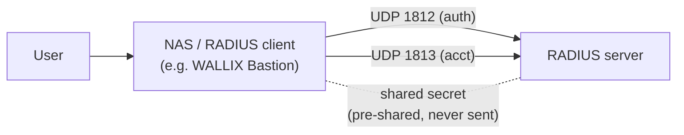
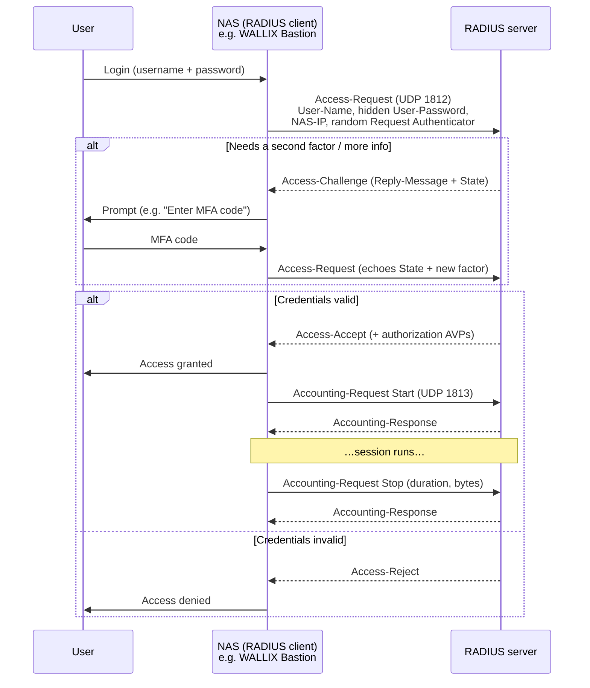
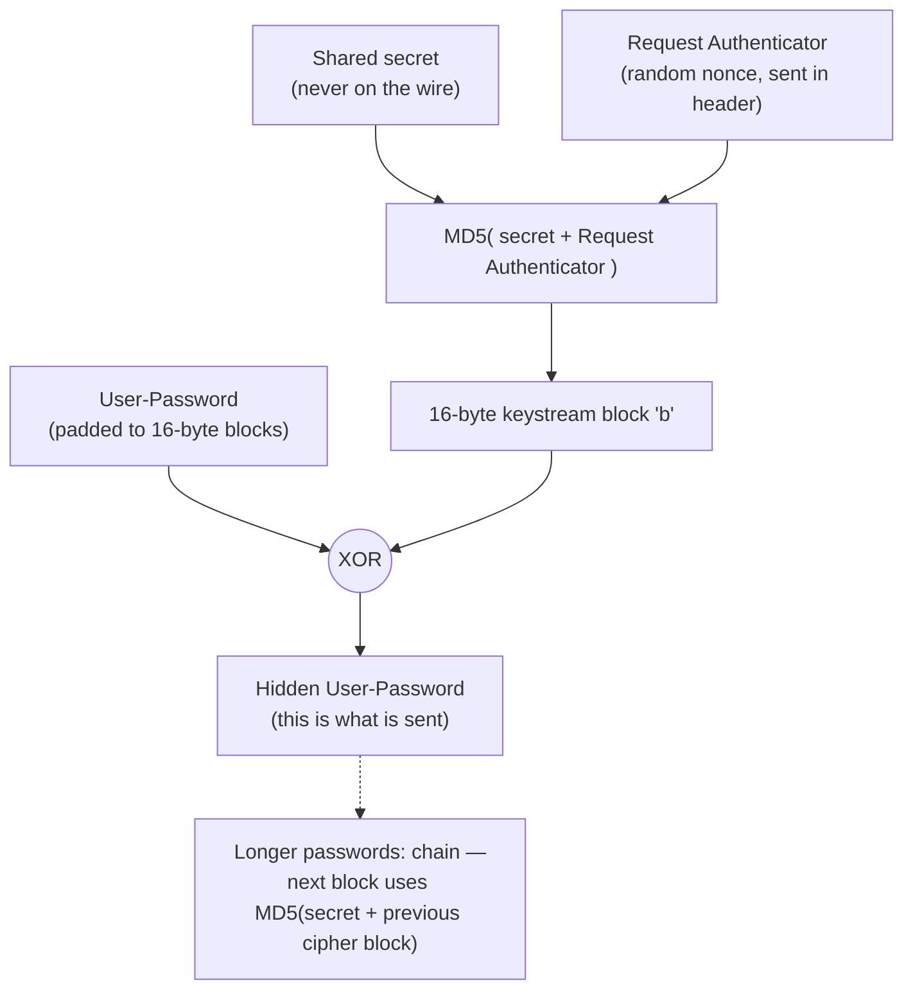

# RADIUS — Remote Authentication Dial-In User Service (Mechanism)

The **Remote Authentication Dial-In User Service (RADIUS)** is a client/server protocol for
centralised **AAA — Authentication, Authorization, and Accounting**. A device that users log
in *through* — a **Network Access Server (NAS)** — does not store credentials itself; it
forwards each login to a central **RADIUS server**, which decides accept or reject and can
return policy (the "authorization") to apply, while a parallel accounting channel records who
was connected and for how long. In **WALLIX Bastion** and **Access Manager**, RADIUS is a
common **external authentication** method and a frequent carrier for the **Multi-Factor
Authentication (MFA)** second factor.

This page explains the mechanism honestly, including the part most summaries get wrong:
**RADIUS does not encrypt the packet.** Only the `User-Password` attribute is obfuscated,
using a **shared secret** and **MD5** — and that obfuscation is weak. Real confidentiality
comes from running RADIUS inside **TLS (RadSec)** or **IPsec**, and strong authentication is
carried by **EAP** tunnelled inside RADIUS.

RADIUS authentication/authorization is **RFC 2865**; accounting is **RFC 2866**; extensions
(including `Message-Authenticator`) are **RFC 2869**; carrying the **Extensible Authentication
Protocol (EAP)** is **RFC 3579**; and **RADIUS over TLS (RadSec)** is **RFC 6614**.

## Learning objectives

By the end of this page you should be able to:

- Explain **AAA** and the **NAS-client ↔ RADIUS-server** model.
- State the **transport and ports**: **UDP 1812** (auth) and **1813** (accounting), with
  legacy **1645/1646**.
- Read a RADIUS **packet**: Code, Identifier, Length, **Request Authenticator**, and
  **Attribute-Value Pairs (AVPs)**.
- Trace the flow **Access-Request → Access-Challenge / Access-Accept / Access-Reject**.
- Describe **precisely** how the **shared secret** is used: the **Request Authenticator**, the
  **Response Authenticator** (MD5 over the response), and **User-Password hiding**
  (XOR with `MD5(secret + Request Authenticator)`).
- Explain why **only `User-Password` is obfuscated**, the rest is **cleartext**, MD5 is
  **weak**, and why production uses **RadSec / IPsec** and **EAP** for strong auth.
- Describe **accounting** (RFC 2866) and **Vendor-Specific Attributes (VSAs)**.

See [../prerequisites/networking-and-protocols.md](../prerequisites/networking-and-protocols.md)
for ports/transport, [../prerequisites/cryptography-and-pki.md](../prerequisites/cryptography-and-pki.md)
for MD5/TLS background, [./tls.md](./tls.md) for the TLS that RadSec rides on,
[./kerberos.md](./kerberos.md) for an alternative ticket-based scheme, and
[../deep-dives/authentication-and-access-manager.md](../deep-dives/authentication-and-access-manager.md)
for how WALLIX uses RADIUS as an authentication domain and MFA second factor.

---

## 1. The model: AAA, NAS, and the shared secret

| Term | Meaning |
|------|---------|
| **Authentication** | Proving *who* the user is (verify credential). |
| **Authorization** | Deciding *what* the authenticated user may do — returned as attributes (VLAN, filter, idle timeout, service type…). In RADIUS, **authentication and authorization are combined** in the same Access-Accept. |
| **Accounting** | Recording session facts (start, stop, bytes, duration) for audit/billing — a *separate* RFC (2866) and a *separate* port. |
| **NAS (Network Access Server)** | The RADIUS **client**: the VPN concentrator, Wi-Fi controller, switch, or — here — **WALLIX Bastion** acting on the user's behalf. It never returns the decision itself. |
| **RADIUS server** | The decision point holding/validating credentials and policy. |
| **Shared secret** | A pre-configured **symmetric secret** known to *both* the NAS and the server (per NAS-server pair). It is **never sent on the wire**; it is mixed into MD5 computations to authenticate the server and to hide the password. |



### Transport and ports

| Purpose | Modern port | Legacy port | Transport |
|---------|-------------|-------------|-----------|
| Authentication / Authorization | **1812** | 1645 | **UDP** |
| Accounting | **1813** | 1646 | **UDP** |
| RadSec (RADIUS over TLS) | **2083** | — | **TCP + TLS** (RFC 6614) |

RADIUS runs over **UDP** (connectionless); the client handles retransmission and timeouts.
The legacy ports 1645/1646 predate the official IANA assignment and are still seen on older
gear.

---

## 2. Packet format (RFC 2865)

Every RADIUS packet has a fixed 20-byte header followed by zero or more attributes:

| Field | Size | Meaning |
|-------|------|---------|
| **Code** | 1 byte | Packet type (see table below). |
| **Identifier** | 1 byte | Matches a reply to its request (and detects duplicates). |
| **Length** | 2 bytes | Total packet length. |
| **Authenticator** | 16 bytes | The **Request Authenticator** (random, in requests) or **Response Authenticator** (MD5 hash, in replies). |
| **Attributes** | variable | The **Attribute-Value Pairs (AVPs)** in **Type-Length-Value (TLV)** form. |

Common **Codes**:

| Code | Packet | Direction |
|------|--------|-----------|
| 1 | **Access-Request** | NAS → server |
| 2 | **Access-Accept** | server → NAS |
| 3 | **Access-Reject** | server → NAS |
| 4 | **Accounting-Request** | NAS → server |
| 5 | **Accounting-Response** | server → NAS |
| 11 | **Access-Challenge** | server → NAS (ask for more, e.g. an MFA code) |

Each **AVP** is `Type (1 byte) | Length (1 byte) | Value`. Standard attributes include
`User-Name (1)`, `User-Password (2)`, `NAS-IP-Address (4)`, `Service-Type (6)`,
`Reply-Message (18)`, `State (24)`, and `Vendor-Specific (26)`.

---

## 3. The AAA flow



The **Access-Challenge** is what makes RADIUS a natural MFA carrier: the server replies "not
yet — also give me X," includes an opaque **`State`** attribute, and the NAS prompts the user
and sends a fresh Access-Request echoing that `State`.

---

## 4. How it "encrypts" / what is actually protected

> **Be precise:** RADIUS does **not** encrypt the packet. The Code, Identifier, attributes
> like `User-Name`, `NAS-IP-Address`, and all authorization/accounting attributes travel in
> **cleartext**. Only the `User-Password` value is *obfuscated*, and the server's reply is
> *authenticated* (not encrypted) — both using the **shared secret** and **MD5**.

### 4a. The Request Authenticator

In an **Access-Request**, the 16-byte Authenticator is a **random value (a nonce)** generated
by the NAS. It must be unpredictable and unique per request, because it is the salt that hides
the password (below) and the input that ties the response back to this request.

### 4b. User-Password hiding (RFC 2865 §5.2)

The password is **XOR-ed** (not encrypted with a cipher) against an MD5 keystream derived from
the shared secret and the Request Authenticator. For a single 16-byte block:

```
b      = MD5( shared_secret + Request_Authenticator )
hidden = password  XOR  b
```

For passwords longer than 16 bytes the password is split into 16-byte chunks and **chained**:
each subsequent block uses `MD5(shared_secret + previous_ciphertext_block)` as its keystream.
The server, knowing the same shared secret and seeing the Request Authenticator, recomputes the
keystream and XORs it back to recover the password.



**Why this is weak (do not overstate it):**

- It is **MD5-based** and **XOR keystream** — not a modern authenticated cipher. MD5 is
  cryptographically broken for collision resistance and was never designed for this.
- If the shared secret is short, shared across many NAS devices, or guessable, it can be
  **brute-forced/dictionary-attacked offline** once an attacker captures a request/response —
  recovering both the secret and the password.
- Reusing a Request Authenticator (poor randomness) reuses the keystream, enabling
  XOR-of-ciphertexts attacks.
- **Only `User-Password` is protected.** EAP messages, accounting data, usernames, and
  authorization attributes are visible to any on-path observer.

### 4c. The Response Authenticator (RFC 2865 §3)

The server does not generate a random Authenticator for its reply. Instead the
**Response Authenticator** is:

```
Response_Authenticator = MD5( Code + ID + Length + Request_Authenticator
                              + response_attributes + shared_secret )
```

This is a **keyed hash (an integrity/authenticity check), not encryption.** Because it folds in
the shared secret and the original Request Authenticator, the NAS can verify the reply genuinely
came from a server that knows the secret and pertains to *this* request — defeating a forged
Access-Accept from someone who doesn't know the secret. **RFC 2869** adds the
**`Message-Authenticator (80)`** attribute — an HMAC-MD5 over the whole packet keyed by the
shared secret — to integrity-protect *requests* too (mandatory for EAP, and now strongly
recommended generally to resist forgery/"Blast-RADIUS"-style attacks).

### 4d. What actually gives confidentiality

| Approach | What it does |
|----------|--------------|
| **RadSec — RADIUS over TLS (RFC 6614)** | Runs RADIUS inside a **TLS** tunnel over **TCP 2083**, encrypting and authenticating the **entire** packet stream and replacing reliance on the MD5 shared-secret tricks with real PKI. |
| **RADIUS over IPsec** | Wrap the UDP traffic in an IPsec tunnel for confidentiality + integrity at the network layer. |
| **EAP inside RADIUS (RFC 3579)** | The **Extensible Authentication Protocol** is *tunnelled* in `EAP-Message` AVPs so strong methods like **EAP-TLS** (mutual certificates) run end-to-end between supplicant and server. Note EAP gives strong *authentication*, but the RADIUS packet around it is still cleartext unless RadSec/IPsec is also used. |

**Bottom line:** treat plain UDP RADIUS as *not confidential*. Use a strong, long, unique
shared secret per NAS, enable `Message-Authenticator`, and for anything across an untrusted
network use **RadSec or IPsec**.

---

## 5. Accounting (RFC 2866)

Accounting is a **separate exchange** on **UDP 1813**. The NAS sends an
**Accounting-Request** with `Acct-Status-Type = Start` when a session begins and `= Stop` when
it ends (with `Acct-Session-Time`, `Acct-Input/Output-Octets`, etc.); the server acknowledges
with **Accounting-Response**. Interim updates are possible. Accounting requests are
integrity-protected by an Accounting **Request Authenticator** that is itself an MD5 over the
packet plus the shared secret (unlike the *random* auth-request Authenticator) — again
integrity, **not** encryption.

---

## 6. Vendor-Specific Attributes (VSAs)

The standard attribute set is finite, so RFC 2865 reserves attribute **type 26
(`Vendor-Specific`)** as an extension envelope. A VSA carries a **Vendor-ID** (an IANA
"enterprise number") plus vendor-defined sub-attributes, letting a vendor return proprietary
authorization data (group names, role mappings, custom timeouts). WALLIX and other products use
VSAs to pass product-specific policy in an Access-Accept. VSAs are ordinary cleartext AVPs —
they enjoy no special protection.

---

## 7. Security notes & common attacks

- **Cleartext exposure** — everything except the obfuscated `User-Password` is visible on the
  wire. *Mitigation:* RadSec (TLS) or IPsec.
- **Offline shared-secret cracking** — a captured request+response lets an attacker
  dictionary-attack a weak secret, then decrypt passwords and forge packets. *Mitigation:*
  long, random, unique-per-NAS secrets; rotate them; prefer RadSec.
- **Forged Access-Accept / response spoofing** — UDP is spoofable; weak or known secrets let an
  attacker fabricate an Accept. *Mitigation:* verify the Response Authenticator (built in),
  require `Message-Authenticator`, use RadSec. (The 2024 **"Blast-RADIUS"** attack exploited
  MD5 weaknesses in the Response Authenticator/`Message-Authenticator` handling.)
- **Password attribute weaknesses** — MD5/XOR construction and any Request-Authenticator reuse
  weaken `User-Password`. *Mitigation:* good RNG for the Request Authenticator; tunnel it.
- **Replay** — duplicate Accounting/Access packets. *Mitigation:* Identifier + authenticator
  checks; RadSec's TLS prevents replay on the channel.
- **Do not rely on RADIUS alone for confidentiality across untrusted links** — it was designed
  for trusted management networks. For internet-facing or zero-trust paths, RadSec/IPsec is
  required, and EAP-TLS provides certificate-based mutual authentication.

---

## Sources

- **RFC 2865** — *Remote Authentication Dial In User Service (RADIUS)* (packet format,
  authenticators, User-Password hiding). <https://www.rfc-editor.org/rfc/rfc2865>
- **RFC 2866** — *RADIUS Accounting*. <https://www.rfc-editor.org/rfc/rfc2866>
- **RFC 2869** — *RADIUS Extensions* (`Message-Authenticator`, EAP-Message).
  <https://www.rfc-editor.org/rfc/rfc2869>
- **RFC 3579** — *RADIUS Support for the Extensible Authentication Protocol (EAP)*.
  <https://www.rfc-editor.org/rfc/rfc3579>
- **RFC 6614** — *Transport Layer Security (TLS) Encryption for RADIUS (RadSec)*.
  <https://www.rfc-editor.org/rfc/rfc6614>
- **RFC 5176** — *Dynamic Authorization Extensions to RADIUS* (CoA / Disconnect, for context).
  <https://www.rfc-editor.org/rfc/rfc5176>
