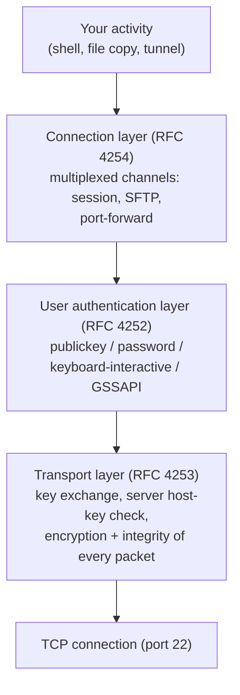
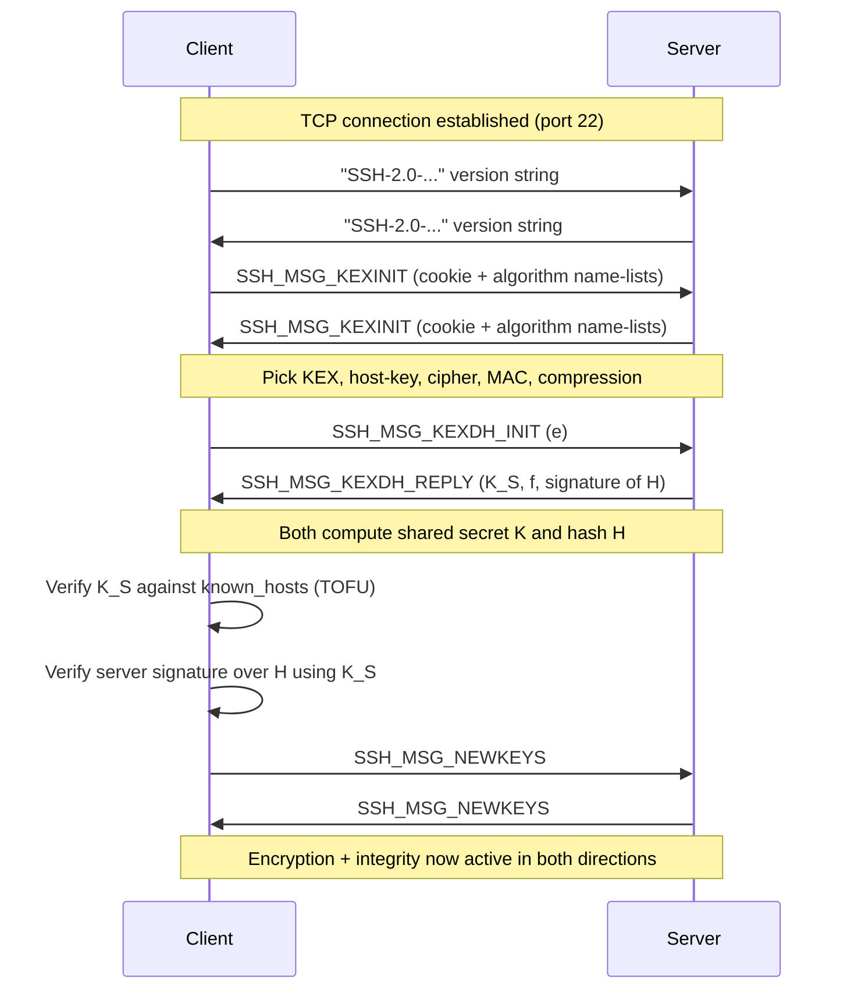
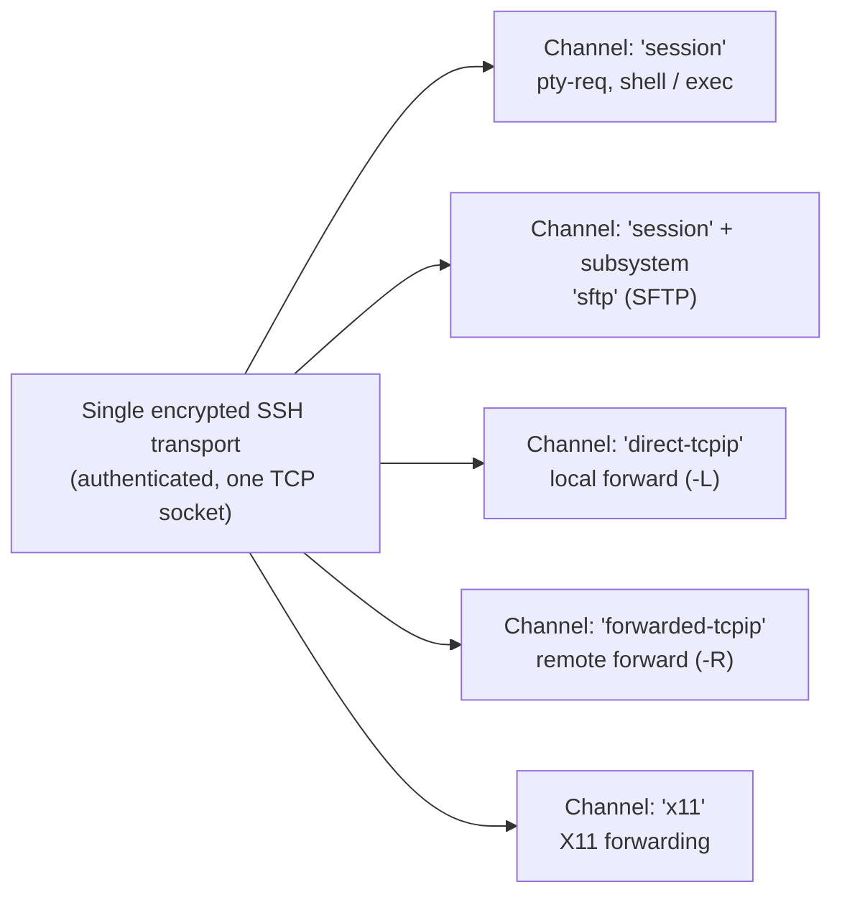

# Secure Shell (SSH-2): how it actually works

**Secure Shell (SSH)** is the protocol you use every day to open a remote shell, copy
files, and tunnel other services — all over a single encrypted, authenticated **Transmission
Control Protocol (TCP)** connection (by default TCP port 22). This page explains the
*mechanism* of **SSH protocol version 2 (SSH-2)**: how the two sides agree on a shared secret
without ever sending it, how that secret becomes the keys that encrypt every packet, how the
client decides it is really talking to the right server (**host-key** trust), and how *you*
the user are then authenticated.

The SSH-2 architecture is deliberately split into **three layers**, each defined by its own
**Request For Comments (RFC)** document, and this page is organised the same way:

| Layer | What it does | Defining RFC |
|---|---|---|
| **Transport layer** | Sets up the encrypted, integrity-protected pipe; authenticates the *server* by its host key | RFC 4253 |
| **User authentication layer** | Authenticates the *user* to the server (password, publickey, etc.) | RFC 4252 |
| **Connection layer** | Multiplexes many logical *channels* (shells, file transfer, port forwarding) over the one pipe | RFC 4254 |

The overall design and terminology come from RFC 4251 (architecture).

> New to the underlying crypto? Read
> [../prerequisites/cryptography-and-pki.md](../prerequisites/cryptography-and-pki.md) first —
> this page assumes you know symmetric vs asymmetric encryption, Diffie-Hellman, hashing,
> **Message Authentication Codes (MACs)**, and digital signatures. For the Linux side of
> keys and `~/.ssh`, see
> [../prerequisites/linux-essentials-for-pam.md](../prerequisites/linux-essentials-for-pam.md).

## Learning objectives

By the end of this file you should be able to:

- Name the **three SSH-2 layers** and what each one is responsible for.
- Walk the **transport-layer handshake** message by message: version exchange, algorithm
  negotiation (`SSH_MSG_KEXINIT`), key exchange, and `SSH_MSG_NEWKEYS`.
- Explain how **Diffie-Hellman / Elliptic-Curve Diffie-Hellman (ECDH)** agrees a shared
  secret `K`, how the **exchange hash `H`** is computed, and how the **six session keys** are
  derived from `K` and `H`.
- Explain what the **host key** is, how the **server signature** proves the server's identity,
  and how the client verifies it via **Trust On First Use (TOFU)** and `known_hosts`.
- Distinguish **encrypt-then-MAC / MAC schemes** from **Authenticated Encryption with
  Associated Data (AEAD)** ciphers (Advanced Encryption Standard in Galois/Counter Mode,
  AES-GCM; ChaCha20-Poly1305).
- Describe the **user-authentication methods** — `publickey`, `password`,
  `keyboard-interactive`, `hostbased`, and **Generic Security Service Application Program
  Interface (GSSAPI)** / **Kerberos** — and exactly what a `publickey` signature covers.
- Explain **channels**: sessions, `exec`/`shell`, **port forwarding** (local, remote,
  dynamic), and **subsystems** such as the **SSH File Transfer Protocol (SFTP)**.
- Explain the security properties: why host-key verification defeats
  **man-in-the-middle (MITM)** attacks, the risk of weak algorithms and agent forwarding, and
  why a privileged-access proxy like WALLIX Bastion sits in front of SSH.

---

## 1. The big picture: three layers on one TCP connection

SSH does not open a new connection per task. One TCP connection is established, the transport
layer secures it, the user authenticates once, and then the connection layer carves that
single secure pipe into many independent **channels**.



The layers run **in order**: transport first (you cannot authenticate over an unencrypted
pipe), then authentication, then the connection layer. Authentication and all channel traffic
travel *inside* the transport layer's encryption.

---

## 2. Transport layer (RFC 4253)

### 2.1 Version (identification) string exchange

Before any binary protocol runs, each side sends a plaintext **identification string**:

```
SSH-protoversion-softwareversion SP comments CR LF
```

For SSH-2 the `protoversion` is `2.0`, e.g. `SSH-2.0-OpenSSH_9.6`. The line is at most 255
bytes including the carriage return and line feed (RFC 4253 §4.2). These exact strings matter
because they are later fed into the exchange hash, so a tampered banner breaks the handshake.

### 2.2 Algorithm negotiation — `SSH_MSG_KEXINIT`

Each side now sends `SSH_MSG_KEXINIT`, which carries a 16-byte random **cookie** and ordered
**name-lists** of the algorithms it supports for: key exchange, server host key, encryption
(client→server and server→client), MAC (each direction), and compression (each direction).
The first algorithm on the client's list that also appears on the server's list is chosen
(RFC 4253 §7.1). SSH negotiates **separate ciphers and MACs per direction**, so the two
directions can in principle use different algorithms.

### 2.3 Key exchange — agreeing the secret `K`

The negotiated key-exchange method runs next. The classic case is **Diffie-Hellman (DH)**:

- Client sends `SSH_MSG_KEXDH_INIT` with its public DH value `e`.
- Server replies `SSH_MSG_KEXDH_REPLY` containing its **host public key `K_S`**, its DH
  public value `f`, and a **signature** over the exchange hash `H` (RFC 4253 §8).

Both sides independently compute the same shared secret `K` from the DH exchange. `K` is
never transmitted.

Modern deployments prefer **Elliptic-Curve Diffie-Hellman (ECDH)** for the same result with
smaller, faster keys:

| Key-exchange method | Curve / group | Hash | Defining RFC |
|---|---|---|---|
| `diffie-hellman-group14-sha1` | 2048-bit MODP group | SHA-1 | RFC 4253 (REQUIRED) |
| `ecdh-sha2-*` | NIST P-256/384/521 | SHA-2 family | RFC 5656 |
| `curve25519-sha256` | Curve25519 (X25519) | SHA-256 | RFC 8731 |
| `curve448-sha512` | Curve448 (X448) | SHA-512 | RFC 8731 |

RFC 5656 defines ECDH and the **Elliptic-Curve Digital Signature Algorithm (ECDSA)** host
keys; RFC 8731 defines the `curve25519-sha256` / `curve448-sha512` methods (the X25519 / X448
functions); RFC 8709 defines the **Ed25519** and **Ed448** signature algorithms for host keys
and user keys. Because each handshake uses a fresh ephemeral DH/ECDH key pair, SSH provides
**Perfect Forward Secrecy (PFS)** — stealing a host's long-term private key later does not
decrypt past sessions.

### 2.4 The handshake, end to end



### 2.5 Host keys and how the client verifies the server — TOFU / `known_hosts`

The **host key** `K_S` is the server's long-term identity (typically Ed25519, ECDSA, or RSA).
In `SSH_MSG_KEXDH_REPLY` the server *signs the exchange hash `H`* with the private half of its
host key. Because `H` is bound to the fresh DH values and both `KEXINIT` payloads, a valid
signature proves the server holds the private key **and** that the handshake was not tampered
with. This is what authenticates the server.

But a signature only proves "whoever owns this key". The client still has to decide whether it
*trusts* that key:

- **First connection — Trust On First Use (TOFU):** the client has never seen this server, so
  it shows the host-key fingerprint and asks you to accept it. On acceptance it is stored in
  `~/.ssh/known_hosts` (this storage and prompt behaviour is implementation-specific, e.g.
  OpenSSH; RFC 4251 §4.1 describes the trust model in general terms).
- **Later connections:** the offered host key is compared byte-for-byte with the stored entry.
  If it **matches**, the server is trusted silently. If it **differs**, SSH warns loudly and
  (by default) refuses to continue — this is the alarm for a possible MITM or a server rebuild.

The weakness of TOFU is the *first* connection: if an attacker is in the path then, you may
trust the wrong key. Out-of-band fingerprint distribution, **SSH certificates** (a trusted
**Certificate Authority, CA**, signs host keys), or a managed bastion solve this.

---

## How it encrypts / key exchange

This is the heart of the protocol. Read it slowly:

1. **Agree a shared secret.** DH/ECDH gives both sides the same secret `K` without ever
   sending it; eavesdroppers cannot derive `K` from the public values.

2. **Compute the exchange hash `H`.** `H` is the negotiated hash over (RFC 4253 §8):
   client version string `V_C`, server version string `V_S`, client `KEXINIT` payload `I_C`,
   server `KEXINIT` payload `I_S`, host key `K_S`, DH values `e` and `f`, and the secret `K`.
   On the **first** key exchange, `H` also becomes the permanent **session identifier**
   (`session_id`) — it is reused later by user authentication.

3. **Derive the six directional keys** from `K`, `H`, and `session_id` (RFC 4253 §7.2). Each
   key uses a distinct single-letter constant:

   | Constant | Key |
   |---|---|
   | `A` | Initial **Initialisation Vector (IV)**, client → server |
   | `B` | Initial IV, server → client |
   | `C` | Encryption key, client → server |
   | `D` | Encryption key, server → client |
   | `E` | Integrity (MAC) key, client → server |
   | `F` | Integrity (MAC) key, server → client |

   The formula (quoting RFC 4253 §7.2) is `HASH(K || H || X || session_id)` where `X` is the
   constant above and `||` is concatenation. If a cipher needs **more** key bytes than the
   hash produces, the key is extended by hashing again and concatenating:
   `K1 = HASH(K || H || X || session_id)`, `K2 = HASH(K || H || K1)`,
   `K3 = HASH(K || H || K1 || K2)`, …, `key = K1 || K2 || K3 || …`.

4. **Switch on the keys.** Each side sends `SSH_MSG_NEWKEYS`; from that point every packet is
   encrypted and integrity-protected with the new keys.

5. **Protect every packet.** SSH's **binary packet** is (RFC 4253 §6):
   `uint32 packet_length`, `byte padding_length`, `byte[] payload`, `byte[] random padding`,
   `byte[] mac`. Total length up to the padding is a multiple of the cipher block size (≥ 8),
   and there are at least 4 bytes of random padding.

   - With a **separate MAC**, the MAC covers the *unencrypted* packet **plus** a per-direction
     **sequence number** that starts at 0 and increments per packet (and wraps at 2³²):
     `mac = MAC(key, sequence_number || unencrypted_packet)` (RFC 4253 §6.4). The sequence
     number is never transmitted but is included so an attacker cannot reorder, drop, or
     replay packets. Common MACs: `hmac-sha2-256`, `hmac-sha2-512` (the older `hmac-sha1` and
     `3des-cbc` are required-baseline in RFC 4253 but now considered weak).
   - With an **AEAD** cipher — **AES-GCM** (`aes128-gcm@openssh.com` / `aes256-gcm`) or
     **ChaCha20-Poly1305** (`chacha20-poly1305@openssh.com`) — encryption and integrity are a
     single operation producing an authentication tag; no separate HMAC is negotiated. The
     widely deployed AES counter modes (`aes128-ctr`, `aes256-ctr`) instead pair a stream
     cipher with a separate MAC. (Specific cipher *names* and AES-GCM-in-SSH details are
     implementation/extension-specific and are noted as such here rather than attributed to
     RFC 4253.)

**In one sentence:** key exchange agrees `K` → `K` + `H` derive the session keys →
a cipher plus MAC/AEAD protect every packet; the **host key** authenticates the *server*, and
(next layer) **publickey** auth authenticates the *user*.

---

## 3. User authentication layer (RFC 4252)

Once the transport is encrypted, the client requests the `ssh-userauth` service and proves who
the *user* is. All of this happens inside the encrypted channel, so passwords are never on the
wire in cleartext.

Core messages (RFC 4252 §5–6):

| Message | Number | Meaning |
|---|---|---|
| `SSH_MSG_USERAUTH_REQUEST` | 50 | Client attempts a method (username, service, method) |
| `SSH_MSG_USERAUTH_FAILURE` | 51 | Rejected; server lists methods that may yet continue |
| `SSH_MSG_USERAUTH_SUCCESS` | 52 | Authentication complete |
| `SSH_MSG_USERAUTH_BANNER` | 53 | Optional banner shown before/at auth |

A client may attempt the `none` method first; the server **must reject** it (unless the user
needs no authentication) but its failure reply usefully lists the **methods that can
continue** — that is how the client discovers what the server will accept.

### 3.1 The methods

| Method | RFC 4252 | How it proves identity |
|---|---|---|
| `publickey` | §7 (REQUIRED) | Client **signs** with its private key; server checks with the matching authorized public key |
| `password` | §8 (OPTIONAL) | Client sends the password (protected by transport encryption); `SSH_MSG_USERAUTH_PASSWD_CHANGEREQ` (60) handles expiry |
| `keyboard-interactive` | RFC 4256 | Server sends one or more prompts; client returns responses — used for **one-time passwords**, **multi-factor authentication (MFA)** |
| `hostbased` | §9 (OPTIONAL) | The **client host** signs with its host key, vouching for a local user |
| `gssapi-with-mic` | RFC 4462 | **GSSAPI**, in practice **Kerberos**, for single sign-on; see [./kerberos.md](./kerberos.md) |

`keyboard-interactive` (RFC 4256) and GSSAPI (RFC 4462) are defined in companion RFCs, not in
4252 itself.

### 3.2 `publickey` in detail — signing a challenge bound to the session

`publickey` is the strongest common method and the one to understand deeply. The private key
**never leaves the client**. The client proves possession by producing a signature over a blob
that includes the **`session_id`** from the transport layer. Per RFC 4252 §7, the signed data
is, in order: the `session_id`, the byte `SSH_MSG_USERAUTH_REQUEST`, the user name, the
service name, the string `"publickey"`, a boolean `TRUE`, the public-key algorithm name, and
the public-key blob.

Because `session_id` (= the first exchange hash `H`) is unique to *this* encrypted session, a
captured signature **cannot be replayed** against a different session — this binds user
authentication to the exact transport that was negotiated.

```mermaid
sequenceDiagram
  participant C as Client
  participant S as Server
  Note over C,S: Transport layer already encrypted; session_id is fixed
  C->>S: SSH_MSG_USERAUTH_REQUEST (user, "publickey", FALSE, alg, pubkey)
  Note over S: Is this public key authorized for this user?
  S->>C: SSH_MSG_USERAUTH_PK_OK (alg, pubkey)
  Note over C: Sign session_id + request fields with PRIVATE key
  C->>S: SSH_MSG_USERAUTH_REQUEST (..., TRUE, alg, pubkey, signature)
  Note over S: Verify signature with the authorized PUBLIC key
  S->>C: SSH_MSG_USERAUTH_SUCCESS
```

The optional first round (boolean `FALSE`, no signature) lets the client ask *"would this key
even be accepted?"* and get `SSH_MSG_USERAUTH_PK_OK` (60) before spending a signature — useful
when an agent holds many keys.

---

## 4. Connection layer (RFC 4254)

After authentication, the single encrypted pipe is multiplexed into many **channels**. Each
side allocates its own channel numbers and they are mapped to each other at open time.

### 4.1 Channel lifecycle and flow control

Messages (RFC 4254 §5):

| Message | Purpose |
|---|---|
| `SSH_MSG_CHANNEL_OPEN` | Request to open a channel of a given **type** |
| `SSH_MSG_CHANNEL_OPEN_CONFIRMATION` / `SSH_MSG_CHANNEL_OPEN_FAILURE` | Accept / reject |
| `SSH_MSG_CHANNEL_WINDOW_ADJUST` | Grant the peer more send window (flow control) |
| `SSH_MSG_CHANNEL_DATA` / `SSH_MSG_CHANNEL_EXTENDED_DATA` | Normal data / e.g. stderr |
| `SSH_MSG_CHANNEL_EOF` / `SSH_MSG_CHANNEL_CLOSE` | Half-close / close |
| `SSH_MSG_CHANNEL_REQUEST` | Channel-specific request (`shell`, `exec`, `pty-req`, …) |
| `SSH_MSG_GLOBAL_REQUEST` | Connection-wide request (e.g. set up remote forwarding) |

**Flow control** is per-channel and window-based: a window says how many bytes the peer may
send before it must wait, and `SSH_MSG_CHANNEL_WINDOW_ADJUST` replenishes it. Implementations
must handle windows up to 2³² − 1 bytes (RFC 4254 §5.2). This stops one busy channel (say a
large SFTP transfer) from starving an interactive shell on the same connection.

### 4.2 The channel model



### 4.3 Sessions and subsystems

A `"session"` channel is the workhorse. Common channel requests (RFC 4254 §6):

- `pty-req` — allocate a **pseudo-terminal** for an interactive shell.
- `shell` — start the user's login shell.
- `exec` — run a single command (`ssh host "uptime"`).
- `subsystem` — hand the channel to a named subsystem. The standard one is **`sftp`**, the
  SSH File Transfer Protocol — a structured file-transfer protocol that runs *inside* an SSH
  session channel (the SFTP wire format itself is an separate draft, not RFC 4254).

### 4.4 Port forwarding (local / remote / dynamic)

Port forwarding tunnels arbitrary TCP through the SSH connection:

| Forward | OpenSSH flag | Channel type | What happens |
|---|---|---|---|
| **Local** | `-L` | `direct-tcpip` | A port on the **client** is forwarded to a host:port reachable from the **server** |
| **Remote** | `-R` | `forwarded-tcpip` | A port on the **server** is forwarded back to a host:port reachable from the **client**; set up with the `tcpip-forward` **global** request |
| **Dynamic** | `-D` | `direct-tcpip` | Client runs a **SOCKS** proxy and opens `direct-tcpip` channels on demand (the SOCKS front end is an implementation feature, not in RFC 4254) |

Note: when opening a `direct-tcpip` channel, the originator (the SSH client for `-L`) connects
and asks the server to make the onward TCP connection; `forwarded-tcpip` is the reverse. This
multiplexing is exactly why port forwarding is so useful — and why a bastion must control it.

---

## Security notes & common attacks

- **Host-key verification defeats man-in-the-middle.** The server signature proves key
  ownership, and `known_hosts`/TOFU pins that key. An attacker who intercepts the connection
  cannot produce the right signature, so on a *return* visit SSH detects the swapped key and
  refuses. The residual risk is the **first** connection (no prior key on file) — mitigate
  with out-of-band fingerprints, SSH **host certificates**, or a managed bastion.
- **Weak ciphers / algorithms.** `diffie-hellman-group14-sha1` and `3des-cbc`/`hmac-sha1` are
  baseline-required by RFC 4253 but are now weak; prefer `curve25519-sha256` (RFC 8731),
  Ed25519 host/user keys (RFC 8709), AES-GCM or ChaCha20-Poly1305 AEAD, and SHA-2 MACs.
  Disable SSH-1 entirely — it is obsolete and insecure.
- **CBC and the integrity model.** Older Cipher-Block-Chaining modes plus MAC-and-encrypt
  ordering have known padding/plaintext-recovery weaknesses; **encrypt-then-MAC** variants and
  **AEAD** are preferred. Always verify both confidentiality *and* integrity are negotiated.
- **Agent forwarding risk.** SSH **agent forwarding** (`-A`) exposes a socket on the *remote*
  host that can request signatures from your local key agent. A root user (or attacker) on
  that remote host can hijack the socket and authenticate onward **as you** for the life of
  the session. Forward agents only to fully trusted hosts; prefer `ProxyJump`/certificates, or
  let a bastion broker the credentials instead.
- **Password auth and brute force.** `password` auth exposes the account to online guessing;
  prefer `publickey` (+ MFA via `keyboard-interactive`), rate-limit, and never expose
  weak-credentialed SSH directly to the Internet.
- **Why WALLIX Bastion proxies and records SSH.** A **Privileged Access Management (PAM)**
  bastion terminates the user's SSH session and opens a *second*, separate SSH session to the
  target. Sitting in the middle, it: authenticates the human centrally (and can inject the
  target secret so the user never learns it), enforces the **single trusted point** that fixes
  the TOFU/host-key trust problem at scale, controls which channels are allowed (e.g. block
  port forwarding or SFTP per policy), and **records the session** for audit and replay. See
  [../deep-dives/bastion-architecture.md](../deep-dives/bastion-architecture.md) for how this
  proxy/record design works. Compare with the parallel mechanisms in
  [./tls.md](./tls.md) and [./kerberos.md](./kerberos.md).

---

## Sources

- RFC 4251 — *The Secure Shell (SSH) Protocol Architecture.* <https://www.rfc-editor.org/rfc/rfc4251>
- RFC 4252 — *The Secure Shell (SSH) Authentication Protocol.* <https://www.rfc-editor.org/rfc/rfc4252>
- RFC 4253 — *The Secure Shell (SSH) Transport Layer Protocol.* <https://www.rfc-editor.org/rfc/rfc4253>
- RFC 4254 — *The Secure Shell (SSH) Connection Protocol.* <https://www.rfc-editor.org/rfc/rfc4254>
- RFC 4256 — *Generic Message Exchange Authentication for SSH (keyboard-interactive).* <https://www.rfc-editor.org/rfc/rfc4256>
- RFC 4462 — *GSS-API Authentication and Key Exchange for SSH.* <https://www.rfc-editor.org/rfc/rfc4462>
- RFC 5656 — *Elliptic Curve Algorithm Integration in SSH (ECDH/ECDSA).* <https://www.rfc-editor.org/rfc/rfc5656>
- RFC 8709 — *Ed25519 and Ed448 Public Key Algorithms for SSH.* <https://www.rfc-editor.org/rfc/rfc8709>
- RFC 8731 — *SSH Key Exchange Method Using Curve25519 and Curve448.* <https://www.rfc-editor.org/rfc/rfc8731>

> Cross-references: [../prerequisites/linux-essentials-for-pam.md](../prerequisites/linux-essentials-for-pam.md) ·
> [../prerequisites/cryptography-and-pki.md](../prerequisites/cryptography-and-pki.md) ·
> [../deep-dives/bastion-architecture.md](../deep-dives/bastion-architecture.md) ·
> [./tls.md](./tls.md) · [./kerberos.md](./kerberos.md)
