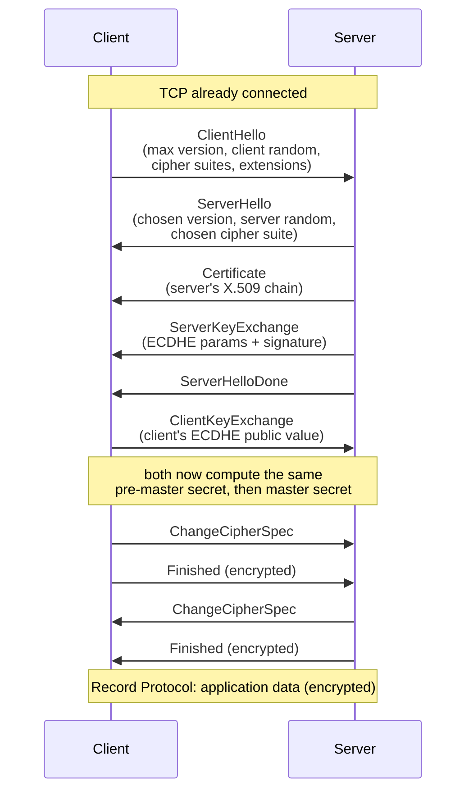
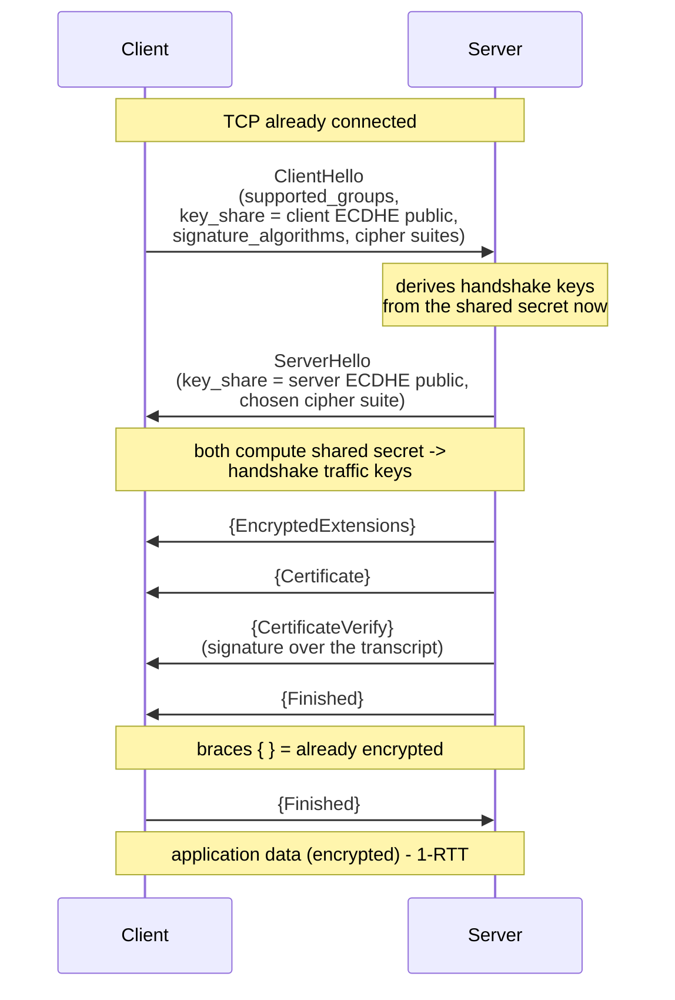
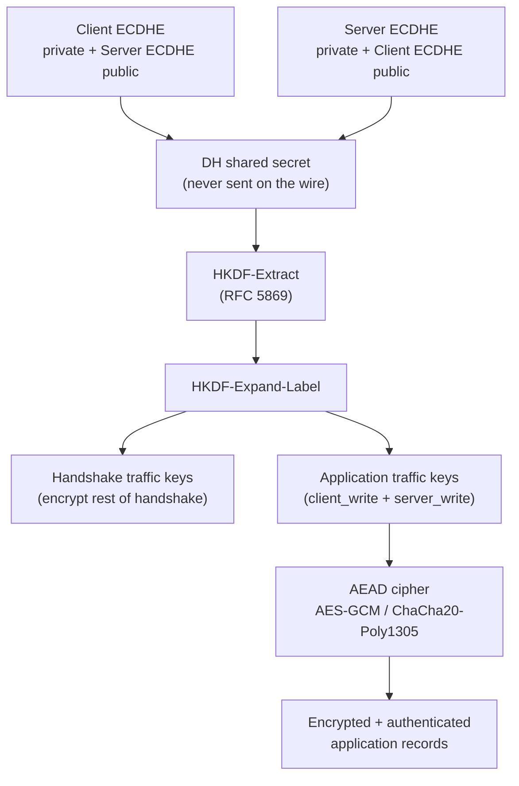

# Transport Layer Security (TLS): how it actually works

**Transport Layer Security (TLS)** is the protocol that turns an ordinary, plaintext
**Transmission Control Protocol (TCP)** connection into a *confidential, integrity-protected,
authenticated* channel. When you see `https://`, when an **LDAP (Lightweight Directory
Access Protocol)** bind is wrapped in **LDAPS**, when **RADIUS (Remote Authentication
Dial-In User Service)** is carried over **RadSec**, or when WALLIX Bastion talks to a
backend over a secure socket — TLS is doing the work underneath.

This page explains the **mechanism**: what messages are exchanged, how a shared secret is
*agreed* without ever sending it, how that secret is turned into the keys that encrypt your
data, *what* is encrypted *when*, and the security properties (and attacks) you must be able
to explain. It distinguishes **TLS 1.2** and **TLS 1.3** precisely, because they differ in
important ways.

> If you have not yet read the cryptography primer, start with
> [../prerequisites/cryptography-and-pki.md](../prerequisites/cryptography-and-pki.md) — this
> page assumes you know symmetric vs asymmetric encryption, hashing, and what an X.509
> certificate is.

## Learning objectives

By the end of this file you should be able to:

- Place **SSL** and **TLS** in history and state which versions are current vs deprecated.
- Separate the **Handshake Protocol** (negotiate, authenticate, agree keys) from the
  **Record Protocol** (bulk-encrypt application data).
- Walk through the **TLS 1.2** handshake *and* the **TLS 1.3** handshake, message by message,
  and explain why 1.3 is faster (**1-RTT**) and more private.
- Explain how **asymmetric** crypto (ephemeral **Elliptic-Curve Diffie-Hellman, ECDHE**)
  *agrees* a secret, how a certificate *authenticates* the peer, how a **Key Derivation
  Function (HKDF)** turns that secret into traffic keys, and how an **AEAD** cipher then
  encrypts the data.
- Define **Perfect Forward Secrecy (PFS)** and explain why ephemeral keys provide it.
- Decode a **cipher suite** name and validate a **certificate chain**.
- Explain **downgrade attacks**, what TLS 1.3 fixes, and why RADIUS/LDAP rely on TLS.

---

## 1. SSL vs TLS: history and current versions

TLS is the descendant of **SSL (Secure Sockets Layer)**, developed at Netscape in the 1990s.
When the protocol was standardised by the **IETF (Internet Engineering Task Force)** the name
changed from SSL to TLS, but people still loosely say "SSL" when they mean TLS.

| Version | Year | Status | Notes |
|---------|------|--------|-------|
| SSL 2.0 / 3.0 | 1995 / 1996 | **Deprecated / prohibited** | SSL 3.0 prohibited by RFC 7568; broken (POODLE). |
| TLS 1.0 | 1999 (RFC 2246) | **Deprecated** (RFC 8996) | Do not use. |
| TLS 1.1 | 2006 (RFC 4346) | **Deprecated** (RFC 8996) | Do not use. |
| **TLS 1.2** | 2008 (**RFC 5246**) | **Current, widely deployed** | Flexible but easy to misconfigure. |
| **TLS 1.3** | 2018 (**RFC 8446**) | **Current, preferred** | Faster, simpler, more private; removes legacy crypto. |

**RFC 8996** formally deprecates TLS 1.0 and 1.1. **RFC 7568** prohibits SSL 3.0. In a
hardened 2026 environment you should negotiate only **TLS 1.2 or 1.3**, and prefer 1.3.

---

## 2. Two protocols inside TLS: Handshake vs Record

TLS is not one monolithic thing. Internally it is a set of sub-protocols layered on top of a
reliable transport (TCP). The two that matter for understanding the mechanism are the
**Handshake Protocol** and the **Record Protocol**.

| Protocol | Runs when | Job | Crypto used |
|----------|-----------|-----|-------------|
| **Handshake Protocol** | At connection start (and on resumption) | **Negotiate** versions/cipher suites, **authenticate** the peer via certificates, **agree** the shared secret | Asymmetric (ECDHE) + signatures + a KDF |
| **Record Protocol** | For every byte after the handshake | Frame data into *records*, then **encrypt + authenticate** them | Symmetric **AEAD** cipher with the derived keys |

Mental model: **the handshake establishes keys using slow asymmetric crypto; the record
protocol then uses fast symmetric crypto to protect the actual traffic.** This is the
hybrid pattern from the crypto primer applied to a live connection. (TLS also has minor
sub-protocols: **Alert** for error/close signalling, and in 1.2 **ChangeCipherSpec** to
switch on encryption; 1.3 keeps a dummy ChangeCipherSpec only for middlebox compatibility.)

---

## 3. The TLS 1.2 handshake (RFC 5246)

In the **full 1.2 handshake** with an **(EC)DHE** key exchange (the modern, forward-secret
choice), the parties exchange these messages. Note this costs **2 round trips (2-RTT)**
before application data can flow.

What each message does:

- **ClientHello** — client offers its highest supported TLS version, a 32-byte **client
  random**, the list of **cipher suites** it supports, and **extensions** (e.g.,
  `supported_groups` for which elliptic curves it knows, **SNI** for the hostname).
- **ServerHello** — server picks one version and one cipher suite, and sends its own
  **server random**. These two randoms feed key derivation so identical secrets still yield
  unique keys per session.
- **Certificate** — server's **X.509 certificate chain**, used to *authenticate* the server
  (see §6). Sent in the clear in 1.2.
- **ServerKeyExchange** — for **(EC)DHE**, the server sends its **ephemeral** Diffie-Hellman
  public value plus a **signature** (made with the certificate's private key) over the
  handshake parameters. The signature is what binds the ephemeral key to the authenticated
  identity, preventing a man-in-the-middle from substituting their own DH value.
- **ServerHelloDone** — "I'm finished with my part of the hello."
- **ClientKeyExchange** — client sends *its* ephemeral DH public value. Now both sides
  independently compute the same **pre-master secret** from the DH exchange, then derive the
  **master secret** (via the 1.2 **PRF (Pseudo-Random Function)**) using the two randoms.
- **ChangeCipherSpec** — a one-byte signal: "everything I send after this is encrypted with
  the new keys."
- **Finished** — the *first encrypted message*; it contains a hash of the entire handshake so
  far. If a man-in-the-middle altered any earlier (plaintext) handshake message, the
  Finished hashes won't match and the connection aborts. This is the **handshake integrity
  check**.

> In **TLS 1.2 the handshake is mostly in the clear** — version, cipher suites, certificate,
> and SNI are all visible to a network observer. Only after ChangeCipherSpec does encryption
> begin. Remember this when you contrast it with 1.3.

---

## 4. The TLS 1.3 handshake (RFC 8446)

TLS 1.3 redesigned the handshake. The big changes: **only forward-secret (EC)DHE key
exchange is allowed** (static RSA key transport is *removed*), legacy/weak ciphers are gone,
and the handshake completes in **1 round trip (1-RTT)** because the client *guesses* the
group and sends its key share immediately.

Key points (braces `{ }` mean **already encrypted** under the handshake keys):

- The client sends its **`key_share`** (ephemeral ECDHE public value) and **`supported_groups`**
  in the very first flight. If it guessed a group the server accepts, the server can reply
  with *its* key_share immediately — so the shared secret exists after **one round trip**.
  (If the client guessed wrong, the server sends a **HelloRetryRequest** asking for a
  different group, costing an extra round trip.)
- After ServerHello, **everything else the server sends is encrypted**: **EncryptedExtensions**,
  the server **Certificate**, **CertificateVerify**, and **Finished**.
- **CertificateVerify** is a *signature over the handshake transcript* made with the
  certificate's private key — this is how 1.3 proves the server actually owns the certificate
  (the role 1.2's ServerKeyExchange signature played).
- **Finished** again carries a keyed hash (a **HMAC**) of the transcript for handshake
  integrity.

**0-RTT / PSK (briefly):** TLS 1.3 supports **session resumption** via a **Pre-Shared Key
(PSK)** issued on a prior connection. With **0-RTT** ("early data") the client can send
application data *in its very first flight*, encrypted under a key derived from the PSK —
zero round trips of latency. **Caveat: 0-RTT data is replayable.** Because it carries no
fresh server randomness, a network attacker can capture and *resend* the early-data, so
0-RTT must only be used for **idempotent** requests (e.g., a safe GET), never for state-changing
operations. RFC 8446 documents this anti-replay limitation explicitly.

### TLS 1.2 vs 1.3 at a glance

| Aspect | TLS 1.2 (RFC 5246) | TLS 1.3 (RFC 8446) |
|--------|--------------------|--------------------|
| Round trips (full) | **2-RTT** | **1-RTT** (0-RTT on resumption) |
| Key exchange | RSA key-transport *or* (EC)DHE | **(EC)DHE only** — always forward-secret |
| Handshake privacy | Mostly **in the clear** | Certificate + most messages **encrypted** |
| Key derivation | PRF (based on HMAC) | **HKDF** (RFC 5869) |
| Bulk cipher | AEAD *or* legacy CBC/RC4 | **AEAD only** (AES-GCM, AES-CCM, ChaCha20-Poly1305) |
| Renegotiation | Yes (a source of bugs) | Removed; replaced by KeyUpdate |
| Forward secrecy | Optional | **Mandatory** |

---

## 5. How it encrypts / key derivation

This is the heart of the mechanism. TLS uses each kind of cryptography for what it is best
at:

1. **Asymmetric crypto agrees a secret — ephemeral ECDHE.** In **Elliptic-Curve
   Diffie-Hellman Ephemeral (ECDHE)**, each side generates a fresh, single-use key pair.
   They exchange **public** values; each then combines its own *private* value with the
   peer's *public* value and — by the math of Diffie-Hellman — arrives at the **same shared
   secret**, *which was never transmitted*. An eavesdropper sees both public values but
   cannot derive the secret. "Ephemeral" means the private values are discarded after the
   handshake.

2. **The certificate authenticates — it does not encrypt the data.** Diffie-Hellman alone is
   anonymous and vulnerable to a man-in-the-middle. The **X.509 certificate** (validated in
   §6) and a **signature** over the handshake (1.2 ServerKeyExchange / 1.3 CertificateVerify)
   prove that the ephemeral public value really came from the legitimate server. With
   **mutual TLS (mTLS)** the client also presents a certificate, so *both* ends are
   authenticated — common for machine-to-machine and used by hardened PAM integrations.

3. **A Key Derivation Function turns the secret into keys — HKDF in 1.3.** The raw
   Diffie-Hellman shared secret is not used directly as an encryption key. It is fed into a
   **Key Derivation Function (KDF)**: TLS 1.3 uses **HKDF (HMAC-based Extract-and-Expand Key
   Derivation Function, RFC 5869)**. HKDF *extracts* uniform randomness from the secret and
   *expands* it into several distinct keys — separate keys for client→server and server→client
   directions, plus the initialization vectors (IVs). TLS 1.3's
   `HKDF-Expand-Label` derives **handshake traffic keys** first (to encrypt the rest of the
   handshake) and then **application traffic keys**. TLS 1.2 does the analogous job with its
   **PRF**.

4. **An AEAD cipher encrypts + authenticates the data.** The derived symmetric keys drive an
   **Authenticated Encryption with Associated Data (AEAD)** cipher — typically **AES-GCM
   (Galois/Counter Mode)** or **ChaCha20-Poly1305**. AEAD does two jobs in one pass:
   **confidentiality** (the ciphertext) and **integrity/authenticity** (an authentication
   tag). If even one bit of ciphertext (or the associated header data) is altered, tag
   verification fails and the record is rejected — so AEAD defends against tampering, not just
   eavesdropping. This is the **Record Protocol** doing the bulk work.

### Perfect Forward Secrecy (PFS)

Because the Diffie-Hellman keys are **ephemeral** — fresh per connection and then thrown away
— compromising the server's *long-term certificate private key* **later** does not let an
attacker decrypt **past** recorded sessions. The session keys were derived from secrets that
no longer exist. This property is **Perfect Forward Secrecy (PFS)**. It is *optional* in
TLS 1.2 (only with the (EC)DHE suites, not the old RSA key-transport suites) and **mandatory
in TLS 1.3**. PFS is the single biggest reason to disable RSA key transport and prefer 1.3.

### Cipher-suite anatomy

A **cipher suite** names the algorithms for one connection. The naming changed between
versions:

- **TLS 1.2 example:** `TLS_ECDHE_RSA_WITH_AES_128_GCM_SHA256`
  - `ECDHE` — key exchange (ephemeral elliptic-curve DH → PFS)
  - `RSA` — the certificate/signature type that authenticates the server
  - `AES_128_GCM` — the AEAD bulk cipher and key size
  - `SHA256` — hash for the KDF/PRF and HMAC
- **TLS 1.3 example:** `TLS_AES_128_GCM_SHA256`
  - 1.3 **decouples** key exchange and authentication from the suite (they are negotiated via
    `supported_groups` and `signature_algorithms` extensions), so the suite names **only the
    AEAD cipher and hash**.

---

## 6. Certificate chain validation (RFC 5280)

Authentication only holds if the client actually *validates* the server's certificate. The
client walks the **chain of trust** defined by **RFC 5280**:

1. **Build the chain** from the server (leaf) certificate up through any **intermediate
   Certificate Authority (CA)** certificates to a **root CA** the client already trusts (in
   its trust store).
2. **Verify each signature** in the chain — each certificate is signed by the next one up;
   the root is self-signed and pre-trusted.
3. **Check identity** — the hostname must match the certificate's **Subject Alternative Name
   (SAN)** (the **Common Name / CN** is legacy/deprecated for this purpose).
4. **Check validity period** — current date must fall between `notBefore` and `notAfter`
   (**expiry**).
5. **Check revocation** — that the certificate has not been revoked, via a **Certificate
   Revocation List (CRL)** or the **Online Certificate Status Protocol (OCSP)** (often
   delivered as an **OCSP staple** the server attaches during the handshake).
6. **Check basic constraints / key usage** — e.g., a leaf cert may not act as a CA.

Any failure aborts the handshake. The full PKI mechanics (CA, CSR, CRL, OCSP, trust chains)
live in [../prerequisites/cryptography-and-pki.md](../prerequisites/cryptography-and-pki.md).

### Session resumption

Re-running a full handshake for every connection is expensive. TLS supports **resumption**
to skip most of it:

- **TLS 1.2:** **session IDs** (server caches state) or **session tickets** (RFC 5077,
  encrypted state handed back to the client).
- **TLS 1.3:** a **PSK (Pre-Shared Key)** sent in a **NewSessionTicket** after the handshake;
  a later connection presents the PSK to resume, optionally with **0-RTT** early data (with
  the replay caveat from §4). For resumption to keep PFS, TLS 1.3 can mix a fresh ECDHE
  exchange into the resumed handshake (**PSK with (EC)DHE**).

---

## 7. Security notes & common attacks

- **Downgrade attacks.** An active attacker who can tamper with the unencrypted ClientHello
  may try to force both ends down to a weaker version or cipher suite they can break (e.g.,
  the historical **FREAK**, **Logjam**, **POODLE** families). Defences: TLS 1.3 bakes a
  **downgrade-protection sentinel** into the server random so a client detects a forced
  fallback; the **Finished** messages hash the whole transcript so any tampering is caught;
  and you should **disable SSL 3.0 / TLS 1.0 / TLS 1.1** entirely (RFC 8996, RFC 7568) so
  there is nothing weak to fall back to.
- **The value of TLS 1.3.** It is faster (1-RTT, 0-RTT resumption), **encrypts most of the
  handshake** (certificate and extensions are hidden from passive observers), enforces
  **forward secrecy**, and removes whole classes of misconfiguration by deleting static-RSA
  key transport, CBC-mode ciphers, RC4, compression, and renegotiation. Most TLS-layer attacks
  of the 2010s target features that simply no longer exist in 1.3.
- **AEAD vs older modes.** TLS 1.3 mandates AEAD; the old CBC-mode constructions in 1.2 were
  the substrate for padding-oracle attacks (e.g., **Lucky 13**). Prefer AEAD suites even on
  1.2.
- **Certificate failures are the silent risk.** Most real-world TLS compromises are not
  broken math but **unvalidated certificates** — expired certs, hostname mismatches, or
  clients that skip validation. Always validate the full chain (§6).
- **Why RADIUS and LDAP rely on TLS.** Classic **RADIUS** uses weak MD5-based obfuscation and
  classic **LDAP** binds can send credentials in the clear; both are wrapped in TLS
  (**RadSec / RADIUS-over-TLS** and **LDAPS / StartTLS**) precisely to get the
  confidentiality, integrity, and server authentication described above. See
  [./ldap.md](ldap.md) and [./radius.md](radius.md), and how the WALLIX
  **Access Manager** terminates and brokers these in
  [../deep-dives/authentication-and-access-manager.md](../certs/wallix/deep-dives/authentication-and-access-manager.md).

---

## Sources

- **RFC 8446** — *The Transport Layer Security (TLS) Protocol Version 1.3*:
  <https://www.rfc-editor.org/rfc/rfc8446>
- **RFC 5246** — *The Transport Layer Security (TLS) Protocol Version 1.2*:
  <https://www.rfc-editor.org/rfc/rfc5246>
- **RFC 5280** — *Internet X.509 Public Key Infrastructure Certificate and CRL Profile*:
  <https://www.rfc-editor.org/rfc/rfc5280>
- **RFC 7919** — *Negotiated Finite Field Diffie-Hellman Ephemeral Parameters for TLS*:
  <https://www.rfc-editor.org/rfc/rfc7919>
- **RFC 5869** — *HMAC-based Extract-and-Expand Key Derivation Function (HKDF)*:
  <https://www.rfc-editor.org/rfc/rfc5869>
- **RFC 8996** — *Deprecating TLS 1.0 and TLS 1.1*:
  <https://www.rfc-editor.org/rfc/rfc8996>
- **RFC 7568** — *Deprecating Secure Sockets Layer Version 3.0*:
  <https://www.rfc-editor.org/rfc/rfc7568>
- Related: [../prerequisites/cryptography-and-pki.md](../prerequisites/cryptography-and-pki.md),
  [../prerequisites/networking-and-protocols.md](../prerequisites/networking-and-protocols.md),
  [./ldap.md](ldap.md), [./radius.md](radius.md),
  [../deep-dives/authentication-and-access-manager.md](../certs/wallix/deep-dives/authentication-and-access-manager.md)
