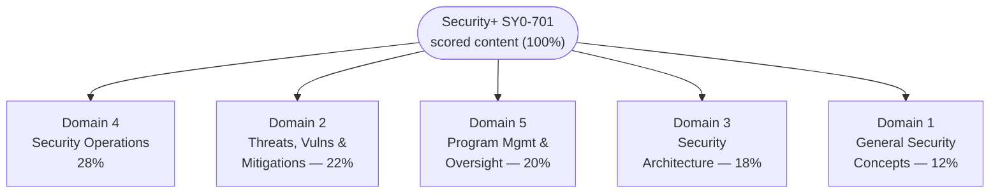

# Security+ (SY0-701) Exam Format and Objectives

This page explains how the CompTIA Security+ (SY0-701) exam is structured — question count and types, duration, scoring, and languages — and lays out the **five exam domains and their weightings**. It also explains what performance-based questions are and how to download CompTIA's official exam objectives. Figures that change between exam versions are flagged so you verify them on CompTIA before relying on them.

> **Verify volatile details.** The verified facts below come from CompTIA's official Security+ page. CompTIA rotates exam codes roughly every three years and revises price and renewal terms, so re-check anything marked **"verify on CompTIA"**: https://www.comptia.org/en-us/certifications/security/

## Learning objectives

- State the verified Security+ exam format: question count, types, duration, and scoring.
- Explain what performance-based questions (PBQs) are and why they reward hands-on practice.
- List the five SY0-701 domains and their published weightings.
- Describe how to obtain CompTIA's official exam objectives PDF and why it is the study spine.
- Identify which details are version-sensitive and must be verified on CompTIA.

## Exam format at a glance

| Item | Detail | Note |
| --- | --- | --- |
| Exam code | **SY0-701** | Launched 7 November 2023; CompTIA rotates codes ~every 3 years, so a retirement around 2026 is plausible — *verify on CompTIA* |
| Number of questions | **Maximum 90** | The cap is 90; some forms present fewer |
| Question types | **Multiple-choice questions (MCQ)** + **performance-based questions (PBQs)** | See PBQ section below |
| Duration | **90 minutes** | CompTIA official page |
| Passing score | **750** on a scale of **100–900** | This is a *scaled* score, not a raw percentage |
| Recommended experience | **CompTIA Network+** and **~2 years** in a security/sysadmin role | Recommended, **not required** |
| Languages | English, Japanese, Portuguese, Spanish, Thai | *Verify current list on CompTIA* |
| Price / renewal (CEUs) | **Not quoted here — verify on CompTIA** | Omitted to avoid stale figures |

> The **750 / 100–900** scale is a scaled score, not "750 out of 900 = 83%." CompTIA does not publish a fixed percentage of questions you must answer correctly; the raw-to-scaled mapping is not disclosed. Treat any flat "you need X%" claim from third-party sites with suspicion.

## What are performance-based questions (PBQs)?

**Performance-based questions (PBQs)** are interactive tasks that ask you to **do** something rather than pick an answer — for example, configuring a setting, matching controls to scenarios, ordering incident-response steps, dragging items into a diagram, or interpreting log or command output. They simulate realistic on-the-job activities.

Key points for planning:

- PBQs typically appear **at the start** of the exam and are usually the most time-consuming items. A common strategy is to **flag and skip** difficult PBQs, complete the multiple-choice questions, then return to the PBQs with the remaining time. *(Verify whether the current exam delivery permits skipping/returning — CompTIA's interface and rules can change.)*
- They are **why hands-on familiarity matters.** A sysadmin who has actually configured firewall rules, read logs, and managed accounts has a real advantage here. The exact number of PBQs on any given form is **not published by CompTIA** — do not rely on a specific count.

## The five domains and their weightings

SY0-701 is organised into **five domains**. CompTIA publishes the following weightings (the percentage of scored content each domain contributes) *(verify on CompTIA — weightings change per exam version)*:

| # | Domain | Weight |
| --- | --- | --- |
| 1 | [General Security Concepts](../domains/01-general-security-concepts.md) | **12%** |
| 2 | [Threats, Vulnerabilities, and Mitigations](../domains/02-threats-vulnerabilities-mitigations.md) | **22%** |
| 3 | [Security Architecture](../domains/03-security-architecture.md) | **18%** |
| 4 | [Security Operations](../domains/04-security-operations.md) | **28%** |
| 5 | [Security Program Management and Oversight](../domains/05-security-program-management-oversight.md) | **20%** |

Two takeaways from the weightings:

- **Security Operations (28%)** is the single largest domain — day-to-day defensive work (monitoring, logging, incident response, hardening) carries the most weight. This is where a sysadmin's experience pays off most directly.
- **Threats, Vulnerabilities & Mitigations (22%)** and **Program Management & Oversight (20%)** together are nearly half the exam, so attacker knowledge and governance/risk content both matter — not just the technical architecture in Domain 3.

See [../domains/README.md](../domains/README.md) for the full domain index and the per-domain pages.

## How to get the official exam objectives

CompTIA publishes a free, downloadable **exam objectives** document (often called the "objectives PDF" or "exam blueprint") for SY0-701. It is the **authoritative, comprehensive list** of every topic, term, and acronym that can appear on the exam, broken down by domain and sub-objective. It is the single most important study artefact.

To obtain it:

1. Go to the official CompTIA Security+ page: https://www.comptia.org/en-us/certifications/security/ *(verify — the page layout changes)*.
2. Look for **"Download the exam objectives"** (CompTIA may ask for an email address).
3. Confirm the document is for **SY0-701** — older objectives (e.g., SY0-601) cover a retired exam and differ.

The domain pages in this hub are written **to the SY0-701 objectives**, but the objectives PDF is the canonical checklist — use it to track coverage and to confirm exact wording, because CompTIA can issue minor revisions.

## Renewal and continuing education (CEUs) *(verify on CompTIA)*

Security+ is **not permanent**; it must be maintained. CompTIA certifications are renewed through the **Continuing Education (CE) program**, primarily by earning **Continuing Education Units (CEUs)** over a fixed validity period (for example, by completing training, earning a higher-level certification, or other approved activities).

- The **exact validity period, the number of CEUs required, and any renewal fee are not quoted here** — these terms change and must be confirmed on CompTIA's Continuing Education page. **Verify on CompTIA.**
- Earning a higher CompTIA certification can also renew Security+ automatically under the CE program *(verify current rules)*.

## Where to go next

- [what-is-security-plus.md](./what-is-security-plus.md) — what the credential is and where it sits.
- [../domains/README.md](../domains/README.md) — the five domain pages written to the SY0-701 objectives.
- [../../ceh/00-overview/exam-and-eligibility.md](../../ceh/00-overview/exam-and-eligibility.md) — the equivalent exam page for the CEH sibling hub.
- [../../reference/README.md](../../reference/README.md) — repo-wide glossary, acronyms, and standards.

## Sources

- CompTIA — Security+ (SY0-701) official certification page (max 90 questions, MCQ + PBQ, 90 minutes, 750 on a 100–900 scale, five domains and weightings, recommended experience, languages): https://www.comptia.org/en-us/certifications/security/
- CompTIA — Security+ exam objectives (SY0-701) download (authoritative topic blueprint): https://www.comptia.org/en-us/certifications/security/
- CompTIA — Continuing Education (CE) program / CEU renewal terms (validity period, CEU count, fees — verify; not quoted here): https://www.comptia.org/continuing-education
- Verified ground truth for this hub: SY0-701 launched 2023-11-07; max 90 questions (MCQ + PBQ); 90 minutes; passing 750 on 100–900; domain weights 12 / 22 / 18 / 28 / 20 percent.
- All volatile specifics (exam code, retirement date, price, languages, CEU renewal terms) are version-sensitive — *verify on CompTIA*.
