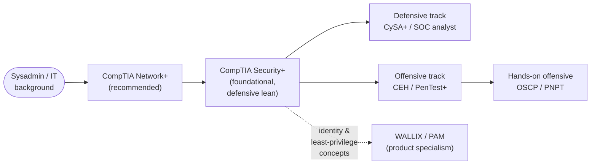

# What is CompTIA Security+ (SY0-701)?

CompTIA **Security+** is a vendor-neutral, foundational cybersecurity certification from **CompTIA (the Computing Technology Industry Association)**. It validates the baseline knowledge and skills needed to perform core security functions and pursue an entry-level security role. The current exam is **SY0-701**. This page explains what the credential is, who it is for, and where it sits in a learning path — including how it relates to this repo's CEH and WALLIX/PAM material.

> **Unofficial & no fabrication.** This hub is not affiliated with or endorsed by CompTIA. Exam specifics come from CompTIA's official Security+ page; anything volatile (exam code, retirement date, price, renewal terms) is flagged **"verify on CompTIA"** and should be re-checked there before you rely on it.

## Learning objectives

- Explain what Security+ is and who issues it (CompTIA).
- Describe what "vendor-neutral" and "foundational" mean for this credential.
- Identify who Security+ is for and the experience CompTIA recommends.
- Place Security+ in a sysadmin-to-security path and relate it to this repo's CEH and WALLIX/PAM hubs.
- Summarise its US Department of Defense (DoD) 8140 relevance and where to confirm it.

## Who issues Security+? (CompTIA)

Security+ is produced by **CompTIA (the Computing Technology Industry Association)**, a non-profit trade body and one of the largest vendor-neutral IT certification providers. CompTIA also issues the broader "core" certifications a sysadmin may already recognise — A+, Network+, and the security-track Security+, CySA+ (Cybersecurity Analyst), PenTest+, and the advanced CASP+/SecurityX.

Always treat the official CompTIA Security+ page as the authoritative source for the current exam code, format, languages, price, and renewal terms, because these change between exam versions: https://www.comptia.org/en-us/certifications/security/ *(verify — specifics change)*.

## "Vendor-neutral" and "foundational" — the core idea

Two properties define where Security+ fits:

- **Vendor-neutral** — it is not tied to any single product or platform. It teaches concepts (firewalls, identity, encryption, logging) rather than how to operate one vendor's tool. This contrasts with product certifications such as the **WALLIX Academy** credentials in this repo's [main hub](../../README.md), which certify a specific Privileged Access Management (PAM) product.
- **Foundational** — it is **breadth, not depth**. Security+ surveys threats, architecture, operations, and governance at a working level rather than drilling into one platform or into hands-on exploitation. It is widely treated as an early, baseline credential rather than a specialist one.

Security+ also has a **defensive (blue-team) lean**: it is oriented toward securing, monitoring, and governing systems, with offensive techniques covered conceptually as threats to defend against.

> For a systems administrator: most of what you already do — patching, hardening, managing accounts, reading logs, segmenting networks — is Security+ material reframed under security terminology. The certification formalises and names the practices you likely use day to day.

## Who Security+ is for

Security+ suits people moving into security from an IT background, including:

- **Systems and network administrators and help-desk staff** making a first move into cybersecurity (this hub's primary audience).
- Junior security analysts and **Security Operations Center (SOC)** staff who need a recognised baseline.
- Anyone needing a credential to clear job-posting filters for an entry-level security role.
- US federal and defence-contractor staff who need a **DoD 8140**-aligned baseline (see below).

### Recommended experience (not required)

CompTIA recommends — but does not **require** — the following before attempting Security+:

| Recommendation | Detail |
| --- | --- |
| Prior certification | **CompTIA Network+** (networking fundamentals) |
| Hands-on experience | **About two years** in a security or systems-administrator role |

These are guidance, not gatekeeping: there is no mandatory prerequisite exam or formal eligibility application. A sysadmin's existing networking, operating-system, and identity knowledge maps directly onto the material. See [exam-and-objectives.md](./exam-and-objectives.md) for the full exam detail.

## Where Security+ sits in a certification path

Security+ is typically a **first or early** security certification — the breadth baseline you earn before choosing an offensive or defensive specialisation.

How it relates to the other study hubs in this repository:

- **Relative to this repo's CEH hub:** Security+ and the **CEH (Certified Ethical Hacker)** are both vendor-neutral and breadth-focused, but Security+ leans **defensive/foundational** while CEH adds the **offensive lens** on top. A common order is Security+ then CEH. See [../../ceh/README.md](../../ceh/README.md) and the [CEH career & adjacent certs page](../../ceh/career/ceh-career-and-adjacent-certs.md).
- **Relative to WALLIX / Privileged Access Management (PAM):** Security+ teaches the access-control, identity, and least-privilege concepts that PAM products such as WALLIX **operationalise**. It is useful conceptual background before working with a specific PAM platform — see this repo's [WALLIX/PAM learning-path hub](../../README.md) and the [WALLIX product & certification docs](../../docs/00-overview/).
- **Shared fundamentals:** the cross-cutting [protocols reference](../../protocols/README.md) (TLS, Kerberos, LDAP, SAML, OIDC/OAuth2, RADIUS, SSH) and the repo [reference glossary and acronyms](../../reference/README.md) reinforce concepts that appear across Security+, CEH, and PAM.

## DoD 8140 relevance *(verify on DoD / CompTIA)*

Security+ is long-established as a **United States Department of Defense (DoD)** baseline credential. CompTIA states that Security+ aligns with multiple **DoD Directive 8140** cyber work roles. **DoD Directive 8140** is the current cyber-workforce qualification framework that succeeded the older **DoD 8570** information-assurance baseline, under which Security+ was a long-standing staple. This DoD alignment is a major reason Security+ appears so often in US government and defence-contractor job requirements.

- Approved-certification lists and role mappings are **revised over time** — confirm the current Security+ status and role mappings on the DoD cyber-workforce site: https://public.cyber.mil/ *(verify on DoD / CompTIA — specifics change)*.

## Where to go next

- [exam-and-objectives.md](./exam-and-objectives.md) — exam format, the five domains and weightings, performance-based questions (PBQs), and renewal.
- [../domains/README.md](../domains/README.md) — the five domain pages written to the SY0-701 objectives.
- [../../ceh/README.md](../../ceh/README.md) — the offensive-leaning sibling hub.
- [../../reference/README.md](../../reference/README.md) — repo-wide glossary, acronyms, and standards.

## Sources

- CompTIA — Security+ (SY0-701) official certification page (provider, vendor-neutral/foundational positioning, recommended experience of Network+ and ~2 years, DoD 8140 alignment): https://www.comptia.org/en-us/certifications/security/
- US DoD Cyber Workforce, Directive 8140 (formerly 8570) — verify current Security+ mapping: https://public.cyber.mil/
- Related in this repo: [../../ceh/README.md](../../ceh/README.md) · [../../README.md](../../README.md) (WALLIX/PAM hub) · [../../protocols/README.md](../../protocols/README.md) · [../../reference/README.md](../../reference/README.md) · one-page overview superseded by this hub: [../../adjacent-certs/security-plus.md](../../adjacent-certs/security-plus.md)
- Verify all volatile specifics (exam code, retirement date, price, renewal/CEU terms, DoD mapping) on CompTIA's site — programs change.
