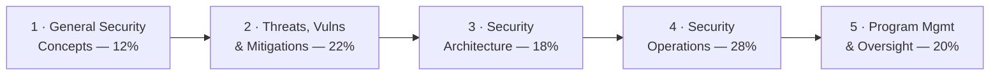

# 🛡️ CompTIA Security+ — Study Hub

### A source-grounded study hub for **CompTIA Security+ (SY0-701)**

*Concepts, real diagrams, and exam prep* — the **vendor-neutral, foundational** baseline for
a sysadmin moving into cybersecurity.

---

> [!NOTE]
> **Unofficial & no fabrication.** Not affiliated with or endorsed by CompTIA. Exam specifics
> are from CompTIA's official Security+ page; anything volatile (price, exam code, retirement
> date, Continuing Education / CEU renewal) should be re-checked there — codes rotate ~every
> 3 years. Compiled **2026-06-20**.

## 📋 At a glance

| Item | Detail |
|------|--------|
| **Exam** | SY0-701 *(verify — codes rotate ~every 3 years)* |
| **Format** | Max **90 questions** — multiple-choice + **performance-based (PBQ)** |
| **Duration / pass** | **90 minutes** · **750** on a 100–900 scale |
| **Level** | Foundational, **vendor-neutral**, defensive-leaning |
| **Recommended** | Network+ and ~2 years security/sysadmin experience *(not required)* |

Full details: **[exam & objectives](00-overview/exam-and-objectives.md)**.

## 🗺️ The five domains

| # | Domain | Weight | Page |
|---|--------|--------|------|
| 1 | General Security Concepts | 12% | [01-general-security-concepts.md](domains/01-general-security-concepts.md) |
| 2 | Threats, Vulnerabilities & Mitigations | 22% | [02-threats-vulnerabilities-mitigations.md](domains/02-threats-vulnerabilities-mitigations.md) |
| 3 | Security Architecture | 18% | [03-security-architecture.md](domains/03-security-architecture.md) |
| 4 | Security Operations | 28% | [04-security-operations.md](domains/04-security-operations.md) |
| 5 | Security Program Management & Oversight | 20% | [05-security-program-management-oversight.md](domains/05-security-program-management-oversight.md) |

## 📦 What's inside

| Section | Contents |
|---------|----------|
| **[Overview](00-overview/what-is-security-plus.md)** | [What is Security+](00-overview/what-is-security-plus.md) · [Exam & objectives](00-overview/exam-and-objectives.md) |
| **[The 5 domains](domains/README.md)** | Each domain taught to the SY0-701 objectives, with diagrams & exam tips |
| **[Exam prep](exam-prep/study-plan.md)** | [Study plan](exam-prep/study-plan.md) · [Practice questions](exam-prep/practice-questions.md) · [Cheat sheet](exam-prep/cheat-sheet.md) |
| **[Reference](reference/acronyms.md)** | [Acronyms](reference/acronyms.md) (the famously long Security+ list) · [Glossary](reference/glossary.md) |

## 🧭 Where it fits

Security+ is the **breadth baseline** you earn early — before specializing. It pairs naturally
with the rest of this repo:

- **Offensive next step** → the [CEH hub](../ceh/README.md) adds the attacker's lens on top.
- **Defensive / identity depth** → the [WALLIX / PAM hub](../docs/pam-bastion/README.md)
  operationalizes the access-control, identity, and least-privilege concepts Security+ surveys.
- **Mechanisms** → the [protocols](../protocols/README.md) pages explain the crypto, TLS,
  Kerberos, SAML, and 802.1X that Security+ references.
- **Career path** → see the [learning roadmap](../learning/roadmap.md) and
  [platforms](../learning/platforms.md).

## 🔗 Quick links

- 🎓 [CompTIA Security+ (official)](https://www.comptia.org/en-us/certifications/security/)
- 🧠 [Acronyms](reference/acronyms.md) · [Glossary](reference/glossary.md)
- 🧪 [The 5 domains](domains/README.md)

> CompTIA and Security+ are trademarks of CompTIA, used here for identification and
> educational purposes only.
