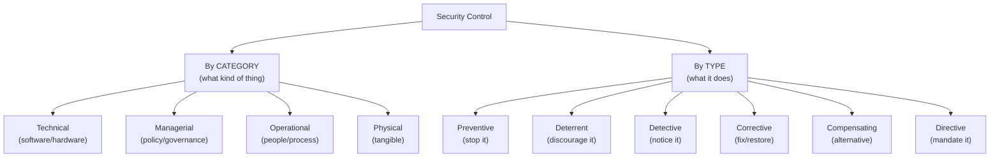
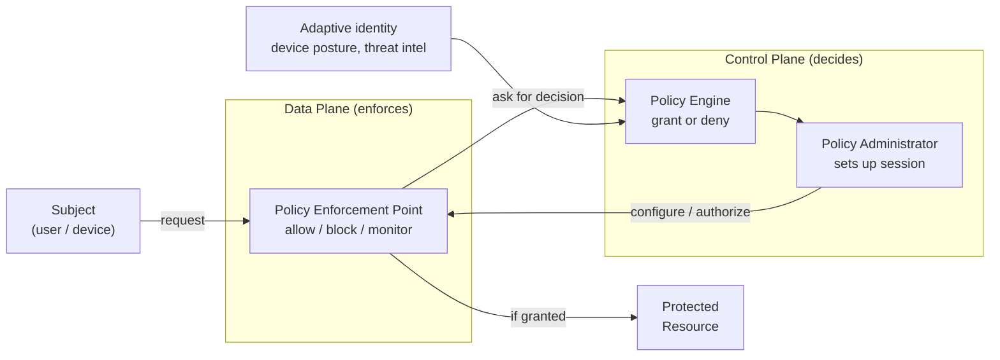
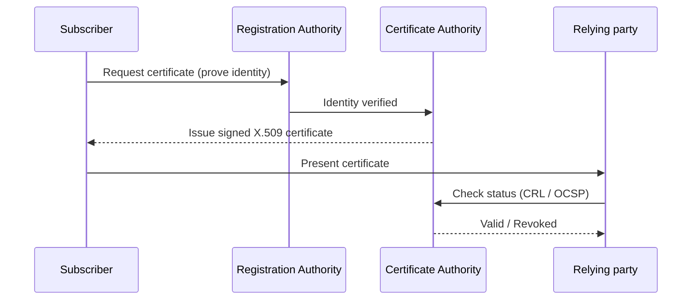

# Domain 1 — General Security Concepts

This is the first of five domains in the **CompTIA Security+ (SY0-701)** exam and accounts for roughly **12%** of the scored questions. It establishes the vocabulary and mental models the rest of the exam builds on: how we *categorize* security controls, the core security goals (the **CIA triad** plus non-repudiation), how identity is managed (**AAA**), what **Zero Trust** architecture actually means, the basics of physical security and deception, the discipline of **change management**, and the cryptographic building blocks (**PKI**, keys, hashing, signatures, certificates). Coming from a system-administration background, you already operate many of these controls daily; this domain reframes them in the formal language CompTIA uses and that you will see throughout the exam.

> **Note on objective numbering.** CompTIA organizes SY0-701 into numbered objectives (1.1–1.4 for this domain). This page is organized by *topic area* to match those objectives faithfully; it describes the objective topics rather than reproducing CompTIA's numbering verbatim. Always confirm the current breakdown against the official **CompTIA SY0-701 Exam Objectives** PDF (linked in Sources).

## Learning objectives

After working through this page you should be able to:

- Classify a security control by **category** (technical, managerial, operational, physical) and by **type** (preventive, deterrent, detective, corrective, compensating, directive).
- State the **CIA triad** (Confidentiality, Integrity, Availability) and explain **non-repudiation**, and map controls to each.
- Explain **AAA** (Authentication, Authorization, Accounting) and the difference between authenticating people and authenticating systems.
- Describe a **gap analysis** and where it fits in a security program.
- Explain **Zero Trust**: the split between the **control plane** and **data plane**, the **policy engine / policy administrator / policy enforcement point**, and **adaptive identity**.
- Identify common **physical security** controls and **deception/disruption** technologies (honeypots, honeynets, honeyfiles, honeytokens).
- Describe the **change-management** process and its technical and documentation implications.
- Explain core **cryptographic** concepts: symmetric vs. asymmetric encryption, key exchange, hashing and salting, digital signatures, **PKI** (CA, CRL, OCSP), and supporting ideas (blockchain, steganography, tokenization).

---

## 1. Security controls

A **security control** is a safeguard or countermeasure that protects the confidentiality, integrity, and availability of information and systems. CompTIA asks you to classify controls two independent ways at once: by **category** (the *nature* of the control — what kind of thing it is) and by **type** (the *function* — what it does in the timeline of an incident). A single control has exactly one primary category but can be described by one or more types.

### Control categories (the nature of the control)

| Category | What it is | Examples |
|---|---|---|
| **Technical** (logical) | Implemented in hardware, software, or firmware. | Firewalls, encryption, antivirus/EDR, access control lists (ACLs), multi-factor authentication (MFA). |
| **Managerial** (administrative) | Governance: policies, procedures, and oversight that direct how security is run. | Risk assessments, security policies, change-management policy, vendor reviews. |
| **Operational** | Carried out primarily by **people** in day-to-day operation. | Security-awareness training, incident response, configuration management, guards' procedures. |
| **Physical** | Tangible controls that protect facilities, equipment, and people. | Fences, locks, badge readers, bollards, security guards, lighting, mantraps. |

> **Memory hook:** *technical = the machine enforces it; managerial = the policy says to do it; operational = a person does it; physical = you can touch it.*

### Control types (the function of the control)

| Type | Function | Example |
|---|---|---|
| **Preventive** | Stop an incident before it happens. | Firewall rule blocking a port; least privilege; a locked door. |
| **Deterrent** | Discourage an attacker from trying (psychological). | Warning banners, "CCTV in use" signage, visible guards. |
| **Detective** | Identify that an incident is occurring or occurred. | IDS/IPS, log review, SIEM alerts, motion sensors. |
| **Corrective** | Fix or restore after an incident, limiting damage. | Restoring from backup, patching the exploited flaw, IPS dropping a malicious session. |
| **Compensating** | An alternative control used when the primary one isn't feasible. | A jump host + monitoring when a legacy app can't support MFA. |
| **Directive** | Direct or mandate behavior — tells people what to do. | Acceptable-use policy, signage instructing "authorized personnel only." |

The same item can be more than one type depending on context. A **security camera** is **detective** (records what happened) and also **deterrent** (its visible presence discourages). The exam often gives a scenario and asks you to pick the *best* category **and** type — read for whether it is asking about the control's nature or its function.

---

## 2. The CIA triad and non-repudiation

The **CIA triad** is the foundational model of information security. Every control ultimately supports one or more of these three goals. (The repo's [CEH Module 1](../../ceh/domains/01-introduction-to-ethical-hacking.md#2-the-cia-triad) covers the same triad from the offensive-security angle.)

| Goal | Meaning | Supporting controls |
|---|---|---|
| **Confidentiality** | Information is accessible only to those authorized. | Encryption, access control, classification, least privilege. |
| **Integrity** | Information is accurate and unmodified except by authorized action. | Hashing, digital signatures, checksums, version control. |
| **Availability** | Information and systems are usable on demand by authorized users. | Redundancy, backups, failover, DoS mitigation, patching. |

**Non-repudiation** is the assurance that a party **cannot credibly deny** having taken an action or sent a message. It is delivered primarily by **digital signatures** (which bind an action to a private key only the signer holds) together with **audit logging**. Do not confuse it with **authentication** (proving who you are) — non-repudiation goes one step further: it produces evidence a third party can later use to prove *you*, specifically, did the thing.

---

## 3. Authentication, Authorization, and Accounting (AAA)

**AAA** is the framework that governs identity and access:

- **Authentication** — proving an identity is genuine. Done with one or more **factors**: something you *know* (password), something you *have* (token, smart card), something you *are* (biometric), plus *somewhere you are* (location) and *something you do* (behavior). Combining factors from different categories gives **multi-factor authentication (MFA)**.
- **Authorization** — deciding what an authenticated identity is *allowed* to do (permissions, roles, policies). Authentication answers "who are you?"; authorization answers "what may you do?".
- **Accounting** — recording what was done (logs, audit trails, session records), which supports monitoring, billing, forensics, and non-repudiation.

CompTIA distinguishes **authenticating people** from **authenticating systems**. People authenticate with passwords, MFA, and biometrics. **Systems/devices** authenticate with cryptographic identities — e.g., **certificates** issued by a Certificate Authority, or hardware roots of trust — so that a server, service, or device can prove its identity without a human present. Protocols that implement AAA include **RADIUS**, **TACACS+**, and federated identity via **SAML** and **OAuth/OIDC**. This repo covers several in depth: [RADIUS](../../protocols/radius.md), [SAML](../../protocols/saml.md), and [OIDC/OAuth2](../../protocols/oidc-oauth2.md).

---

## 4. Gap analysis

A **gap analysis** is a structured comparison of an organization's **current** security posture against a **desired** target — usually a standard or framework such as **ISO/IEC 27001**, the **NIST Cybersecurity Framework (CSF)**, or a regulatory requirement. The process: define the target state, assess the current state, identify the **gaps** (controls missing or insufficient), then build a **remediation plan** that prioritizes closing them. It is the natural first step before a compliance audit or when adopting **Zero Trust**, because it tells you exactly which controls you still need.

---

## 5. Zero Trust

**Zero Trust** is an architecture built on the maxim **"never trust, always verify."** It removes the old assumption that anything *inside* the network perimeter is trustworthy; every access request is authenticated, authorized, and continuously evaluated regardless of where it originates. The authoritative reference is **NIST SP 800-207**. This repo discusses Zero Trust in the PAM context in [Core Concepts: Least Privilege, JIT & Zero Trust](../../foundations/core-concepts-least-privilege-jit-zero-trust.md).

Zero Trust splits the architecture into two planes:

- **Control plane** — *makes* access decisions. It holds the policy logic and adaptive identity evaluation.
- **Data plane** — *enforces* and carries the actual traffic to the resource, acting on the control plane's decisions.

Within the control/data split, SP 800-207 defines three logical components:

| Component | Plane | Role |
|---|---|---|
| **Policy Engine (PE)** | Control | The brain — decides **grant or deny** for each request using policy + signals (identity, device posture, threat intel). |
| **Policy Administrator (PA)** | Control | Executes the PE's decision — establishes or tears down the session and issues credentials/tokens to the enforcement point. |
| **Policy Enforcement Point (PEP)** | Data | The gate in front of the resource — actually allows, blocks, and monitors the connection. |

Additional Zero Trust concepts CompTIA lists:

- **Adaptive identity** — authentication strength adjusts to **risk/context** (location, device health, behavior). A login from a new country may trigger step-up MFA; a routine login may not.
- **Threat scope reduction** — shrinking what any one identity or session can reach (tied to least privilege and **microsegmentation**).
- **Policy-driven access control** — decisions come from explicit, centrally managed policy, not network location.
- **Implicit trust zones** — areas where, once admitted, traffic is trusted; Zero Trust seeks to minimize these.

---

## 6. Physical security

Physical controls protect the facilities and hardware that everything else depends on — if an attacker can touch a server, most logical controls eventually fall. Key controls CompTIA expects:

| Control | Purpose |
|---|---|
| **Fencing, bollards, barriers** | Define and protect the perimeter; bollards stop vehicle attacks. |
| **Locks** (physical, electronic, biometric) | Restrict entry to authorized people. |
| **Access badges / proximity readers** | Authenticate and log entry; integrate with AAA. |
| **Access control vestibule (mantrap)** | A two-door airlock that prevents **tailgating** (one person at a time). |
| **Video surveillance (CCTV)** | Detective + deterrent; provides forensic record. |
| **Security guards / reception** | Human judgment, response, visitor management. |
| **Lighting** | Deters intrusion and improves camera coverage. |
| **Sensors** (infrared, pressure, microwave, ultrasonic) | Detect motion/intrusion. |

Related people-facing attacks the controls counter: **tailgating/piggybacking** (following an authorized person through a door) and **shoulder surfing** (observing credentials) — both link to social engineering in [Domain 2](02-threats-vulnerabilities-mitigations.md).

---

## 7. Deception and disruption technology

Deception controls deliberately plant attractive but fake assets so that *any* interaction with them is, by definition, suspicious — giving defenders early, high-confidence warning and slowing the attacker down. CompTIA lists four:

| Technology | What it is |
|---|---|
| **Honeypot** | A single decoy system designed to lure and observe attackers. Interaction with it signals malicious activity. |
| **Honeynet** | A whole **network** of honeypots, simulating a realistic environment to study attacker behavior. |
| **Honeyfile** | A decoy **file** (e.g., `passwords.xlsx`) that, when opened or exfiltrated, triggers an alert. |
| **Honeytoken** | A piece of **fake data** (a bogus credential, API key, or database record) seeded in real systems; if it ever appears in use, you know data leaked. |

These are **detective/deterrent** controls. The CEH module on [evading IDS, firewalls, and honeypots](../../ceh/domains/12-evading-ids-firewalls-honeypots.md) covers the attacker's perspective on detecting and avoiding them.

---

## 8. Change management

**Change management** is the formal process for proposing, reviewing, approving, implementing, and documenting changes to systems. Its security value is huge: most outages and many vulnerabilities come from *unmanaged* change. CompTIA treats it as both a **business process** and a set of **technical implications**.

**Business process elements:**

- **Approval process** — changes are formally requested and authorized.
- **Change Advisory Board (CAB)** — the group that reviews and approves significant changes.
- **Ownership** — a named owner accountable for the change.
- **Stakeholders** — everyone affected is identified and consulted.
- **Impact analysis** — assess what could go wrong and who is affected.
- **Test results** — changes are validated in a test environment first.
- **Backout (rollback) plan** — a defined way to revert if the change fails.
- **Maintenance window** — a scheduled time that minimizes disruption.
- **Standard operating procedure (SOP)** — documented steps for recurring changes.

**Technical implications to assess before approving a change:**

- **Allow/deny lists** that may need updating.
- **Restricted activities** and **downtime** the change requires.
- **Service / application restarts** triggered by the change.
- **Legacy applications** that may break.
- **Dependencies** — other systems that rely on the changed component.

**Documentation implications:** update **diagrams**, **policies/procedures**, and asset/configuration records; and maintain **version control** so you can trace and revert changes (especially infrastructure-as-code and firewall rule sets).

---

## 9. Cryptographic solutions

Cryptography provides confidentiality, integrity, authenticity, and non-repudiation. This section is a survey; for the full treatment see this repo's [Cryptography and PKI](../../prerequisites/cryptography-and-pki.md) and the [CEH cryptography module](../../ceh/domains/20-cryptography.md).

### Symmetric vs. asymmetric encryption

| | **Symmetric** | **Asymmetric** (public-key) |
|---|---|---|
| Keys | One shared **secret key** for encrypt + decrypt. | A **key pair**: public key + private key. |
| Speed | Fast — good for bulk data. | Slow — good for small data, key exchange, signatures. |
| Examples | **AES**, ChaCha20, (legacy: 3DES). | **RSA**, **ECC** (Elliptic Curve), Diffie-Hellman. |
| Challenge | Distributing the secret key safely. | Slower; needs PKI to bind keys to identities. |

In practice the two combine: asymmetric crypto performs a **key exchange** (e.g., **Diffie-Hellman**, including ephemeral **ECDHE**) to agree on a symmetric **session key**, which then encrypts the bulk traffic. **TLS** works exactly this way — see [TLS](../../protocols/tls.md).

### Levels at which encryption is applied

CompTIA stresses that encryption is applied at many **levels**: **full-disk** and **partition/volume** encryption; **file**-level; **database**, down to **record** and **column**; and **transport/communication** (e.g., TLS, IPsec, a VPN). Choose the level by what you need to protect and against which threat (a stolen laptop → full-disk; a multi-tenant database → column-level).

### Keys and key management

Security depends on **key length** (longer resists brute force) and on protecting keys. Hardware safeguards include a **Trusted Platform Module (TPM)** on a device, a **Hardware Security Module (HSM)** for enterprise key storage, a **secure enclave**, and centralized **key management systems**. **Key escrow** stores a copy of keys with a trusted third party for recovery.

### Hashing, salting, and digital signatures

- **Hashing** is a **one-way** function producing a fixed-length **digest** (e.g., **SHA-256**). It verifies **integrity** — any change to the input changes the digest. It is not encryption (you cannot reverse it).
- **Salting** adds random data to each input (especially passwords) before hashing, so identical passwords yield different hashes and precomputed (**rainbow-table**) attacks fail. **Key stretching** (bcrypt, PBKDF2, scrypt, Argon2) deliberately slows hashing to resist brute force.
- A **digital signature** combines hashing and asymmetric crypto: the signer **hashes** the message and **encrypts the hash with their private key**. Anyone can verify it with the signer's public key, proving **integrity**, **authenticity**, and **non-repudiation**.

### Public Key Infrastructure (PKI)

**PKI** is the system of policies, roles, and technologies that binds **public keys to verified identities** using **digital certificates**.

| Element | Role |
|---|---|
| **Certificate Authority (CA)** | Trusted issuer that signs certificates, vouching that a public key belongs to a named entity. |
| **Registration Authority (RA)** | Verifies identity before the CA issues a certificate. |
| **Digital certificate (X.509)** | Binds an identity to a public key; signed by the CA. Includes validity dates, **Subject Alternative Names (SANs)**, key usage. |
| **Certificate Revocation List (CRL)** | A signed list of certificates the CA has **revoked** before expiry. |
| **Online Certificate Status Protocol (OCSP)** | Real-time check of a single certificate's revocation status (with **OCSP stapling** for efficiency). |
| **Root of trust / chain** | Certificates chain up to a trusted **root CA**; intermediates sit between. |

### Other cryptographic concepts

- **Blockchain** — a distributed, append-only ledger where each block is cryptographically linked (hashed) to the previous one, making tampering evident. Supports integrity and an **open public ledger** without a central authority.
- **Steganography** — **hiding** data inside another medium (image, audio, network traffic) so its very existence is concealed. Contrast with encryption, which hides *meaning* but not *existence*.
- **Tokenization** — replacing sensitive data (e.g., a card number) with a non-sensitive **token** that has no exploitable value; the mapping is kept in a secure vault. Common in payment processing; unlike encryption, the token is not mathematically derived from the data.
- **Obfuscation / data masking** — making data harder to interpret (e.g., showing only the last four digits) to reduce exposure.

---

## Exam tips

- Classify controls on **two axes at once**: category (technical / managerial / operational / physical) **and** type (preventive / deterrent / detective / corrective / compensating / directive). A scenario may need both answers.
- A **security camera** is both **detective** and **deterrent**; a **backup** is **corrective**; a **warning sign** is **deterrent** *and* **directive**.
- A **compensating** control is the *substitute* when the ideal control isn't possible — watch for "legacy system can't support X."
- **Non-repudiation = digital signatures** (cannot deny the action). Don't confuse it with authentication.
- Map **AAA**: Authentication = *who*, Authorization = *what you may do*, Accounting = *what you did*.
- For **Zero Trust**, memorize the planes and components: **Policy Engine decides**, **Policy Administrator sets up the session**, **Policy Enforcement Point enforces**; PE/PA are **control plane**, PEP is **data plane**. **Adaptive identity** = risk-based step-up.
- Distinguish the **deception** terms: honeypot (system) → honeynet (network) → honeyfile (file) → honeytoken (data).
- In change management, the **backout/rollback plan** and the **CAB** approval are favorite exam points.
- Crypto must-knows: **hashing = integrity (one-way)**; **salting** defeats rainbow tables; **digital signature = private key signs the hash**; **CRL vs. OCSP** (list vs. real-time check); **symmetric is fast/bulk, asymmetric is for key exchange and signatures**; **tokenization ≠ encryption**.

---

## Sources

- CompTIA — Security+ (SY0-701) certification and exam objectives: <https://www.comptia.org/certifications/security>
- NIST SP 800-207 — *Zero Trust Architecture*: <https://csrc.nist.gov/pubs/sp/800/207/final>
- NIST SP 800-63 — *Digital Identity Guidelines* (authentication, AAA): <https://pages.nist.gov/800-63-3/>
- NIST Cybersecurity Framework (CSF): <https://www.nist.gov/cyberframework>
- NIST FIPS 199 / SP 800-12 — security objectives (CIA): <https://csrc.nist.gov/>
- IETF RFC 5280 — X.509 PKI certificates and CRLs: <https://datatracker.ietf.org/doc/html/rfc5280>
- IETF RFC 6960 — Online Certificate Status Protocol (OCSP): <https://datatracker.ietf.org/doc/html/rfc6960>
- NIST FIPS 197 — Advanced Encryption Standard (AES): <https://csrc.nist.gov/pubs/fips/197/final>

---

*Related: [Cryptography and PKI](../../prerequisites/cryptography-and-pki.md) · [TLS](../../protocols/tls.md) · [Core Concepts: Least Privilege, JIT & Zero Trust](../../foundations/core-concepts-least-privilege-jit-zero-trust.md) · [Domain 2 — Threats, Vulnerabilities & Mitigations](02-threats-vulnerabilities-mitigations.md) · [Acronyms](../reference/acronyms.md)*
