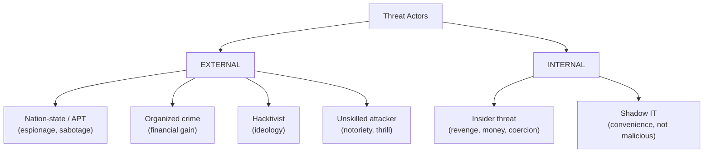
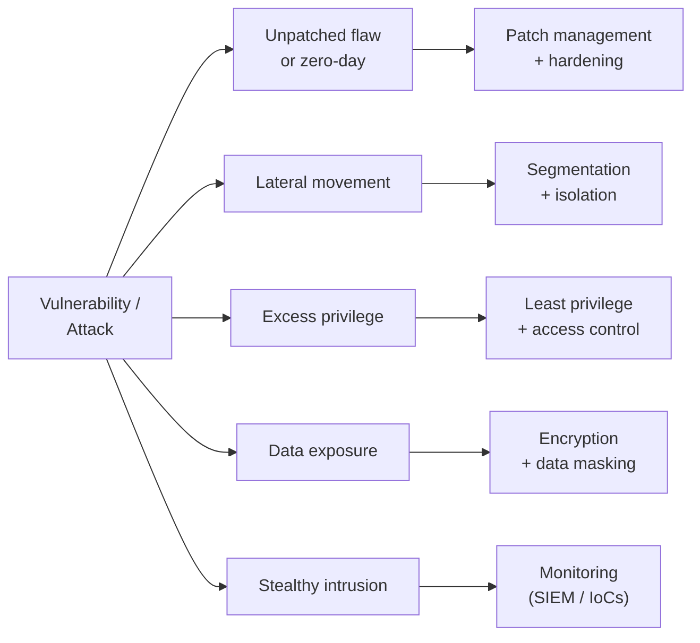

# Domain 2 — Threats, Vulnerabilities, and Mitigations

This is the **largest** domain in the **CompTIA Security+ (SY0-701)** exam — about **22%** of the scored questions, more than any other. It is the offensive-defensive core: *who* attacks (threat actors and their motivations), *how* they get in (threat vectors and attack surfaces, including social engineering), *what weaknesses* they exploit (vulnerabilities across applications, operating systems, hardware, cloud, and the supply chain), how you *recognize* an attack in progress (malicious activity and indicators of compromise), and *what you do about it* (mitigation techniques). As a system administrator you have likely cleaned up after some of these; this domain organizes them into the framework CompTIA tests. The repo's offensive-security companion, the [CEH program](../../ceh/domains/README.md), covers many of these techniques in greater depth from the attacker's side — cross-links point there throughout.

> **Note on objective numbering.** CompTIA groups this domain into objectives 2.1–2.5. This page follows those topic areas faithfully without reproducing CompTIA's numbering verbatim; confirm the exact breakdown against the official **SY0-701 Exam Objectives** (Sources). Offensive content here is **conceptual and defense-oriented** — there are no operational attack instructions.

## Learning objectives

After working through this page you should be able to:

- Identify common **threat actors** (nation-state, unskilled attacker, hacktivist, insider, organized crime, shadow IT) and their **attributes** and **motivations**.
- Describe **threat vectors and attack surfaces**: message-based, image, file, voice call, removable media, supply chain, and human/social-engineering vectors.
- Recognize the main **social-engineering** techniques (phishing and its variants, pretexting, business email compromise, and more).
- Classify **vulnerabilities** across application, OS, web (SQLi, XSS), hardware, virtualization, cloud, supply-chain, cryptographic, misconfiguration, mobile, and zero-day.
- Identify **malicious activity** — malware types, network/application/cryptographic/password attacks — and the **indicators of compromise (IoCs)** that reveal them.
- Apply **mitigation techniques**: segmentation, access control, isolation, hardening, patching, encryption, monitoring, and least privilege.

---

## 1. Threat actors and motivations

A **threat actor** is the entity behind an attack. CompTIA wants you to know each actor type, characterize it by a set of **attributes**, and match likely **motivations**.

| Threat actor | Typical attributes | Common motivations |
|---|---|---|
| **Nation-state / APT** | Highly sophisticated, very well resourced, patient (**Advanced Persistent Threat**), external. | Espionage, data exfiltration, sabotage, war/political gain. |
| **Unskilled attacker** ("script kiddie") | Low sophistication; uses others' tools without understanding them. | Curiosity, notoriety, disruption, thrill. |
| **Hacktivist** | Variable skill; often external; ideologically driven. | Philosophical/political beliefs, activism, revenge. |
| **Insider threat** | Has **legitimate access**; internal; hard to detect. | Revenge, financial gain, coercion, negligence. |
| **Organized crime** | Skilled, well funded, business-like; external. | **Financial gain** (ransomware, fraud, theft). |
| **Shadow IT** | Internal staff deploying unsanctioned tech; not malicious but creates risk. | Convenience, speed — bypassing slow processes. |

**Actor attributes** the exam tests:

- **Internal vs. external** — does the actor already have access?
- **Resources / funding** — from none (script kiddie) to vast (nation-state).
- **Level of sophistication / capability** — from running canned tools to writing zero-day exploits.

**Motivations** to recognize: data exfiltration, espionage, service disruption, **financial gain**, blackmail/extortion, ideological/philosophical beliefs, revenge, ethical (whitehat) reasons, war, and chaos/disruption.

---

## 2. Threat vectors and attack surfaces

The **attack surface** is the sum of all points where an attacker could try to get in. A **threat vector** (attack vector) is the specific path or method used. CompTIA enumerates these vectors:

| Vector | Description | Example mitigation |
|---|---|---|
| **Message-based** | Email, SMS, and instant messaging carrying phishing or malware. | Email/spam filtering, link rewriting, user training. |
| **Image-based** | Malicious code or payloads embedded in image files. | Content inspection, sandboxing. |
| **File-based** | Malicious documents, executables, scripts. | EDR, macro blocking, attachment filtering. |
| **Voice call** | **Vishing** — social engineering by phone. | Caller verification procedures, awareness. |
| **Removable media** | USB drives delivering malware or enabling exfiltration. | Disable autorun, port control, device policy. |
| **Unsecured networks** | Wired, wireless, and Bluetooth networks with weak controls. | WPA3, network segmentation, disabling unused radios. |
| **Supply chain** | Compromise via vendors, managed service providers (MSPs), or hardware/software suppliers. | Vendor vetting, code signing, SBOM, due diligence. |
| **Human / social engineering** | Manipulating people directly (see §3). | Security-awareness training, verification policies. |

The **CEH footprinting and reconnaissance** module shows how attackers map an organization's attack surface before striking: [CEH Module 2](../../ceh/domains/02-footprinting-and-reconnaissance.md).

---

## 3. Social engineering

**Social engineering** manipulates people into breaking security procedures or divulging information. It is consistently one of the most effective vectors because it bypasses technical controls entirely. The repo's [CEH social-engineering module](../../ceh/domains/09-social-engineering.md) treats these in depth; the key SY0-701 terms:

| Technique | Description |
|---|---|
| **Phishing** | Fraudulent email luring victims to reveal data or run malware. |
| **Vishing** | Phishing by **voice** call. |
| **Smishing** | Phishing by **SMS** text. |
| **Spear phishing** | Phishing **targeted** at a specific individual/group. |
| **Whaling** | Spear phishing aimed at **executives / high-value** targets. |
| **Business Email Compromise (BEC)** | Impersonating a trusted exec or partner to trigger fraudulent payments/actions. |
| **Pretexting** | Inventing a believable scenario/identity to gain trust and information. |
| **Impersonation** | Pretending to be someone with authority or a right to access. |
| **Watering-hole attack** | Compromising a website the target group is known to visit. |
| **Pharming** | Redirecting users from a legitimate site to a fake one (e.g., via DNS poisoning). |
| **Typosquatting** | Registering misspelled domains to catch mistyped traffic. |
| **Pretexting / Brand impersonation / Disinformation** | Other influence techniques CompTIA lists. |

The common psychological **principles** attackers exploit: **authority, intimidation, consensus/social proof, scarcity, urgency, familiarity/liking, and trust.** Recognizing these levers is itself a defense.

---

## 4. Vulnerabilities

A **vulnerability** is a weakness a threat can exploit. CompTIA organizes them by where they live:

| Category | Examples |
|---|---|
| **Application** | Memory injection, **buffer overflow**, race conditions (TOC/TOU — time-of-check to time-of-use), malicious update. |
| **Operating system (OS)** | Unpatched kernels/services, insecure defaults, end-of-life software. |
| **Web** | **SQL injection (SQLi)** and **cross-site scripting (XSS)** — the two CompTIA names explicitly (see below). |
| **Hardware** | Firmware flaws, **end-of-life / legacy** hardware, missing updates. |
| **Virtualization** | **VM escape** (breaking out to the host), resource reuse leakage. |
| **Cloud-specific** | Misconfigured storage buckets, over-broad IAM, exposed management APIs. |
| **Supply chain** | Compromised service providers, hardware/software vendors. |
| **Cryptographic** | Weak ciphers, short keys, poor key management, downgrade attacks. |
| **Misconfiguration** | Default credentials, open ports, excessive permissions, errors. |
| **Mobile device** | Sideloading, **jailbreaking/rooting**, insecure apps. |
| **Zero-day** | A flaw unknown to the vendor with **no patch available** — exploited before defenders can react. |

**The two named web vulnerabilities:**

- **SQL injection (SQLi)** — an attacker inserts crafted SQL into an input that the application passes unsafely to its database, letting them read, alter, or destroy data, or bypass authentication. Defense: **parameterized queries / prepared statements**, input validation, least-privilege DB accounts. Deep dive: [CEH Module 15 — SQL Injection](../../ceh/domains/15-sql-injection.md).
- **Cross-site scripting (XSS)** — an attacker injects malicious script that runs in another user's browser in the trusted site's context (stealing sessions, keystrokes). Defense: **output encoding**, input validation, a **Content Security Policy (CSP)**.

Vulnerabilities are tracked publicly as **CVEs** (Common Vulnerabilities and Exposures) and scored with **CVSS** (Common Vulnerability Scoring System). Web app weaknesses are catalogued in the **OWASP Top 10**.

---

## 5. Malicious activity and indicators

### Malware types

| Type | Behavior |
|---|---|
| **Virus** | Attaches to a host file; spreads when the file runs. |
| **Worm** | Self-replicates across networks **without** a host file or user action. |
| **Trojan** | Disguised as legitimate software; carries a hidden payload. |
| **Ransomware** | Encrypts data and demands payment for the key. |
| **Spyware / Keylogger** | Covertly collects information / records keystrokes. |
| **Rootkit** | Hides deep in the OS (sometimes kernel/firmware) to evade detection and maintain persistence. |
| **Logic bomb** | Dormant code that triggers on a condition (date, event). |
| **Bloatware** | Unwanted preinstalled software that enlarges the attack surface. |

Deeper coverage: [CEH Module 7 — Malware Threats](../../ceh/domains/07-malware-threats.md).

### Attacks by category

- **Network attacks** — **denial-of-service (DoS)** and **distributed DoS (DDoS)**, **DNS attacks** (poisoning, hijacking), **on-path / man-in-the-middle (MITM)**, **ARP poisoning**, replay, **credential reuse**.
- **Application attacks** — **injection** (incl. SQLi), **XSS**, **directory traversal**, **privilege escalation**, **forgery (CSRF/SSRF)**, replay.
- **Cryptographic attacks** — **downgrade** (forcing a weaker protocol), **collision** (two inputs, one hash), **birthday attack**, exploiting weak/legacy ciphers.
- **Password attacks** — **brute force**, **dictionary**, **password spraying** (one password against many accounts), and offline cracking against stolen hashes (**rainbow tables**, defeated by **salting**).

### Indicators of compromise (IoCs)

**IoCs** are the observable signs that a system has been or is being attacked. Recognizing them is core to detection and incident response. CompTIA's list includes:

- Account lockouts and **impossible-travel** logins (two logins from far-apart locations too close in time).
- **Concurrent session usage** from multiple locations.
- **Blocked content**, **resource consumption** spikes, **resource inaccessibility**.
- **Out-of-cycle logging**, **published/leaked** data appearing, and **missing logs** (an attacker covering tracks).
- Unexpected **outbound traffic**, beaconing to **command-and-control (C2)**, and unusual DNS queries.

The repo's [attack-to-defense matrix](../../attack-to-defense-matrix.md) maps many of these attacks to the defensive controls that catch them.

---

## 6. Mitigation techniques

The flip side of every threat is a **mitigation**. CompTIA's named techniques for securing the enterprise:

| Technique | What it does |
|---|---|
| **Segmentation** | Divide the network into zones so a breach can't spread freely (limits lateral movement). |
| **Access control** | Enforce permissions via ACLs and **least privilege**; right people, right access, no more. |
| **Isolation / sandboxing** | Contain risky processes or compromised hosts away from the rest. |
| **Application allow listing** | Permit only approved software to run (deny by default). |
| **Hardening** | Reduce the attack surface: remove unused services/ports, change defaults, disable unneeded accounts. |
| **Patching / patch management** | Remove known vulnerabilities promptly (addresses zero-days once fixes ship). |
| **Encryption** | Protect confidentiality of data at rest and in transit. |
| **Monitoring** | Detect attacks via logging, SIEM, IDS/IPS, and IoC analysis. |
| **Configuration enforcement** | Apply and maintain secure baselines (e.g., CIS Benchmarks). |
| **Decommissioning** | Retire end-of-life assets that can no longer be secured. |
| **Least privilege** | Grant the minimum access needed — limits the blast radius of any compromise. |

Endpoint and device hardening specifics include host firewalls, **EDR**, secure baselines, disabling unused ports/protocols, and removing default passwords.

This maps directly to **defense-in-depth**: no single control stops everything, so layer them. The PAM-specific view of these threats — credential theft, lateral movement, privilege abuse — is in [PAM Threat Landscape](../../foundations/pam-threat-landscape.md).

---

## Exam tips

- Match **threat actor → motivation**: nation-state → **espionage/sabotage**; organized crime → **financial gain**; hacktivist → **ideology**; insider → **revenge/money**; script kiddie → **notoriety/thrill**. **Shadow IT** is internal and **not malicious** but risky.
- Know actor **attributes**: internal vs. external, resources/funding, sophistication. **APT** implies *nation-state-level, patient, well-resourced*.
- Distinguish phishing variants: **vishing** = voice, **smishing** = SMS, **whaling** = executives, **BEC** = impersonated exec/partner triggering fraud.
- The two web vulns CompTIA names are **SQLi** (fix: parameterized queries) and **XSS** (fix: output encoding + input validation).
- A **zero-day** has *no patch yet* — the defining trait.
- Know the **password attacks**: brute force vs. dictionary vs. **password spraying** (one password, many accounts). **Salting** defeats rainbow tables.
- **Worm self-replicates without a host**; **virus needs a host file**; **trojan is disguised**; **logic bomb is condition-triggered**.
- **Impossible travel** and **concurrent sessions** are classic **IoCs**.
- Mitigations to recognize from scenarios: **segmentation** (stop spread), **least privilege** (limit blast radius), **hardening** (shrink attack surface), **patching** (close known flaws), **isolation/sandboxing** (contain), **monitoring** (detect).

---

## Sources

- CompTIA — Security+ (SY0-701) certification and exam objectives: <https://www.comptia.org/certifications/security>
- MITRE ATT&CK — adversary tactics and techniques: <https://attack.mitre.org/>
- MITRE CVE — Common Vulnerabilities and Exposures: <https://www.cve.org/>
- FIRST — Common Vulnerability Scoring System (CVSS): <https://www.first.org/cvss/>
- OWASP Top 10 — web application security risks: <https://owasp.org/www-project-top-ten/>
- NIST SP 800-61 — *Computer Security Incident Handling Guide* (indicators, response): <https://csrc.nist.gov/pubs/sp/800/61/r2/final>
- CISA — supply chain and threat guidance: <https://www.cisa.gov/>

---

*Related: [Domain 1 — General Security Concepts](./01-general-security-concepts.md) · [PAM Threat Landscape](../../foundations/pam-threat-landscape.md) · [Attack-to-Defense Matrix](../../attack-to-defense-matrix.md) · [CEH — Footprinting & Reconnaissance](../../ceh/domains/02-footprinting-and-reconnaissance.md) · [CEH — Social Engineering](../../ceh/domains/09-social-engineering.md) · [Acronyms](../reference/acronyms.md)*
