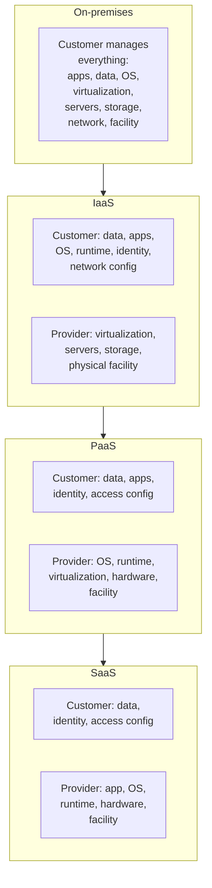
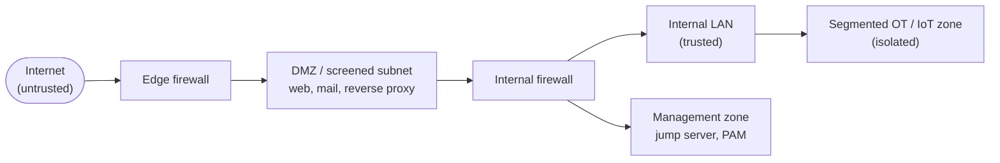

# Domain 3 — Security Architecture (18%)

Domain 3 of CompTIA Security+ (SY0-701) is about **where you put security and why**. It asks you to compare architecture models (cloud, on-premises, virtualized, containerized, embedded, industrial), reason about the security *implications* of each, and then apply enterprise design principles — device placement, security zones, firewalls, secure communication — to protect systems and the data flowing through them. For a sysadmin, this is the domain that turns "I administer servers and networks" into "I design *defensible* servers and networks."

This domain weights **18%** of the scored exam content *(verify on [CompTIA](https://www.comptia.org/en-us/certifications/security/) — weightings change per exam version)*. It maps to four objective areas — architecture models (3.1), enterprise infrastructure security principles (3.2), data protection (3.3), and resilience and recovery (3.4) — but treat the official **objectives PDF** as the authoritative checklist for exact wording; see [how to get it](../00-overview/exam-and-objectives.md#how-to-get-the-official-exam-objectives).

Where this hub already covers a topic in depth, this page **cross-links** rather than duplicates: cloud and OT attack surfaces from the attacker's side in the [CEH cloud module](../../ceh/domains/19-cloud-computing.md) and [CEH IoT/OT module](../../ceh/domains/18-iot-and-ot-hacking.md); transport security in [Transport Layer Security (TLS)](../../protocols/tls.md); and high availability and disaster recovery in the [HA & DR deep dive](../../wallix/deep-dives/high-availability-and-dr.md).

## Learning objectives

By the end of this page you should be able to:

- Compare **architecture models** — cloud, Infrastructure as Code (IaC), serverless, microservices, on-premises, virtualization, containerization, the Internet of Things (IoT), Industrial Control Systems / Supervisory Control and Data Acquisition (ICS/SCADA), real-time operating systems (RTOS), and embedded — and state the security implication of each.
- Apply the **considerations** (availability, resilience, cost, responsiveness, scalability, ease of deployment/recovery, patch availability, power, compute) to choose and defend an architecture.
- Apply **enterprise infrastructure security principles**: device placement, security zones, attack surface, connectivity, failure modes, device attributes, network appliances, port security, firewall types, and secure communication.
- Select **data-protection methods** appropriate to the data type, classification, and state (at rest, in transit, in use), accounting for geographic and sovereignty constraints.
- Design for **resilience and recovery**: high availability, load balancing vs. clustering, site strategies, platform diversity, multicloud, continuity of operations, backups, and power.

## 3.1 Architecture models and their security implications

An **architecture model** is *where and how* your compute, storage, and network live. Each model trades control for convenience differently, which changes who is responsible for security and what the attack surface looks like.

### Cloud and the shared responsibility model

The **shared responsibility model** is the single most important cloud security concept. The cloud provider secures *the cloud* (physical data centers, the hypervisor, the core network); the customer secures what they put *in* the cloud (data, identities, configurations, and — depending on the service model — operating systems and applications). The dividing line moves with the service model.

- **Infrastructure as a Service (IaaS):** the provider supplies virtual machines, storage, and networking; the customer owns the OS upward (patching, hardening, app security). Largest customer responsibility.
- **Platform as a Service (PaaS):** the provider also manages the OS and runtime; the customer owns the application and data.
- **Software as a Service (SaaS):** the provider manages the whole stack; the customer owns *only* their data, identities, and access configuration. A misconfigured share or over-permissive role is the customer's fault, not the provider's.

> **Exam framing:** the customer **always** owns their data and identity/access management, regardless of model. Most real cloud breaches are *customer-side misconfigurations* (open storage buckets, weak Identity and Access Management (IAM) roles), not provider failures.

**Hybrid** (mixing on-prem and cloud) and **third-party / vendor** considerations add risk at the seams: data crossing trust boundaries, inconsistent controls, and reliance on a vendor's security posture (covered as third-party risk in Domain 5). The offensive view of these weaknesses is in the [CEH cloud module](../../ceh/domains/19-cloud-computing.md).

### IaC, serverless, microservices

| Model | What it is | Security implication |
| --- | --- | --- |
| **Infrastructure as Code (IaC)** | Provisioning infrastructure from declarative templates (e.g., versioned config files) instead of manual clicks. | Consistent, repeatable, auditable builds — but a flaw in a template is replicated everywhere; secrets must never be hard-coded into code. |
| **Serverless** | Running functions on demand without managing servers; the provider scales and patches the host. | Smaller customer attack surface (no OS to patch) but heavy dependence on provider security and on correct function permissions; ephemeral, harder to monitor. |
| **Microservices** | An application split into small, independently deployable services that talk over the network (often via APIs). | Each service is small and isolatable, but the network between them becomes the attack surface; demands strong service-to-service authentication and API security. |

### On-prem, virtualization, containerization

- **On-premises:** full control and full responsibility — you own the hardware, the facility, patching, and physical security. Higher capital cost, slower to scale.
- **Virtualization:** multiple virtual machines (VMs) share one physical host via a **hypervisor**. Efficient, but introduces hypervisor risk and **VM escape** (breaking out of a guest into the host) as a high-impact threat.
- **Containerization:** apps packaged with their dependencies share the host **OS kernel** (e.g., via a container engine). Lighter and faster than VMs, but weaker isolation — a kernel vulnerability can affect all containers; image provenance and registry trust matter.

### Network infrastructure: physical vs. software-defined

- **Physical** networks use dedicated hardware (switches, routers, cabling). Tangible, but slow to reconfigure.
- **Software-Defined Networking (SDN)** separates the network's **control plane** (decisions) from the **data plane** (forwarding), letting software centrally program the network. Agile, but the central controller is a high-value target.

### Centralized vs. decentralized

- **Centralized:** one place to manage and monitor (easy control, single point of failure and a single juicy target).
- **Decentralized:** distributed control and resilience (no single point of failure, but harder to govern consistently).

### IoT, ICS/SCADA, RTOS, embedded

These constrained or specialized systems share a theme: **availability and safety often outrank confidentiality**, and many cannot be patched easily.

| Model | What it is | Security implication |
| --- | --- | --- |
| **Internet of Things (IoT)** | Internet-connected everyday devices (cameras, sensors, thermostats). | Often shipped with default credentials, rarely patched, weak by design — segment them off the main network. |
| **ICS / SCADA** | Industrial Control Systems / Supervisory Control and Data Acquisition: software and controllers that run physical processes (power, water, manufacturing). | Legacy protocols, no/weak authentication, decades-long lifecycles; a compromise can have *physical/safety* consequences. Isolate from IT networks. |
| **Real-time operating system (RTOS)** | An OS guaranteeing response within strict time bounds, used in control and safety systems. | Minimal security features by design; updates risk breaking timing guarantees, so patching is rare. |
| **Embedded systems** | Special-purpose computers built into a larger device (medical, automotive, appliances). | Fixed function, limited memory/compute, hard or impossible to patch; long service life means old vulnerabilities persist. |

The attacker's perspective on these is in the [CEH IoT and OT module](../../ceh/domains/18-iot-and-ot-hacking.md). WALLIX's OT-specific packaging of Privileged Access Management is in the [PAM4OT deep dive](../../wallix/deep-dives/pam4ot-operational-technology.md).

### High availability as a model property

**High availability (HA)** is the property that a service stays reachable despite failures — built through redundancy and no single points of failure. It is both an architecture choice and a resilience outcome; covered in depth in [§3.4](#34-resilience-and-recovery) and the [HA & DR deep dive](../../wallix/deep-dives/high-availability-and-dr.md).

### Considerations that drive the choice

CompTIA lists factors you weigh when selecting an architecture — be ready to match a scenario to the dominant consideration:

| Consideration | Question it answers |
| --- | --- |
| **Availability** | Will the service be reachable when needed? |
| **Resilience** | Can it absorb and recover from failure? |
| **Cost** | Capital vs. operating expense; cloud shifts CapEx to OpEx. |
| **Responsiveness** | Latency and how quickly it reacts to demand. |
| **Scalability** | Can it grow (and shrink) with load? |
| **Ease of deployment** | How fast and repeatably can you stand it up? |
| **Ease of recovery** | How quickly can you restore after failure? |
| **Patch availability** | Can it be updated? (Often *no* for embedded/ICS/RTOS.) |
| **Power** | Power draw and dependence on uninterrupted supply. |
| **Compute** | Processing capacity available and required. |

## 3.2 Enterprise infrastructure security principles

Once you have a model, you apply design principles that decide *where* defenses sit and *how* traffic is controlled.

### Device placement, security zones, and attack surface

- **Device placement:** put each control where it can see and act on the traffic it must protect (e.g., a firewall at the network edge, a sensor at a chokepoint).
- **Security zones:** group systems by trust level and separate them, so a compromise in one zone does not freely reach another. The classic example is a **demilitarized zone (DMZ)** — a screened subnet between the untrusted internet and the trusted internal network where internet-facing servers live.
- **Attack surface:** the sum of all points an attacker could probe. Good architecture **minimizes** it (close unused ports, remove unneeded services, segment).
- **Connectivity:** how zones and devices interconnect; every link is a path to be secured or denied.

### Failure modes: fail-open vs. fail-closed

When a security device fails, it falls into one of two modes — a frequently tested distinction:

- **Fail-open (fail-safe for availability):** on failure, traffic is *allowed* through. Prioritizes availability over security — used where an outage is unacceptable (e.g., some inline taps on critical links).
- **Fail-closed (fail-secure):** on failure, traffic is *blocked*. Prioritizes security over availability — used where letting unchecked traffic through is the bigger risk.

### Device attributes: active/passive, inline/tap

- **Active** devices can modify or block traffic (e.g., an Intrusion Prevention System (IPS)); **passive** devices only observe (e.g., an Intrusion Detection System (IDS)).
- **Inline** devices sit *in* the traffic path, so they can block but can also become a bottleneck or point of failure; **tap/monitor** devices receive a *copy* of traffic out-of-band, so they can only observe but never disrupt the flow.

### Network appliances

| Appliance | Role |
| --- | --- |
| **Jump server (jump box)** | A hardened, monitored host that administrators connect *through* to reach a protected zone — a single, audited entry point. (WALLIX Bastion is a PAM-grade implementation; see [PAM in Domain 4](04-security-operations.md#49-identity-and-access-management-iam).) |
| **Proxy server** | An intermediary for requests; a **forward proxy** mediates outbound user traffic (and enables filtering), a **reverse proxy** fronts servers (and enables load balancing and TLS termination). |
| **IDS / IPS** | Intrusion **Detection** System alerts on malicious patterns (passive); Intrusion **Prevention** System detects *and* blocks (active, usually inline). |
| **Load balancer** | Distributes traffic across multiple servers for capacity and availability (see [§3.4](#34-resilience-and-recovery)). |
| **Sensors** | Collection points that feed traffic or telemetry to monitoring/SIEM systems. |

### Port security: 802.1X and EAP

- **Port security** restricts which devices may use a switch port (e.g., by MAC address) to stop rogue connections.
- **IEEE 802.1X** is the standard for **port-based network access control** — a device must authenticate *before* the switch/AP grants network access. It uses the **Extensible Authentication Protocol (EAP)**, a flexible authentication framework with many methods (EAP-TLS, PEAP, etc.). 802.1X typically authenticates against a **RADIUS** server; see the [RADIUS protocol page](../../protocols/radius.md).

### Firewall types

| Type | What it inspects |
| --- | --- |
| **Layer 4 firewall** | Operates at the transport layer — filters by IP address, protocol, and **port** (stateful packet filtering). Fast, no application awareness. |
| **Layer 7 firewall** | Operates at the application layer — understands application protocols and content, enabling far more granular rules. |
| **Web Application Firewall (WAF)** | A Layer 7 firewall specialized to protect web apps from attacks such as injection and cross-site scripting. |
| **Next-Generation Firewall (NGFW)** | Combines stateful filtering with application awareness, integrated IPS, and identity-based rules. |
| **Unified Threat Management (UTM)** | An all-in-one appliance bundling firewall, IDS/IPS, antivirus, content filtering, and VPN. Convenient; can become a single point of failure. |

### Secure communication and access

- **Virtual Private Network (VPN):** an encrypted tunnel over an untrusted network, giving remote users or sites private connectivity.
- **TLS (Transport Layer Security):** encrypts data in transit for applications (HTTPS and many others); the cryptographic backbone of secure communication. Deep dive: [TLS](../../protocols/tls.md).
- **IPSec (Internet Protocol Security):** a suite that authenticates and encrypts IP packets, commonly used to build **site-to-site VPNs**; operates in transport or tunnel mode.
- **SD-WAN (Software-Defined Wide Area Network):** centrally managed, policy-driven WAN connectivity that intelligently routes traffic across links (broadband, MPLS, LTE) — agility plus integrated encryption.
- **SASE (Secure Access Service Edge):** converges SD-WAN networking with cloud-delivered security (secure web gateway, cloud access security broker, Zero Trust network access) into one service, delivered close to the user.

## 3.3 Data protection

You cannot protect data you have not classified, and the right protection method depends on the data's **type, classification, and state**.

### Data types and classifications

- **Types** include regulated data, trade secrets, intellectual property, legal information, financial information, and human-/non-human-readable data.
- **Classifications** label data by sensitivity so controls scale to value — common ladders are **Public → Sensitive → Confidential → Critical**, or government schemes such as **Unclassified → Secret → Top Secret**. Classification drives handling, access, and retention.

### Data states

| State | Meaning | Typical protection |
| --- | --- | --- |
| **At rest** | Stored data (disks, databases, backups). | Encryption (full-disk, database, file-level). |
| **In transit / in motion** | Data moving across a network. | TLS, IPSec, VPN ([TLS](../../protocols/tls.md)). |
| **In use** | Data being processed in memory by an application. | Hardest to protect; techniques include access controls and confidential-computing/enclaves. |

### Geographic and sovereignty considerations

- **Data sovereignty:** data is subject to the laws of the country where it is **physically stored** — so where your cloud region sits matters legally.
- **Geographic restrictions (geofencing):** limiting where data may be stored or accessed from, often to meet regulation (e.g., keeping EU residents' data in the EU).

### Methods to secure data

| Method | What it does |
| --- | --- |
| **Geographic restrictions** | Constrain where data is stored/accessed to satisfy law and policy. |
| **Encryption** | Reversibly transforms data so only key-holders can read it — the core protection for at-rest and in-transit data. |
| **Hashing** | A *one-way* transform producing a fixed-length digest; verifies **integrity** (not reversible, so not for confidentiality). |
| **Masking** | Hides part of a value (e.g., showing only the last 4 digits) so the rest is unreadable. |
| **Tokenization** | Replaces sensitive data with a non-sensitive **token**, with the real value held in a separate secure vault — common for payment data. |
| **Obfuscation** | Makes data harder to interpret without strong cryptographic guarantees. |
| **Segmentation** | Separates sensitive data into its own protected zone to limit exposure and ease compliance scope. |
| **Permissions / access controls** | Restrict who can read or modify the data (see IAM in Domain 4). |

> **Don't confuse encryption, hashing, and tokenization.** Encryption is reversible with a key (confidentiality). Hashing is one-way (integrity). Tokenization swaps the value for a meaningless token and stores the original elsewhere. Masking just hides characters in display.

## 3.4 Resilience and recovery

Resilience is the architecture's ability to **keep running and recover** when things fail. This section overlaps heavily with business continuity in Domain 5 and is covered hands-on in the [high availability & DR deep dive](../../wallix/deep-dives/high-availability-and-dr.md).

### High availability, load balancing, and clustering

- **High availability (HA):** designing out single points of failure so service continues through component failures.
- **Load balancing:** distributing incoming requests across multiple *active* servers for both performance and availability — if one node dies, traffic shifts to the rest.
- **Clustering:** grouping servers so they act as one system; nodes share state and can take over for a failed peer (failover). *Load balancing distributes work for scale; clustering provides coordinated failover/state sharing — they overlap but are not synonyms.*

### Site considerations: hot, warm, cold

A frequently tested trade-off of recovery speed vs. cost for a recovery site:

| Site | State | Recovery speed | Cost |
| --- | --- | --- | --- |
| **Hot** | Fully equipped, data continuously replicated, ready to run. | Near-instant | Highest |
| **Warm** | Equipped with hardware/connectivity but data must be loaded. | Hours | Medium |
| **Cold** | Space and power only; everything must be installed. | Days | Lowest |

### Diversity and distribution

- **Platform diversity:** using different vendors/technologies so a single flaw (a shared vulnerability) cannot take down everything.
- **Multicloud:** spreading workloads across multiple cloud providers to avoid lock-in and provider-wide outages.
- **Continuity of operations (COOP):** the plan and capability to keep essential functions running during disruption.

### Backups and power

- **Backups:** copies that enable recovery. Plan for **frequency**, on-site vs. **off-site**, **encryption**, and **journaling/snapshots**; the **3-2-1 rule** (3 copies, 2 media types, 1 off-site) is a common benchmark. Test restores — an untested backup is a guess.
- **Power resilience:**
  - **Uninterruptible Power Supply (UPS):** battery that bridges short outages and rides through to generator start or graceful shutdown.
  - **Generator:** provides longer-term power for sustained outages.

## Exam tips

- **Shared responsibility:** the **customer always owns data and identity/access**; provider responsibility *grows* from IaaS → PaaS → SaaS. Most cloud breaches are customer **misconfigurations**.
- **Fail-open allows traffic, fail-closed blocks it.** Open = availability first; closed = security first.
- **Active = can block (IPS); passive = observe only (IDS). Inline = in the path (can disrupt); tap = a copy (cannot disrupt).**
- **802.1X = port-based network access control** and uses **EAP**, usually against **RADIUS**.
- **Firewall layers:** Layer 4 filters by IP/port; Layer 7/NGFW/WAF understand application content. **UTM** = all-in-one bundle.
- **Data states:** at rest → encryption; in transit → TLS/IPSec/VPN; in use → hardest to protect.
- **Hashing is one-way (integrity); encryption is reversible with a key (confidentiality); tokenization swaps the value and vaults the original.**
- **Recovery sites:** hot = fast & costly, cold = cheap & slow, warm = in between.
- **Data sovereignty** = the law of the country where data is **physically stored**.
- **Load balancing distributes active traffic; clustering provides failover/shared state.**
- **UPS** bridges *short* outages; a **generator** covers *sustained* ones.

## Sources

- CompTIA — Security+ (SY0-701) certification page and official exam objectives (Domain 3 — Security Architecture, 18%): https://www.comptia.org/en-us/certifications/security/
- NIST Special Publication 800-145, *The NIST Definition of Cloud Computing* (IaaS/PaaS/SaaS service models): https://csrc.nist.gov/pubs/sp/800/145/final
- NIST Special Publication 800-207, *Zero Trust Architecture* (zones, segmentation, trust boundaries): https://csrc.nist.gov/pubs/sp/800/207/final
- NIST Special Publication 800-82, *Guide to Operational Technology (OT) Security* (ICS/SCADA, RTOS, embedded): https://csrc.nist.gov/pubs/sp/800/82/r3/final
- IETF RFC 8446 — The Transport Layer Security (TLS) Protocol Version 1.3: https://www.rfc-editor.org/rfc/rfc8446
- IETF RFC 4301 — Security Architecture for the Internet Protocol (IPSec): https://www.rfc-editor.org/rfc/rfc4301
- IEEE 802.1X-2020 — Port-Based Network Access Control: https://standards.ieee.org/standard/802_1X-2020.html
- Related in this repo: [TLS](../../protocols/tls.md) · [RADIUS](../../protocols/radius.md) · [High availability & DR](../../wallix/deep-dives/high-availability-and-dr.md) · [PAM4OT](../../wallix/deep-dives/pam4ot-operational-technology.md) · [CEH cloud](../../ceh/domains/19-cloud-computing.md) · [CEH IoT/OT](../../ceh/domains/18-iot-and-ot-hacking.md)
- Domain weightings are version-sensitive — *verify on CompTIA* before relying on them.
