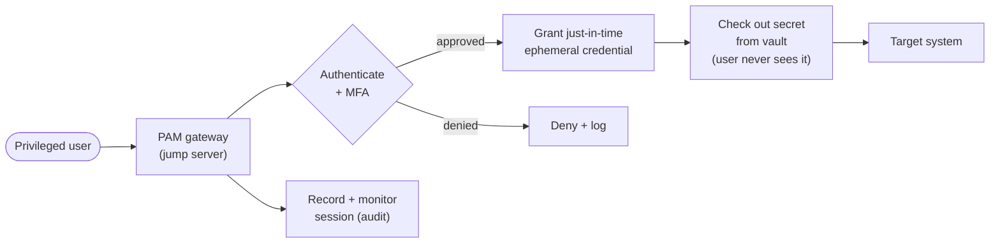
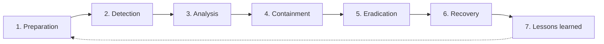

# Domain 4 — Security Operations (28%)

Domain 4 is the **largest** domain on CompTIA Security+ (SY0-701) and the one that maps most directly onto a sysadmin's day job. It is the operational core of the exam: hardening systems, securing mobile and wireless, managing vulnerabilities and assets, watching the network, enforcing identity and access, automating response, and handling incidents and forensics. If you already patch servers, read logs, and manage accounts, this is where your experience converts straight into exam marks — and where the new vocabulary (SOAR, EDR/XDR, just-in-time access) attaches to things you already understand.

This domain weights **28%** of the scored exam content *(verify on [CompTIA](https://www.comptia.org/en-us/certifications/security/) — weightings change per exam version)*. It spans roughly nine objective areas — baselines and hardening, mobile/wireless, application/asset/vulnerability management, monitoring and enterprise capabilities, identity and access management (IAM), automation/orchestration, and incident response/investigation. The official **objectives PDF** remains the authoritative checklist; see [how to get it](../00-overview/exam-and-objectives.md#how-to-get-the-official-exam-objectives).

Because **Privileged Access Management (PAM) is itself a Security+ topic**, this page links into the WALLIX material this repo specializes in: the [PAM / Bastion track](../../docs/pam-bastion/README.md), [secrets & password management](../../deep-dives/secrets-and-password-management.md), and [session management](../../deep-dives/session-management.md). Federation links into the [SAML](../../protocols/saml.md) and [OIDC/OAuth2](../../protocols/oidc-oauth2.md) protocol pages, and investigation/reporting parallels the [CEH engagement methodology](../../ceh/00-overview/engagement-methodology-and-reporting.md).

## Learning objectives

By the end of this page you should be able to:

- Apply **secure baselines and hardening** across the full target list (mobile, workstations, network devices, cloud, servers, ICS/SCADA, embedded, RTOS, IoT).
- Secure **mobile** (deployment models, Mobile Device Management (MDM), connection methods) and **wireless** (WPA3, AAA/RADIUS, cryptographic and authentication protocols).
- Manage **application security, assets, and vulnerabilities** end to end (scanning, CVE/CVSS/CWE, validation, remediation, disposal).
- Operate **security monitoring** and **enterprise security capabilities** (SIEM, DLP, IDS/IPS, email security, EDR/XDR, NAC, web/DNS filtering).
- Implement **identity and access management (IAM)**, including federation, SSO, access-control models, MFA, and **PAM** (just-in-time, vaulting, ephemeral credentials).
- Use **automation/orchestration (SOAR)** appropriately and run the **incident-response** lifecycle and **digital forensics** correctly.

## 4.1 Secure baselines and hardening

A **secure baseline** is the documented, approved secure configuration for a class of system. The lifecycle is **establish → deploy → maintain**: define the baseline, apply it consistently (often via IaC/MDM/group policy), then keep it current as threats and software change.

**Hardening** is reducing a system's attack surface by removing what it does not need. Core techniques (apply to every target):

- Remove/disable unnecessary software, services, and ports.
- Change default credentials; enforce strong authentication.
- Apply patches; enable host firewall and logging.
- Apply least-functionality and least-privilege.
- Use encryption and secure protocols.

**Hardening targets** and their wrinkles:

| Target | Hardening note |
| --- | --- |
| **Mobile devices** | Enforce via MDM; encryption, screen lock, remote wipe (see [§4.2](#42-secure-mobile-solutions)). |
| **Workstations** | Endpoint protection, patching, least privilege, disk encryption. |
| **Switches / routers** | Disable unused ports/services, strong admin auth, management-plane isolation, secure protocols (SSH not Telnet). |
| **Cloud infrastructure** | Secure configurations, least-privilege IAM, logging, benchmark compliance (e.g., CIS). |
| **Servers** | Minimal roles, patching, host firewall, file integrity monitoring. |
| **ICS / SCADA** | Often cannot be patched; rely on **isolation/segmentation** and compensating controls (see [Domain 3](03-security-architecture.md#iot-icsscada-rtos-embedded)). |
| **Embedded / RTOS** | Limited patchability and compute; minimize exposure, segment, monitor. |
| **IoT** | Change defaults, segment off the main network, update firmware where possible. |

## 4.2 Secure mobile solutions

### Deployment models

| Model | Meaning | Trade-off |
| --- | --- | --- |
| **BYOD** | Bring Your Own Device — employee-owned. | Cheapest for the org; weakest control and messy privacy/data separation. |
| **COPE** | Corporate-Owned, Personally Enabled — company device, some personal use allowed. | Strong control with reasonable user flexibility. |
| **CYOD** | Choose Your Own Device — user picks from an approved corporate-owned list. | Balances choice and control. |

- **Mobile Device Management (MDM):** centrally enforces policy on devices — encryption, passcodes, app control, remote lock/wipe, and separation of corporate from personal data (containerization).
- **Deployment** also covers enrollment and provisioning at scale.
- **Connection methods:** **cellular** (carrier network), **Wi-Fi** (secure with WPA3 — below), and **Bluetooth** (short-range; disable when unused, beware pairing-based attacks).

## 4.3 Wireless security

- **WPA3 (Wi-Fi Protected Access 3):** the current Wi-Fi security standard; strengthens WPA2 with **SAE (Simultaneous Authentication of Equals)** for stronger handshake protection against offline password guessing, and improved encryption. Prefer it over WPA2.
- **AAA (Authentication, Authorization, Accounting) / RADIUS:** enterprise Wi-Fi (WPA3-Enterprise) authenticates each user against a central **RADIUS** server rather than a shared password — covered in the [RADIUS protocol page](../../protocols/radius.md).
- **Cryptographic protocols:** the encryption protecting the wireless link (e.g., the AES-based suites used by WPA2/WPA3).
- **Authentication protocols:** how identities are proven on the WLAN — typically **802.1X** carrying **EAP** methods such as **EAP-TLS** or **PEAP** (see [Domain 3 port security](03-security-architecture.md#port-security-8021x-and-eap)).

## 4.4 Application security

Securing the software itself:

- **Input validation:** never trust input — validate type, length, format, and range to defeat injection and overflow attacks.
- **Secure cookies:** flag session cookies `Secure` (HTTPS only) and `HttpOnly` (no script access) to protect session tokens (see [session management](../../deep-dives/session-management.md)).
- **Static code analysis (SAST):** inspects source code *without running it* to find flaws early.
- **Dynamic code analysis (DAST):** tests the *running* application for flaws (e.g., fuzzing with unexpected inputs).
- **Sandboxing:** runs untrusted code in an isolated environment so it cannot harm the host.
- **Monitoring:** observe application behavior in production for anomalies and attacks.

## 4.5 Asset management

Securing the *lifecycle* of hardware, software, and data assets:

- **Acquisition / procurement:** buy from trusted sources; security requirements start at purchase.
- **Assignment / accounting:** record ownership and classification; assign a responsible party.
- **Monitoring / inventory:** maintain an accurate, current inventory — you cannot protect what you do not know you have. Includes **enumeration** of assets.
- **Disposal / decommissioning:** retire assets securely:
  - **Sanitization:** render data unrecoverable (cryptographic erase, secure wipe, degaussing, or physical destruction).
  - **Certification:** documented proof that data was destroyed.
  - **Data retention** rules govern what must be kept and for how long.

## 4.6 Vulnerability management

The cycle of finding, prioritizing, fixing, and verifying weaknesses.

- **Identification:** vulnerability **scanning** (authenticated/unauthenticated), **application security** testing, **threat feeds / OSINT** (Open-Source Intelligence), **penetration testing**, and **responsible disclosure / bug bounty** programs.
- **Scoring and naming standards:**
  - **CVE (Common Vulnerabilities and Exposures):** a unique ID for a specific known vulnerability.
  - **CVSS (Common Vulnerability Scoring System):** a 0–10 severity score for a vulnerability.
  - **CWE (Common Weakness Enumeration):** a catalog of *weakness types* (the root-cause categories, e.g., "improper input validation").
- **Analysis:** confirm findings, weed out **false positives**, assess exposure and environmental context.
- **Validation:** confirm a vulnerability is real and exploitable before acting (rescanning, penetration testing).
- **Remediation:** patching, configuration changes, **compensating controls**, **exceptions/exemptions** (risk-accepted with sign-off), and **insurance** — governed by **SLAs (Service Level Agreements)** that set fix deadlines by severity.
- **Reporting:** communicate findings and track closure.

> **Don't confuse CVE, CVSS, and CWE.** CVE = the *identifier* of a specific flaw; CVSS = its *severity score*; CWE = the *category of weakness*. The offensive view of scanning and disclosure is in the [CEH scanning module](../../ceh/domains/03-scanning-networks.md) and the [CEH engagement methodology](../../ceh/00-overview/engagement-methodology-and-reporting.md).

## 4.7 Security monitoring and alerting

Watching the environment and turning telemetry into action.

- **SIEM (Security Information and Event Management):** centralizes logs from across the environment, correlates events, and generates alerts — the analyst's console.
- **Log aggregation:** collecting logs into one place (a prerequisite for SIEM and investigation).
- **SNMP (Simple Network Management Protocol):** monitors and manages network devices; use **SNMPv3** (authenticated, encrypted).
- **NetFlow:** records metadata about network flows (who talked to whom, how much) for traffic analysis.
- **Activities:** **alerting** (notify on conditions), **scanning** (continuous discovery), **reporting**, and **archiving** (retain logs for compliance/forensics).
- **SCAP (Security Content Automation Protocol):** a NIST standard suite for expressing and automating security configuration and vulnerability checks (machine-readable benchmarks).
- **Antivirus** and **DLP (Data Loss Prevention)** feed alerts into the monitoring pipeline.

## 4.8 Enterprise security capabilities

The toolbox of controls a security team operates:

| Capability | What it does |
| --- | --- |
| **Firewall rules / ACLs** | Allow/deny traffic by rule; **Access Control Lists** define what is permitted on an interface or resource. |
| **IDS / IPS** | Detect (and, for IPS, block) malicious traffic — tuned via signatures and rules. |
| **Web filtering** | Block/allow web access by URL, category, or reputation; agent-based or centralized proxy; **content categorization** and **block rules**. |
| **DNS filtering** | Block resolution of malicious/known-bad domains — cheap, high-leverage control against malware command-and-control. |
| **Email security** | **SPF** (Sender Policy Framework — authorizes sending IPs), **DKIM** (DomainKeys Identified Mail — signs messages), **DMARC** (Domain-based Message Authentication, Reporting & Conformance — policy + reporting built on SPF/DKIM); plus a secure **email gateway** for filtering spam/phishing/malware. |
| **File Integrity Monitoring (FIM)** | Alerts when critical files change unexpectedly. |
| **DLP (Data Loss Prevention)** | Detects and blocks sensitive data leaving the organization (endpoint, network, cloud). |
| **NAC (Network Access Control)** | Enforces posture/identity checks before a device joins the network (often 802.1X-based). |
| **EDR / XDR** | **Endpoint Detection and Response** monitors endpoints for threats and enables response; **Extended Detection and Response** correlates across endpoints, network, email, and cloud. |
| **UEBA** | **User and Entity Behavior Analytics** — baselines normal behavior and flags anomalies (e.g., impossible travel, unusual data access). |

> **Email auth trio:** **SPF** says *which servers may send*; **DKIM** *signs* messages to prove integrity/origin; **DMARC** ties them together and tells receivers what to do on failure (plus reporting). Memorize all three.

## 4.9 Identity and Access Management (IAM)

IAM is *who is who*, *what they may do*, and *proving it*. This is the area where this repo's PAM specialization lives.

### Lifecycle and core concepts

- **Provisioning / deprovisioning:** create accounts on hire/role change; **promptly disable** them on departure (orphaned accounts are a top risk).
- **Permission assignments:** grant exactly the access the role requires (least privilege).
- **Identity proofing:** verifying a person is who they claim before issuing credentials.
- **Attestation:** periodic **access reviews** confirming each person still needs their access (recertification).
- **Interoperability:** identities and entitlements working across systems and vendors.

### Federation and single sign-on (SSO)

- **Federation:** trusting identities asserted by another organization or identity provider, so users authenticate once in their home domain and access partner services.
- **SSO (Single Sign-On):** one authentication grants access to many applications. Underlying protocols:
  - **LDAP (Lightweight Directory Access Protocol):** queries/authenticates against a directory (e.g., Active Directory) — see [LDAP](../../protocols/ldap.md).
  - **SAML (Security Assertion Markup Language):** XML-based federation/SSO, common for web SSO between an identity provider and service providers — see [SAML](../../protocols/saml.md).
  - **OAuth 2.0 / OpenID Connect (OIDC):** OAuth grants *authorization* (delegated access); OIDC adds an *identity* (authentication) layer on top — see [OIDC/OAuth2](../../protocols/oidc-oauth2.md).

### Access-control models

| Model | Decision basis |
| --- | --- |
| **MAC (Mandatory Access Control)** | System-enforced labels/clearances; users cannot change permissions. Highest assurance (military). |
| **DAC (Discretionary Access Control)** | The resource **owner** decides who gets access. Flexible, common, but prone to over-sharing. |
| **RBAC (Role-Based Access Control)** | Access by **job role**; assign people to roles, roles to permissions. Scales well in enterprises. |
| **Rule-based access control** | Access by **rules/conditions** (e.g., time of day, source) applied to all users. |
| **ABAC (Attribute-Based Access Control)** | Access by **attributes** of user, resource, and environment — most granular and dynamic. |

Underpinning all of them: **least privilege** — grant the minimum access needed, for the minimum time.

### Multi-factor authentication (MFA)

**MFA** requires two or more **different** factor *types*:

- **Something you know** — password, PIN.
- **Something you have** — token, smartphone, smart card.
- **Something you are** — biometric (fingerprint, face).
- Plus attributes: **somewhere you are** (location), **something you do** (behavior).

> Two passwords are **not** MFA — both are "something you know." MFA needs factors from **different categories**.

**Password concepts:** length, complexity, reuse, expiration, and age policies, plus **password managers** and **passwordless** approaches (passkeys/FIDO2). Strong, unique, vaulted passwords beat frequent forced rotation.

### Privileged Access Management (PAM)

**PAM** secures the *most powerful* accounts (admin/root/service) — the ones attackers want most. Core PAM tooling (a Security+ objective, and this repo's specialty):

- **Just-in-time (JIT) access:** grant elevated rights only for the moment they are needed, then revoke — no standing privilege.
- **Password vaulting:** store privileged credentials in a secured vault; users check them out without ever seeing the secret. See [secrets & password management](../../deep-dives/secrets-and-password-management.md).
- **Ephemeral credentials:** short-lived, single-use credentials that expire automatically, shrinking the window of exposure.

PAM also brings **session recording/monitoring** and an audited single point of entry (the jump server from [Domain 3](03-security-architecture.md#network-appliances)). The WALLIX implementation is the [PAM / Bastion track](../../docs/pam-bastion/README.md) and [session management deep dive](../../deep-dives/session-management.md).

## 4.10 Automation and orchestration (SOAR)

**SOAR (Security Orchestration, Automation, and Response)** connects security tools and runs **playbooks** so routine response steps execute automatically.

- **Use cases:** user/account provisioning, ticket enrichment, alert triage, automated containment (e.g., isolating a host), and consistent application of guardrails.
- **Benefits:** speed and **time savings**, consistency/**enforcing baselines**, fewer human errors, **scaling** a small team, and better **employee retention** (less drudgery).
- **Considerations:** **complexity/cost**, **single point of failure**, ongoing **maintenance** (playbooks rot), and **technical debt** if automation is poorly built.

## 4.11 Incident response

A repeatable **incident-response (IR)** process limits damage and speeds recovery. CompTIA's lifecycle:

| Phase | Goal |
| --- | --- |
| **Preparation** | Build the team, tools, plans, and training **before** an incident. |
| **Detection** | Identify that an incident is occurring (alerts, monitoring). |
| **Analysis** | Determine scope, impact, and root cause. |
| **Containment** | Stop the spread (isolate hosts, disable accounts). |
| **Eradication** | Remove the threat (malware, persistence, attacker access). |
| **Recovery** | Restore systems to normal, validated operation. |
| **Lessons learned** | Post-incident review to improve defenses and the plan. |

Supporting practices:

- **Training** and **testing** the plan: **tabletop exercises** (discussion-based walk-throughs), **simulations**, and full drills.
- **Root-cause analysis:** find the underlying cause, not just the symptom.
- **Threat hunting:** proactively searching for threats that evaded automated detection.

## 4.12 Digital forensics and evidence

When an incident may involve legal or HR action, evidence handling must be rigorous:

- **Legal hold:** a formal duty to preserve potentially relevant data once litigation is anticipated.
- **Chain of custody:** documented record of who handled evidence, when, and why — proves it was not tampered with.
- **Acquisition:** collecting evidence in **order of volatility** (memory before disk before backups) using forensically sound methods (write blockers, hashing to verify integrity).
- **Preservation:** keeping evidence unaltered (working on copies, not originals).
- **Reporting:** documenting findings clearly and defensibly — parallels the [CEH engagement reporting methodology](../../ceh/00-overview/engagement-methodology-and-reporting.md).
- **E-discovery:** the legal process of identifying, collecting, and producing electronically stored information.

### Log data sources for investigation

Know where evidence comes from: **firewall logs**, **application logs**, **endpoint logs**, **OS-specific security logs**, **IPS/IDS logs**, **network logs** (and **NetFlow**), **vulnerability scans**, **automated reports**, **dashboards**, and **packet captures**. Centralizing these in a **SIEM** ([§4.7](#47-security-monitoring-and-alerting)) is what makes timeline reconstruction possible.

## Exam tips

- **Hardening = reduce attack surface**: disable services, close ports, patch, change defaults, least privilege. ICS/embedded that *can't* be patched → **isolate/segment**.
- **Mobile models:** BYOD (employee-owned, least control) vs. COPE vs. CYOD; enforce with **MDM**.
- **WPA3** uses **SAE** (replaces WPA2's weaker handshake); enterprise Wi-Fi uses **802.1X/EAP** to **RADIUS**.
- **SAST = static (code, not running); DAST = dynamic (running app).**
- **CVE = the flaw's ID; CVSS = its 0–10 score; CWE = the weakness category.** Don't mix them up.
- **Email auth:** **SPF** (allowed senders) + **DKIM** (signature) + **DMARC** (policy/reporting).
- **EDR = endpoints; XDR = correlates across endpoint/network/email/cloud.**
- **Access models:** MAC (labels, system-enforced), DAC (owner decides), RBAC (by role), ABAC (by attributes), rule-based (by conditions).
- **MFA = different factor *types*** (know/have/are) — two passwords is not MFA.
- **PAM tools:** just-in-time access, password vaulting, ephemeral credentials — eliminate standing privilege.
- **IR order: Preparation → Detection → Analysis → Containment → Eradication → Recovery → Lessons learned.**
- **Forensics essentials: chain of custody, legal hold, order of volatility, work on copies.**

## Sources

- CompTIA — Security+ (SY0-701) certification page and official exam objectives (Domain 4 — Security Operations, 28%): https://www.comptia.org/en-us/certifications/security/
- NIST Special Publication 800-61, *Computer Security Incident Handling Guide* (incident-response lifecycle): https://csrc.nist.gov/pubs/sp/800/61/r2/final
- NIST Special Publication 800-86, *Guide to Integrating Forensic Techniques into Incident Response* (acquisition, order of volatility, chain of custody): https://csrc.nist.gov/pubs/sp/800/86/final
- NIST Special Publication 800-63, *Digital Identity Guidelines* (identity proofing, authenticators, MFA): https://csrc.nist.gov/pubs/sp/800/63/3/final
- NIST Special Publication 800-128, *Guide for Security-Focused Configuration Management* (secure baselines/hardening): https://csrc.nist.gov/pubs/sp/800/128/final
- FIRST — Common Vulnerability Scoring System (CVSS): https://www.first.org/cvss/
- MITRE — CVE program: https://www.cve.org/ · MITRE — CWE: https://cwe.mitre.org/
- IETF RFC 7208 (SPF), RFC 6376 (DKIM), RFC 7489 (DMARC): https://www.rfc-editor.org/rfc/rfc7208 · https://www.rfc-editor.org/rfc/rfc6376 · https://www.rfc-editor.org/rfc/rfc7489
- Related in this repo: [PAM / Bastion track](../../docs/pam-bastion/README.md) · [Secrets & password management](../../deep-dives/secrets-and-password-management.md) · [Session management](../../deep-dives/session-management.md) · [SAML](../../protocols/saml.md) · [OIDC/OAuth2](../../protocols/oidc-oauth2.md) · [LDAP](../../protocols/ldap.md) · [RADIUS](../../protocols/radius.md) · [CEH engagement methodology](../../ceh/00-overview/engagement-methodology-and-reporting.md)
- Domain weightings are version-sensitive — *verify on CompTIA* before relying on them.
