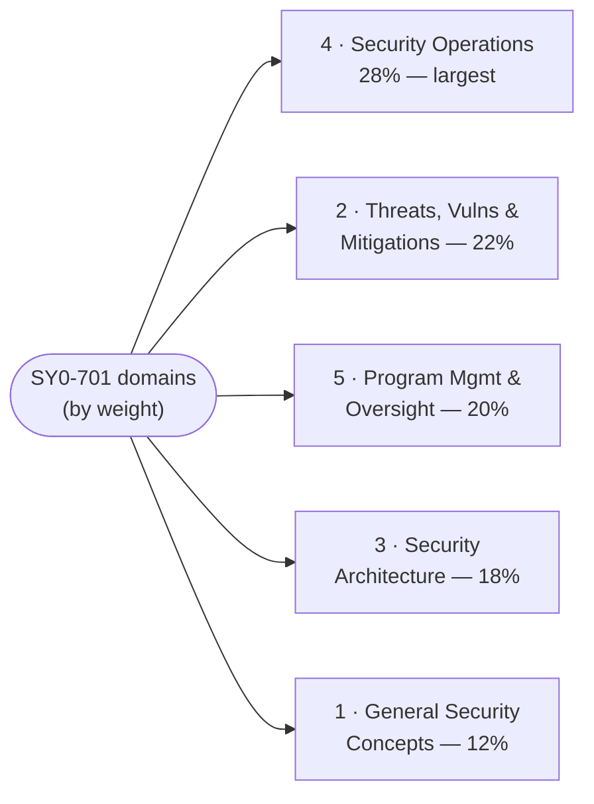

# The Five Security+ (SY0-701) Domains

The core knowledge areas of the CompTIA Security+ (SY0-701) exam. Each page below is written **to the official SY0-701 exam objectives** and covers the domain's concepts, a Mermaid diagram, and the key terms a sysadmin moving into security needs — with a **defensive (blue-team) framing**. The percentages are CompTIA's published weightings (the share of scored content per domain) *(verify on [CompTIA](https://www.comptia.org/en-us/certifications/security/) — weightings change per exam version)*.

> The objectives PDF is the canonical checklist for exact wording and every listed term — see [how to get it](../00-overview/exam-and-objectives.md#how-to-get-the-official-exam-objectives). These pages follow it but do not replace it.

## Learning objectives

- Identify the five SY0-701 domains, their weightings, and their themes.
- Use the weightings to prioritise study time (Security Operations is the largest).
- Navigate to the per-domain page written to the official objectives.

## Domain index

| # | Domain | Weight | Theme (one line) |
| --- | --- | --- | --- |
| 1 | [General Security Concepts](01-general-security-concepts.md) | **12%** | CIA triad, security controls, Zero Trust, change management, cryptography & PKI basics |
| 2 | [Threats, Vulnerabilities & Mitigations](02-threats-vulnerabilities-mitigations.md) | **22%** | Threat actors, attack types, vulnerabilities, indicators, and mitigation techniques |
| 3 | [Security Architecture](03-security-architecture.md) | **18%** | Secure design across cloud, on-prem, network, and data — resilience and protection |
| 4 | [Security Operations](04-security-operations.md) | **28%** | Day-to-day defence: hardening, monitoring, logging, identity, incident response |
| 5 | [Security Program Management & Oversight](05-security-program-management-oversight.md) | **20%** | Governance, risk management, third-party risk, compliance, audits, and awareness |

## How to use these pages

- **Prioritise by weight.** Domain 4 (Security Operations, 28%) is the largest and maps most directly onto a sysadmin's existing skills — start there for quick wins. Domains 2 and 5 together are ~42% of the exam, so do not neglect threats or governance for the more technical Domain 3.
- **Pair with the objectives PDF.** Track each sub-objective against the official list; these pages are written to those objectives but the PDF is the authoritative checklist — see [exam-and-objectives.md](../00-overview/exam-and-objectives.md).
- **Cross-reference the offensive view.** Where this hub covers attacks defensively, the [CEH modules](../../ceh/domains/README.md) cover the same techniques from the attacker's side; the [protocols reference](../../protocols/README.md) and [repo glossary](../../reference/README.md) reinforce shared fundamentals.

## Where to go next

- [../00-overview/what-is-security-plus.md](../00-overview/what-is-security-plus.md) — what Security+ is and where it sits.
- [../00-overview/exam-and-objectives.md](../00-overview/exam-and-objectives.md) — exam format, the weightings, PBQs, and the objectives PDF.
- [../../ceh/domains/README.md](../../ceh/domains/README.md) — the offensive sibling: the same topics from the attacker's side.

## Sources

- CompTIA — Security+ (SY0-701) official certification page and exam objectives (five domains and published weightings 12 / 22 / 18 / 28 / 20 percent): https://www.comptia.org/en-us/certifications/security/
- Related in this repo: [../../ceh/domains/README.md](../../ceh/domains/README.md) · [../../protocols/README.md](../../protocols/README.md) · [../../reference/README.md](../../reference/README.md)
- Domain weightings are version-sensitive — *verify on CompTIA* before relying on them.
