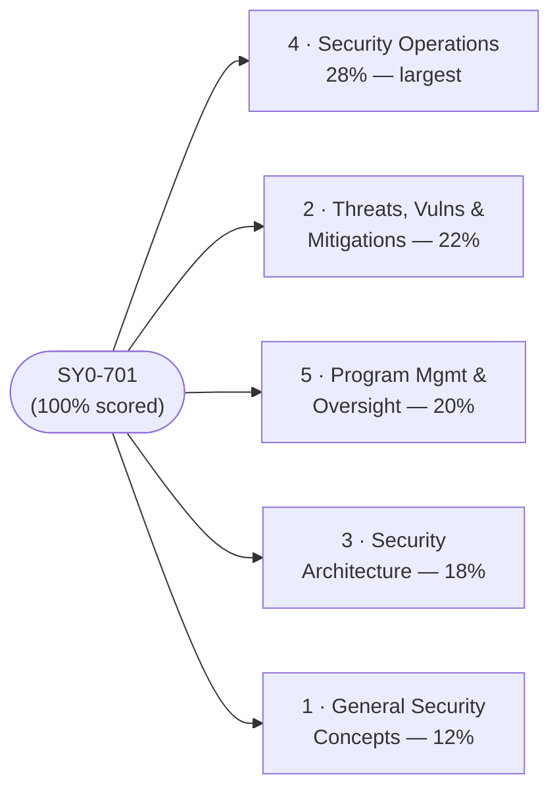
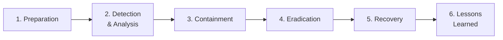

# Security+ (SY0-701) Cheat Sheet

A dense, last-mile quick reference for the **CompTIA Security+ (SY0-701)** exam. Use it for spaced review and final-week drilling, paired with the [study-plan.md](./study-plan.md) and [practice-questions.md](./practice-questions.md).

> This is a condensed reference, not a teaching page. Each line assumes you have already read the relevant [domain page](../domains/README.md). Acronyms are expanded on first use.

## Exam-day facts

| Item | Detail |
| --- | --- |
| Exam code | **SY0-701** |
| Questions | **Maximum 90** (multiple-choice + performance-based) |
| Time | **90 minutes** |
| Passing | **750** on a **100–900** scaled score (not a flat percentage) |
| Pace | ~1 minute/item; PBQs cost more — flag and return |
| Recommended | Network+ and ~2 years experience (not required) |

- Confirm exam code, retirement date, price, languages, and CEU renewal on **CompTIA** — these change.

## The 5 domains at a glance

| # | Domain | Weight | Theme |
| --- | --- | --- | --- |
| 1 | [General Security Concepts](../domains/01-general-security-concepts.md) | 12% | CIA, AAA, controls, Zero Trust, change mgmt, crypto/PKI |
| 2 | [Threats, Vulns & Mitigations](../domains/02-threats-vulnerabilities-mitigations.md) | 22% | Threat actors, attacks, vulns, indicators, mitigations |
| 3 | [Security Architecture](../domains/03-security-architecture.md) | 18% | Cloud/on-prem design, segmentation, resilience, data protection |
| 4 | [Security Operations](../domains/04-security-operations.md) | 28% | Hardening, monitoring/logging, identity, IR |
| 5 | [Program Mgmt & Oversight](../domains/05-security-program-management-oversight.md) | 20% | Governance, risk, third-party, compliance, audits, awareness |

## CIA triad + AAA

| Model | Element | Meaning |
| --- | --- | --- |
| CIA | **Confidentiality** | Only authorised parties can read the data |
| CIA | **Integrity** | Data is accurate and unaltered (hashes detect change) |
| CIA | **Availability** | Authorised users can access it when needed |
| AAA | **Authentication** | Prove identity (something you know/have/are) |
| AAA | **Authorisation** | What the identity is allowed to do |
| AAA | **Accounting** | Log/record what was done (auditing, non-repudiation) |

> Related: **Non-repudiation** = you cannot deny an action (digital signatures). **Authentication factors:** know (password), have (token), are (biometric), plus location and behaviour.

## Security control categories and types

| Categories (what kind) | Types (what it does) |
| --- | --- |
| **Technical** — technology (firewall, encryption, MFA) | **Preventive** — stops it (lock, firewall) |
| **Managerial** — policy/risk decisions | **Detective** — finds it (logs, IDS, camera) |
| **Operational** — people/process (awareness, guards) | **Corrective** — fixes it (backup restore, patch) |
| **Physical** — tangible (fence, lock, badge) | **Deterrent** — discourages it (warning sign, lighting) |
| | **Compensating** — alternative when primary isn't feasible |
| | **Directive** — instructs behaviour (policy, signage) |

## Access-control models

| Model | Basis for access | Note |
| --- | --- | --- |
| **DAC** (Discretionary) | Data **owner** decides | Flexible; common in OSes (file permissions) |
| **MAC** (Mandatory) | System-enforced **labels/clearances** | Strict; military/high-security |
| **RBAC** (Role-Based) | User's **job role** | Scales well in enterprises |
| **ABAC** (Attribute-Based) | **Attributes** (user, resource, context) | Fine-grained, dynamic |
| **Rule-Based** | Predefined **rules/ACLs** | E.g., firewall rules, time-of-day |

> **Least privilege** = minimum access needed. **Separation of duties** = split critical tasks. **Zero Trust** = never trust, always verify. See [../../foundations/core-concepts-least-privilege-jit-zero-trust.md](../../foundations/core-concepts-least-privilege-jit-zero-trust.md).

## Cryptography quick facts

| Type | What it does | Key model | Examples |
| --- | --- | --- | --- |
| **Symmetric** | Bulk encryption (fast) | One **shared** secret key | **AES** (128/192/256), 3DES (legacy), ChaCha20 |
| **Asymmetric** | Key exchange, signatures | **Key pair** (public/private) | **RSA**, **ECC** (smaller keys, efficient), Diffie–Hellman |
| **Hashing** | Integrity (one-way) | No key; fixed-length digest | **SHA-256/SHA-3**, MD5 (broken), SHA-1 (deprecated) |
| **Password storage / MAC** | Slow hash / authenticated integrity | Salt + key stretching | bcrypt, PBKDF2, scrypt, Argon2, HMAC |

- **Asymmetric rule:** encrypt with recipient's **public** key (only their private decrypts); sign with sender's **private** key (anyone verifies with public).
- **PKI** (Public Key Infrastructure) binds public keys to identities via **certificates** issued by a **Certificate Authority (CA)**; trust chains up to a root CA; revocation via CRL/OCSP.
- **Salting** defeats rainbow tables; **key stretching** (bcrypt/PBKDF2) slows brute force.
- **AES** = Advanced Encryption Standard; **RSA** = Rivest–Shamir–Adleman; **ECC** = Elliptic-Curve Cryptography; **SHA** = Secure Hash Algorithm.

## Common ports

| Port | Proto | Service | Note |
| --- | --- | --- | --- |
| 20/21 | TCP | FTP (data/control) | Cleartext |
| 22 | TCP | SSH / SCP / SFTP | Encrypted remote admin |
| 23 | TCP | Telnet | Cleartext — insecure |
| 25 | TCP | SMTP | Mail relay |
| 53 | TCP/UDP | DNS | UDP query; TCP zone transfer |
| 67/68 | UDP | DHCP | Address assignment |
| 69 | UDP | TFTP | No auth |
| 80 | TCP | HTTP | Cleartext web |
| 110 | TCP | POP3 | Mail retrieval |
| 123 | UDP | NTP | Time sync |
| 135/137-139 | TCP/UDP | MS RPC / NetBIOS | Windows |
| 143 | TCP | IMAP | Mail retrieval |
| 161/162 | UDP | SNMP | Mgmt; default community strings leak |
| 389 | TCP/UDP | LDAP | Directory |
| 443 | TCP | HTTPS | TLS web |
| 445 | TCP | SMB | Windows file sharing |
| 514 | UDP | Syslog | Logging |
| 636 | TCP | LDAPS | LDAP over TLS |
| 993 / 995 | TCP | IMAPS / POP3S | Mail over TLS |
| 1433 / 1521 / 3306 / 5432 | TCP | MSSQL / Oracle / MySQL / PostgreSQL | Databases |
| 3389 | TCP | RDP | Remote Desktop; brute-force target |
| 5900 | TCP | VNC | Remote control |

> FTP = File Transfer Protocol; SSH = Secure Shell; SMTP = Simple Mail Transfer Protocol; DNS = Domain Name System; SNMP = Simple Network Management Protocol; LDAP = Lightweight Directory Access Protocol; SMB = Server Message Block; RDP = Remote Desktop Protocol. Full table: [../../prerequisites/networking-and-protocols.md](../../prerequisites/networking-and-protocols.md) and [../../ceh/exam-prep/cheat-sheet.md](../../ceh/exam-prep/cheat-sheet.md).

## Risk formulas (memorise)

| Term | Expansion | Formula |
| --- | --- | --- |
| **AV** | Asset Value | input |
| **EF** | Exposure Factor (% lost per event) | input |
| **SLE** | Single Loss Expectancy | **SLE = AV × EF** |
| **ARO** | Annualised Rate of Occurrence | input (events/year) |
| **ALE** | Annualised Loss Expectancy | **ALE = SLE × ARO** |

> Quick check: AV $100k, EF 0.5 → SLE $50k; ARO 0.25 → ALE $12,500/yr. A control is justified if it costs less than the ALE reduction.

## BIA metrics

| Metric | Expansion | Answers |
| --- | --- | --- |
| **RTO** | Recovery Time Objective | How fast must we **restore**? (downtime tolerance) |
| **RPO** | Recovery Point Objective | How much **data loss** is OK? → backup frequency |
| **MTTR** | Mean Time To Repair/Recover | Average **repair** time |
| **MTBF** | Mean Time Between Failures | Average time **between** failures (reliability) |

> BIA = Business Impact Analysis. **RTO = time; RPO = data.** RPO drives how often you back up.

## Risk management quick reference

- **Strategies:** **Avoid** (stop activity) · **Mitigate** (add controls) · **Transfer** (insurance/contract) · **Accept** (tolerate, with exemption/exception).
- **Register** tracks each risk: likelihood, impact, **owner**, treatment, status.
- **KRI** (Key Risk Indicator) signals rising risk · **Appetite** = willing risk · **Tolerance** = allowed variance · **Threshold** = trigger line.
- **Qualitative** = subjective (High/Med/Low) · **Quantitative** = money (SLE/ALE/ARO).
- **Assessment cadence:** ad-hoc · one-time · recurring · continuous.

## Incident-response (IR) lifecycle

> NIST-aligned order. **Lessons learned** feeds back into preparation. Containment may be short-term then long-term.

## Governance document hierarchy

**Guidelines** (optional) → **Policies** (intent, mandatory) → **Standards** (specific rules) → **Procedures** (step-by-step). Only **guidelines** are non-mandatory.

> Policy examples: AUP (Acceptable Use), info-security, BC/DR, IR, SDLC, change management. Data roles: **owner** (accountable/classifies) · **controller** (decides why/how) · **processor** (acts on instruction) · **custodian** (implements controls, often IT) · **steward** (data quality).

## Agreement acronyms

| Acronym | Agreement | Purpose |
| --- | --- | --- |
| **SLA** | Service Level Agreement | Measurable service levels + penalties |
| **MOU** | Memorandum of Understanding | Soft statement of intent (often non-binding) |
| **MOA** | Memorandum of Agreement | More formal cooperative agreement |
| **MSA** | Master Service Agreement | Umbrella contract of general terms |
| **SOW / WO** | Statement of Work / Work Order | Specific deliverables under an MSA |
| **NDA** | Non-Disclosure Agreement | Protects confidential information |
| **BPA** | Business Partners Agreement | Terms between business partners |

> Umbrella = **MSA**; specific job = **SOW**; soft intent = **MOU**; performance promise = **SLA**.

## Compliance & privacy quick hits

- **Due diligence** = investigate *before*; **due care** = reasonable effort *ongoing*.
- **Controller** decides purpose/means; **processor** acts on instruction; **data subject** = the person.
- **Non-compliance consequences:** fines · sanctions · reputational damage · contractual impact · loss of license.
- **Right to be forgotten** = erasure on request. **Retention** = keep only as long as needed.
- Frameworks (PCI DSS, HIPAA, GDPR, SOX, ISO 27001, NIST): [../../reference/compliance-and-standards.md](../../reference/compliance-and-standards.md).

## Penetration-test types

- **By engagement:** physical · offensive (red) · defensive (blue) · integrated (purple).
- **By knowledge:** known (white-box) · partially known (grey-box) · unknown (black-box).
- **Recon:** passive (no contact, public sources) vs active (probing the target).
- Always authorised, scoped, with rules of engagement — see [../../ceh/00-overview/legal-and-ethics.md](../../ceh/00-overview/legal-and-ethics.md).

## High-yield distinctions to memorise

- **Control category vs type:** category = *what kind* (technical/managerial/operational/physical); type = *what it does* (preventive/detective/...).
- **IDS vs IPS:** IDS alerts; IPS blocks inline.
- **Symmetric vs asymmetric:** shared key vs key pair.
- **Encryption vs hashing:** reversible confidentiality vs one-way integrity.
- **RTO vs RPO:** restore time vs tolerable data loss.
- **Due diligence vs due care:** investigate before vs reasonable effort ongoing.
- **Controller vs processor:** decides vs acts on instruction.
- **MSA vs SOW:** umbrella terms vs the specific job.
- **Risk transfer vs accept:** insure/contract out vs knowingly tolerate.
- **Qualitative vs quantitative risk:** subjective ratings vs money (SLE/ALE).

## Where to go next

- [study-plan.md](./study-plan.md) — the schedule that builds toward this reference.
- [practice-questions.md](./practice-questions.md) — apply these facts under exam conditions.
- [../domains/README.md](../domains/README.md) — the five domain pages.
- [../reference/acronyms.md](../reference/acronyms.md) — full acronym expansions.

## Sources

- CompTIA — Security+ (SY0-701) exam objectives, the five domains and weightings: https://www.comptia.org/en-us/certifications/security/
- NIST — SP 800-61 (incident-response lifecycle), SP 800-30 (risk: SLE/ALE/ARO), and the Risk Management Framework: https://csrc.nist.gov/
- FIRST.org — Common Vulnerability Scoring System (CVSS) severity bands: https://www.first.org/cvss/
- IANA — Service Name and Transport Protocol Port Number Registry (ports): https://www.iana.org/assignments/service-names-port-numbers/service-names-port-numbers.xhtml
- Sibling hub pages: [../../prerequisites/networking-and-protocols.md](../../prerequisites/networking-and-protocols.md) · [../../ceh/exam-prep/cheat-sheet.md](../../ceh/exam-prep/cheat-sheet.md) · [../../reference/compliance-and-standards.md](../../reference/compliance-and-standards.md) · [../../foundations/core-concepts-least-privilege-jit-zero-trust.md](../../foundations/core-concepts-least-privilege-jit-zero-trust.md)
- Verified ground truth for this hub: SY0-701; max 90 questions (MCQ + PBQ); 90 minutes; passing 750 on a 100–900 scale; domain weights 12 / 22 / 18 / 28 / 20 percent.
- All volatile specifics (exam code, retirement date, price, CEU renewal) are version-sensitive — *verify on CompTIA*.
