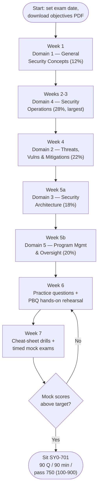

# Security+ (SY0-701) Study Plan

An ordered route through this `security-plus/` hub for the **CompTIA Security+ (SY0-701)** exam. It sequences the five domains by **exam weighting** (so your time goes where the points are), gives **performance-based question (PBQ)** practice tips, lays out **exam-day logistics**, and shows how a systems administrator's existing skills map onto each domain.

> **Time estimates below are SUGGESTIONS, not requirements.** They assume a working sysadmin studying part-time. CompTIA does not mandate a study duration — compress or stretch the plan to fit your pace, prior knowledge, and exam date. Re-check all volatile exam specifics on CompTIA: https://www.comptia.org/en-us/certifications/security/

## Learning objectives

- Follow a weight-prioritised path through the five SY0-701 domain pages.
- Allocate study time in proportion to each domain's exam weighting (most to Domain 4, then Domain 2).
- Prepare specifically for **PBQs**, the interactive, hands-on items.
- Know the exam-day logistics: **max 90 questions, 90 minutes, pass = 750 on a 100–900 scale**.
- Recognise how your sysadmin background gives you a head start on the technical domains.

## How this plan is organised

Use the hub in three passes:

1. **Pass 1 — Learn (Weeks 1–5):** read each [domain page](../domains/README.md) in priority order, build vocabulary, and expand every acronym.
2. **Pass 2 — Practise (Week 6):** work the [practice questions](./practice-questions.md) and rehearse PBQ-style tasks hands-on.
3. **Pass 3 — Polish (Week 7):** drill the [cheat sheet](./cheat-sheet.md), take timed mock exams, and fix weak areas.

> **Always study against the official objectives PDF.** It is the authoritative checklist of every term and acronym — download it from CompTIA and tick off coverage as you go. See [../00-overview/exam-and-objectives.md](../00-overview/exam-and-objectives.md#how-to-get-the-official-exam-objectives).

## Weight-driven priority

The exam is not evenly weighted, so your study time should not be either. Spend the most time on **Domain 4 (28%)** and **Domain 2 (22%)**; give **Domain 5 (20%)** and **Domain 3 (18%)** solid coverage; and treat **Domain 1 (12%)** as the conceptual foundation that the others build on.

| Order | Domain | Weight | Suggested study share | Why this slot |
| --- | --- | --- | --- | --- |
| 1 | [Domain 1 — General Security Concepts](../domains/01-general-security-concepts.md) | 12% | ~12% | Foundation: CIA, controls, Zero Trust — read first even though it is small |
| 2 | [Domain 4 — Security Operations](../domains/04-security-operations.md) | **28%** | **~30%** | Largest domain and closest to sysadmin skills — biggest payoff |
| 3 | [Domain 2 — Threats, Vulnerabilities & Mitigations](../domains/02-threats-vulnerabilities-mitigations.md) | **22%** | **~22%** | Second-largest; the attacker's view of what you defend |
| 4 | [Domain 3 — Security Architecture](../domains/03-security-architecture.md) | 18% | ~18% | Secure design across cloud, network, and data |
| 5 | [Domain 5 — Program Management & Oversight](../domains/05-security-program-management-oversight.md) | 20% | ~18% | High-weight but least technical; needs deliberate (not intuitive) study |

> Domain 1 is read **first** (it is the vocabulary the rest assumes) but is **small**, so it gets a small time share. Domains 4 and 2 are where the marks concentrate.

## The study path at a glance

## Week-by-week milestones

### Week 1 — Domain 1: General Security Concepts (12%) — suggested ~5–7 h
- Read [Domain 1](../domains/01-general-security-concepts.md). Lock down the **CIA triad** (Confidentiality, Integrity, Availability), **AAA** (Authentication, Authorisation, Accounting), **control categories** (technical/managerial/operational/physical) and **types** (preventive/detective/corrective/deterrent/compensating/directive), **Zero Trust**, **change management**, and **PKI/cryptography basics**.
- **Milestone:** you can name every control category and type, and explain Zero Trust in a sentence.

### Weeks 2–3 — Domain 4: Security Operations (28%, largest) — suggested ~12–16 h
- Read [Domain 4](../domains/04-security-operations.md). This is the biggest domain and the one closest to your day job: **hardening**, **monitoring/logging (SIEM)**, **identity and access management**, **vulnerability management**, and the **incident-response lifecycle**.
- **Milestone:** you can recite the IR lifecycle and explain what a SIEM does and why logs matter.

### Week 4 — Domain 2: Threats, Vulnerabilities & Mitigations (22%) — suggested ~9–11 h
- Read [Domain 2](../domains/02-threats-vulnerabilities-mitigations.md). Cover **threat actors and motivations**, **attack types** (malware, social engineering, network, application), **vulnerabilities**, **indicators of compromise**, and **mitigation techniques**.
- Cross-reference the offensive view in the [CEH modules](../../ceh/domains/README.md) — Security+ defends what CEH attacks.
- **Milestone:** match each common attack to its primary mitigation.

### Week 5a — Domain 3: Security Architecture (18%) — suggested ~7–9 h
- Read [Domain 3](../domains/03-security-architecture.md). Cover **architecture models** (cloud, on-prem, hybrid, serverless), **secure network design and segmentation**, **resilience** (high availability, backups), and **data protection** (classification, encryption at rest/in transit).
- **Milestone:** explain segmentation and the cloud shared-responsibility model.

### Week 5b — Domain 5: Program Management & Oversight (20%) — suggested ~7–9 h
- Read [Domain 5](../domains/05-security-program-management-oversight.md). This is **high-weight but non-technical**, so give it deliberate study: **governance** (policies/standards/procedures, data roles), **risk management** (the **SLE/ALE/ARO** formulas, **RTO/RPO/MTTR/MTBF**), **third-party agreements** (SLA/MOU/MSA/NDA/BPA), **compliance/privacy**, **audits/pentests**, and **security awareness**.
- **Milestone:** compute an ALE from an AV/EF/ARO scenario and distinguish RTO from RPO.

### Week 6 — Practice & PBQ rehearsal — suggested ~8–10 h
- Work the [practice questions](./practice-questions.md) domain by domain; review every miss against the relevant domain page.
- Rehearse **PBQ-style tasks hands-on** (see tips below).
- **Milestone:** consistently above your target score on each domain set.

### Week 7 — Consolidation — suggested ~6–8 h
- Drill the [cheat sheet](./cheat-sheet.md) until ports, control types, crypto facts, risk formulas, and acronyms are automatic.
- Take **full-length timed mock exams** under exam conditions; re-read your two weakest domains.
- **Milestone:** you finish a full mock within 90 minutes with margin above 750-equivalent.

## Performance-based questions (PBQ) practice tips

**PBQs** are interactive tasks — configuring a setting, ordering incident-response steps, matching controls to scenarios, dragging items into a diagram, or interpreting log/command output. They typically appear **at the start** and are the most time-consuming items.

- **Flag and skip first.** If the exam interface allows it, **flag a hard PBQ, do all the multiple-choice questions, then return** with the time you have left. Do not let one PBQ burn 15 minutes early. *(Verify the current interface permits skipping/returning — CompTIA's delivery can change.)*
- **Practise the underlying task, not just the theory.** Actually configure a firewall rule, read a real log excerpt, lay out a small network, and order the IR phases. A sysadmin who has *done* these has a real edge here.
- **Know the orderings cold.** IR lifecycle, risk-management lifecycle, and the document hierarchy are natural drag-to-order PBQs — drill them from the [cheat sheet](./cheat-sheet.md).
- **Read the whole scenario before touching anything.** PBQs bury constraints in the prompt; one missed line changes the right answer.
- **Budget time.** With **max 90 questions in 90 minutes** you average **~1 minute/item**, but PBQs eat several minutes each — front-load the quick MCQs to bank time for them.

## Exam-day logistics

| Item | Detail |
| --- | --- |
| Questions | **Maximum 90** (some forms fewer); **MCQ + PBQ** |
| Duration | **90 minutes** |
| Passing score | **750** on a **100–900** scale (a *scaled* score, not a flat percentage) |
| Delivery | Testing centre or online proctoring — *verify current options on CompTIA* |
| Recommended experience | Network+ and ~2 years in a security/sysadmin role (recommended, **not** required) |
| Price / renewal (CEUs) | **Not quoted here — verify on CompTIA**; programs change |

- **The 750/100–900 score is scaled**, not "750 out of 900." CompTIA does not publish a fixed percentage-correct threshold — ignore third-party "you need X%" claims.
- **Pacing:** roughly 1 minute per item on average. Answer every question — there is no penalty for guessing, so never leave a blank.
- **On the day:** read each question fully, watch qualifier words (*best*, *most likely*, *first*, *least*), eliminate obviously wrong options, and use the flag-and-review feature for anything uncertain.

See [../00-overview/exam-and-objectives.md](../00-overview/exam-and-objectives.md) for the full format detail and how to download the objectives PDF.

## How a sysadmin's background maps in

You already do most of Domain 4 and much of Domains 1–3 — Security+ mostly **renames** what you do under security terminology.

| You already... | ...maps to Security+ |
| --- | --- |
| Patch and harden systems | Domain 4 (vulnerability/configuration management) and Domain 1 (controls) |
| Manage accounts, groups, and permissions | Domain 4 identity & access management; least privilege (Domain 1) |
| Read logs and triage alerts | Domain 4 monitoring, logging, SIEM, and incident response |
| Segment networks, run firewalls/VPNs | Domain 3 secure network architecture |
| Run backups and plan recovery | Domain 3 resilience and Domain 5 BIA (RTO/RPO) |
| Follow change-control and write runbooks | Domain 1 change management and Domain 5 procedures/playbooks |

- **Lean into Domain 4 for quick wins** — it is the largest domain and your strongest ground.
- **Invest deliberately in Domain 5** — governance, risk formulas, and agreement acronyms are the least intuitive for a hands-on admin and are 20% of the exam.
- **Use the offensive sibling hub** ([CEH](../../ceh/domains/README.md)) to deepen Domain 2: seeing an attack from the attacker's side makes the defensive mitigation memorable.

## Where to go next

- [practice-questions.md](./practice-questions.md) — 50+ unofficial practice questions grouped by domain.
- [cheat-sheet.md](./cheat-sheet.md) — dense last-mile quick reference.
- [../domains/README.md](../domains/README.md) — the five domain pages, written to the objectives.
- [../00-overview/exam-and-objectives.md](../00-overview/exam-and-objectives.md) — exam format, weightings, PBQs, and the objectives PDF.
- [../../ceh/exam-prep/study-plan.md](../../ceh/exam-prep/study-plan.md) — the sibling offensive study plan.

## Sources

- CompTIA — Security+ (SY0-701) official certification page (max 90 questions, MCQ + PBQ, 90 minutes, 750 on 100–900, five domains and weightings, recommended Network+ and ~2 years): https://www.comptia.org/en-us/certifications/security/
- CompTIA — Security+ exam objectives (SY0-701) download (the authoritative study checklist): https://www.comptia.org/en-us/certifications/security/
- Sibling hub pages: [../00-overview/exam-and-objectives.md](../00-overview/exam-and-objectives.md) · [../domains/README.md](../domains/README.md) · [../../ceh/exam-prep/study-plan.md](../../ceh/exam-prep/study-plan.md)
- Verified ground truth for this hub: SY0-701; max 90 questions (MCQ + PBQ); 90 minutes; passing 750 on a 100–900 scale; domain weights 12 / 22 / 18 / 28 / 20 percent.
- All volatile specifics (exam code, retirement date, price, delivery, CEU renewal) are version-sensitive — *verify on CompTIA*.
