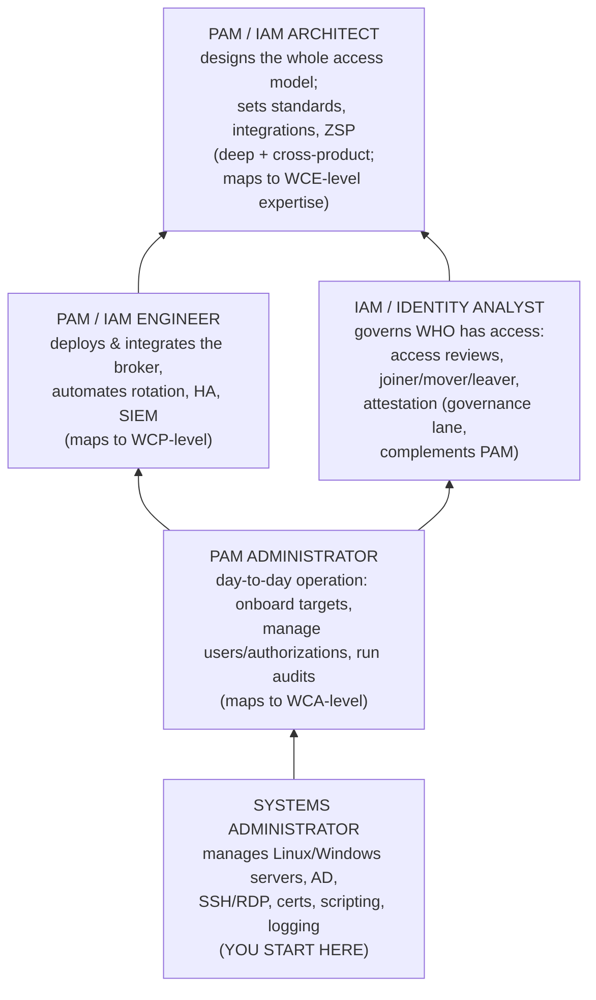
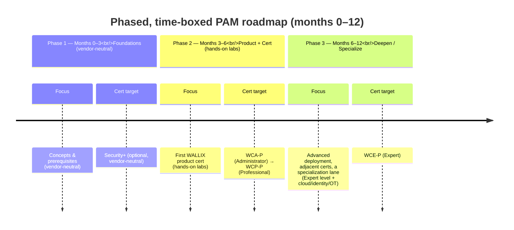
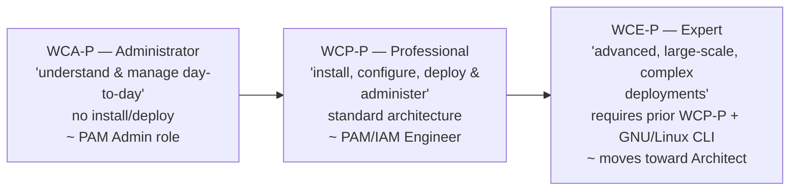
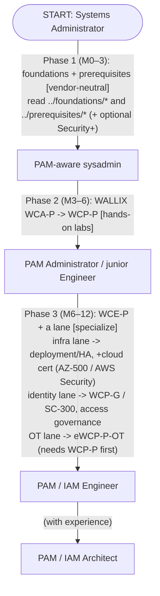

# From Systems Administrator to PAM Specialist — A Roadmap

This page is for a **systems administrator (sysadmin)** who wants to build a
cybersecurity career specializing in **Privileged Access Management (PAM)** — the
discipline of securing, brokering, and auditing the high-privilege accounts that are the
"keys to the kingdom." It explains *why* PAM is an unusually good fit for a sysadmin, the
**transferable skills you already have**, a **phased, time-boxed roadmap** that links
into the rest of this repository, the **common PAM job roles**, and how the **WALLIX
certification ladder (WCA → WCP → WCE)** and adjacent vendor certifications fit in.

Market claims here are kept qualitative or cited; for the vendor landscape and analyst
positioning see [../foundations/pam-market-landscape.md](../../foundations/pam-market-landscape.md).
For the certification ladder mechanics see
[../docs/00-overview/certification-framework.md](../overview/certification-framework.md).
For the companion skills matrix and certification survey, see
[skills-and-adjacent-certifications.md](skills-and-adjacent-certifications.md).

---

## Acronyms used on this page

| Acronym | Expansion | One-line meaning |
|---|---|---|
| **PAM** | Privileged Access Management | Securing, brokering, and auditing high-privilege accounts/sessions |
| **IAM** | Identity & Access Management | Managing *who* is who and *what* they can access, broadly |
| **IGA / IAG** | Identity Governance & Administration / Identity & Access Governance | "Who has access to what, and *should* they?" |
| **IDaaS** | Identity-as-a-Service | Cloud single sign-on (SSO) / multi-factor authentication (MFA) / federation |
| **EPM / PEDM** | Endpoint Privilege Management / Privilege Elevation & Delegation Management | Removing local admin / controlling app privileges on endpoints |
| **JIT** | Just-in-Time (access) | Privilege granted only for a task, then revoked |
| **ZSP** | Zero Standing Privileges | No permanent admin rights left lying around |
| **AD** | Active Directory | Microsoft's identity backbone for Windows domains |
| **SSH / RDP** | Secure Shell / Remote Desktop Protocol | The two protocols admins use to reach servers (and that a PAM broker proxies) |
| **MFA** | Multi-Factor Authentication | More than one proof of identity (e.g., password + one-time code) |
| **PKI** | Public Key Infrastructure | The system of CAs and certificates that lets you trust public keys |
| **SIEM** | Security Information & Event Management | Where security logs are aggregated and analyzed |
| **OT** | Operational Technology | Industrial control systems (ICS / SCADA / PLCs) |
| **WCA / WCP / WCE** | WALLIX Certified Administrator / Professional / Expert | The three WALLIX certification levels |

---

## 1. Why PAM is a strong specialization for a sysadmin

PAM sits at the intersection of three things a sysadmin already lives in every day:
**identities**, **the operating systems and protocols those identities log into**, and
**the audit trail of what they did**. That overlap makes the jump shorter than for most
cybersecurity sub-fields.

- **It builds on what you know, instead of replacing it.** A penetration-testing or
  malware-analysis pivot asks a sysadmin to learn a largely new craft. PAM asks you to
  *re-frame* skills you already have — SSH, RDP, Active Directory, Linux, certificates,
  logging — through a security lens. See the transferable-skills table in §2.
- **Privileged accounts are a leading breach vector, so the demand is durable.** Stolen
  or misused privileged credentials (root, domain admin, service accounts, cloud admin
  roles) feature repeatedly in breach analyses, which is *why* PAM exists as its own
  product category. (For the threat detail, see
  [../foundations/pam-threat-landscape.md](../../foundations/pam-threat-landscape.md).)
- **Regulation is pushing it.** EU rules such as **NIS2 (Network & Information Security
  Directive 2)** and **DORA (Digital Operational Resilience Act)** drive organizations to
  control and audit privileged access — qualitatively strong, regulation-backed demand
  (see [../foundations/pam-market-landscape.md](../../foundations/pam-market-landscape.md)).
- **The vendor field is small and learnable.** PAM is a consolidated market — a handful
  of global vendors (CyberArk, BeyondTrust, Delinea) plus regional specialists like
  **WALLIX**. The *concepts* (vaulting, session brokering, JIT, ZSP, PEDM) transfer
  across all of them, so one product cert plus the shared concepts goes a long way.

> **Honesty note:** This repository does **not** quote salary figures or "demand grew X%"
> statistics, because reliable, dated sources are required and vary by country. Treat the
> demand framing as **qualitative** ("strong, regulation-driven demand"). If you need
> hard numbers, cite a named, dated source such as the (ISC)² Cybersecurity Workforce
> Study or your national labor statistics office.

---

## 2. The transferable skills you already have

A sysadmin is, in effect, a *privileged user* and an *administrator of privileged
systems* already. Here is how day-job skills map directly onto PAM work. Each row links to
the prerequisite deep-dive in this repo.

| Sysadmin skill you already have | How it becomes a PAM skill | Deep-dive in this repo |
|---|---|---|
| Managing **Linux** servers, `sudo`/`su`, SSH, services, logs | The WALLIX Bastion *is* a Debian-based Linux appliance; you configure SSH proxying, read `journalctl`, fix key permissions | [../prerequisites/linux-essentials-for-pam.md](../../prerequisites/linux-essentials-for-pam.md) |
| Administering **Windows / Active Directory**, RDP, group membership | PAM authenticates users against AD/LDAP, maps AD groups to access rights, and brokers RDP to Windows targets | [../prerequisites/windows-and-active-directory.md](../../prerequisites/windows-and-active-directory.md) |
| Knowing **ports, protocols, firewalls** | A PAM broker lives *between* admins and targets; you must know which protocol uses which port and whether it is proxied or relied upon | [../prerequisites/networking-and-protocols.md](../../prerequisites/networking-and-protocols.md) |
| Handling **TLS certificates, SSH keys, MFA tokens** | PAM is cryptography in production: vault encryption, TLS, PKI, certificate auth, key rotation, TOTP/FIDO2 | [../prerequisites/cryptography-and-pki.md](../../prerequisites/cryptography-and-pki.md) |
| Writing **shell / PowerShell / Python** automation | Automating credential rotation, onboarding targets, and integrating via REST APIs (WALLIX calls the script case AAPM) | [skills-and-adjacent-certifications.md](skills-and-adjacent-certifications.md) |
| Reading **logs and troubleshooting** | PAM produces session recordings + Syslog feeds to a SIEM; auditing and incident support are core PAM duties | [../prerequisites/linux-essentials-for-pam.md](../../prerequisites/linux-essentials-for-pam.md) |
| Practising **least privilege** (you already avoid logging in as root all day) | The whole philosophy of PAM — least privilege, JIT, ZSP — formalized as a product | [../foundations/core-concepts-least-privilege-jit-zero-trust.md](../../foundations/core-concepts-least-privilege-jit-zero-trust.md) |

**The one mental shift to make:** as a sysadmin you *use* privilege to get work done. In
PAM you *govern* privilege — you assume any privileged account could be abused or stolen,
and you design controls (broker it, record it, rotate it, time-box it) so that even a
compromised credential does limited damage. Same building blocks, adversarial mindset.

---

## 3. The career ladder — sysadmin to PAM specialist

This is an **illustrative** progression, not a guaranteed path; titles vary by employer.
The point is that each rung reuses the rung below it.

Two broad directions open up above "PAM Administrator":

- **The engineering/architecture lane** (left) — you go *deeper into the product and its
  integrations*: deployment, high availability (HA), automation, then whole-of-estate
  design. This is the most natural continuation of a hands-on sysadmin.
- **The governance lane** (right) — you go *broader into identity*: who should have what,
  access reviews, lifecycle. This leans on policy and process as much as technology.

Many people zig-zag between the two; both are legitimate PAM careers.

---

## 4. A phased, time-boxed roadmap

The timeline below assumes you are starting from a working sysadmin baseline and studying
alongside a job. Adjust the months to your pace — the **sequence** matters more than the
exact dates. Each phase links to the part of this repo that supports it.

### Phase 1 — Months 0–3: foundations (vendor-neutral)

Lock down the concepts and prerequisites *before* touching a specific product, so the
product makes sense rather than feeling like button-clicking.

- **Read the foundations** of *what PAM is* and *why*:
  [../foundations/what-is-pam.md](../../foundations/what-is-pam.md),
  [../foundations/privileged-accounts-and-credentials.md](../../foundations/privileged-accounts-and-credentials.md),
  [../foundations/core-concepts-least-privilege-jit-zero-trust.md](../../foundations/core-concepts-least-privilege-jit-zero-trust.md),
  and [../foundations/pam-iam-iga-idaas-epm.md](../../foundations/pam-iam-iga-idaas-epm.md) (how PAM, IAM, IGA, IDaaS, EPM relate).
- **Shore up the four technical prerequisites** (all under `../prerequisites/`): Linux,
  Windows/AD, networking & protocols, cryptography & PKI — see the table in §2.
- **Optional vendor-neutral cert to validate the base:** **CompTIA Security+**
  (vendor-neutral, entry-level security). See
  [skills-and-adjacent-certifications.md](skills-and-adjacent-certifications.md).

**Exit criteria:** you can explain vaulting, session brokering, JIT, ZSP, and walk the
SSH key-auth and Kerberos flows without notes.

### Phase 2 — Months 3–6: get hands-on with a product, earn your first cert

Now bind concepts to a real platform. In this repo that platform is the **WALLIX
Bastion**.

- **Target the WALLIX Certified Administrator – PAM (`WCA-P`):** "understand the solution
  and manage it in day-to-day activities" — no install/deploy required, ~1 day of course.
  See [../docs/pam-bastion/wca-p-administrator.md](../pam-bastion/wca-p-administrator.md).
- **Then the WALLIX Certified Professional – PAM (`WCP-P`):** install, configure, deploy,
  and administer in a standard architecture. See
  [../docs/pam-bastion/wcp-p-professional.md](../pam-bastion/wcp-p-professional.md).
- Use the **lab environment** (Azure-hosted for instructor-led; downloadable OVA images
  for e-learning) — see the labs note in
  [../docs/00-overview/certification-framework.md](../overview/certification-framework.md).

**Exit criteria:** WCA-P (and ideally WCP-P) earned; you can stand up a Bastion, onboard
a target, vault and inject a credential, and replay a recorded session.

### Phase 3 — Months 6–12: deepen and specialize

Go from "can operate it" to "can design and troubleshoot it," and pick a lane.

- **WALLIX Certified Expert – PAM (`WCE-P`):** advanced, large-scale, complex
  deployments. **Prerequisite: a prior WCP-P (or eWCP) certification *and* GNU/Linux CLI
  knowledge.** See [../docs/pam-bastion/wce-p-expert.md](../pam-bastion/wce-p-expert.md).
- **Branch into an adjacent WALLIX track** if it fits your employer:
  - **IDaaS (`WCP-I`)** and **OT (`eWCP-P-OT`)** each **require a prior WCP-P** — see the
    matrix in [../README.md](../../README.md). OT is a notable WALLIX growth lane.
  - **IAG (`WCP-G`)** has **no PAM prerequisite** (governance lane).
- **Add adjacent vendor certs** that match your direction — Microsoft identity (SC-300),
  cloud security (AZ-500 / AWS Certified Security), or a broader credential
  ((ISC)² CC, later CISSP). See the full survey in
  [skills-and-adjacent-certifications.md](skills-and-adjacent-certifications.md).

**Exit criteria:** WCE-P earned (or a clear specialization cert), and you can design a
PAM deployment — HA, AD/MFA integration, SIEM forwarding — not just operate one.

---

## 5. Common PAM roles — what they actually do

Titles are not standardized across employers; use this as a map of *responsibilities*,
not a rigid hierarchy. The "WALLIX level" column shows the **closest** certification fit
(the certs validate product skill, not the whole job).

| Role | What they do (day-to-day) | Typical seniority | Closest WALLIX level |
|---|---|---|---|
| **PAM Administrator** | Operate the PAM platform day-to-day: onboard targets and accounts, manage users/groups and authorizations, vault & rotate credentials, run access audits and pull session recordings, basic troubleshooting | Entry → mid | **WCA-P** (Administrator) |
| **PAM / IAM Engineer** | Deploy and integrate the broker: installation, high availability, AD/LDAP + MFA wiring, SIEM/Syslog forwarding, automate credential rotation and onboarding via APIs/scripts, upgrades | Mid → senior | **WCP-P** (Professional) |
| **PAM / IAM Architect** | Design the whole privileged-access model: standards, segmentation/tiering, JIT/ZSP strategy, multi-product and cloud integration, vendor selection, roadmap; reviews engineers' work | Senior | **WCE-P** (Expert) level depth |
| **IAM / Identity Analyst** | Govern *who* has access: run access reviews/recertification, joiner-mover-leaver (JML) lifecycle, entitlement and segregation-of-duties (SoD) checks, attestation and compliance reporting — more governance than infrastructure | Entry → mid (governance lane) | **WCP-G** (IAG track) is the closest fit |

> The **Administrator → Engineer → Architect** spine is the infrastructure lane; the
> **Identity Analyst** is the governance lane (§3). A sysadmin most naturally enters at
> **PAM Administrator** and moves up the infrastructure spine.

---

## 6. How the WALLIX ladder fits — WCA → WCP → WCE

The WALLIX Academy ladder is **progressive**: each level builds on the last, mirroring the
job ladder in §5. (Full mechanics, exam model, and the `WCx-y` naming convention are in
[../docs/00-overview/certification-framework.md](../overview/certification-framework.md).)

- **Exam model (all tracks):** a final multiple-choice questionnaire (MCQ) requiring
  **≥ 70%** to pass, plus a pre-test and continuous assessment (oral questions, MCQs,
  hands-on labs). On success WALLIX awards a digital badge and diploma.
- **Prerequisites between levels/tracks:** **WCE-P** needs a prior **WCP-P** (or eWCP)
  *and* GNU/Linux CLI knowledge; **WCP-I (IDaaS)** and **eWCP-P-OT (OT)** also require a
  prior **WCP-P**; **WCP-G (IAG)** has no PAM prerequisite.
- **Delivery:** in-person plus inter-/intra-company classroom is **only** offered for the
  PAM track; IAG, IDaaS, and OT are online e-learning (the `e` prefix marks the self-paced
  variant). *Validity/renewal period is **not** stated in official WALLIX sources — verify
  with WALLIX Academy.*

---

## 7. Where adjacent vendor certifications fit

PAM concepts transfer across vendors, so widening beyond WALLIX makes you more
employable. Pick based on the lane you chose in §3. Full descriptions, levels, provider
links, and the vendor-specific vs vendor-neutral split are in the companion file —
[skills-and-adjacent-certifications.md](skills-and-adjacent-certifications.md).

| When to add it | Examples (see companion file for details/links) |
|---|---|
| **To validate the foundation** (Phase 1) | CompTIA **Security+** (and **Network+ / Linux+** if you want to certify the prerequisites) — vendor-neutral |
| **To broaden PAM product breadth** | **CyberArk**, **BeyondTrust**, **Delinea**, **One Identity** certifications — same concepts, different platforms (vendor-specific) |
| **If you go Microsoft-identity / cloud** | Microsoft **SC-300** (identity), **AZ-500** (Azure security — note its scheduled retirement), **AWS Certified Security – Specialty** |
| **To round out breadth / move toward management** | (ISC)² **CC** (entry, vendor-neutral) and later **CISSP** (senior, experience-gated) |

> **Don't collect certs for their own sake.** One product cert (WALLIX) + the
> vendor-neutral foundation (Security+) + one specialization (a second PAM vendor *or* a
> cloud/identity cert) is a coherent, credible profile for an early PAM career. Depth in
> the shared concepts beats a shelf of unrelated badges.

---

## 8. Putting it together — a one-glance plan

**Next:** the skills matrix and certification survey in
[skills-and-adjacent-certifications.md](skills-and-adjacent-certifications.md).

---

## Sources

- WALLIX Academy: https://www.wallix.com/support-services/wallix-academy/
- WALLIX training catalog 2025–2026 (EN): https://www.wallix.com/wp-content/uploads/2024/04/WALLIX_TRAINING_2025-2026_ENG.pdf
- This repo — certification framework: [../docs/00-overview/certification-framework.md](../overview/certification-framework.md)
- This repo — PAM market landscape (analyst positioning, qualitative demand): [../foundations/pam-market-landscape.md](../../foundations/pam-market-landscape.md)
- This repo — PAM threat landscape: [../foundations/pam-threat-landscape.md](../../foundations/pam-threat-landscape.md)
- This repo — prerequisites (Linux, Windows/AD, networking, crypto/PKI): [../prerequisites/](../../prerequisites/)
- (ISC)² Cybersecurity Workforce Study (for any demand statistics — cite the dated edition): https://www.isc2.org/research
- EU NIS2 Directive (Directive (EU) 2022/2555): https://eur-lex.europa.eu/eli/dir/2022/2555/oj
- EU DORA (Regulation (EU) 2022/2554): https://eur-lex.europa.eu/eli/reg/2022/2554/oj
