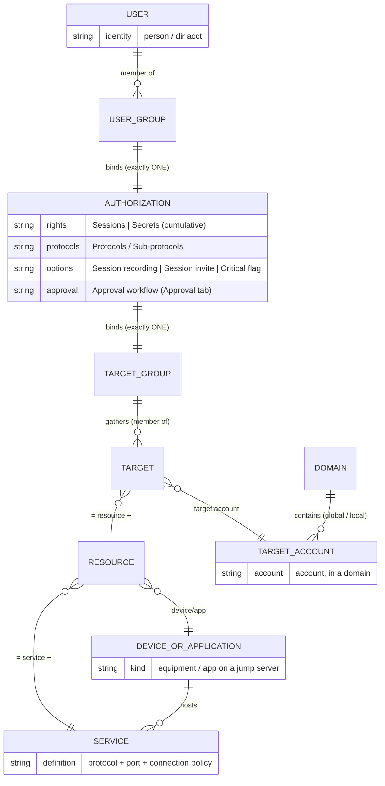
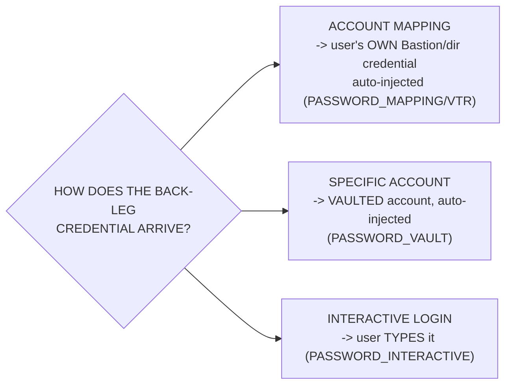
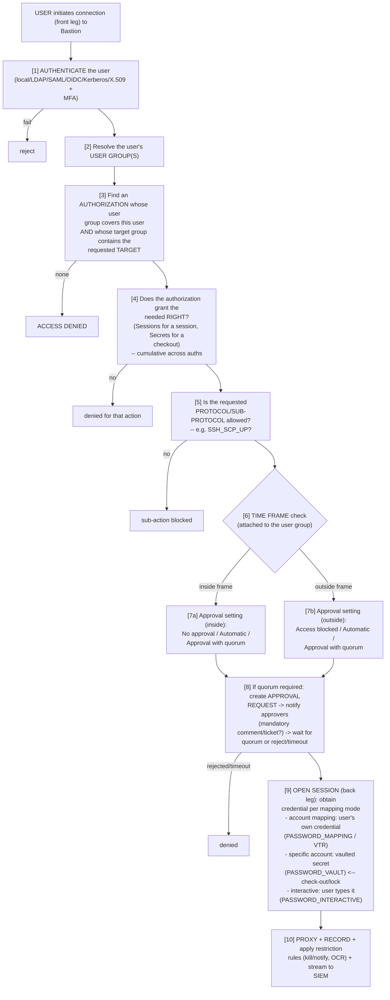

# WALLIX Bastion Data Model — The ACL Engine, Step by Step

WALLIX Bastion decides *who can reach what, when, and how* with an **Access Control List (ACL)** engine. The whole product configuration is, fundamentally, the act of populating a small set of objects and then drawing **one binding object — the authorization — between a group of users and a group of targets.** This file dissects every object, then walks a **complete worked example** and the **runtime evaluation flow** an administrator must understand for the WCP-P / WCE-P exams.

For where these objects physically live (services, database) see [./bastion-architecture.md](bastion-architecture.md); for what happens *inside* a session see [./session-management.md](session-management.md); for the vault see [./secrets-and-password-management.md](secrets-and-password-management.md). High-level summary lives in the [product portfolio](../overview/product-portfolio.md#core-pam-concepts--the-acl-data-model). Acronyms: [../reference/acronyms.md](../../reference/acronyms.md).

> **Served document version:** WALLIX Bastion **12.3.2** *Functional Administration Guide*. All quoted terminology and rules are from that guide.

---

## Key points

- The engine is built on **ACLs**; the objects are **Users, User groups, Devices, Target accounts, Target groups, Applications** — plus **Services**, **Resources**, **Domains**, **Targets**, and **Authorizations**.
- **A target account = device + service + account** (or **application + account**). **An account always belongs to a domain.**
- **A target group** gathers targets; **a user group** gathers users.
- **An authorization binds exactly ONE user group to ONE target group.** You *cannot* create two authorizations with the same user-group/target-group pair.
- An authorization carries two **cumulative** rights: **Sessions** (open sessions) and **Secrets** (retrieve/view credentials), plus protocols/sub-protocols, recording, session-invite, a critical-targets flag, and an approval workflow.
- **Permission profiles** are a *separate* axis: they govern *administrative* rights to the GUI/features (None / View / Modify), not access to targets. Highest right wins on conflict.
- Three **secondary-connection (user-mapping) modes** decide how the back-leg credential is obtained: **account mapping**, **specific/session account (vault)**, and **interactive login**.

---

## 1. The object catalogue

The 12.3.2 guide defines the ACL objects as follows (paraphrased from §5.3 and the per-object chapters):

| Object | Definition (12.3.2) | Notes |
|---|---|---|
| **User** | A physical user of the Bastion, from an internal or external directory. | Local, LDAP/AD, SAML, OIDC, Kerberos, or X.509. |
| **User group** | "A set of users." | The *only* thing an authorization binds on the user side. Time frames and restrictions attach here. |
| **Device** | "Physical or virtual equipment for which WALLIX Bastion manages the access to sessions or passwords." | Addressed by name, IP/FQDN, or CIDR subnet. |
| **Service** | Protocol + port + connection policy declared **on a device**. | E.g. `SSH:22` with the `SSH` connection policy. |
| **Application** | Any application/service running on a device or set of devices (via a Windows **jump server**). | Lets you grant a single app without a full desktop. |
| **Resource** | **Service + (device or application).** | The "where you connect" half of a target. |
| **Account (target account)** | "Entity managed by WALLIX Bastion or by an external secrets vault allowing a user to be authenticated to a system … **An account belongs to a domain.**" | The "as whom you connect" half. |
| **Domain** | A management entity grouping accounts — **global** (across devices) or **local** (single device). | Drives synchronized password change. |
| **Target** | **Resource + target account.** | What an authorization ultimately reaches. |
| **Target group** | "Gathering of different systems or servers (targets) with similar characteristics … every target from a group is handled according to the same authorizations." | The *only* thing an authorization binds on the target side. |
| **Authorization** | "Object in the Bastion configured by administrators to give users rights to access sessions on targets and their secrets." | One user group ↔ one target group. |

### Target account types

A target account is "the association of **a device, a service and an account**." There are **three types**:

- **Global account** — defined on a **global domain**; usable across the devices in that domain; can also manage **service accounts**.
- **Device account** — defined on a **device**; usable only for a service on *that* device.
- **Application account** — defined for an **application**; may also need a jump-server account to reach the host.

Plus a special use: **Scenario accounts** (used by an SSH **startup scenario** to auto-`su`/`sudo` at session start — see [session-management](session-management.md)). *Note: scenario accounts cannot be used with authorizations that carry an approval workflow.*

---

## 2. Entity-relationship diagram



**Relationship chain (memorise this):**
`users → user groups → (AUTHORIZATION) → target groups → targets (= resource + account)`.

---

## 3. The authorization object in detail

> §13: *"Authorization is a key object in the Bastion as it allows WALLIX Bastion administrators to give a **user group** access rights to a **target group**."*

Two main rights, **cumulative, without restriction**:

- **Sessions** — "enables users to access sessions on targets."
- **Secrets** — "enables users to access secrets related to targets" (i.e. check out / view credentials).

The **authorization mode** is therefore one of: *Sessions*, *Secrets*, or *Sessions and secrets*.

**The cardinal rule (exam favourite):**

> "**One authorization can link only one user group to one target group.** It is not possible to create multiple authorizations with the same user group/target group pair."

So access is the *set union* of all authorizations a user inherits through group membership — but you can never have two competing authorizations for the *same* pair; refine the single one instead.

**Other settings carried on the authorization:**

| Setting | What it does |
|---|---|
| **Protocols / Sub-protocols** | Which protocol actions are allowed (see the sub-protocol matrix in [session-management](session-management.md#1-protocols-and-sub-protocols)). For SSH e.g. `SSH_SHELL_SESSION`, `SSH_SCP_UP/DOWN`, `SFTP_SESSION`; for RDP e.g. `RDP_CLIPBOARD_UP/DOWN`, `RDP_DRIVE`, `RDP_PRINTER`. |
| **Session recording** | Enables recording (type depends on protocol). |
| **Session invite** | Lets a host invite an external **guest** into a live **RDP/VNC** session — *View only* or *View and control* (requires Access Manager 5+; not on SaaS; not for SSH/applications). |
| **Critical targets** | Flags targets as critical (notifications fire only if the dedicated alert is also enabled). |
| **Approval workflow** (Approval tab) | Optional quorum-based approval; see §6 below and [session-management](session-management.md#6-approval-workflows). |

> When editing an existing authorization you **cannot change the User group or Target group** — those are fixed at creation; delete and recreate to re-pair.

---

## 4. Domains — global vs. local

> §11.3: "There are two types of domains: global and local."

| | **Global domain** | **Local domain** |
|---|---|---|
| Scope | Accounts that authenticate **across multiple devices**. | Accounts that authenticate **on a single device only**. |
| Created | Explicitly (`Targets > Domains > Add a global domain`). | Implicitly, via association with a device or a target account. |
| Vault type | **Local** (Bastion vault) **or External** (external-vault plugin). | Local. |
| Password change | Synchronized across all accounts in the domain; needs a **password change policy + plugin**. | Synchronized across the device's accounts. |
| External vault | Yes — a global domain "groups accounts which are managed externally through the association of an **external vault plugin**." Password change cannot then be applied by the Bastion. | No. |

A global domain can also be tied to an **SSH Certificate Authority (CA)** so the Bastion signs SSH public keys for its accounts. **External-vault accounts are always mapped through global domains**, which act as containers ([secrets file](secrets-and-password-management.md#5-external-vaults)).

---

## 5. User mapping / secondary-connection modes

A target group's tab determines **how the back-leg (secondary) credential is obtained**. The 12.3.2 glossary names the three modes precisely:

| Mode | Glossary definition | Connection-policy requirement |
|---|---|---|
| **Account mapping** ("Connection with account mapping") | "The user connects to the target with **their WALLIX Bastion account**. Credentials are **injected automatically** when the session starts." | **`PASSWORD_MAPPING`** must be enabled. For non-password primary auth (Kerberos/OIDC/SAML/X.509/SSH-key), configure **Vault Transformation Rules (VTR)** *or* use `PUBKEY_AGENT_FORWARDING` / `KERBEROS_FORWARDING` / `PASSWORD_INTERACTIVE`. |
| **Specific / session account** ("Connection with a specific account") | "The user connects to the target with a **specific account saved in the WALLIX Bastion database** … Credentials are **injected automatically** when the session starts." | **`PASSWORD_VAULT`** — secret comes from the Bastion vault (or external vault). |
| **Interactive login** | The user **manually types** the target credentials on the target. | **`PASSWORD_INTERACTIVE`** must be enabled; no injection. |



> A **Vault Transformation Rule (VTR)** is "a rule based on a character string … to retrieve the credentials of an existing account in the WALLIX Bastion vault for a target account configured for account mapping" — the bridge that lets non-password primary auth still pull a vaulted secret for the back leg.

---

## 6. Permission profiles (a *separate* axis)

**Permission profiles** are **not** about reaching targets — they govern *administrative* rights to GUI features. §6.1: "A profile specifies the authorizations for the main features of the web interface … Profiles can be assigned to individual users, user groups, or **API keys**."

- Each feature gets a level: **None / View / Modify** (and **Execute** for a few, e.g. *Credential recovery* used by Break-Glass).
- **Conflict rule:** "If a user has conflicting profiles, they always receive the **highest level of authorization for each feature**." (Per-feature max, not whole-profile.)
- **Default profiles** are preconfigured and **cannot be modified or deleted** (e.g. `product_administrator`, auditor-style profiles) to preserve separation of duties; you create **custom** profiles for finer needs.

**Two orthogonal questions to keep straight for the exam:**

| Question | Answered by |
|---|---|
| *Can this person reach target X and pull its secret?* | **Authorization** (user group ↔ target group; Sessions/Secrets rights). |
| *Can this person create users, edit authorizations, view audit, manage approvals?* | **Permission profile**. |

(Approving requests, for instance, needs **Modify on "Manage Approvals"** in the profile *and* membership in a group selected as approver — both axes at once.)

---

## 7. Step-by-step worked example

**Scenario:** the Linux team must SSH into the production database servers as `root` via the vault, with full keystroke recording and dual approval after hours.

```
 STEP 1  Create the USER GROUP
   Users > Groups > Add  ->  "grp-linux-admins"
   add members: alice, bob (LDAP users)

 STEP 2  Declare the DEVICES + SERVICES
   Devices > Add  ->  "dbprod01" (10.20.0.11)
       Service: SSH / port 22 / connection policy = SSH-sogisces_1.3_2030
   Devices > Add  ->  "dbprod02" (10.20.0.12)  (same SSH service)

 STEP 3  Create a DOMAIN + ACCOUNT (the "as whom")
   Targets > Domains > Add a global domain  ->  "dom-linux-prod" (Vault type: Local)
       enable password change: policy=default, plugin=Unix
   Targets > Accounts > Global accounts > Add
       domain=dom-linux-prod, account name="root"  (secret stored in vault)
   => TARGET ACCOUNT root@dom-linux-prod is born (account + service + device)

 STEP 4  Build the TARGETS into a TARGET GROUP
   Targets > Groups > Add  ->  "tg-db-prod"
       tab "Account" (= specific/vault account, PASSWORD_VAULT):
         add  root@dbprod01:SSH   and   root@dbprod02:SSH
   => TARGETS = (resource dbprod01:SSH + root) and (dbprod02:SSH + root)

 STEP 5  Bind with ONE AUTHORIZATION
   Authorizations > Manage authorizations > Add  ->  "auth-linux-dbprod"
       User group   = grp-linux-admins
       Target group = tg-db-prod
       Mode         = Sessions and secrets
       Protocols    = SSH_SHELL_SESSION (+ SFTP_SESSION if file transfer needed)
       Session recording = ON
       Critical targets  = ON

 STEP 6  Add the APPROVAL workflow (Approval tab of auth-linux-dbprod)
       inside time frame  : No approval required
       outside time frame : Approval with quorum = 2
       Approvers          = "grp-security"
       Comment = Mandatory, Ticket = Mandatory, Single connection = ON
```

**Result:** Alice (in `grp-linux-admins`) can SSH through the Bastion to `dbprod01`/`dbprod02` as `root`; the Bastion injects the vaulted `root` secret on the back leg (she never sees it); the session is recorded; and after hours she needs **2 approvers** from `grp-security`, a comment, and a ticket before the session opens.

---

## 8. Runtime evaluation flow — "how an authorization is evaluated when a user connects"



**Notes that trip people up:**
- An *accepted* approval that **starts inside** the allowed time frame may **continue into blocked hours** — only the **start** time is checked against the time frame ("approval is more important than time frame").
- Rights are **cumulative** across all of a user's authorizations and permission profiles (highest wins on profiles), but a single user-group/target-group pair can only ever be one authorization.

---

## Acronyms

| Acronym | Expansion |
|---|---|
| ACL | Access Control List |
| PAM | Privileged Access Management |
| LDAP / AD | Lightweight Directory Access Protocol / Active Directory |
| SAML | Security Assertion Markup Language |
| OIDC | OpenID Connect |
| MFA | Multi-Factor Authentication |
| VTR | Vault Transformation Rule |
| CA | Certificate Authority |
| SSH / SCP / SFTP | Secure Shell / Secure Copy / SSH File Transfer Protocol |
| RDP | Remote Desktop Protocol |
| FQDN | Fully Qualified Domain Name |
| CIDR | Classless Inter-Domain Routing |
| API | Application Programming Interface |
| SoD | Segregation of Duties |

Full list: [../reference/acronyms.md](../../reference/acronyms.md).

---

## Sources

- WALLIX Bastion **12.3.2** *Functional Administration Guide*: §5.3 (WALLIX Bastion ACLs), §6.1 (Permission profiles), §6.2 (User groups), §9 (Devices/Services), §10 (Applications), §11 (Targets: accounts, groups, domains, checkout/connection policies), §13 (Authorizations + parameters + approval workflow), §18.1 (Glossary — Account, Account mapping, Authorization, Connection with account mapping/specific account, Domain, Target account, Target application, Target group, User group, Vault transformation rule). https://pam.wallix.one/documentation/admin-doc/bastion_en_administration_guide.pdf
- Cross-reference: [../docs/00-overview/product-portfolio.md](../overview/product-portfolio.md#core-pam-concepts--the-acl-data-model).

> **Flagged uncertainties:** the worked example uses illustrative names/IPs (not from a WALLIX sample). The set of *default* permission-profile names beyond `product_administrator` is not fully enumerated in the served chapters reviewed — *not specified in sources* for an exhaustive list.
