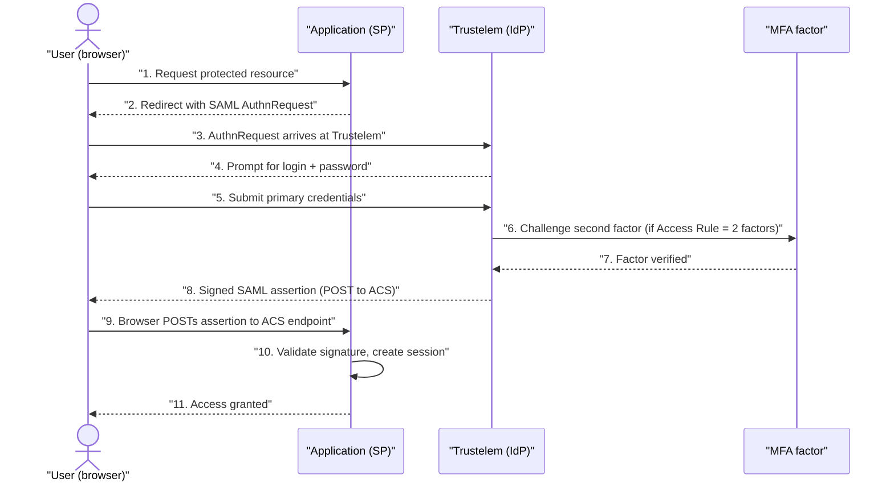
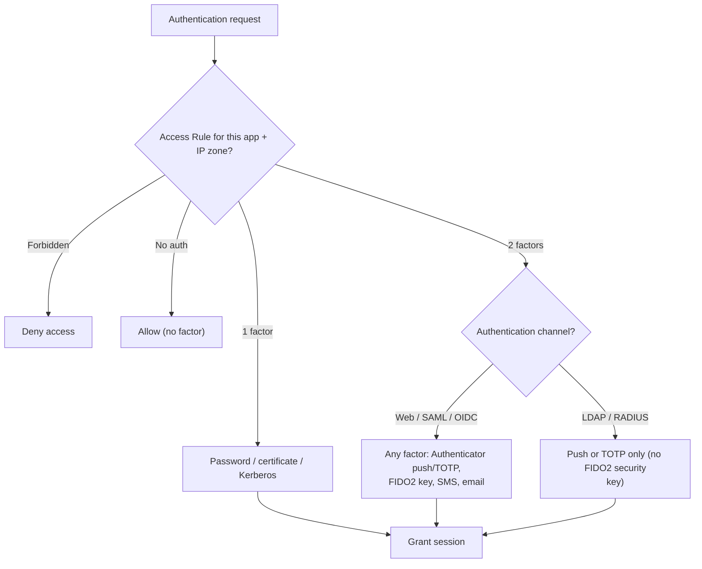
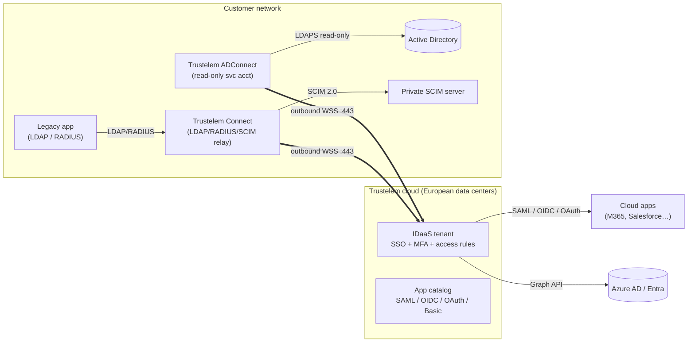
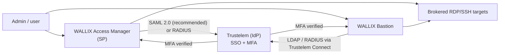

# WALLIX One IDaaS / Trustelem — Technical Deep Dive

**WALLIX One IDaaS** (historically branded **Trustelem**) is WALLIX's European
**Identity-as-a-Service (IDaaS)** platform: cloud **Single Sign-On (SSO)**,
**Multi-Factor Authentication (MFA)**, and **identity federation** for the workforce. It
answers a different question than the Bastion: not *"how do I broker a privileged session
to a server?"* but *"how does a person prove who they are once, and reach all their
applications safely?"* It is the IDaaS pillar of the **WALLIX One** SaaS platform, and it
plugs MFA/SSO into the rest of the WALLIX stack (Bastion, Access Manager).

This page is the technical companion to the
[eWCP-I — WALLIX Certified Professional – IDaaS](../idaas/ewcp-i-professional.md)
certification. For the product-level summary and its sourcing, start at the
[product portfolio — Trustelem section](../overview/product-portfolio.md#3-wallix-trustelem--idaas-sso--mfa--identity-federation).

**Acronyms (first use):** IDaaS = Identity-as-a-Service · SSO = Single Sign-On · MFA =
Multi-Factor Authentication · 2FA = Two-Factor Authentication · SAML = Security Assertion
Markup Language · OIDC = OpenID Connect · OAuth = Open Authorization · IdP = Identity
Provider · SP = Service Provider · ACS = Assertion Consumer Service · TOTP = Time-based
One-Time Password · OTP = One-Time Password · FIDO2 = Fast IDentity Online 2 · WebAuthn =
Web Authentication · LDAP = Lightweight Directory Access Protocol · LDAPS = LDAP over TLS
· RADIUS = Remote Authentication Dial-In User Service · PAP = Password Authentication
Protocol · SCIM = System for Cross-domain Identity Management · AD = Active Directory ·
IWA = Integrated Windows Authentication · SSPR = Self-Service Password Reset · WAM =
WALLIX Access Manager · PAM = Privileged Access Management · TLS = Transport Layer
Security · CRL = Certificate Revocation List · OCSP = Online Certificate Status Protocol.
Full list: [../reference/acronyms.md](../../reference/acronyms.md).

## Learning objectives

By the end of this file you should be able to:

- Explain what **IDaaS** is and how SSO + MFA + federation reduce password risk.
- Walk through an **SP-initiated SAML 2.0 SSO** flow end to end.
- Compare **SAML 2.0**, **OIDC**, and **OAuth 2.0** and know which one Trustelem uses for what.
- Enumerate the **MFA factors** Trustelem supports and which factors **cannot** work over LDAP/RADIUS.
- Describe **non-federated** authentication via **LDAP** and **RADIUS** (Trustelem Connect).
- Explain **SCIM 2.0** outbound provisioning and the grant/revoke lifecycle.
- Distinguish the two on-prem connectors — **ADConnect** and **Trustelem Connect** — and their outbound-443 model.
- Configure **Access Rules** (adaptive, IP-zone-based) and understand rule precedence.
- Explain **Self-Service Password Reset (SSPR)** and the directory sources it covers.
- Describe how Trustelem integrates with **WALLIX Access Manager** and **WALLIX Bastion**.

---

## 1. What IDaaS is, and the problem it solves

A sysadmin already knows the pain: every application has its own password, users reuse
weak ones, leavers keep access, and IT drowns in reset tickets. **IDaaS** centralizes the
*identity* — the user authenticates **once** to the IDaaS, and the IDaaS then *vouches*
for that user to each downstream application using a standard trust protocol. The
application never sees the password; it sees a signed assertion or token from a provider
it trusts.

Three capabilities sit on top of that central identity:

- **SSO** — one authentication unlocks many applications (the IDaaS is the **Identity
  Provider, IdP**; each app is a **Service Provider, SP** or **Relying Party**).
- **MFA** — the IDaaS enforces a second factor at the *single* point of authentication,
  so every federated app inherits strong auth without changing the app.
- **Federation / provisioning** — the IDaaS syncs *who exists* from your directory
  (inbound) and pushes accounts *into* downstream apps (outbound, via SCIM).

WALLIX positions this within a **Zero Trust** framework: never trust, always verify,
and verify *contextually* (see [Access Rules](#7-access-rules--adaptive-ip-zone-access)).

> **Verify on source:** WALLIX states the IDaaS is **hosted in European data centers**
> ("European privacy standards" / GDPR positioning). The exact data-center locations and
> the size of the pre-integrated application catalog (sources gave conflicting "80+" vs
> "1000+" figures) are **not pinned down in the docs reviewed** — verify on
> <https://www.wallix.com/products/idaas/>.

---

## 2. Federation protocols — SAML 2.0, OIDC, OAuth 2.0

Trustelem federates SSO over three standards. They overlap but solve different problems —
a frequent exam trap is conflating **authentication** (proving identity) with
**authorization** (granting API access).

| Standard | Era / format | Primarily for | What it carries |
|---|---|---|---|
| **SAML 2.0** | XML, 2005 | Enterprise web SSO | XML **assertion** (signed), user attributes |
| **OpenID Connect (OIDC)** | JSON/JWT, on top of OAuth 2.0 | Modern web/mobile **authentication** | **ID token** (JWT) identifying the user |
| **OAuth 2.0** | JSON, 2012 | **Authorization** (API access delegation) | **Access token** granting scoped resource access |

Key distinctions to memorize:

- **SAML 2.0** and **OIDC** are about *logging a user in*. **OAuth 2.0 by itself is about
  delegating access to resources** (an app acting on your behalf), not about logging you
  in — OIDC is the identity layer added on top of OAuth to fix that.
- In Trustelem terms, you configure an application as a **SAML 2.0**, **OpenID Connect**,
  **OAuth 2.0**, or **"Basic / no SSO"** (LDAP/RADIUS) integration — either from the
  pre-integrated catalog or via a **generic model** for each protocol.
- For cross-protocol fundamentals (TLS handshake, token signing, certificates) see
  [Cryptography & PKI](../../prerequisites/cryptography-and-pki.md); for the wire-level
  SAML/OIDC/RADIUS flows see
  [Networking & protocols](../../prerequisites/networking-and-protocols.md).

### SAML 2.0 SSO flow (SP-initiated)

The most common enterprise pattern: a user hits the application first, the app bounces
them to Trustelem, Trustelem authenticates (and MFAs) them, then returns a signed
assertion the app consumes at its **ACS (Assertion Consumer Service)** endpoint.

Trustelem also supports **IdP-initiated** SSO (the user starts from the Trustelem app
portal and clicks an app tile), and **OIDC** uses the analogous **Authorization Code
Flow** (authorization request to Trustelem → user authenticates → authorization code
returned → app exchanges the code for an ID token + access token at the token endpoint).

---

## 3. MFA factors

Trustelem enforces a **second factor** at the point of authentication. The documentation
distinguishes **MFA** (any two factors) from **strong authentication**: *"A strong
authentication is the combination of 2 different kinds of factors."* So password + email
OTP is technically two factors but does **not** count as strong (both are "something you
know"-ish / weak); password + authenticator app does.

Five second factors are supported (verify on the
[Trustelem MFA doc](https://trustelem-doc.wallix.com/books/trustelem-administration/page/multi-factors-authentication)):

| Factor | What it is | Notes |
|---|---|---|
| **WALLIX Authenticator** | Proprietary mobile (iOS/Android) + desktop (Windows) app | **Push** when online; **TOTP** fallback offline. MFA tech is *powered by inWebo* (partnership, not an acquisition). |
| **TOTP Authenticator** | Time-based one-time code | Works with Google / Microsoft Authenticator and NFC devices. |
| **Security Key** | **FIDO2 / WebAuthn** hardware key (e.g., YubiKey) | Phishing-resistant; **cannot be used over LDAP or RADIUS** (see below). |
| **SMS OTP** | Code by SMS | **Disabled by default**; additional cost. |
| **Email OTP** | Code by email | **Disabled by default**; explicitly **"not strong authentication."** |

**Primary authentication methods** (the first factor) include password (stored in
AD/LDAP or Trustelem-local), **Integrated Windows Authentication (IWA)**, and **X.509
certificate** auth.

### Which factors work over which protocol

This is the single most testable nuance. **Security keys (FIDO2/WebAuthn) cannot be used
over LDAP or RADIUS** — *"the protocol can't read USB device."* Push and TOTP do work over
LDAP/RADIUS, though push over LDAP may require extended timeouts. Over **Web / SAML /
OIDC**, all factors are supported and the user can pick an alternative at login.

---

## 4. Non-federated authentication — LDAP & RADIUS

Plenty of legacy or appliance-style applications cannot speak SAML or OIDC. They *can*
usually authenticate against an **LDAP** directory or a **RADIUS** server. Trustelem
covers these via the **Trustelem Connect** connector (see
[§6](#6-connectors--architecture)), which exposes **local LDAP and RADIUS endpoints** that
relay to the Trustelem cloud. This gives such apps **MFA but not true SSO** (each app
still authenticates separately).

- **LDAP / LDAPS** — Trustelem Connect runs a local LDAP-like server (it emulates AD
  naming, e.g. `CN=my_user,DC=my_trustelem_domain,DC=trustelem,DC=com`). The app does a
  search + bind against the connector's IP/FQDN and a configured TCP port (the docs cite
  **2001** as a typical example) using a configured DN/account/password.
- **RADIUS** — the connector listens on **UDP 1812** and uses **PAP**; the app is given a
  **shared secret**. A common pattern is **"2nd factor only"** — the app already validated
  the password, and Trustelem only checks the second factor.

The RADIUS **Access Rule** options differ from web/LDAP because RADIUS has no IP-zone
data: *no rule* (blocked), *Always allow* (accept known logins without verification),
*2nd factor only*, *2 factors* (full MFA), or *Forbidden*. The LDAP options are *no rule*,
*1 factor*, *2 factors* (push/TOTP), or *Forbidden*.

> **Why no inbound firewall hole?** Even though Trustelem Connect *listens* locally for
> the app, its link **to the cloud is an outbound WebSocket on 443** — apps reach the
> connector on your LAN, and the connector reaches Trustelem outbound. No inbound port is
> opened to the Internet.

---

## 5. SCIM 2.0 provisioning

SSO gets a user *into* an app at login time; **SCIM (System for Cross-domain Identity
Management) 2.0** keeps the app's **account list** in sync — provision on grant,
deprovision on revoke. Trustelem acts as a **SCIM client** that pushes to applications
exposing a **SCIM 2.0 server**.

- **On grant** — when a user gets a SCIM access rule for an app, Trustelem *"creates (or
  updates) the user on the SCIM server."*
- **On revoke** — when access is lost, Trustelem *"deletes (or deactivates) the user on
  the SCIM server."*
- **Schedule** — automatic push **every 5 minutes**; admins can **Force SCIM Sync** for
  immediate provisioning.
- **Routing** — outbound SCIM is **relayed through Trustelem Connect** (it *"never dials
  the remote directly"*), so it can reach SCIM servers that live on a **private network**.

This closes the Joiner-Mover-Leaver loop on the *application* side that
[WALLIX IAG](iag-identity-governance.md) governs on the *entitlement* side — a useful
mental link between the two products.

---

## 6. Connectors & architecture

Trustelem is **SaaS** (per-customer tenant at `https://<tenant>.trustelem.com`, web admin
console). Only two **lightweight on-prem connectors** are ever installed, and both follow
the same **outbound-only WebSocket on port 443** model — there is **no inbound firewall
opening**.

| Connector | Job | Talks to | Key facts |
|---|---|---|---|
| **Trustelem ADConnect** | Sync + authenticate **Active Directory** users | AD over LDAP(S) with a **read-only service account**; cloud via WebSocket to **admin.trustelem.com:443** | Syncs users/groups by **`memberOf`**; **stores no AD passwords**; recommended **≥2 VMs for failover**; connector updates cause **no service interruption** (parallel install + priority). |
| **Trustelem Connect** | Local **LDAP / RADIUS** server + **SCIM** forwarder | Apps on the LAN (LDAP/RADIUS); cloud via WebSocket to Trustelem services on **443** | Exposes local TCP/UDP listeners; relays LDAP/RADIUS auth and SCIM provisioning to the cloud. |

### Directory / identity sources

- **Active Directory** — via **ADConnect** (above). Login maps to **sAMAccountName**,
  **userPrincipalName**, or **mail**; attributes such as `title`, `memberOf`, `objectGUID`
  can be imported.
- **Azure AD / Entra ID** — via **Microsoft Graph API**. *Limitation:* when Azure
  delegates auth to an external IdP or uses federated domains, **Azure password auth is
  unavailable**.
- **Google Workspace**, generic **LDAP** directories, and **Trustelem local users**.

---

## 7. Access Rules — adaptive (IP-zone) access

**Access Rules** are Trustelem's adaptive-authentication engine. For each application you
choose how strongly a user must authenticate, and you can make that **differ by network
location** (internal vs external IP zone).

- **Web (SAML / OIDC / no-SSO) options:** *no rule*, *Default* (from Security settings),
  *1 factor* (login+password OR certificate OR Kerberos), *2 factors*, *Forbidden*.
- **Internal vs external zones:** *"Internal IPs are usually the public IPs of the company
  offices."* If a user's public IP matches the configured internal IPs, the **internal**
  rule applies; otherwise the **external** rule applies. (LDAP and RADIUS have **no
  IP-zone data**, so they have no internal/external split.)
- **Scope:** a rule can target a **user**, a **group**, or **everyone**. WALLIX best
  practice: *"If possible, an access rule should always apply to a group."*

**Precedence — two combined rules:** (1) **user-specific overrides group, which overrides
everyone**; and (2) **most restrictive wins**. The documented hierarchy is:

> Access forbidden (user) > 2 factors (user) > 1 factor (user) > Access forbidden (group)
> > 2 factors (group) > 1 factor (group).

> **Scope flag:** "adaptive" in Trustelem is primarily **network/IP-context** based.
> Geolocation, device-posture, and time-of-day conditions were **not found** in the docs
> reviewed — do not assume them. Verify on the
> [Access Rules doc](https://trustelem-doc.wallix.com/books/trustelem-administration/page/access-rules).

---

## 8. Self-Service Password Reset (SSPR)

**SSPR** lets users reset a forgotten password themselves after proving identity with
configured verification factors — cutting helpdesk load. Trustelem SSPR covers:

- **Trustelem-local** users,
- **Active Directory** users (the reset is pushed back through **ADConnect**), and
- **Azure AD** users (non-federated).

Admins configure which verification factors are required before a reset is allowed.

---

## 9. Integration with Bastion & Access Manager

Trustelem is the **MFA/SSO front door** for the WALLIX PAM stack:

- **WALLIX Access Manager (WAM)** — federates to Trustelem over **SAML 2.0**
  (recommended) or **RADIUS**. WAM is the **SP**; Trustelem is the **IdP**. This is how
  the HTML5 web access gateway gets MFA. Note: **FIDO2 / push / OTP are not native to
  WAM** — they arrive *through* the federated IdP (Trustelem) over SAML/OIDC. See
  [Authentication & Access Manager](authentication-and-access-manager.md).
- **WALLIX Bastion** — integrates via **LDAP / RADIUS** (using Trustelem Connect's local
  endpoints), giving the Bastion MFA on its primary connection.
- **WALLIX One** — Trustelem is bundled as the **IDaaS** service alongside PAM and Remote
  Access, managed from the WALLIX One Console; MFA is natively integrated with WALLIX PAM.

---

## 10. Exam-relevant cheat sheet

- **Three federation standards:** SAML 2.0 (XML assertion), OIDC (JWT ID token,
  Authorization Code Flow), OAuth 2.0 (access token, *authorization* not authentication).
- **Five MFA factors:** WALLIX Authenticator (push/TOTP), TOTP, **FIDO2/WebAuthn security
  key**, SMS OTP (off by default), email OTP (off by default, not "strong").
- **FIDO2 keys do NOT work over LDAP/RADIUS.** Push/TOTP do.
- **Strong auth = two *different kinds* of factors** (password + email OTP is not strong).
- **Two connectors, both outbound 443 WebSocket:** **ADConnect** (AD sync/auth, stores no
  AD passwords, read-only service account, ≥2 VMs for failover) and **Trustelem Connect**
  (local LDAP/RADIUS + SCIM relay).
- **SCIM 2.0:** Trustelem is a **SCIM client**; create/update on grant, deactivate/delete
  on revoke; **5-minute** push; relayed via Trustelem Connect (never dials the remote
  directly).
- **Access Rules:** internal vs external **IP zone**; precedence = **user > group >
  everyone** AND **most restrictive wins**.
- **SSPR** covers Trustelem-local, AD (via ADConnect), and Azure AD.
- **RADIUS** = **UDP 1812**, **PAP**, often **"2nd factor only."**
- **Bastion** integrates over **LDAP/RADIUS**; **Access Manager** over **SAML 2.0**
  (recommended) or RADIUS.

---

## Sources

- WALLIX IDaaS product page: <https://www.wallix.com/products/idaas/>
- WALLIX MFA product page: <https://www.wallix.com/products/multi-factor-authentication-mfa/>
- Trustelem administration — MFA: <https://trustelem-doc.wallix.com/books/trustelem-administration/page/multi-factors-authentication>
- Trustelem administration — AD users / ADConnect: <https://trustelem-doc.wallix.com/books/trustelem-administration/page/active-directory-users-trustelem-adconnect>
- Trustelem administration — Azure AD users: <https://trustelem-doc.wallix.com/books/trustelem-administration/page/azure-ad-users>
- Trustelem administration — LDAP/RADIUS / Trustelem Connect: <https://trustelem-doc.wallix.com/books/trustelem-administration/page/ldap-radius-trustelem-connect>
- Trustelem administration — SCIM client: <https://trustelem-doc.wallix.com/books/trustelem-administration/page/scim-client>
- Trustelem administration — Access Rules: <https://trustelem-doc.wallix.com/books/trustelem-administration/page/access-rules>
- Trustelem administration — Self-Service Password Reset: <https://trustelem-doc.wallix.com/books/trustelem-administration/page/self-service-password-reset>
- Trustelem applications — WALLIX Access Manager: <https://trustelem-doc.wallix.com/books/trustelem-applications/page/wallix-access-manager>
- Trustelem — WALLIX Authenticator: <https://trustelem-doc.wallix.com/books/wallix-authenticator/page/presentation>
- Repo: [product portfolio](../overview/product-portfolio.md) · [eWCP-I cert](../idaas/ewcp-i-professional.md) · [Networking & protocols](../../prerequisites/networking-and-protocols.md) · [Cryptography & PKI](../../prerequisites/cryptography-and-pki.md)
