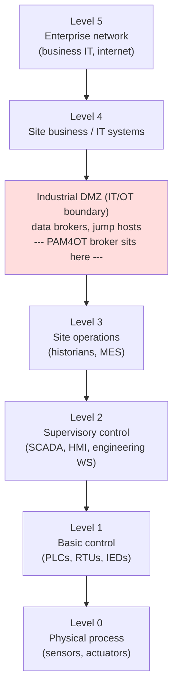
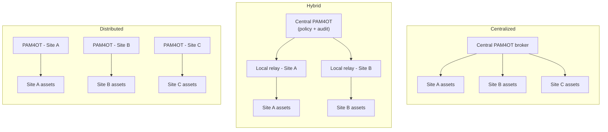

# WALLIX PAM4OT — Privileged Access Management for Operational Technology (OT)

**PAM4OT** is WALLIX's **Privileged Access Management (PAM)** offering packaged for
**Operational Technology (OT)** — the hardware and software that monitors and controls
physical industrial processes (factory lines, power grids, water treatment, building
systems). It is **not a separately-engineered product**: WALLIX's own launch material
describes it as a **dedicated package built on WALLIX PAM (the Bastion product line)**,
delivered under the **"OT.security by WALLIX"** brand. This deep dive explains what PAM4OT
is, why OT changes the rules, how the Bastion engine is applied to industrial assets, the
three reference architectures, and how it maps to **ISA/IEC 62443**, **NIS2**, and the
**eWCP-P-OT** exam.

> This page supports the [eWCP-P-OT certification](../ot-pam4ot/ewcp-p-ot-professional.md)
> and builds on the Bastion fundamentals in the
> [product portfolio — PAM4OT section](../overview/product-portfolio.md#6-wallix-pam4ot--operational-technology-ot-security)
> and the [session-management deep dive](session-management.md). For OT/ICS/Purdue
> background see the CEH [IoT & OT Hacking module](../../ceh/domains/18-iot-and-ot-hacking.md).
> Acronyms: [../reference/acronyms.md](../../reference/acronyms.md); compliance mappings:
> [../reference/compliance-and-standards.md](../../reference/compliance-and-standards.md).

## Learning objectives

- Explain what PAM4OT is (Bastion packaged for OT) and why a dedicated OT package exists.
- Describe why OT security differs from IT — the **safety → availability → integrity →
  confidentiality** priority inversion, legacy gear, and the no-agents-on-PLCs constraint.
- Know the OT vocabulary (ICS, SCADA, DCS, PLC, RTU, IED, HMI, historian) and the main
  industrial protocols (Modbus, DNP3, OPC UA, PROFINET, S7, EtherNet/IP).
- Place PAM4OT in the **Purdue model** at the IT/OT boundary (and keep the "Level 3.5 is
  industry framing" caveat).
- Explain how the Bastion engine brokers an OT session: agentless gateway, credential
  injection, protocol proxies, industrial-protocol encapsulation, recording + OCR, MFA,
  vault, Just-in-Time access, and clientless HTML5 via Access Manager.
- Compare the three architectures (Centralized / Hybrid / Distributed).
- Map PAM4OT to ISA/IEC 62443 Foundational Requirements, NIS2, NIST CSF + SP 800-82, and
  NERC CIP, and name the OT ecosystem partners.

---

## 1. What PAM4OT is, and why it exists

### The brand and the package

- **OT.security by WALLIX** is WALLIX's brand dedicated to industrial cybersecurity,
  **launched 6 October 2022**. Per the launch press release it encompasses three things:
  **dedicated technological offerings**, a **network of specialist partners**, and a
  **dedicated identity/website (www.OT.security)**.
- **PAM4OT** is the flagship offering of that brand — described by WALLIX as
  *"a unified set of state-of-the-art functionalities for securing access and identity in
  all industrial operations,"* providing *"global secure access management based on the
  principle of least privilege."*
- Crucially, the launch material calls PAM4OT *"a package specifically configured for
  industrial environments based on WALLIX PAM"* that *"protects, according to the principle
  of least privilege, all access, whether human or machine."* It is sold with a
  **simplified price list** bundling the functionalities an industrial site needs.

> **Product vs. packaging (preserve this caveat).** PAM4OT is **not** a separate engine.
> Sessions flow through **WALLIX Bastion** — the same Session Manager, Password Manager /
> Vault, Access Manager, and authentication stack documented for IT PAM. Treat PAM4OT as
> an **OT-specific packaging/positioning of Bastion** plus **WALLIX Remote Access**. This
> is why the [eWCP-P-OT cert](../ot-pam4ot/ewcp-p-ot-professional.md) requires
> **WCP-P** (PAM/Bastion) as a prerequisite — your Bastion fundamentals carry over.

### Why a dedicated OT package exists

WALLIX frames the problem bluntly: *"OT systems were not initially designed to be secure,"*
which makes them vulnerable to threats that can cause *"downtime, loss of production, health
and safety risks."* As factories digitize (Industry 4.0), OT assets that were once
air-gapped now need **remote maintenance, vendor access, and IT connectivity** — but the
gear and protocols underneath were built for **isolated, trusted networks**. PAM4OT exists
to insert a **controlled, monitored broker** between users (especially third-party
maintainers) and OT assets, enforcing least privilege and full traceability **without
disrupting production**.

WALLIX summarizes the OT value proposition as five pillars: **simplify operations,
guarantee availability, maintain productivity, eliminate risk, and address compliance.**

---

## 2. Why OT differs from IT

The single most important mental shift for the exam: **in OT, the classic CIA priority is
inverted.**

| Dimension | Classic IT | Operational Technology (OT) |
|---|---|---|
| **Priority order** | Confidentiality → Integrity → Availability | **Safety → Availability → Integrity → Confidentiality** |
| **Top concern** | Protect data / privacy | Keep the physical process running and people safe |
| **Patching** | Frequent; reboot at will | Rare; downtime is costly and a reboot can halt production or endanger people — long-lived equipment (often decades) |
| **Endpoints** | Can host agents (EDR, etc.) | **PLCs / RTUs / legacy HMIs cannot host agents** — agentless control is mandatory |
| **Protocols** | TLS, Kerberos, modern auth | Legacy industrial protocols (Modbus, DNP3, S7…) often **with no built-in authentication or encryption** — they trust whoever can reach them |
| **Network** | Segmented, identity-aware | Often **flat**, with shared/vendor accounts and weak audit |
| **Change tolerance** | Tolerant | Very low — "production continuity" governs every decision |

This inversion (sourced from the CEH [IoT & OT module](../../ceh/domains/18-iot-and-ot-hacking.md)
and NIST SP 800-82) is why PAM4OT emphasizes **agentless** operation, **no performance
impact on target equipment**, and **availability / 24×7** above IT-style policy. WALLIX's
OT positioning explicitly promises to protect *"increasingly exposed OT environments
without impacting customer industrial and business processes."*

---

## 3. The OT universe / vocabulary

Grounded in NIST SP 800-82 (Guide to OT Security), ISA/IEC 62443, and the CEH OT module.

### Systems and equipment

| Term | Expansion | What it is |
|---|---|---|
| **ICS** | Industrial Control System | Umbrella term for OT control systems (SCADA, DCS, PLCs and the rest) |
| **SCADA** | Supervisory Control and Data Acquisition | Software that **monitors/controls geographically distributed** processes (pipelines, grids, water networks) |
| **DCS** | Distributed Control System | Process-control system for a **single plant/site** (refineries, chemical, power generation); tightly-coupled control loops |
| **PLC** | Programmable Logic Controller | Rugged industrial computer that **directly controls machinery** (the workhorse of Level 1) |
| **RTU** | Remote Terminal Unit | Field device that **collects data and relays commands** over wide areas; SCADA's remote arms |
| **IED** | Intelligent Electronic Device | Microprocessor-based device in power systems (protective relays, meters) that senses and acts on the grid |
| **HMI** | Human-Machine Interface | The **operator's screen/dashboard** for an ICS — usually a Windows graphical app |
| **Engineering workstation** | — | Windows/Linux PC used to **program/configure PLCs and ICS** (e.g. PLC programming software); a high-value target |
| **Historian** | (Data Historian) | Time-series database that **records process data** for analysis, reporting, compliance |

### Industrial protocols

| Protocol | Domain | Note (security relevance) |
|---|---|---|
| **Modbus** | OT/ICS, general | Very old serial/TCP protocol; **no built-in authentication or encryption** — network access ≈ control |
| **DNP3** | Utilities (electric/water) | Distributed Network Protocol 3; security is an **add-on** (Secure Authentication), not the default |
| **OPC UA** | OT interoperability | **Modern** standard **with security features** (auth, encryption) — the secure-by-design exception |
| **PROFINET** | Factory automation (Siemens-led) | Industrial Ethernet for real-time control; designed for trusted networks |
| **S7 / S7comm** | Siemens PLCs | Proprietary protocol for SIMATIC S7 PLC communication |
| **EtherNet/IP** | Factory automation (ODVA) | CIP (Common Industrial Protocol) over standard Ethernet; widely used by Rockwell/Allen-Bradley |

> Recurring theme: most legacy industrial protocols **trust whoever can reach them**. They
> were designed for isolated networks, so simply having network access to a Modbus PLC can
> mean control over it. **Segmentation and brokered access are therefore the central
> defences** — which is exactly the gap PAM4OT fills at the IT/OT boundary.

---

## 4. The Purdue model and where PAM4OT sits

The **Purdue Enterprise Reference Architecture** divides an industrial network into
**levels**, separating physical process control from enterprise IT. It is the standard
mental model for OT segmentation and is reflected in **ISA/IEC 62443**'s zones-and-conduits
approach. PAM4OT's broker (the Bastion / jump host) belongs at the **IT/OT boundary** — the
**industrial DMZ (DeMilitarized Zone)** between operations (Levels 0–3) and enterprise IT
(Levels 4–5), where it can mediate every remote or cross-boundary privileged session.



> **Caveat to keep (industry-framing vs WALLIX-stated):** the explicit **"Level 3.5"**
> label for the industrial DMZ is **general OT-architecture framing** (Purdue / common
> practice), **not** a WALLIX-published label. WALLIX's own pages speak of the **"IT/OT
> boundary"** and **segmentation** rather than publishing a "Level 3.5" diagram. Use
> "industrial DMZ / IT-OT boundary" when citing WALLIX, and reserve "Level 3.5" as the
> widely-used industry shorthand.

The key idea: the industrial DMZ prevents an internet-borne compromise (Levels 4–5) from
reaching PLCs that control physical equipment (Levels 0–1). A PAM broker placed here means
**no direct connection** from a remote vendor to a PLC — every privileged session is
authenticated, brokered, recorded, and time-boxed.

---

## 5. Identity & access risks in OT (the "security stakes")

This section maps to **Module 1 — "security stakes of identity & access."** OT environments
accumulate identity risks precisely because the gear and networks predate modern identity
practice:

| Risk | Why it exists in OT | What PAM4OT does about it |
|---|---|---|
| **Shared / vendor accounts** | One login reused by many technicians and outside integrators; no per-person attribution | Brokers access under **named users** with credential injection — operators never see the target password, and every action is attributable |
| **Flat networks** | Historically air-gapped, so little internal segmentation; lateral movement is easy once inside | Forces traffic through a single **brokered gateway** at the IT/OT boundary; users see **only the systems they are permitted to access**, not the whole network |
| **Remote maintenance** | OEMs/integrators dial in for support; often via uncontrolled VPNs or vendor tools | Replaces *"risky direct connections with a controlled gateway"* — remote users authenticate to WALLIX, not to OT systems |
| **Weak / no MFA** | Legacy devices can't enforce strong auth themselves | **Multi-factor authentication at the gateway** before any access is granted (via WALLIX Authenticator / federated IdP) |
| **Little / no audit** | Devices keep no usable logs; no central record of "who did what" | **Session recording** (video-style playback, keystroke logging, command capture, OCR) gives a tamper-evident, attributable trail for compliance and incident response |
| **Standing privilege** | Always-on admin access lingers between maintenance windows | **Just-in-Time (JIT) / Zero Standing Privileges** — access granted for the right purpose and timeframe, then revoked when the work ends |

WALLIX states the goal as JIT and Zero Standing Privileges so that *"the right user has
access to the right resources, for the right purpose and for the right timeframe."*

---

## 6. How PAM4OT works (the Bastion engine applied to OT)

Because PAM4OT **is** Bastion, the mechanics are the Bastion mechanics — see
[session-management](session-management.md) and
[secrets-and-password-management](secrets-and-password-management.md) for the IT-side
depth. The OT-specific points:

### The broker / gateway model

- **Agentless on targets.** Nothing is installed on PLCs, RTUs, HMIs, or engineering
  workstations — the single most-emphasized OT differentiator, because that equipment
  cannot host agents and must not take a performance hit. WALLIX lists **"universal
  agentless access"** as a core OT use case.
- The broker sits at the IT/OT boundary. **Users connect to the WALLIX gateway — not
  directly to OT systems.** After authentication they *"see only the systems they're
  permitted to access — not the entire network."*

### Authentication, credential injection, and the vault

- **MFA** verifies identity *"before any access is granted."*
- **Credential injection:** *"Credentials are injected automatically — users never see or
  handle passwords for critical systems."* The **Password Manager / Vault** stores and
  rotates the target secrets; for OT this matters because shared device passwords are
  otherwise impossible to rotate safely.
- **Least privilege + JIT / PEDM:** time-limited, task-scoped access and elevation policies
  *"available for a defined set of tasks"*; *"when the work is done, the session ends
  cleanly."*

### Protocol proxies and industrial-protocol encapsulation

- **Native proxy protocols:** **RDP, SSH, VNC, Telnet, and HTTP/HTTPS** to Windows/Linux
  systems, network devices, HMIs, and engineering workstations.
- **Industrial protocols via encapsulation:** legacy industrial protocols (Modbus,
  PROFINET, S7, EtherCAT, etc.) can be **encapsulated inside an SSH tunnel** for a
  controlled, traceable PLC session. Technically this is Bastion's **RAW TCP/IP / Universal
  Tunneling (UT)** capability — the SSH proxy forwards arbitrary TCP ports to the target and
  monitors them (see [session-management — Universal Tunneling](session-management.md#1-protocols-and-sub-protocols)).
  In some configurations PAM4OT connects directly to the PLC without a separate jump server.

> **Flag (encapsulation specifics).** That industrial protocols are *encapsulated in SSH /
> tunneled via UT* is stated by WALLIX/OT materials at a capability level. The exact
> per-protocol **encapsulation internals are not detailed in the sources** — do not invent
> framing/handshake specifics; describe it as "industrial protocol forwarded/monitored
> through the SSH-based tunnel."

### Recording, OCR, and clientless access

- **Session recording for OT:** *"every action during the session is recorded for audit and
  investigation,"* with **video-style playback, keystroke logging, command capture, and OCR
  for text extraction.** **Optical Character Recognition (OCR)** matters for **graphical HMI
  sessions** where there is no text stream to log — Bastion can read on-screen window
  titles/text to drive restriction rules and searchable audit.
- **Clientless, browser-based access:** via **WALLIX Access Manager** (HTML5 web access
  gateway) — *"browser-based access eliminating traditional RDP/SSH/Telnet connections,"* no
  plug-in, no VPN, no fat client. Remote sessions get *"identical control, approval, tracking
  and monitoring as internal sessions."*

### Session flow: remote vendor → PAM4OT gateway → OT asset

```mermaid
sequenceDiagram
    actor Vendor as Remote vendor / integrator
    participant AM as WALLIX Access Manager<br/>(HTML5 / HTTPS gateway)
    participant B as PAM4OT broker<br/>(Bastion @ IT-OT boundary)
    participant V as Password Vault
    participant Asset as OT asset<br/>(PLC / HMI / eng. WS)

    Vendor->>AM: HTTPS in browser (no VPN, no client)
    AM->>AM: Authenticate + MFA
    AM->>B: Broker authorized session only
    B->>B: Check authorization (JIT window, approval)
    B->>V: Retrieve target credential
    V-->>B: Inject credential (user never sees it)
    B->>Asset: Proxy RDP/SSH/VNC/Telnet/HTTPS<br/>(or industrial protocol via SSH tunnel)
    Asset-->>B: Session traffic
    B->>B: Record session (video + keystrokes + OCR)
    B-->>Vendor: Live session (monitored, time-limited)
    Note over B,Asset: When work is done, session ends;<br/>access is revoked (no standing privilege)
```

---

## 7. The three PAM4OT architectures

The [eWCP-P-OT curriculum](../ot-pam4ot/ewcp-p-ot-professional.md) lists three
architectures — **Centralized, Hybrid, Distributed** — as Module 3. WALLIX's public OT pages
**do not publish a detailed per-architecture diagram**, so the descriptions below are the
**generic, faithful** reading of those three patterns as they apply to a multi-site
industrial estate; treat the specifics as architectural reasoning, **not** verbatim WALLIX
labels.

| Architecture | Idea | Where the broker(s) live | Fits when… |
|---|---|---|---|
| **Centralized** | One PAM instance brokers all sites | A single Bastion (or HA pair) at a central IT/OT boundary | Few sites, reliable WAN links, central IT/OT team; simplest to operate |
| **Hybrid** | Central control plane + local relays | Central Bastion plus local access points / relays per site | Mixed connectivity; you want central policy/audit but local resilience for some sites |
| **Distributed** | A PAM instance per site | A Bastion at each site's IT/OT boundary | Many sites, poor/intermittent WAN, strict local-autonomy or sovereignty needs, must keep working if the link drops |



> **Flag.** The trade-off table is generic multi-site PAM architecture reasoning. WALLIX
> documentation for the eWCP-P-OT module names the three patterns; the **detailed
> site-by-site internals are not specified in the public sources** consulted. For the exam,
> know the *names* and the *when-to-use* logic (link quality, number of sites, autonomy /
> sovereignty vs central control).

---

## 8. Key use cases

These map to **Module 2 — "Advanced Applications."**

| Use case | What it covers | Why it matters |
|---|---|---|
| **Secure remote third-party / vendor maintenance access** *(flagship)* | OEMs and integrators reach OT assets through the brokered gateway with MFA, credential injection, recording, and JIT — never a direct connection | The number-one OT risk; the portfolio cites WALLIX securing **7,000+ remote access points** for OT service providers in 2023 |
| **Secure file transfer to / from OT** | Controlled, audited transfer of files (firmware, configs, project files) across the IT/OT boundary, governed by sub-protocol rules and file-size limits | Moves bits in/out of OT without an uncontrolled path; named in the launch material as a core use case |
| **Secured access to critical assets** | Tight, approval-gated, recorded access to the most sensitive PLCs/HMIs/engineering workstations | Concentrates strong controls where physical/safety impact is highest |
| **Break-glass / emergency access** | Pre-authorized emergency credential recovery and access when normal paths fail | Keeps recovery possible during incidents while staying audited (Bastion's Vault & break-glass capability) |
| **Service / production continuity** | Secure any protocol/access **without impacting production**; HA / 24×7 | The governing OT constraint — security must never stop the line |

---

## 9. Trace, audit & compliance

This maps to **Module 2 — "trace & audit for incident response and regulatory
compliance."** PAM4OT's audit value rests on three Bastion capabilities: **session
recording** (video + keystroke + command + OCR), **per-user attribution** (named users via
credential injection → non-repudiation), and **SIEM forwarding** of events for correlation.
WALLIX positions this as guaranteeing *"full traceability of user actions within a network,
which is crucial for compliance."*

### ISA/IEC 62443 — the central OT standard

**ISA/IEC 62443** (Security for Industrial Automation and Control Systems, from the
**International Society of Automation** and the **International Electrotechnical
Commission**) frames OT security around **zones and conduits**, **seven Foundational
Requirements (FR1–FR7)**, and **Security Levels (SL1–SL4)**.

- **Zones and conduits:** a *zone* is a group of assets with common security requirements;
  *conduits* are the controlled communication paths between zones. PAM4OT enforces a
  controlled conduit at the IT/OT boundary.
- **Foundational Requirements (FR1–FR7):** FR1 Identification & Authentication Control,
  FR2 Use Control, FR3 System Integrity, FR4 Data Confidentiality, FR5 Restricted Data
  Flow, FR6 Timely Response to Events, FR7 Resource Availability.
- **Security Levels (SL1–SL4):** four levels that match countermeasures to the strength of
  the adversary, expressed per-FR as a **security-level vector** (seven elements).

WALLIX publishes a whitepaper, *"How WALLIX helps achieve ISA 62443 compliance,"* which
states that WALLIX Bastion addresses *"many of the essential criteria of ISA 62443"* —
specifically **remote access security, password and credentials protection, and centralized
privilege user management.**

> **Flag.** The detailed FR-by-FR and SL-by-SL mapping lives in the **gated whitepaper
> PDF**, not the public landing page. The mapping below is the **PAM-supports-the-control**
> reading (which FRs a PAM broker most directly helps with); confirm exact clause language
> against the official 62443 text for a given scope.

| 62443 Foundational Requirement | How PAM4OT helps |
|---|---|
| **FR1 — Identification & Authentication Control** | Named-user auth + **MFA** at the gateway for every human/vendor reaching OT (strongest fit) |
| **FR2 — Use Control** | Authorization model + least privilege + **JIT**; users see only permitted targets; sub-protocol restrictions |
| **FR3 — System Integrity** | Indirectly — credential injection + recording reduce tampering opportunity; restriction rules can `kill`/`notify` |
| **FR4 — Data Confidentiality** | Secrets vaulted/rotated; passwords never exposed to operators; encrypted sessions/recordings |
| **FR5 — Restricted Data Flow** | Brokered, single-path access at the IT/OT boundary = an enforced **conduit** between zones |
| **FR6 — Timely Response to Events** | Session recording + real-time monitoring + **SIEM** forwarding feed detection/IR |
| **FR7 — Resource Availability** | Agentless (no load on assets), production-continuity focus, HA deployment |

### Other frameworks

| Standard / regulation | Body / region | How PAM4OT helps |
|---|---|---|
| **NIS2 Directive** | EU | Traceability, access control, and audit-readiness for "essential/important" entities incl. industry; named as a driver on WALLIX OT pages |
| **NIST CSF + SP 800-82** | NIST / US (global) | Maps to **Identify/Protect/Detect** functions; PAM4OT explicitly *"covers… the NIST Cybersecurity Framework (especially the ICS requirements of NIST SP 800-82)"* |
| **NERC CIP** | North America (electric utilities) | Cited in the Schneider i-PAM context for interactive-remote-access and access-management requirements |
| **ISO/IEC 27001** | International | Access control + auditability evidence; named in WALLIX OT/partner messaging |
| **CCB controls** | Belgium | Referenced on WALLIX's OT page as a compliance driver |

For the full PAM-to-framework mapping see
[../reference/compliance-and-standards.md](../../reference/compliance-and-standards.md).

---

## 10. Ecosystem / partnerships

Only as the sources state — the substance varies by partner.

| Partner | What it is | What PAM4OT integrates / provides |
|---|---|---|
| **Schneider Electric** | The most substantive OT alliance; joint **i-PAM (Industrial PAM)** solution. Schneider embeds **"WALLIX Inside"** into its **Harmony P6 "Edge Box"** line (announced **June 2021**), strengthening a 5+ year partnership | A plug-&-play secure-connectivity device for PLC programming/maintenance: operator connections *"automatically go through WALLIX Inside, which provides authentication and verification of session rights,"* then connect to the PLC *"with a non-accessible password that will be changed after use."* Secures Schneider tools incl. **EcoStruxure** PLC programming. Positioned for NERC CIP, NIS/LPM, ISO 27001, NIST SP 800-82 |
| **Cisco** | Partnership strengthened **27 June 2024**, integrating PAM4OT with **Cisco Cyber Vision** (OT asset discovery / threat assessment without production stoppage) | Mutual integration for **centralized visibility** of operator/integrator remote actions: automated OT asset discovery, granular access rights with predefined policies, **JIT access**, authorized-protocol restriction, and full traceability/monitoring for **NIS2 / IEC 62443 / ISO 27001** |
| **Nozomi Networks** | Technology alliance **20 September 2022** with the OT security leader | PAM4OT integrates with Nozomi's **OT/IoT asset discovery and behavioral threat detection**: Nozomi feeds discovered/updated OT assets to WALLIX (simplifying build/run), and adds traceability + suspicious-behavior detection — toward end-to-end visibility for a Zero-Trust OT architecture |

> **Flag.** Partnership facts above are limited to what the press releases/pages state.
> "WALLIX Inside" is an **embedded form** of WALLIX PAM technology inside Schneider's
> hardware — do not infer additional architecture internals beyond authentication, session-
> rights verification, and post-use password change.

---

## 11. Deployment options

PAM4OT inherits Bastion's deployment flexibility:

- **On-premises** — physical or virtual appliance at the site's IT/OT boundary.
- **Hybrid** — central + local components (mirrors the Hybrid architecture in §7).
- **Cloud / SaaS** — via **WALLIX Remote Access** and the **WALLIX One** SaaS platform
  (third-party access with traceability, MFA, auto-revocation, **no VPN, no shared
  passwords**). See the [product portfolio — WALLIX One](../overview/product-portfolio.md#2-wallix-one--the-cybersecurity-saas-platform).
- **Agentless on the target side** in every case — nothing installed on PLCs/HMIs/equipment.

> **Flag (preserve from the portfolio).** WALLIX One is the SaaS *platform/umbrella*; the
> sources reviewed did **not** present PAM4OT itself as a packaged "WALLIX One-X" SaaS
> service. PAM4OT's SaaS/remote story is delivered **via WALLIX Remote Access / WALLIX One**
> rather than as a separately-branded SaaS SKU — describe it that way and avoid
> over-claiming.

---

## 12. Maps to the eWCP-P-OT exam

| eWCP-P-OT module | Where covered here |
|---|---|
| **Module 0 — Prerequisites** | Builds on **WCP-P** / Bastion fundamentals (§1; PAM4OT = Bastion for OT) |
| **Module 1 — Digital Access in OT** (OT universe; components/equipment/protocols; OT context; security stakes) | §2 (IT vs OT), §3 (vocabulary), §4 (Purdue), §5 (identity & access risks) |
| **Module 2 — Advanced Applications** (third-party access; industrial protocols; service continuity; file transfer; critical assets; trace & audit) | §6 (how it works), §8 (use cases), §9 (trace, audit & compliance) |
| **Module 3 — PAM4OT Architectures** (Centralized / Hybrid / Distributed) | §7 (three architectures) |

**Exam-ready takeaways:**

- PAM4OT = **Bastion packaged for OT** under **"OT.security by WALLIX"** (launched
  2022-10-06); requires **WCP-P** first.
- The OT priority inversion: **safety → availability → integrity → confidentiality**.
- **Agentless on PLCs/equipment**; **industrial protocols encapsulated in an SSH tunnel**
  (Universal Tunneling); **OCR** makes graphical HMI sessions auditable.
- The broker sits at the **IT/OT boundary / industrial DMZ** (industry "Level 3.5" — not a
  WALLIX label).
- Flagship use case = **secure remote third-party/vendor maintenance access**.
- Compliance drivers: **ISA/IEC 62443** (zones & conduits, FR1–FR7, SL1–SL4), **NIS2**,
  **NIST CSF + SP 800-82**, **NERC CIP**.
- Three architectures: **Centralized / Hybrid / Distributed** — know names + when each
  fits.

> See the full certification page:
> [eWCP-P-OT — WALLIX Certified Professional – OT](../ot-pam4ot/ewcp-p-ot-professional.md).

---

## Sources

### WALLIX — OT / PAM4OT
- OT.security by WALLIX (OT homepage): https://www.wallix.com/ot-security/
- PAM4OT product page: https://www.wallix.com/ot-security/ot-products/ot-pam4ot/
- OT secure remote access use case: https://www.wallix.com/ot-homepage/ot-use-case-secure-remote-access/
- "OT.security by WALLIX" launch (2022-10-06): https://www.wallix.com/press/2022/wallix-accelerates-in-the-industry-market-by-launching-ot-security-by-wallix-its-brand-dedicated-to-industrial-cybersecurity/
- SCADA security & PAM (blog): https://www.wallix.com/blogpost/scada-security-and-privileged-access-management-pam/
- OT operations with Remote Access (LP): https://www.wallix.com/product-lp/ot-operations-with-remote-access/

### WALLIX — ISA/IEC 62443 & compliance
- "How WALLIX helps achieve ISA 62443 compliance" (whitepaper page): https://www.wallix.com/ot/ot-whitepaper/how-wallix-helps-achieve-isa62443-compliance/

### WALLIX — OT partnerships
- Schneider Electric — WALLIX Inside in Harmony P6 Edge Box (2021-06-24): https://www.actusnews.com/en/wallix/pr/2021/06/24/schneider-electric-integrates-wallix-inside-into-its-new-line-of-harmony-p6-edge-box-for-industrial-infrastructures
- Schneider Electric — WALLIX OT alliance: https://www.wallix.com/alliances/schneider-electric
- Cisco — strengthened partnership (2024-06-27): https://www.wallix.com/press/wallix-strengthened-its-partnership-with-cisco-to-cyber-secure-industrial-networks/
- Nozomi Networks — technology alliance (2022-09-20): https://www.wallix.com/press/2022/wallix-and-nozomi-networks-sign-a-technology-alliance-to-strengthen-industry-cybersecurity/

### Standards bodies
- NIST SP 800-82 Rev. 3, Guide to Operational Technology (OT) Security: https://csrc.nist.gov/pubs/sp/800/82/r3/final
- NIST Cybersecurity Framework: https://www.nist.gov/cyberframework
- ISA/IEC 62443 series (Security for Industrial Automation and Control Systems): https://www.isa.org/standards-and-publications/isa-standards/isa-iec-62443-series-of-standards
- NERC CIP (Critical Infrastructure Protection) standards: https://www.nerc.com/pa/Stand/Pages/CIPStandards.aspx

### Repo cross-references (already-sourced facts)
- [../docs/00-overview/product-portfolio.md](../overview/product-portfolio.md#6-wallix-pam4ot--operational-technology-ot-security)
- [../docs/ot-pam4ot/ewcp-p-ot-professional.md](../ot-pam4ot/ewcp-p-ot-professional.md)
- [../ceh/domains/18-iot-and-ot-hacking.md](../../ceh/domains/18-iot-and-ot-hacking.md)
- [../reference/compliance-and-standards.md](../../reference/compliance-and-standards.md)
- [./session-management.md](session-management.md) · [./secrets-and-password-management.md](secrets-and-password-management.md)
</content>
</invoke>
