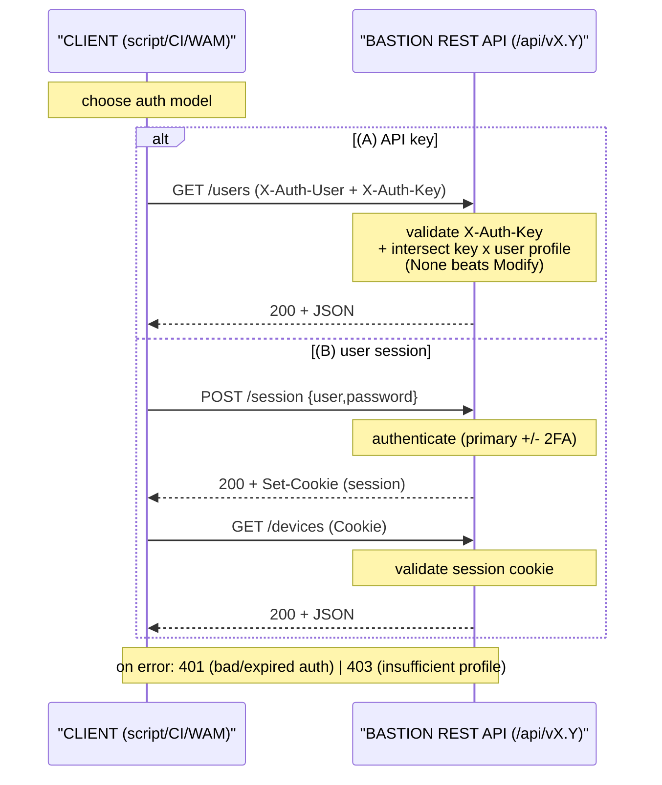
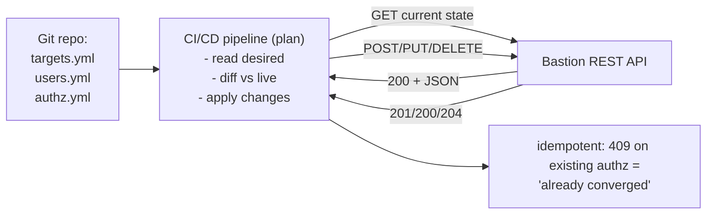

# WALLIX Bastion REST API & Automation

The Bastion's **REST API** (Representational State Transfer Application Programming
Interface) is how you provision and operate PAM at scale: create users/targets/
authorizations, mass-import objects, drive Infrastructure-as-Code (IaC) / DevOps pipelines,
and — via **AAPM / WAAPM** — pull secrets at run time so passwords never sit hard-coded in
scripts. This is **WCE-P (WALLIX Certified Expert – PAM)** Module 5 "WALLIX Bastion REST
API" and Module 4 "WAAPM / External Vault"; see [wce-p-expert.md](../pam-bastion/wce-p-expert.md).

**Acronyms first use:** REST = Representational State Transfer · API = Application
Programming Interface · HTTP(S) = HyperText Transfer Protocol (Secure) · JSON = JavaScript
Object Notation · CRUD = Create-Read-Update-Delete · IaC = Infrastructure as Code · CI/CD =
Continuous Integration / Continuous Delivery · AAPM = Application-to-Application Password
Management · WAAPM = WALLIX Application-to-Application Password Manager · RPA = Robotic
Process Automation · WAM = WALLIX Access Manager · TLS = Transport Layer Security · URL =
Uniform Resource Locator. Full list: [../reference/acronyms.md](../../reference/acronyms.md).

> **Source-grounding note.** The Bastion Administration Guide (served v12.3.2) confirms the
> API **base path `/api/vX.Y`**, the **API-key** and **service-account/user** authentication
> models, and the WAM API-key **profiles** (below). The *full endpoint catalog* (every
> resource, body schema, and exact status code) is served per-appliance — not in a public
> PDF — at **`https://<bastion>/api/doc/Usage.html`** (search-filter help at
> `…/Usage.html#search`). Endpoint paths and status codes below follow the standard WALLIX
> REST API and are flagged where a value is *convention rather than quoted from the PDF*.

---

## Key points

- Base URL: `https://<bastion>/api/v<MAJOR>.<MINOR>` — *"must start with `https://` and end
  with `/api/vX.Y`"*. Minimum API version referenced by current plugins is **2.3**.
- **Two auth models:** (1) an **API key** in a request header (machine-to-machine); (2)
  **user authentication** (login+password, opening a session cookie). A request's effective
  rights = the **intersection** of the user profile and the API-key profile (least-privilege:
  `None` always wins over `Modify`).
- **API keys are created by the `product_administrator` profile**; a key is bound to a
  **read-only** profile type for use by WAM, and from **v12.1** WAM uses scoped key profiles.
- Resources map to PAM objects (users, user groups, devices, accounts, domains, target
  groups, authorizations, sessions, approvals, password checkout). Standard verbs:
  `GET`/`POST`/`PUT`/`DELETE`.
- **Mass import** is available both via the API and via **Import/Export > CSV** in the GUI.
- **AAPM/WAAPM** removes hard-coded passwords: a script/CI job authenticates to the Bastion
  REST API (or runs the WAAPM agent) and **checks out** the secret at run time.

---

## 1. Authentication to the API

### 1.1 API key (machine-to-machine)

Generate the key in the GUI under **Configuration** (the same key WAM consumes when you
register a Bastion). Then send it in the request header. WALLIX's convention uses an
`X-Auth-Key` (and where a user context is needed, an `X-Auth-User`) header:

```bash
# List users with an API key (header auth)
curl -sk \
  -H "X-Auth-User: api-admin" \
  -H "X-Auth-Key: 7b3f...your-api-key..." \
  -H "Accept: application/json" \
  "https://bastion.example.com/api/v3.12/users"
```

> Header names `X-Auth-User` / `X-Auth-Key` follow the documented WALLIX REST convention;
> confirm the exact spelling on your appliance's `/api/doc/Usage.html`. *(Flagged: not quoted
> verbatim from the v12.3.2 PDF.)*

### 1.2 User authentication (session cookie)

Authenticate as a Bastion user; the server returns a session cookie used for subsequent
calls. Useful for short-lived interactive automation or when you want the *user's* own rights:

```bash
# 1) Open a session (cookie saved to cookies.txt)
curl -sk -c cookies.txt \
  -H "Content-Type: application/json" \
  -X POST "https://bastion.example.com/api/v3.12/session" \
  -d '{"user":"alice","password":"S3cr3t!"}'

# 2) Reuse the session cookie
curl -sk -b cookies.txt \
  "https://bastion.example.com/api/v3.12/devices"
```

### 1.3 Service account vs. current user (vault / Bastion plugin)

When one Bastion uses another as an **external vault** (the "Bastion plugin"), the API
caller can be either the **service account** or the **currently authenticated user**:

- **Force use of service account** = always log in to the remote API as the service account.
- Disabled = try the **authenticated user's** credentials first, then fall back to the
  service account.

### 1.4 Effective rights = profile intersection

*"When a user authenticates using an API key, the resulting profile is determined by
combining the profile of the authenticated user and the profile of the API key … the
intersection … defines the feature rights."* So if the key profile says `None` for a feature
but the user has `Modify`, **`None` applies**. Design keys with the *minimum* profile needed.

WAM API-key profiles (Bastion v12.1+), in order of decreasing scope:

| Profile | Scope |
|---|---|
| `wallix_access_manager_session_audit` *(recommended)* | session access + checkout + approvals + audit |
| `wallix_access_manager_session` | session access + checkout + approvals |
| `wallix_access_manager_audit` | session auditing only |

### 1.5 API authentication flow



---

## 2. Resources, methods, and response codes

### 2.1 Core resources (object model → endpoints)

The API mirrors the [ACL data model](../overview/product-portfolio.md#core-pam-concepts--the-acl-data-model).
Typical collections (paths under `/api/vX.Y/`):

| Resource | Path (convention) | What it manages |
|---|---|---|
| Users | `/users` | physical users (local or directory) |
| User groups | `/usergroups` | grouping for authorizations |
| Devices | `/devices` | physical/virtual equipment |
| Services | `/devices/{id}/services` | protocol+port+connection-policy on a device |
| Accounts | `/accounts` (and per-device/-domain) | target accounts {device, service, account} |
| Domains | `/domains` (global) / local | account namespaces / vault binding |
| Target groups | `/targetgroups` | groups of resources+accounts sharing authorizations |
| Authorizations | `/authorizations` | binds one user group ↔ one target group (Sessions/Secrets) |
| Session rights | `/sessionrights` / `/targets` | what the calling user may open |
| Approvals | `/approvals` | request/approve workflow |
| Password checkout | `/accounts/{id}/checkout` · `/checkin` | retrieve / return a secret (AAPM) |
| Sessions (audit) | `/sessions` | session metadata, recordings |

> Exact path spelling/versioned variants live on `/api/doc/Usage.html`. The **advanced
> search filter** syntax (e.g. `${subject_cn}`, `field~value`, `||`, `&&`, `=`) used in
> X.509 matching is documented at `…/Usage.html#search` and reused across the API.

### 2.2 HTTP methods

| Method | Meaning | Example |
|---|---|---|
| `GET` | Read a collection or item | `GET /users` , `GET /users/alice` |
| `POST` | Create a new object | `POST /users` with JSON body |
| `PUT` | Update an existing object | `PUT /users/alice` with JSON body |
| `DELETE` | Remove an object | `DELETE /users/alice` |

### 2.3 Response / status codes (standard REST semantics)

| Code | Meaning in the API |
|---|---|
| `200 OK` | Successful `GET`/`PUT` |
| `201 Created` | Object created by `POST` (often with a `Location` header) |
| `204 No Content` | Successful `DELETE` (or `PUT` with no body returned) |
| `400 Bad Request` | Malformed body / missing required field |
| `401 Unauthorized` | Missing/invalid/expired authentication |
| `403 Forbidden` | Authenticated but profile lacks the right (intersection rule) |
| `404 Not Found` | Resource/id does not exist |
| `409 Conflict` | Duplicate object (e.g. an authorization for an existing user-group↔target-group pair) |

> WCE-P Module 5 explicitly covers "Methods" and "Response codes." The codes above are
> standard REST values; the per-appliance `/api/doc` is authoritative for any deviation.
> *(Flagged: the exact code-by-endpoint table is not in the v12.3.2 PDF.)* Note the **409**
> case maps to the ACL rule that *one authorization links exactly one user group to one
> target group* — re-POSTing the same pair conflicts.

---

## 3. Common automation tasks (curl)

All examples assume the API-key headers from §1.1 exported once:

```bash
export BAST="https://bastion.example.com/api/v3.12"
export H_USER="X-Auth-User: api-admin"
export H_KEY="X-Auth-Key: 7b3f...api-key..."
alias wabcurl='curl -sk -H "$H_USER" -H "$H_KEY" -H "Content-Type: application/json"'
```

### 3.1 Create a user

```bash
wabcurl -X POST "$BAST/users" -d '{
  "user_name": "alice",
  "display_name": "Alice Martin",
  "email": "alice@example.com",
  "profile": "user",
  "user_auths": ["local_password"],
  "password": "ChangeMe-16chars!"
}'
# -> 201 Created
```

### 3.2 Create a device, then a target account

```bash
# Device
wabcurl -X POST "$BAST/devices" -d '{
  "device_name": "srv-linux-01",
  "host": "10.20.0.11",
  "description": "App server"
}'

# Account on that device (SSH service implied by service config)
wabcurl -X POST "$BAST/accounts" -d '{
  "account_name": "root",
  "device": "srv-linux-01",
  "domain": "local-srv-linux-01",
  "credentials": [{ "type": "password", "password": "InitialP@ss" }]
}'
```

### 3.3 Create a target group and an authorization

```bash
# Target group containing the resource (device+service+account)
wabcurl -X POST "$BAST/targetgroups" -d '{
  "group_name": "linux-prod",
  "session": { "accounts": ["root@local-srv-linux-01:srv-linux-01:SSH"] }
}'

# Bind a user group to that target group (Sessions + Secrets)
wabcurl -X POST "$BAST/authorizations" -d '{
  "user_group": "linux-admins",
  "target_group": "linux-prod",
  "authorize_sessions": true,
  "authorize_password_retrieval": true,
  "subprotocols": ["SSH_SHELL", "SSH_SCP_UP", "SSH_SCP_DOWN", "SFTP_SESSION"]
}'
# -> 201 Created  (409 if linux-admins<->linux-prod already exists)
```

### 3.4 Read what a user may reach / open

```bash
wabcurl "$BAST/sessionrights?user=alice"      # authorizations for a user
wabcurl "$BAST/targets?q=linux*"               # search targets (wildcard)
```

### 3.5 Mass import

Two routes:

- **API loop / batch:** iterate `POST` calls (e.g. from a CSV in a shell/Python loop) — see
  the IaC pattern in §4.
- **GUI CSV:** **Import/Export > CSV** imports/exports data types including *Authentication
  domains*, devices, accounts, etc. (field separator selectable). Good for bulk one-shots.

> When mass-importing in a **Master/Master** HA pair, do **not** run provisioning on both
> nodes simultaneously (duplicate IDs) — see [high-availability-and-dr.md](high-availability-and-dr.md#3-what-is-vs-is-not-replicated).

---

## 4. IaC / DevOps integration

Treat Bastion objects as declarative state and reconcile them through the API.



Practical patterns:

- Keep the **API key in the CI secret store** (never in the repo); inject as an env var only
  at job run time.
- Make jobs **idempotent**: `GET` before `POST`; treat `409 Conflict` as "already exists."
- Use a **scoped API-key profile** (intersection rule) so a pipeline can only touch the
  features it owns.
- For multi-Bastion estates, target the Bastion behind **WAM** by its registered **Host**
  (user-service IP); audit lands centrally in WAM.

---

## 5. AAPM / WAAPM — removing hard-coded passwords

**The problem:** scripts, cron jobs, app config files, and CI pipelines that embed a static
password. **The fix:** retrieve the secret from the Bastion vault **at run time** so nothing
is stored on disk. WALLIX brands this **AAPM** (Application-to-Application Password
Management); **WAAPM** is the WALLIX Application-to-Application Password Manager
implementation/agent. Technically it is the **REST API + vault checkout** mechanism.

### 5.1 CI/CD secret-retrieval automation flow

```mermaid
sequenceDiagram
    participant Job as "CI/CD job (pipeline)"
    participant Agent as "WAAPM agent / API client<br/>(key in CI secret store)"
    participant API as "Bastion REST API<br/>/accounts/.../checkout"
    participant Vault as "Vault (Bastion or ext.)"
    Job->>Agent: 1) need DB pw
    Agent->>API: 2) authenticate (X-Auth-Key)
    API->>API: 3) check authz (Secrets right)
    API->>Vault: 4) fetch secret (+ lock if checkout policy)
    Vault-->>API: secret
    API-->>Agent: 200 + secret
    Agent-->>Job: 5) inject into runtime env
    Note over Job: 6) run task (no pw on disk)
    Job->>API: 7) check-in
    Note over API: 8) /checkin (optional rotate on check-in)
    Note over Job,Vault: Secret lives only in memory for the job's lifetime; checkout can lock the<br/>account against concurrent use and rotate the password at check-in.
```

### 5.2 Checkout / check-in via the API

```bash
# Check out a secret (returns login + password / SSH key for the lifetime of the checkout)
wabcurl -X POST "$BAST/accounts/root@global-db:checkout"
# -> 200 { "password": "...", "checkout_id": "...", "expires": "..." }

# ... job uses the secret from its environment, never writing it to disk ...

# Check the secret back in (may trigger "change password at check-in")
wabcurl -X POST "$BAST/accounts/root@global-db:checkin" \
  -d '{ "checkout_id": "..." }'
# -> 204 No Content
```

> Path/verb spelling is convention; confirm on `/api/doc/Usage.html`. *Checkout policy*
> (lock, max duration, change-password-at-check-in) is enforced server-side regardless of the
> client — see the [password management section](../overview/product-portfolio.md#password--secrets-management).
> In a **Master/Slaves** HA setup with *change password at check-in*, all Slaves must have a
> **Bastion plugin** pointed at the Master.

### 5.3 External-vault chaining (Bastion-as-vault)

The Bastion plugin makes one Bastion (`V_BASTION`) the vault for another (`P_BASTION`) over
the API. On `P_BASTION` you add a **global domain** with an **External / Bastion** vault
plugin:

| Field | Value |
|---|---|
| Vault type | External |
| Vault plugin | Bastion |
| **API URL** | `https://<V_BASTION>/api/vX.Y` (min API **v2.3**, must start `https://`, end `/api/vX.Y`) |
| API auth | **API key** generated on `V_BASTION`, **or** a **service account** (with *Force use of service account*) |

`P_BASTION` accounts then use the `target_account_name\domain` form and credentials are
fetched **in real time through the API** at session start. The same external-vault pattern
exists for **CyberArk** (`…/PasswordVault` + Safe name), **HashiCorp Vault** (API v1), and
**Thycotic** — all consuming a remote REST API rather than storing secrets locally.

---

## 6. API versioning & gotchas

- Pin the version in the path (`/api/v3.12`); plugins require **≥ v2.3**.
- A user **disabled** in the Bastion *"will not be allowed to log on to the WALLIX Bastion
  web interface, the REST API web service, and RDP/SSH sessions."* — disabling cuts API
  access too.
- **TLS**: the HTTP server defaults to a *high* security level (restricted modern cipher
  suites); `curl -k` skips cert verification for labs — verify the cert in production.
- **409 on authorizations** is expected when the user-group↔target-group pair already exists
  (the model forbids duplicates) — handle it as idempotent success in pipelines.

---

## Sources

Primary WALLIX documentation, fetched 2026-06-17:

- **WALLIX Bastion Administration Guide** — served version **12.3.2** (374 pp.). Grounds:
  the **`/api/vX.Y`** base path and **min API v2.3** (§15.3.1 Bastion plugin / external-vault
  config); **API-key creation by `product_administrator`** and the **profile-intersection**
  rule (§ "API keys specification"); **WAM API-key profiles** `wallix_access_manager_*`
  (cross-referenced from the WAM guide §13); the advanced **search-filter** syntax at
  `https://<bastion>/api/doc/Usage.html#search`; disabled-user loses REST access (§ user
  creation caution); external-vault plugins CyberArk/HashiCorp/Thycotic (§15.3).
  https://pam.wallix.one/documentation/admin-doc/bastion_en_administration_guide.pdf
- **WALLIX Access Manager Administration Guide** — served version **5.2.4.0** (82 pp.). §13
  Bastions: a Bastion is registered with **Name + Host + API Key**; v12.1 scoped API-key
  profiles.
  https://pam.wallix.one/documentation/admin-doc/am-admin-guide_en.pdf
- **WALLIX Bastion Deployment Guide** — served version **12.0.2** (51 pp.). §8 Annex: "REST
  API supported clients based on REST API version 3.8 / 3.12" (used for the example version
  `v3.12`).
  https://marketplace-wallix.s3.amazonaws.com/bastion_12.0.2_en_deployment_guide.pdf

**Flagged:** the complete endpoint catalog, exact request/response schemas, header-name
spelling (`X-Auth-User` / `X-Auth-Key`), and the precise status-code-per-endpoint table are
served per-appliance at `https://<bastion>/api/doc/Usage.html` and are **not** in any of the
three public PDFs above. The curl examples follow the standard WALLIX REST API and should be
validated against your appliance's `/api/doc`. Cross-references:
[product portfolio – AAPM](../overview/product-portfolio.md#password--secrets-management)
· [HA & DR (provisioning on M/M)](high-availability-and-dr.md) ·
[WCE-P curriculum](../pam-bastion/wce-p-expert.md) · [acronyms](../../reference/acronyms.md).
