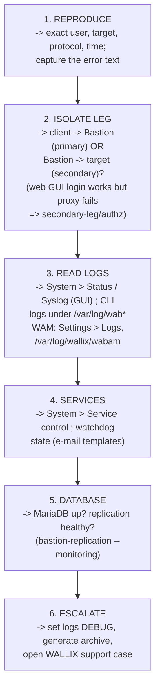
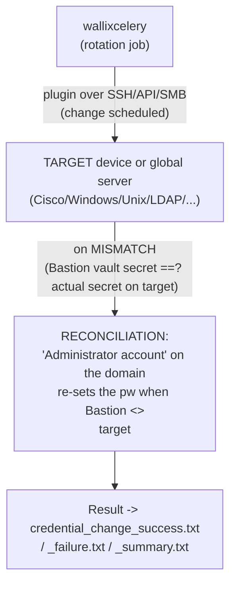
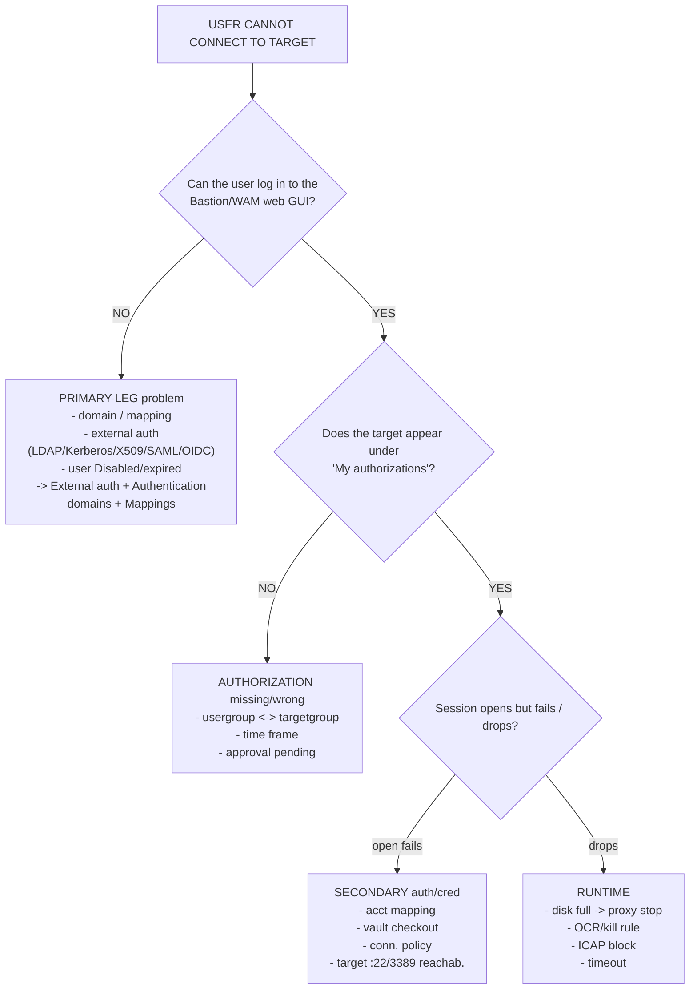
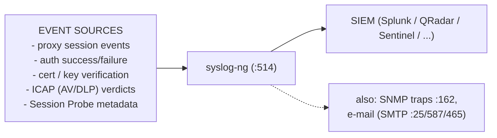
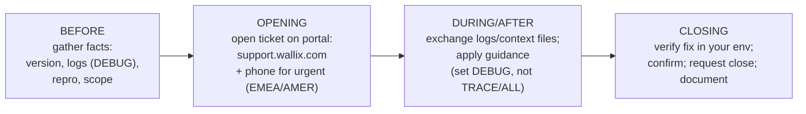

# Troubleshooting & Logs (Bastion + Access Manager)

A working method for diagnosing **WALLIX Bastion** and **WALLIX Access Manager (WAM)**:
where the logs live, how to read the database and services, the common
connection/authentication/recording failures, how to debug password-rotation plugins,
how to forward events to a **SIEM** via **syslog-ng**, and how to run a clean **WALLIX
support case**. This is **WCE-P (WALLIX Certified Expert – PAM)** Module 6 "Troubleshoot"
(Bastion log files, Bastion database, Access Manager log files, Access Manager database,
password-rotation plugins); see [wce-p-expert.md](../pam-bastion/wce-p-expert.md).

**Acronyms first use:** WAM = WALLIX Access Manager · SIEM = Security Information and Event
Management · CLI = Command-Line Interface · GUI = Graphical User Interface · SSH = Secure
Shell · RDP = Remote Desktop Protocol · NLA = Network Level Authentication · ICAP = Internet
Content Adaptation Protocol · DLP = Data Loss Prevention · KDC = Key Distribution Center ·
TLS = Transport Layer Security · JVM = Java Virtual Machine · ZIP = archive format · CA =
Certificate Authority · SMTP = Simple Mail Transfer Protocol. Full list:
[../reference/acronyms.md](../../reference/acronyms.md).

---

## Key points

- **Layered method:** reproduce → isolate the *leg* (client→Bastion vs. Bastion→target) →
  read the right log → check services/watchdog → check the database → escalate with a
  **context/log archive**.
- **GUI first:** **System > Status / Syslog / Boot messages** show service health and let you
  **download log files** (the *View* right is enough). **System > Service control** restarts
  components.
- **Two auth legs fail differently:** a *primary* auth failure (client→Bastion) is about
  domains/external-auth/Kerberos/X.509; a *secondary* failure (Bastion→target) is about
  account mapping / vault credentials / connection policy.
- **Recording issues** usually trace to storage (local vs. remote/NFS, disk full →
  emergency proxy shutdown), the RDP **Session Probe**, or recording being **disabled** on
  the authorization.
- **Password-rotation plugins** are debugged via the **reconciliation** (administrator)
  account, the change/verify result, and `credential_change_*` notifications.
- **SIEM**: configured under **System > SIEM Integration**, transported by **syslog-ng**
  (port **514**). Many events are individually toggleable to syslog/SIEM.
- **Support case**: prepare a **context/log archive** (set logs to DEBUG, never TRACE/ALL in
  prod), open via the portal, follow up, close once verified.

---

## 1. Troubleshooting methodology



Golden rule for isolation: if the user can **log in to the web GUI** but a **session fails**,
the problem is on the **secondary leg** (authorization, account mapping, vault, connection
policy, target reachability) — *not* the user's own authentication.

---

## 2. Bastion log locations & contents

WALLIX does not publish a single exhaustive path table in the public PDFs; the canonical
sources are the **GUI download pages** and the **System Operations / SIEM Logs guides**.
What *is* documented:

| Location / page | Contains | Source |
|---|---|---|
| **System > Status** (GUI) | service health overview; download log files (View right) | Admin Guide §"System settings" |
| **System > Syslog** (GUI) | system/syslog messages; downloadable | Admin Guide |
| **System > Boot messages** (GUI) | kernel/boot diagnostics | Admin Guide |
| **System > Audit logs** (GUI) | audit/event logs (note: *not* replicated in HA) | Admin Guide |
| **Audit > Session History** → *Session metadata* | per-session metadata, ICAP verdicts, Session Probe events | Admin Guide §12.12 / §12.16 |
| `/var/wab/etc/notifier/` | notification **templates** (`.txt`), incl. watchdog/HA/rotation | Admin Guide §8.2.3 |
| `/var/wab/` (LVM) | product storage root (recordings, data) | Deployment/Portfolio |
| **WALLIX Application Driver** local log file | app-automation driver diagnostics (`/e:ShowUsage=Yes`) | Admin Guide §10.6.2 |

> The detailed engine-log filenames (e.g. proxy/`sashimi`/session daemons under `/var/log/`)
> are documented in the **System Operations Guide** and **SIEM Logs guide**, which are not
> among the three guides fetched here — *flagged as not specified in these sources*. Use
> **System > Status** to download whatever the appliance exposes, and set verbosity before
> reproducing.

### 2.1 Internal services (what to restart / check)

From the Deployment Guide / portfolio, the Bastion runs these named services (manage via
**System > Service control** or `systemctl`):

| Service | Role |
|---|---|
| **MariaDB** | database (ports **3306**, replication **3307**) |
| **redemption** | RDP proxy engine |
| **wabgui** | admin web GUI |
| **wabrestapi** | REST API web service |
| **sashimi** | session/proxy orchestration |
| **wallixsession** | session management |
| **wallixcelery** | async task queue (rotation, jobs) |
| **wallix-discovery** | asset discovery |
| **superset** | analytics / dashboards |
| **syslog-ng** | SIEM forwarding (port 514) |
| **wab-backupdaemon** | backup daemon |
| **wabwatchdog** | watchdog (see §3) |
| **autossh** | keeps the HA replication SSH tunnel up (port 2242) |
| **cron** | scheduled jobs incl. password rotation (mask during HA migration) |

### 2.2 The database (MariaDB)

- Health/replication: `bastion-replication --monitoring` / `--status` (see
  [high-availability-and-dr.md](high-availability-and-dr.md#4-the-bastion-replication-cli)).
- Root password rotation at deploy: `WABChangeDbRootPassword`.
- **Audit/session tables are local per node** (not replicated) — a "missing sessions on the
  other node" report in HA is *expected behaviour*, not a fault.

---

## 3. Services, watchdog & notifications

The embedded **watchdog** (`wabwatchdog`) watches component state and e-mails on change.
Default templates (in `/var/wab/etc/notifier/`):

```
  watchdog_back_to_normal.txt     -> service recovered
  watchdog_service_restarted.txt  -> a service was auto-restarted
  watchdog_wab_out_of_order.txt   -> Bastion out of order
```

Other operational notifications worth wiring to e-mail:

- **Disk / storage:** `external_storage_full.txt`, `filesystem_full.txt` (90% full),
  `disk_space_critical.txt` (**< 100 MiB → emergency shutdown of all proxy servers** — a
  classic "all sessions suddenly fail" root cause).
- **HA replication:** `ha_master_fault.txt`, `ha_master_up.txt`, `ha_slave_missing.txt`.
- **Secret rotation:** `credential_change_failure.txt`, `credential_change_success.txt`,
  `credential_change_summary.txt`.
- **License:** `licence_expired.txt`, `licence_quota_exceeded.txt`,
  `licence_waapm_cx_error.txt`, etc.

Customize/translate by dropping a `_<lang>.txt` or `_en.txt` variant in
`/var/wab/etc/notifier/` (root: `super` → `sudo -i`).

---

## 4. Common issues — symptom → cause → check

### 4.1 Connection / authentication

| Symptom | Likely cause | Where to check |
|---|---|---|
| Cannot log in to GUI at all | wrong domain / disabled user / expired account | **Users > Accounts** (Disable flag, expiry); domain mapping |
| LDAP/AD login fails | bind method, StartTLS/SSL off, wrong domain name | External auth → AD; domain name must match realm |
| Kerberos login fails | realm not UPPERCASE, keytab service missing, KDC :88 unreachable, NLA off (RDP) | External auth → Kerberos; keytab HTTP/host/TERMSRV |
| X.509 cert rejected | cert revoked, CRL/OCSP unreachable, matching condition no match | **X.509 configuration** CRL/OCSP; `${subject_*}` filter |
| SAML/OIDC loops or 403 | domain-name mismatch (WAM↔Bastion), message encryption left on, group not mapped | External auth → SAML/OIDC; Mappings tab |
| 2FA push never arrives | RADIUS *Use mobile device for 2FA* off, RADIUS :1812/secret/timeout | External auth → RADIUS |
| User logs into GUI but **session** fails | **secondary leg**: account mapping / vault / connection policy / target down | authorization, target account, connection policy |

### 4.2 Session recording

| Symptom | Likely cause | Where to check |
|---|---|---|
| No recording for a session | recording **disabled on the authorization** | authorization (Sessions tab) |
| Recordings stop / sessions drop | **disk full** → emergency proxy shutdown | watchdog `disk_space_critical.txt`; storage page |
| RDP metadata/OCR missing | **Session Probe** not enabled / blocked | Connection Policies (RDP) > *Enable session probe* |
| Can't replay on another Bastion | recordings **encrypted to the originating Bastion** only | by design — replay on the source (or via WAM) |
| Remote-storage recordings missing | NFS/CIFS mount down (NFS :2049, CIFS :445) | storage page; mount status |

### 4.3 Where the user-cannot-connect decision tree lives

See §6.

---

## 5. Debugging password-rotation plugins



*Password change / verify (and where it breaks).*

Debug checklist:

- **Plugin chosen** on the domain (Targets > Domains > *Enable password change* → plugin).
  Check the bundled list/version (Deployment Guide §8.1: e.g. Unix `V1.2.1`, Windows
  `V1.0.1`, Cisco `V1.0.2`, LDAP `V1.0`, MariaDB `V1.0.3`, plugin API `1.2.1`).
- **Reconciliation / Administrator account**: required on the domain so Bastion can re-push
  when its stored secret diverges from the target. **Mandatory** for **FortiGate** and **IBM
  3270** plugins (add to *Domain accounts* first, then select in *Administrator account*).
- **Transport reachability**: e.g. SMB **:139/445** for Windows, SSH **:22** for Unix —
  failures show as `credential_change_failure.txt`.
- **CA public key** is pushed to the target when a change plugin is set *and* the Password
  Manager feature is licensed — a missing license blocks rotation (`licence_*` notifications).
- **Async worker**: rotation runs under **`wallixcelery`** + **`cron`**; if cron is masked
  (e.g. during an HA migration) rotation silently stops.
- **HA caveat**: schedule rotation **only on the (primary) Master**; in Master/Slave do
  **not** use *Change password at check-in* (the change can land on a Slave and not
  replicate). Slaves needing check-in rotation require a **Bastion plugin to the Master**.

---

## 6. Decision tree — "user cannot connect to a target"



Logs to pull at each leaf:
- **PRIMARY** -> System > Syslog ; external-auth test ; Kerberos/X509 config
- **AUTHZ** -> authorization + approval workflow ; time frame
- **SECONDARY** -> session metadata (Audit > Session History) ; connection policy
- **RUNTIME** -> watchdog/disk notifications ; ICAP/OCR restriction rules ; SIEM

---

## 7. SIEM / syslog forwarding

- Configure under **System > SIEM Integration** (GUI). Transport is **`syslog-ng`** on port
  **514** (UDP/TCP per your config). *(SIEM Integration settings are **not** replicated in
  HA — set on each node.)*
- The **SIEM Logs guide** (auditor-oriented) documents the exact message formats and sample
  logs — *not fetched here; flagged*.
- Many events are individually routable to syslog/SIEM, e.g.:
  - Server-access allowed / new public-key file / key verification success / failure
    (SSH proxy).
  - Target-server connection allowed; new certificate created; cert verification
    success/failure (RDP/TLS).
  - **ICAP** verdicts (antivirus on upload, DLP on download) — logged to session metadata
    **and** SIEM when routing is configured.
  - **Session Probe** metadata (window/process/clipboard/drive events) for RDP targets.
- **Caution:** TRACE/ALL log levels may expose **passwords** — never forward those to a SIEM
  or share with support; drop to **DEBUG** first.



---

## 8. Access Manager troubleshooting

| Item | Location |
|---|---|
| Per-module log levels | **Settings > Logs** (global-org admin only) |
| Log archive | **Download Logs Archive (ZIP)** → `access.log`, `error.log`, `tech.log` |
| Access log (Apache-style) | **`/var/log/wallix/wabam`** (config in `wabam.properties` *Access log configuration*) |
| Main config file | **`/var/wab/etc/wabam/wabam.properties`** (restart WAM after edits) |
| JVM heap (OOM/slowness) | `-Xmx` in **`/var/wab/etc/wabam/wabam.vmoptions`** (default 2373 MB appliance / 60% RAM) |
| Audit store | **Elasticsearch** (root-cert management, WAM guide Ch.16) |
| DB backup/restore | **Settings > Database** (GUI; >10 MB → CLI) |
| Bastion connectivity | **Bastions** page → *Test Connection* (also syncs time zone) |

Common WAM-specific failures:
- **Bastion unreachable / wrong Host** → use the Bastion's **user-service** IP, not the admin
  interface; *Test Connection*.
- **Bad/expired API key** → *Change API Key*; ensure the right v12.1 profile
  (`wallix_access_manager_session_audit` recommended).
- **Cert mismatch after Bastion cert change** → *Reset Bastion Certificate* /
  *Reset SSH/RDP Fingerprint*.
- **SAML through WAM fails** → message **encryption must be disabled**; the WAM SAML domain
  name must equal the Bastion authentication domain's **Server domain name**; use **SAML
  Generic** (not the Entra+Graph variant).
- **Cluster slow when a node is down** → tune `bastion.cluster.identical.mode` /
  REST-API/Bastion section timeouts (Settings > Application).

> **TRACE/ALL warning (WAM):** *"If the environment is a production environment, do not share
> the log archive with the WALLIX support team while either of these modes is active. Change
> the mode to DEBUG before generating the archive."*

---

## 9. The WALLIX support case process



- **Before** — collect: WALLIX Bastion/WAM **version**, exact repro steps, the **log archive**
  (logs at **DEBUG**, never TRACE/ALL in production), affected user/target/protocol/time, and
  whether HA/cluster is involved. For licensing, the **license context file**
  (`Configuration > License > Download context file` → `license_context.json`).
- **Opening** — portal **https://support.wallix.com/** (Downloads tab also holds ISO images
  + signatures for upgrades). Urgent: phone **(+33) (0)1 70 36 37 50** (EMEA) /
  **(+1) 438-814-0255** (Americas). Hours per your support contract.
- **During/after** — send the context/log archive as requested; for licensing you receive
  `wallix_license.json` to upload under *License update*. Old appliances (Dell R310/R510/R810)
  are **best-effort** only.
- **Closing** — apply and **verify** the fix in your environment, confirm with the engineer,
  request closure, and record the root cause + change for your runbook.

---

## 10. Quick command reference

```bash
# Become root (from the admin CLI on port 2242)
ssh -p 2242 wabadmin@<bastion_ip>
super            # then:
sudo -i

# Replication health (HA)
bastion-replication --monitoring
bastion-replication --status

# Recordings (local storage) export/import
WABSessionLogExport
WABSessionLogImport

# DB root password rotation
WABChangeDbRootPassword

# Cipher/security level of SSH & HTTP servers (post-upgrade check)
WABSecurityLevel

# WAM: edit config then restart the Access Manager service
#   /var/wab/etc/wabam/wabam.properties   (access log, time zone, db.connections, ...)
#   /var/wab/etc/wabam/wabam.vmoptions    (-Xmx heap)
```

---

## Sources

Primary WALLIX documentation, fetched 2026-06-17:

- **WALLIX Bastion Administration Guide** — served version **12.3.2** (374 pp.). Grounds:
  GUI **System > Status / Syslog / Boot messages / Audit logs** download pages and the *View*
  right; notification/watchdog templates in **`/var/wab/etc/notifier/`**
  (`watchdog_*`, `ha_*`, `credential_change_*`, `disk_space_critical.txt`,
  `filesystem_full.txt`); **System > SIEM Integration** + per-event syslog/SIEM toggles;
  **ICAP** and **Session Probe** metadata to SIEM; **reconciliation / Administrator account**
  (incl. FortiGate & IBM 3270); password-change plugin behaviour and CA-key push; license
  context file process.
  https://pam.wallix.one/documentation/admin-doc/bastion_en_administration_guide.pdf
- **WALLIX Access Manager Administration Guide** — served version **5.2.4.0** (82 pp.). §15.2
  Logs (`access.log`/`error.log`/`tech.log`, `/var/log/wallix/wabam`, TRACE/ALL warning),
  §15.3 DB backup/restore, §13 Bastions (Test Connection / Reset Cert / API key profiles),
  §20–21 `wabam.properties` / `wabam.vmoptions`, Elasticsearch (Ch.16).
  https://pam.wallix.one/documentation/admin-doc/am-admin-guide_en.pdf
- **WALLIX Bastion Deployment Guide** — served version **12.0.2** (51 pp.). Internal service
  names & ports (MariaDB 3306/3307, syslog 514, admin SSH 2242), `bastion-replication`,
  `WABSessionLogExport/Import`, `WABChangeDbRootPassword`, `WABSecurityLevel`, rescue-mode
  `/opt/wab/bin/BastionSecureUpgrade --unlock-system`, password-change plugin versions
  (§8.1), and the **WALLIX Support** contact block (https://support.wallix.com/, EMEA/Americas
  phone numbers).
  https://marketplace-wallix.s3.amazonaws.com/bastion_12.0.2_en_deployment_guide.pdf

**Flagged / not in these sources:** the full list of engine log filenames and paths under
`/var/log/` (proxy/`sashimi`/session daemons) and the exact SIEM message formats are
documented in the **System Operations Guide** and **SIEM Logs guide**, which were not
fetched — treat those specifics as *not specified in these sources* and pull the actual files
from **System > Status**. Cross-references:
[product portfolio – services](../overview/product-portfolio.md#architecture-deployment-ha-integrations)
· [HA & DR](high-availability-and-dr.md) · [REST API & automation](rest-api-and-automation.md)
· [authentication & WAM](authentication-and-access-manager.md) · [WCE-P curriculum](../pam-bastion/wce-p-expert.md)
· [acronyms](../../reference/acronyms.md).
