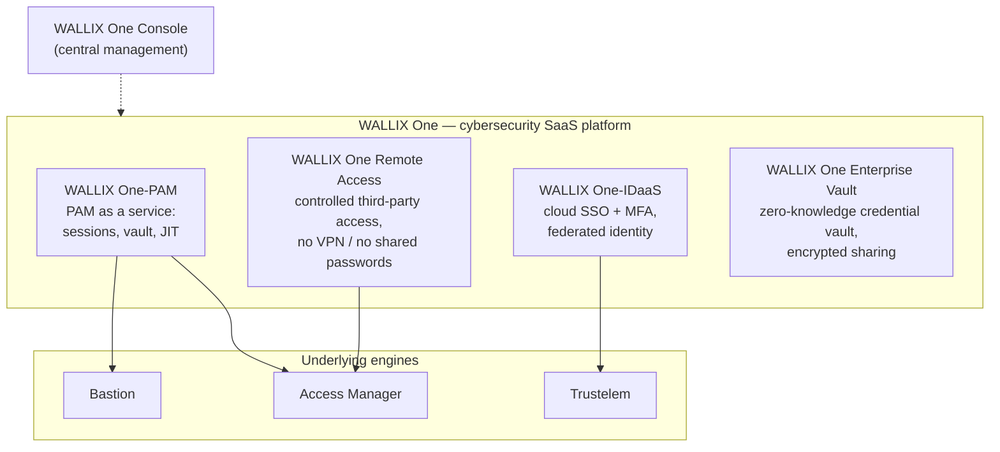
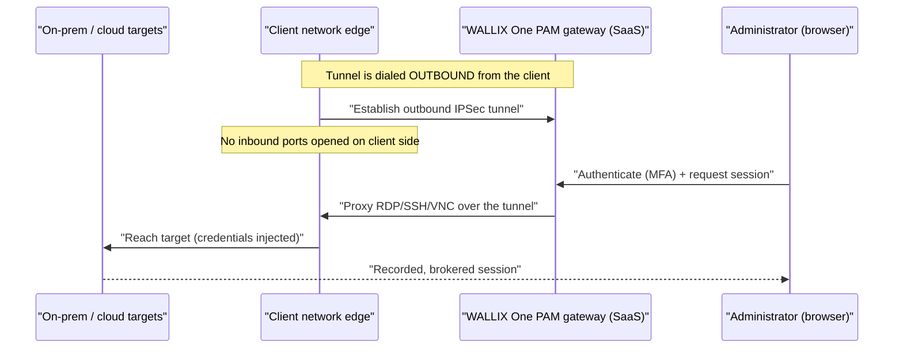
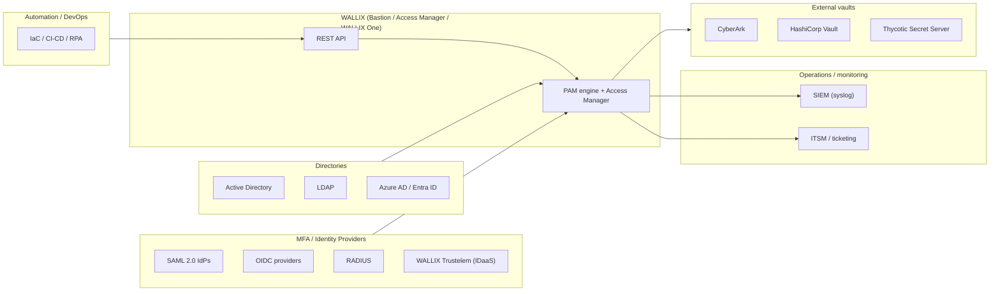

# WALLIX One & the Integration Surface — Deep Dive

**WALLIX One** is WALLIX's **cybersecurity Software-as-a-Service (SaaS) platform** — the
cloud delivery model under which WALLIX packages its access- and identity-security
products as subscription services. It is **not a single product**: it is the umbrella
through which several WALLIX *engines* (Bastion, Access Manager, Trustelem, the vault) are
consumed as managed SaaS. This page covers the **"WALLIX One-X"** services, the
**agentless SaaS connectivity model**, how WALLIX One relates to Bastion + Access Manager,
and — just as important for a sysadmin — the **integration ecosystem** that lets WALLIX
plug into the directories, identity providers, SIEMs, ticketing systems, external vaults,
and automation pipelines you already run.

For the engines themselves, the authoritative reference is
[../docs/00-overview/product-portfolio.md](../overview/product-portfolio.md)
(section 2, WALLIX One). This page links into the automation and IDaaS deep dives rather
than repeating them.

## Learning objectives

- Define **WALLIX One** and distinguish the **platform** from the **WALLIX One-X
  services** and the underlying **engines**.
- List the WALLIX One-X services: **One-PAM, One-IDaaS, One Remote Access, One Enterprise
  Vault** — and what each delivers.
- Explain the **agentless SaaS connectivity model**: outbound **IPSec** tunnel, **no
  inbound ports**.
- Explain how WALLIX One relates to **Bastion + Access Manager**.
- Map the WALLIX **integration surface**: directories, MFA/IdP, SIEM, ITSM, external
  vaults, and the **REST API**.

**Acronyms first use:** SaaS = Software-as-a-Service · PAM = Privileged Access Management
· IDaaS = Identity-as-a-Service · RA = Remote Access · IPSec = Internet Protocol Security
· SLA = Service Level Agreement · AD = Active Directory · LDAP = Lightweight Directory
Access Protocol · IdP = Identity Provider · SAML = Security Assertion Markup Language ·
OIDC = OpenID Connect · RADIUS = Remote Authentication Dial-In User Service · MFA =
Multi-Factor Authentication · SSO = Single Sign-On · SIEM = Security Information and Event
Management · ITSM = IT Service Management · API = Application Programming Interface · REST
= Representational State Transfer · OT = Operational Technology · WAM = WALLIX Access
Manager · MSP = Managed Service Provider. Full list:
[../reference/acronyms.md](../../reference/acronyms.md).

> **Source-grounding note.** Grounded in the WALLIX One product page
> (<https://www.wallix.com/products/wallix-one/>), the Remote Access and Enterprise Vault
> pages, the WALLIX One launch press release, and the WALLIX One architecture docs, as
> consolidated in the product portfolio (section 2). Verbatim quotes are marked. Anything
> uncertain is flagged **(verify)** or "not specified in sources".

---

## 1. What WALLIX One is — and the three layers to keep straight

WALLIX self-describes WALLIX One as "the cybersecurity SaaS platform designed to meet the
digital and economic challenges of companies aiming to safeguard their access and
identities," offering **"best-of-breed Access and PAM services."** It was **launched 14
December 2023**.

The single most common source of confusion (and an easy exam trap) is mixing up three
layers:

| Layer | What it is | Examples |
|---|---|---|
| **WALLIX One** | The SaaS **platform / delivery model** | "the cybersecurity SaaS platform" |
| **WALLIX One-X services** | The individual **services** consumed on the platform | One-PAM, One-IDaaS, One Remote Access, One Enterprise Vault |
| **Engines** | The underlying **technology products** that power the services | Bastion, Access Manager, Trustelem, BestSafe |

> **Mental model:** WALLIX One is *how* some products are delivered (managed SaaS); the
> One-X services are *what* you subscribe to; the engines are *what runs under the hood*.

### Core problem & audience

WALLIX One exists to reduce identity-related breach risk and enable Zero-Trust access
governance **without** on-prem infrastructure, CapEx, setup, and maintenance — "WALLIX
takes care of it for you." It targets organizations of all sizes with emphasis on
**SMEs / mid-caps / SMBs** and cloud-first organizations, and (at blog level) positions
**MSPs** as a cloud-PAM channel play.

### Diagram — WALLIX One service map

> **Scope flag (per portfolio).** **EPM/BestSafe and PAM4OT belong to the broader WALLIX
> suite but were NOT presented as WALLIX One SaaS services** in the sources reviewed. Do
> not conflate the overall product suite with the WALLIX One SaaS platform.

---

## 2. The WALLIX One-X services

| Service | What it delivers |
|---|---|
| **WALLIX One-PAM** | PAM as a service — privileged account/password management, session traceability, **Just-in-Time (JIT)** access. The "Comprehensive suite of Session Manager, Password Manager, Secrets Manager, Access Manager and Universal Tunneling." |
| **WALLIX One-IDaaS** | Cloud **SSO + MFA**, **"Federated identity management,"** "Single credential control across all corporate systems" — built on **Trustelem** technology. |
| **WALLIX One Remote Access** | Controlled third-party access with traceability, MFA, and auto-revocation — **"no VPN, no shared passwords."** JIT provisioning; administration delegated to **business owners**. |
| **WALLIX One Enterprise Vault** | SaaS credential manager with **end-to-end / zero-knowledge encryption**; "Direct Encrypted Sharing"; browser extension + mobile app; password generator; admin recovery. |

**PAM tiers on the SaaS portal:** **WALLIX One PAM Core** (internal users — Session
Manager, Password Manager, Universal Tunneling) and **WALLIX One PAM** (adds **Access
Manager** for remote/external privileged access). The **WALLIX One Console** is the
centralized management console for large/distributed environments.

### Remote Access specifics

WALLIX One Remote Access is built for **third-party / external vendor** access (WALLIX
cites that 54% of organizations were breached through third parties in the prior 12
months). Key properties:

- **No VPN, no shared passwords** — "a plug-and-play solution."
- **JIT provisioning** — "Users are only granted rights to the extent needed and for a
  defined period of time."
- **Mandatory MFA** when accessing corporate networks.
- **No inbound traffic** — "Remote Access does not allow any inbound traffic thus
  preventing any data leakage from the corporate environment."
- **Segregation from corporate AD** — third parties access infrastructure **without
  joining** the corporate directory.
- **Business-owner administration** — "does not require any technical prerequisites," so
  line-of-business managers grant one-off access directly.

### Enterprise Vault specifics

- **End-to-end / zero-knowledge encryption** with layered security "across multiple
  layers: user, shared vault, individual items, and recovery."
- **Direct Encrypted Sharing** of files and text.
- **Browser extension + mobile app**; **password generator**; single- or multi-factor
  authentication.
- **Admin recovery** — operational admins can access other users' items on departure/
  absence; vault reports and monitoring.

---

## 3. Agentless SaaS connectivity — outbound IPSec, no inbound ports

The defining operational property of WALLIX One PAM is that it is **agentless / no on-prem
connectors**: "WALLIX One PAM does not require the installation of any on-premises
connectors." Connectivity to the customer's targets is established by an **IPSec tunnel
initiated *outbound* from the client network** to the WALLIX One PAM gateway, so that
**"no inbound connections or open ports are required on the client's side."**

Why this matters for a sysadmin moving into security:

- **No inbound firewall holes** — the tunnel is dialed *out*, so the customer's perimeter
  exposes nothing new. This is the same defensive pattern as Trustelem's outbound 443
  WebSocket connectors and WALLIX Remote Access's "no inbound traffic."
- **Protocol proxies inside the tunnel** — **RDP, SSH/SFTP, VNC, TELNET/RLOGIN**, plus
  OT protocols, and **LDAP/Kerberos** integration to the customer directory.

### Diagram — agentless SaaS connectivity flow

### Delivery model & SLA

- **Pure SaaS**, annual subscription, consumption-flexible, **automatic updates**.
- **99.9% uptime SLA**; **ISO/IEC 27001** certified.

> **Flags / uncertainties (per portfolio — keep these).** **Single-tenant architecture**
> and **Microsoft Azure hosting** are reported by **secondary sources** but were **not
> directly confirmed** on the wallix.com pages reviewed — treat as **(verify)**. The
> explicit "Trustelem → WALLIX One-IDaaS" rename is strongly implied but **not stated
> verbatim** on the pages read.

---

## 4. How WALLIX One relates to Bastion + Access Manager

WALLIX One PAM is, in effect, **Bastion + Access Manager delivered as managed SaaS**. The
WALLIX One architecture docs reference deployed components named "WALLIX Bastion - GUI /
RDP Proxy / SSH Proxy" alongside WALLIX Access Manager — i.e., the same engines, run and
maintained by WALLIX. Crucially, **Bastion is also still sold standalone** (on-prem and via
the **AWS Marketplace** as Bring-Your-Own-License / BYOL), so WALLIX One is one deployment
*option*, not the only way to get Bastion.

| Deployment | What you operate | What WALLIX operates |
|---|---|---|
| **Bastion standalone** (on-prem / cloud / BYOL) | Everything: appliance, HA, upgrades | Nothing (you own it) |
| **WALLIX One PAM** (SaaS) | Just the outbound tunnel + your targets | The Bastion + Access Manager engines, HA, updates, SLA |

For the engine internals see
[bastion-architecture.md](bastion-architecture.md),
[high-availability-and-dr.md](high-availability-and-dr.md), and
[authentication-and-access-manager.md](authentication-and-access-manager.md).

---

## 5. The integration surface

A PAM/identity platform is only as useful as the systems it plugs into. WALLIX integrates
along five axes — directories, identity/MFA, SIEM, ITSM/ticketing, and external vaults —
plus the **REST API** that ties automation together.

### Diagram — integration map

### Directories — AD / LDAP / Azure AD

- **Active Directory & LDAP** for user authentication, with AD **Silos / Protected Users**
  and **Kerberos** support; also **RADIUS** and **TACACS+** on Bastion.
- **Azure AD / Microsoft Entra ID** via **SAML 2.0** federation (and via Trustelem's
  Microsoft Graph integration on the IDaaS side).

### MFA / Identity Providers — SAML / OIDC / RADIUS (incl. Trustelem)

- **Access Manager** acts as a **SAML 2.0 Service Provider** (IdP- and SP-initiated;
  ADFS/Shibboleth), supports **OIDC** (Authorization Code Flow), **RADIUS**, and **X.509**
  client certificates (with CRL/OCSP).
- **MFA is delivered via the federated IdP** over SAML/OIDC — *FIDO2/OTP/push are not
  native to WAM*; they arrive through the IdP.
- **Federated IdPs** include **Microsoft Entra ID (Azure AD), Okta, PingIdentity, Google,
  AWS IAM Identity Center, inWebo, and WALLIX Trustelem.** Trustelem is pre-integrated for
  WAM (via SAML 2.0, recommended, or RADIUS) and Bastion (via LDAP/RADIUS).

For the IDaaS engine in depth see
[idaas-trustelem.md](idaas-trustelem.md) *(companion deep dive)*.

### SIEM — syslog

- Bastion forwards events via **syslog** (`syslog-ng`, port 514), with **SNMP** (v2c/v3)
  and email notifications, plus **Superset** dashboards. Trustelem supports on-prem SIEM
  export. This is the backbone of the audit/non-repudiation story — see
  [troubleshooting-and-logs.md](troubleshooting-and-logs.md).

### ITSM / ticketing

- Bastion's per-authorization **Approval workflow** can require a **mandatory ticket** and
  integrate with **external ticketing**, so privileged access can be gated on a valid
  change/incident reference. WALLIX IAG likewise routes access requests through the
  customer's ITSM. *(Specific named ITSM connectors are not enumerated in the sources —
  treat the named-product list as **(verify)**.)*

### External vaults — CyberArk / HashiCorp / Thycotic

- Bastion can retrieve secrets from **external vaults** instead of (or alongside) its own:
  **CyberArk Enterprise Password Vault**, **HashiCorp Vault** (KV v1), **Thycotic Secret
  Server**, and a remote **Bastion Vault**. External-vault accounts are mapped via **global
  domains**. See [secrets-and-password-management.md](secrets-and-password-management.md).

### REST API — the automation glue

- The **Bastion REST API** drives provisioning and run-time secret retrieval (the
  mechanism behind **AAPM / WAAPM**), enabling **IaC / CI-CD / RPA** integration. Full
  treatment in [rest-api-and-automation.md](rest-api-and-automation.md).

---

## 6. Compliance & standards angle

WALLIX One's relevance to frameworks flows from the same controls PAM always supports —
restrict and record privileged access, enforce strong auth, produce an audit trail — plus
the SaaS platform's own **ISO/IEC 27001** certification and **99.9% SLA**. For how PAM maps
to NIS2, DORA, GDPR, ISO 27001, IEC 62443 and others, see
[../reference/compliance-and-standards.md](../../reference/compliance-and-standards.md).

---

## Cross-references

- [../docs/00-overview/product-portfolio.md](../overview/product-portfolio.md) —
  authoritative product facts (section 2, WALLIX One).
- [rest-api-and-automation.md](rest-api-and-automation.md) — the REST API and automation.
- [idaas-trustelem.md](idaas-trustelem.md) — the IDaaS / SSO / MFA engine in depth.
- [../reference/compliance-and-standards.md](../../reference/compliance-and-standards.md) —
  how the platform maps to regulatory frameworks.
- [authentication-and-access-manager.md](authentication-and-access-manager.md),
  [secrets-and-password-management.md](secrets-and-password-management.md) — the engine
  components surfaced as WALLIX One services.

---

## Sources

- WALLIX — WALLIX One product page: <https://www.wallix.com/products/wallix-one/>
- WALLIX — Remote Access product page: <https://www.wallix.com/products/remote-access/>
- WALLIX — Enterprise Vault product page:
  <https://www.wallix.com/products/enterprise-vault/>
- WALLIX — WALLIX One launch press release (14 Dec 2023):
  <https://www.wallix.com/press/2023/introducing-wallix-one-the-cybersecurity-saas-platform-designed-to-meet-the-digital-and-economic-challenges-of-companies-aiming-to-safeguard-their-access-and-identities/>
- WALLIX One — architecture / getting-started docs:
  <https://pam.wallix.one/documentation/deployment/getting-started/architecture.html>
- WALLIX — "Winning the future of PAM in the cloud" (MSE/SMB SaaS positioning):
  <https://www.wallix.com/blogpost/winning-the-future-of-pam-in-the-cloud-how-wallix-saas-is-redefining-security-for-mses-and-smbs/>
- WALLIX Bastion on AWS Marketplace (standalone BYOL):
  <https://aws.amazon.com/marketplace/pp/prodview-n5llbkfguwale>
- Internal: [../docs/00-overview/product-portfolio.md](../overview/product-portfolio.md)
  (sections 1–3) — consolidated, source-grounded facts on Bastion, WALLIX One, and Trustelem.
